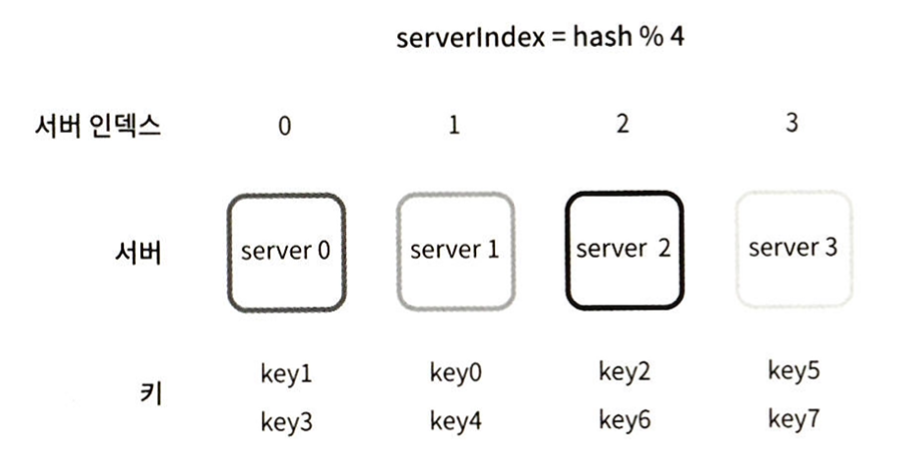
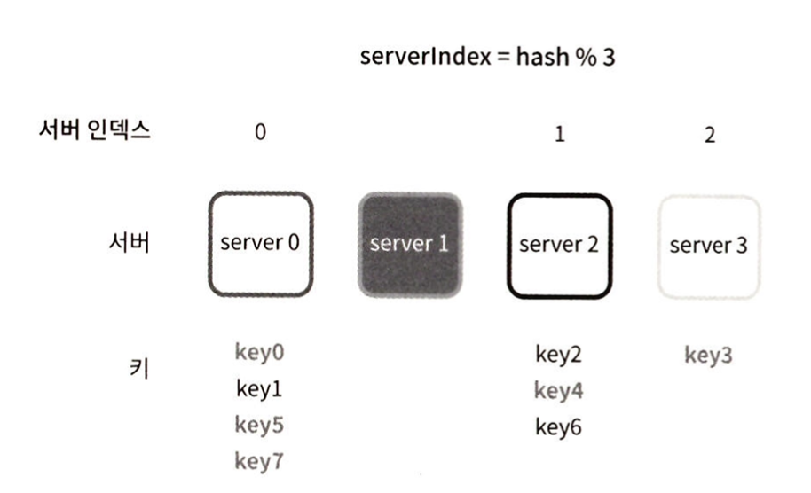
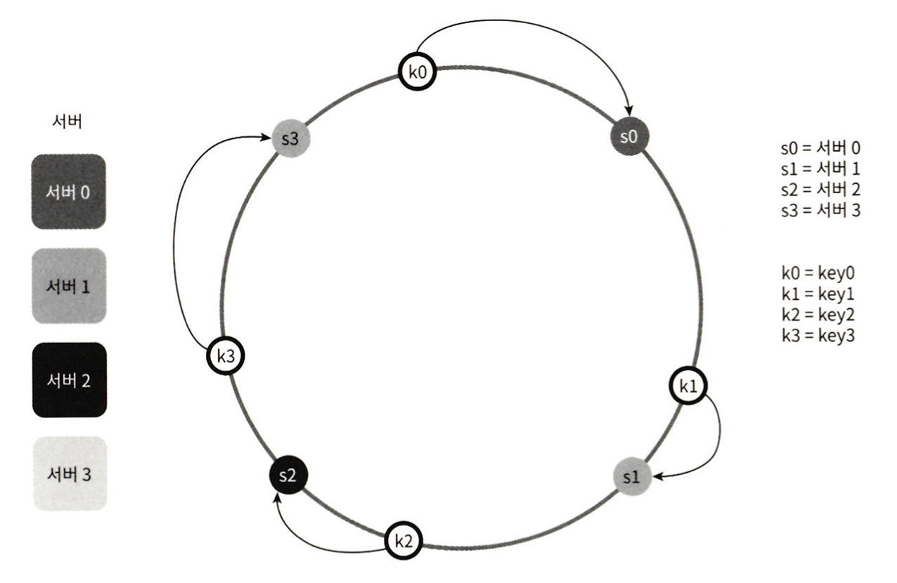
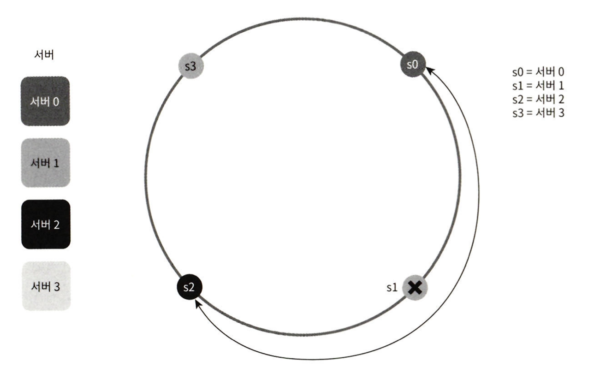
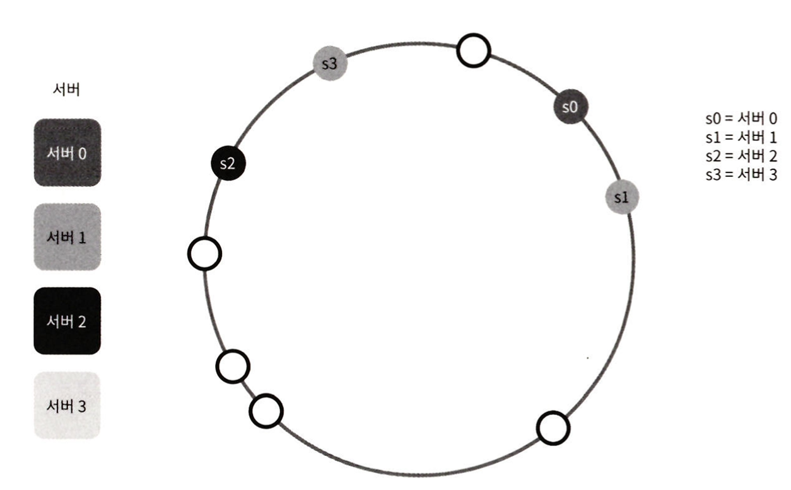
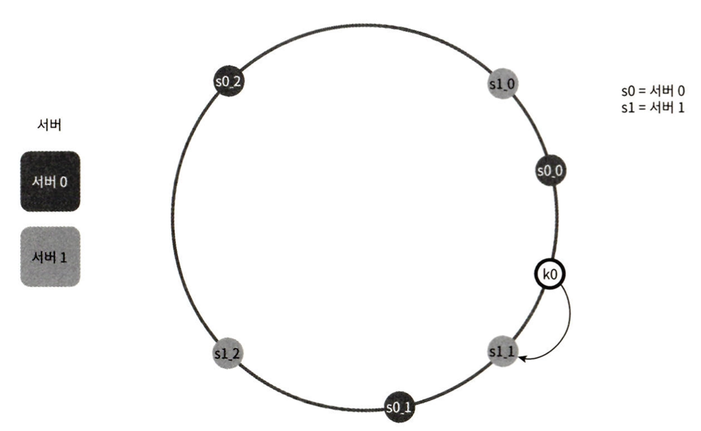

## 안정 해시 설계


### 해시키 재배치 문제 

#### 균등 해시 함수
```
serverIndex=hash(key) % N(N은 서버의 개수 )
```

#### 캐시서버 예제 - 서버풀이 고정되어있을때 잘동작
- key5 => server3에 저장



#### 캐시서버 예제 - 서버가 빠지면 문제 발생
- kery5 => server0 (데이터는 server3에 존재)
- 데이터가 없는 엉뚱한 서버에 접속




#### 캐시서버 예제 - 결론
- 대규모 캐시 미스 발생
- 안정 해시가 이 문제를 해결


### 안정해시(consistence hash)
```
전통적인 해시 테이블은 슬롯의 수가 변경되면 거의 대부분 키를 재배치하는데, 이와는 달리 안정 해시는 해시 테이블 크기가 조정될 때 평균적으로 k(키의 개수)/n(슬롯의 개수)개의 키만 재배치하는 해시 기술이다.
```
Consistent hashing: https://en.wikipedia.org/wiki/Consistent_hashing

#### 안정 해시의 기본 전략
1. 해시 공간의 시작과 끝을 이어붙여 해시 링을 만든다. 
2. 해시함수 - SHA-1 (MIT 기본 구현법은 균등분포 사용(uniform distribution))
3. 서버 IP나 이름을 해시 링의 임의의 위치에 대응 시켜 배치한다. 
4. 해시 키를 해시 링 위의 어느 지점에 배치한다.
5. 해시 키는 시계 방향으로 링을 탐색하며 만나는 첫 번째 서버에 저장된다.
6. 서버추가 및 제거 하더라도 인접한 키만 서버 배배치




#### 안정해시 문제점
- 파티션 크기를 균등하게 유지 불가능 - 서버가 제거되면 한서버의 해시공간이 커진다




- 키의 균등분포 가 어려움
	- 서버2가 거의 모든 데이터를 가지는 예제 





### 가상노드
- **가상 노드**는 실제 서버를 가리키는 노드로, 하나의 서버는 링 위에 여러 개의 가상 노드를 가질 수 있다. 실제 서버를 가리키는 가상의 노드를 링위에 촘촘히 배치하면 표준편차가 작아져 키의 분포를 균등하게 유지할 수 있게된다.
- 서버0는 세개의 가상노드를 가짐 - S0_0, S0_1, S0_2
- 또한 가상 노드 사이 파티션의 크기가 작아지므로 앞서 살펴본 문제점을 해결할 수 있게된다.
- 서버는 물리적으로 한정되어 있지만, 가상 노드는 하나의 서버를 가리키므로 개수를 자유롭게 조정할 수 있다는 장점이 있다. 
- 하지만 그만큼 가상 노드 데이터를 저장할 공간이 늘어남으로 적절한 트레이드오프가 필요하다.





### 마치며 
#### 안정해시 이점
- 서버 추가 제거시 재배치되는 키의 수 최소화
- 수평적 규모 확장성
- 핫스팟 키문제 해결
	- 특정한 샤드에 대한 접근이 지나치게 빈번하면 과부하
	- 유명인을 분산가능

#### 안정해시 사례
- 아마존 Dynamo DB  파티셔닝 컴포넌트
	- Dynamo: Amazon's Highly Available Key-value Store: https://dl.acm.org/doi/10.1145/1294261.1294281
- 카산드라 클러스터의 데이터 파티셔닝
	- http://www.cs.cornell.edu/Projects/ladis2009/papers/Lakshman-ladis2009.PDF
- 디스코드 채팅 어플
	- https://discord.com/blog/how-discord-scaled-elixir-to-5-000-000-concurrent-users
- 아카마이 CDN
	- The Modern Algorithmic Toolbox Lecture #1: Introduction and Consistent Hashing: https://web.stanford.edu/class/cs168/l/l1.pdf
- Maglev(매그레프) 네트워크 부하 분산기
	-  https://static.googleusercontent.com/media/research.google.com/en//pubs/archive/44824.pdf

