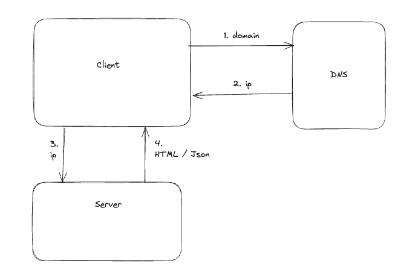

# 사용자 수에 따른 규모 확장성
* 수백만 사용자를 지원하는 시스템을 설계하는 것은 도전적인 과제이다.

* 사용자의 요청이 처리되는 과정
  * 도메인을 DNS 에 질의하여 웹 서버의 ip 를 반환받는다.
  * 해당 ip 로 웹 서버로 요청을 보낸다
  * 웹 서버는 HTML / JSON 을 응답한다.

</img>

## 단일 서버
* 모든 컴포넌트가 한 대의 서버에서 실행되는 간단한 시스템

* 웹 어플리케이션: 비즈니스 로직, 데터 저장 등을 처리하기 위해서는 서버

## 데터베이스
* 사용자가 늘면 서버하나로는 충분하지 않아 여러 서버를 두어야 한다. 웹 서버와 데이터베이스를 분리하여 그 각각을 독립적으로 확장할 수 있다.

### 어떤 데이터베이스를 사용할 것인가?
* 전통적인 RDB
  * MySQL, Oracle, PostgreSQL
* NoSQL
  * Cassandra, HBase, Amazon Dynamo DB
  * key-value store, graph store, column store, document store 4가지로 나눌 수 있다.
  * 일반적으로 조인은 지원하지 않는다.
  * 아래 상황에서는 NoSQL 이 바람직 하다.
    * 아주 낮은 응답 지연시간이 요구됨
    * 비정형데이터를 다룰 때
    * 데이터를 직렬화, 역직렬화 할 수 있기만 하면 될 때
    * 아주 많은 양의 데이터를 저장할 때

## 수직적 규모 확장 vs 수평적 규모 확장

* 수직적 규모확장(scale up) : 서버에 고사양자원(더 좋은 cpu, 더 많은 ram) 을 추가
  * 한 대의 서버에 CPU, Memory 를 무한대로 증설할 수는 없다.
    * failover 나 다중화 방안을 제시하지 않는다. 서버가 중단되면 서비스가 중단된다.

* 수평적 규모확장(scale out) : 더 많은 서버를 추가하여 성능을 개선

### 로드밸런서
  * 로드밸런서는 부하 분산 집합에 속한 웹 서버들에게 트래픽 부하를 고르게 분산한다.
  * 사용자는 로드밸런서의 공개 IP 주소로 접근한다. 
  * 서버간 통신에는 사설 IP 주소를 이용한다. 사설IP는 같은 네트워크에 속한 서버 사이의 통신에만 쓰일 수 있는 IP주소다.
  * 하나의 웹 서버를 추가하고 나면 장애를 자동으로 복구하지 못하는 상황은 해결되며 웹 계층의 가용성이 증가한다.

### 데이터베이스 다중화
* master - slave 관계를 설정하고 데이터 원본은 주 서버에, 사본은 부 서버에 저장한다.
* 쓰기는 master 에만 지원하고 slave는 읽기만 지원하게 한다.
* 데이터베이스 다중화의 장점
  * 일기 연산이 부 데이터베이스로 분산되므로 병렬로 처리될 수 있는 쿼리 수가 늘어난다.
  * 자연 재해 등의 이유로 데이터 베이스 서버 가운데 일부가 파괴되어도 데이터는 보존된다.
  * 데이터를 여러곳에 복제했기 때문에 하나의 데이터베이스에 장애가 발생해도 다른 서버에 있는 데이터를 가져와 계속 서비스할 수 있다.

## 캐시
* 캐시는 값비싼 연산결과, 자주 참조되는 데이터를 메모리안에 두고 뒤에 온 요청이 더 빨리 처리되게 하는 저장소다.
* 캐시 계층은 데이터가 잠시 보관되는 곳으로 데이터베이스보다 훨씬 빠르다.
* 웹 서버의 요청에 대한 데이터가 캐시에 있으면 캐시는 값을 반환하고 없는 경우 데이터베이스를 데이터를 읽어 캐시에 쓰고 클라이언트에 반환한다.
* 유의할점
  * 갱신은 자주 일어나지 않지만 조회가 자주 일어날 때 사용하자
  * 휘발성 메모리에 두므로 영속적으로 보관할 데이터를 캐시에 두는 것은 바람직하지 않다.
  * 만료된 데이터에 대한 정책을 마련하자.
  * 일관성을 어떻게 유지할 것인가? 저장소의 원본과 캐시를 갱신하는 연산이 단일 트랜잭션이 아니라면 일관성이 깨질 수 있다.
  * 캐시 서버를 한 대만 둔다면 SPOF 가 될 수 있다.
  * 캐시 메모리의 크기를 고려하자
  * 데이터 방출 정책은 LRU 를 주로 사용한다.

## CDN(콘텐츠 전송 네트워크)
* CDN 은 정적 콘텐츠를 전송하는데 쓰이는 지리적으로 분산된 서버의 네트워크이다. 이미지, 비디오, CSS, JS 파일 등을 캐시할 수 있다.
* 동적 콘텐츠 캐싱이 존재하며 요청경로, 질의문자열, 쿠키, 요청헤더 등의 정보로 HTML 페이지를 캐시하는 것이다.
* 사용자가 웹 사이트를 방문하면 가장 가까운 CDN 서버가 정적 콘텐츠를 전달한다. 
* 고려사항
  * CDN 은 보통 제3 사업자에 의해 운영되며 데이터 전송 양에 따라 요금을 내게 된다.
  * 적절한 만료 시한 설정: 너무 길지도, 짧지도 않은 시점을 정해야 한다.
  * CDN 자체가 죽었을 경우 웹사이트/애플리케이션이 어떻게 동작하는지 고려하자.
  * 콘텐츠 무효화 방법
    * API 를 이용하여 콘텐츠 무효화
    * 오브젝트 버저닝

## 무상태 웹 계층
* 상태 정보를 웹 계층에서 제거하자.
* 상태 정보는 지속성 저장소에 보관하고 필요할 때 가져와야 한다.
* 만약 상태정보를 웹서버가 갖고 있게 된다면 같은 클라이언트로부터의 요청은 항상 같은 서버로 전송되어야 한다. 이를 로드밸런서의 스티키 세션이라는 기능을 제공한다.
* 하지만 로드밸런서 뒷단에 서버를 추가하거나 제거하기도 어렵고 로드밸런서에도 부담이 된다.

## 데이터 센터
* 두 개의 데이터 센터를 이용하는 경우 하나의 데이터센터에서 오류가 나면 로드밸런서를 통해 장애가 발생하지 않은 데이터 센터로 트래픽을 전송한다.
* 트래픽 우회: 올바른 데이터 센터로 트래픽을 보내는 효과적인 방법을 찾아야 하고 GeoDNS 라는 것이 있다.
* 데이터 동기화: 데이터 센터마다 별도의 데이터베이스를 갖고잇다면 장애는 자동으로 복구되더라도 데이터는 정합성이 맞지 않을 수 있다. 데이터를 여러 데이터 센터에 걸쳐서 다중화할 수 있다.
* 테스트와 배포: 여러 데이터 센터를 사용한다면 여러 위치에서 테스트해보는 것이 중요하다. 자동화된 배포 도구는 모든 데이터 센터에 동일한 서비스가 설치되도록 하는데 중요한 역할을 한다.

## 메시지 큐
* 메시지 큐는 메시지의 무손실을 보장하는 비동기 통신을 지원하는 컴포넌트다. 메시지의 버퍼 역할을 하며 비동기적으로 전송한다.
* Publisher/Subscriber 혹은 Producer/Consumer 로 표현하며 느슨한 결합을 제공한다.
* 생산자는 소비자가 다운되어도 메시지를 발행하여 서비스를 할 수 있고 소비자는 생산자가 다운되도 메시지를 처리할 수 있다.

## 로그, 메트릭 그리고 자동화
* 로그: 에러로그를 모니터링하자
* 메트릭 
  * 호스트 단위 메트릭: CPU, Memory, DiskIO
  * 종합 메트릭: 데이터베이스 성능, 캐시 계층 성능
  * 핵심 비즈니스 메트릭: MAU, DAU, revenue, retention
* 자동화
  * CI, CD
  * 빌드, 테스트, 배포 자동화를 통해 개발 생산성 향상

## 데이터베이스의 규모 확장
* 수직적 확장: 고사양 CPU, RAM 을 가진 데이터베이스
  * 하드웨어에는 한계가 있다
  * SPOF 로 인한 위험성이 크다
  * 비용이 많이 든다
* 수평적 확장
  * 샤딩: 같은 스키마를 쓰지만 샤드에 보관되는 데이터 사이에는 중복이 없다.
    * 샤딩키(partition key)를 어떻게 정할 것인가? - 균등하게 분할할 수 있는 키
    * 데이터의 재 샤딩: 하나의 샤드로는 감당하기 어려울 때 샤드 소진이 일어나고 consistent hash 로 데이터를 재배치한다.
    * hotspot key 가 발생할 수 있다. 
    * 샤드를 하고나면 조인 연산을 지원하기가 어렵다. 비정규화 테이블을 만드는 방법이 있다.

## 정리
* 시스템의 규모를 확장하는 것은 지속적이고 반복적인 과정이다. 
* 수백만 사용자 이상을 지원하려면 새로운 전략을 도입해야 한다.
* summary
  * 웹 계층은 무상태 계층 - 세션을 가져갈 디비
  * 모든 계층에 다중화 도입
  * 가능한 많은 데이터를 캐시할 것
  * 여러 데이터 센터를 지원할 것
  * 정적 콘텐츠는 CDN 을 통해 서비스할 것
  * 데이터 계층은 샤딩을 통해 그 규모를 확장할 것
  * 각 계층은 독립적 서비스로 분할할 것
  * 시스템을 지속적으로 모니터링하고 자동화 도구들을 활용할 것
  