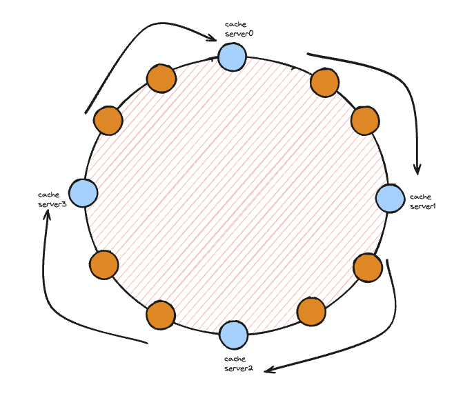
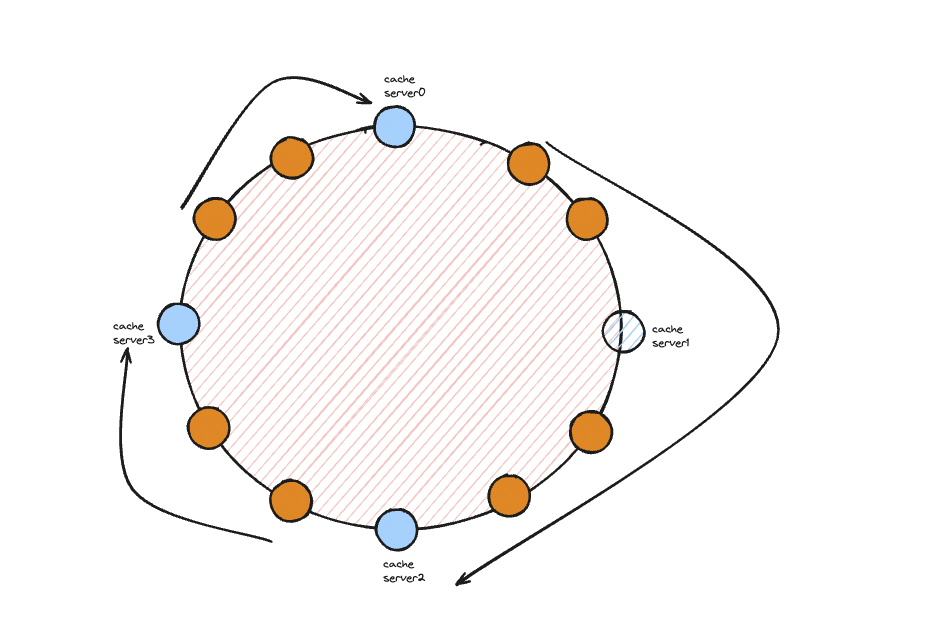
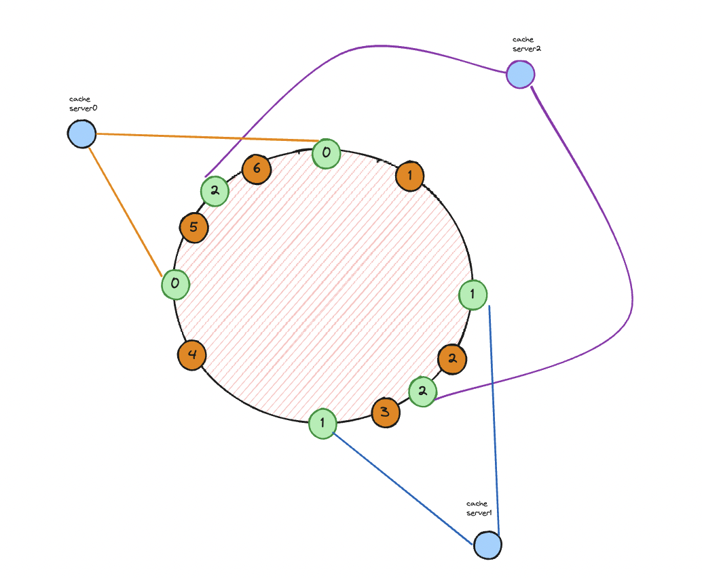

# 안정 해시 설계

요청 또는 데이터를 서버에 균등하게 나누는 것이 중요

## 해시키 재배치 문제

* serverIndex = hash(key) % N(서버 수)
* 여기서 서버가 추가되거나 삭제될 때를 생각해보면 serverIndex 가 변하기 쉽다.

| 서버 | hash(key) |
|----|-----------|
| 0  | 0,4,8...  |
| 1  | 1,5,9...  |
| 2  | 2,6,10... |
| 3  | 3,7,11... |

인 상황에서 3번 서버가 죽고 난이후 키를 살펴보면

| 서버 | hash(key)       |
|----|-----------------|
| 0  | 0,**3,6,9**...  |
| 1  | 1,**4,7,10**... |
| 2  | 2,**5,8,11**... |

대부분의 키 값이 다른 서버로 매칭되면서 예시에서는 12개의 데이터중 9개의 매칭이 수정되고 캐시였으면 75% 가 캐시미스가 나게 될 것이다.

| 서버 | hash(key)         |
|----|-------------------|
| 0  | 0,**5**,**10**... |
| 1  | 1,**6**,**11**... |
| 2  | 2,**7**...        |
| 3  | 3,**8**...        |
| 4  | **4**,**9**...    | 

4번 서버가 추가된 경우 여기서도 대부분의 키가 다른 서버에 매핑되면서 미스가 발생하게 되는 것이다.
이를 해결하기 위해 안정해시가 필요하다.

## 안정 해시

* 하나의 링을 생각해보자.

* 하나의 해시 링을 생각해보자.
* 키가 해시값을 통해 링에 배치되고나면 시계방향으로 탐색하며 처음만나는 캐시서버에 저장된다.
* </img>
* 하지만 이렇게 되면 캐시서버1이 사라지게 되면 캐시서버1에 있던 키들이 모두 캐시서버2로 재배치되고 균등하지 않게 된다.
* </img>

## 가상 노드를 이용한 개선

*
* 초록색의 가상노드를 추가한 경우를 살펴보자
* </img>
* 여기서 서버1이 빠진다면
* 키1은 2번서버로, 키3은 0번서버로 가면서 균등하게 분포된다.
* 여기서는 가상 노드의 순서도 중요한데 0, 1 , 2, 0, 1, 2 의 순서로 노드가 배치되었다면 0번 노드가 죽었을 때 1번노드로 모든 키가 쏠리는 것은 동일하게 된다.

## 마치며

* 서버가 추가되거나 삭제될 때 재배치되는 키의 수를 최소화한다.
* 데이터를 균등하게 분포하게 하여 수평적 규모확장성을 달성하기 쉽다.
* 핫스팟 문제를 줄인다. 특정 샤드에 대한 접근이 지나치게 많아지지 않게 조절한다.
* 실제 예시
    * 다이나모디비의 파티셔닝 관련 컴포넌트
    * 카산드라 클러스터에서의 데이터 파티셔닝
    * 디스코드 채팅 어플리케이션
    * 아카마이 cdn
    * 매그레프 네트워크 부하 분산기
