# 5. 안정 해시 설계

## 5.1 해시 키 재배치(rehash) 문제

N 개의 해시 서버가 있다고 하고 이 서버들에 부하를 균등하게 나누는 보편적인 방법은 다음과 같음

~~~
serverIndex = hash(key) % N(서버의 개수)
~~~

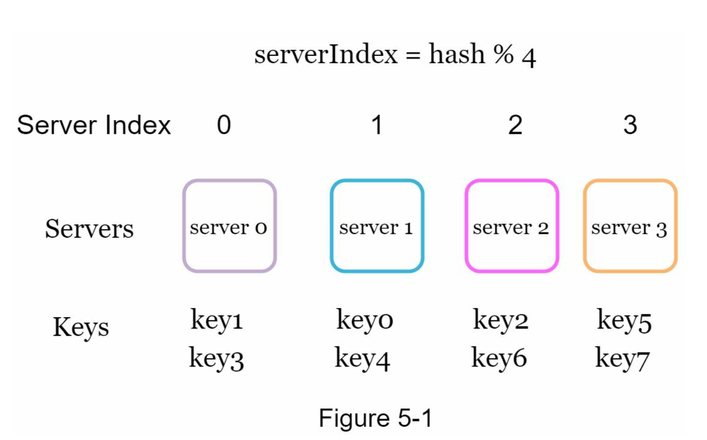

- 서버 풀(server pool)의 크기가 고정되어 있을때, 데이터 분포가 균등할때 잘 동작
- 서버가 추가되거나 삭제되면 문제가 생김

서버 1번이 장애가 발생했다고 하자 그러면 아래와 같이 키가 분배가 된다.
- 서버 풀의 크기가 3으로 줄어 % 3 으로 서버 인덱스를 계산하면 다음과 같다

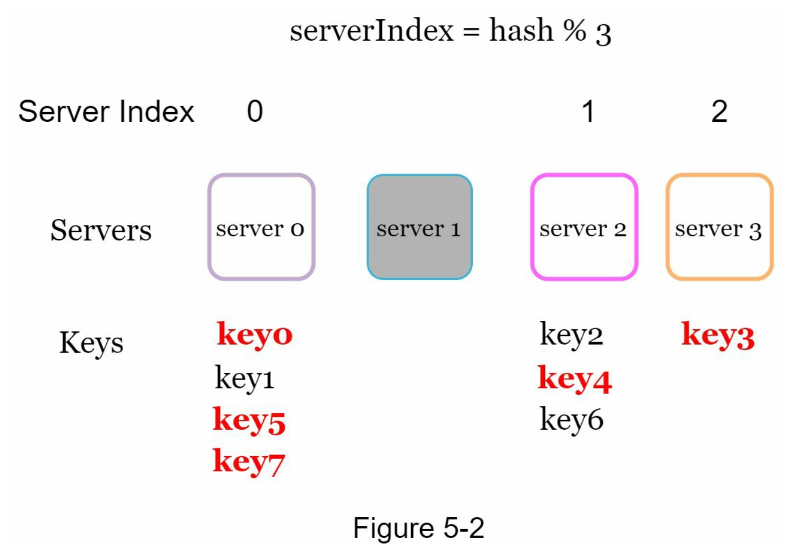

- 서버 1번이 장애가 생겼으나 대부분의 키가 재분배됨
- 즉 대부분 캐시 클라이언트가 데이터가 없는 서버에 접속하게 되고, 그 결과로 대규모 캐시 미스가 발생하게 됨

## 5.2 안정 해시(consistent hash)

MIT 에서 처음 제안되었음

해시 테이블 크기가 조정될 때 평균적으로 오직 k/n 개의 키만 재배치하는 해시 기술
- k: 키의 개수
- n: 슬롯(slot)의 개수

### 해시 공간과 해시 링

해시 함수 f 로는 SHA-1 을 사용한다고 하고, 그 함수의 출력 값 범위는 x0, x1, x2 ... xn 과 같다고 하자
SHA-1 의 해시 공간(hash space) 범위는 0 ~ 2^160 - 1

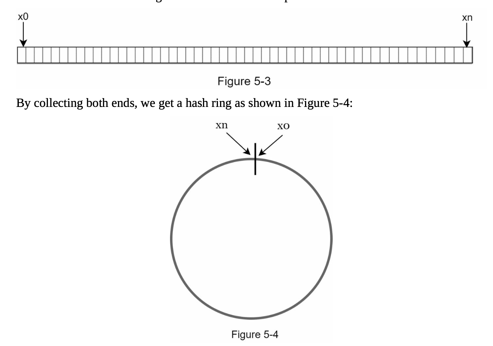

### 해시 서버

함수 f 를 사용하여 서버ip 나 이름으로 4개의 서버를 배치

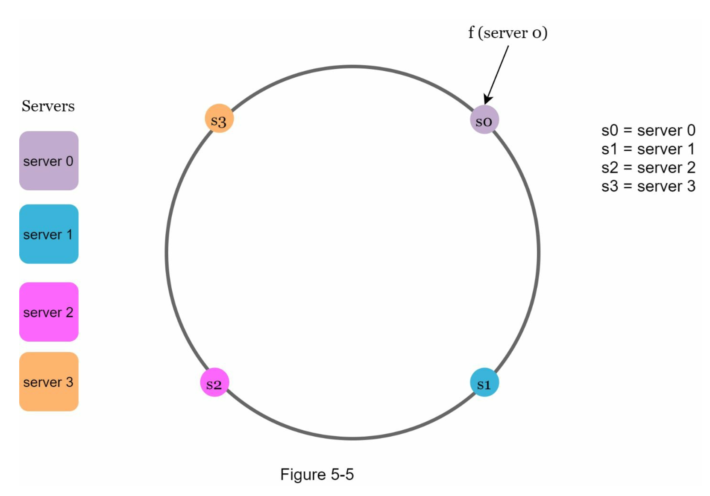

### 해시 키

함수 f 를 사용하여 캐시할 키를 배치할수 있음

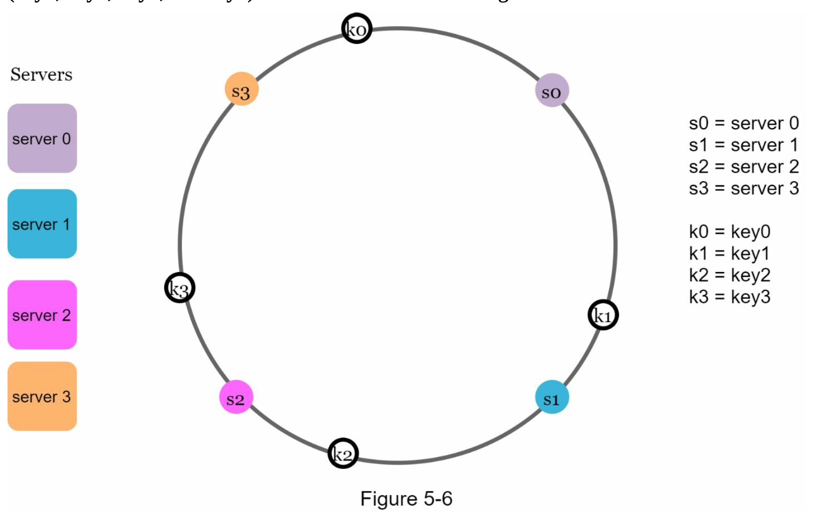

### 서버 조회

키가 저장되는 서버는 해당 키의 위치로 부터 시계 방향으로 탐색해 나가면서 만나는 첫번째 서버임

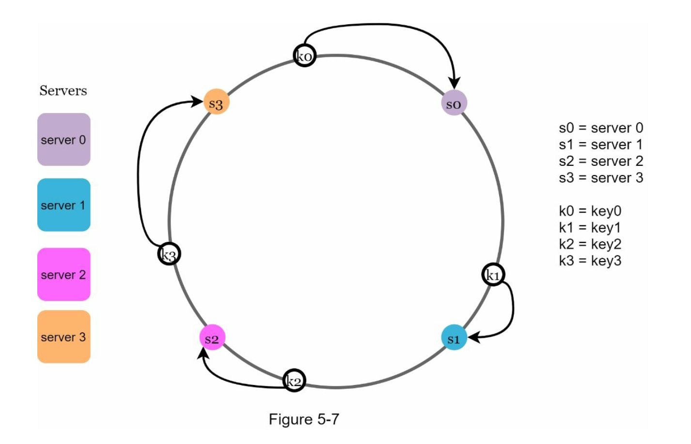

- key0 은 server0 에 저장

### 서버 추가

서버4가 추가되면, key0 만 재배치 됨
다른 키들은 재배치 되지 않음

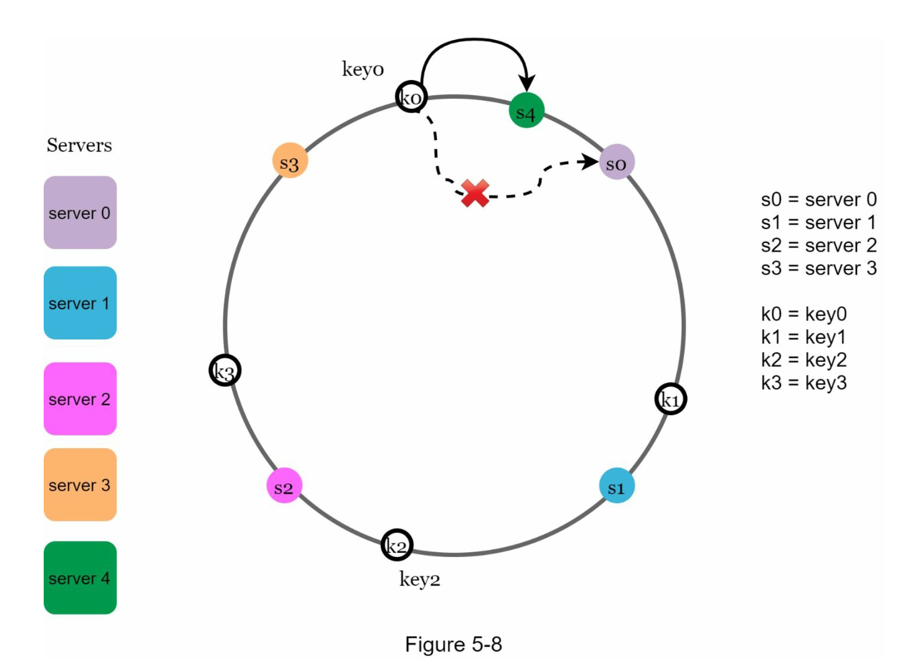

### 서버 제거

서버1이 제거되면, key1 만 서버2로 재배치됨

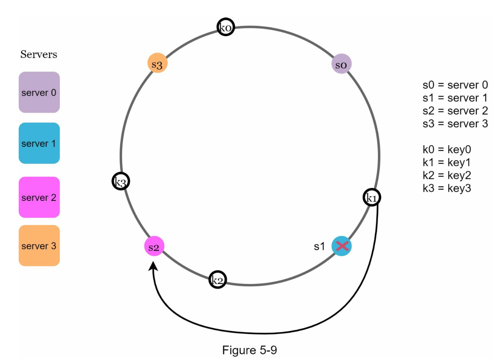

### 기본 구현법의 두가지 문제

기본 절차
- 서버와 키를 균등 분포(uniform distribution) 해시 함수를 사용해 해시 링에 배치
- 키의 위치에서 링을 시계 방향으로 탐색하다 만나는 최초의 서버가 키가 저장될 서버

접근법에 두가지 문제가 있음

#### 문제1. 서버 추가 삭제시 파티션(partition) 의 크기를 균등하게 유지하는게 불가능함

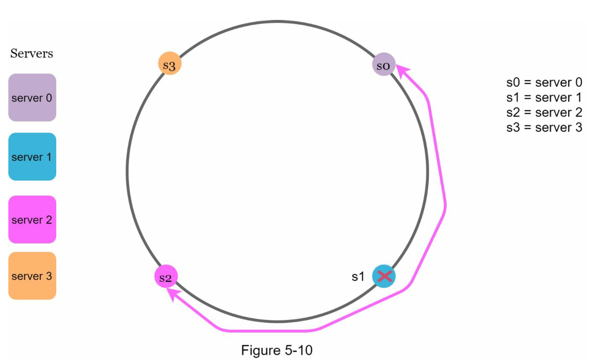

- 서버1이 삭제되어 서버2의 파티션이 다른 서버 파티션 대비 2배로 커짐

#### 문제2. 키의 균등 분포(uniform distribution)를 달성하기 어려움

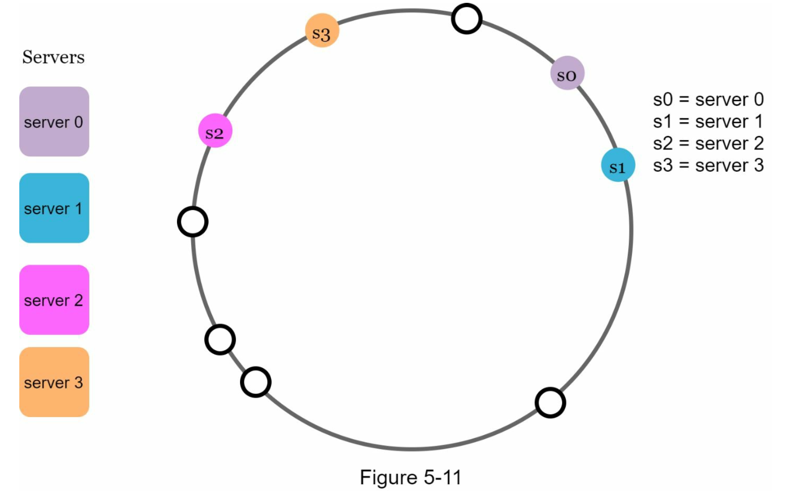

- 서버1과 서버3은 아무 데이터도 갖지 않는 반면, 대부분의 키는 서버2에 보관됨

### 가상 노드(virtual node)

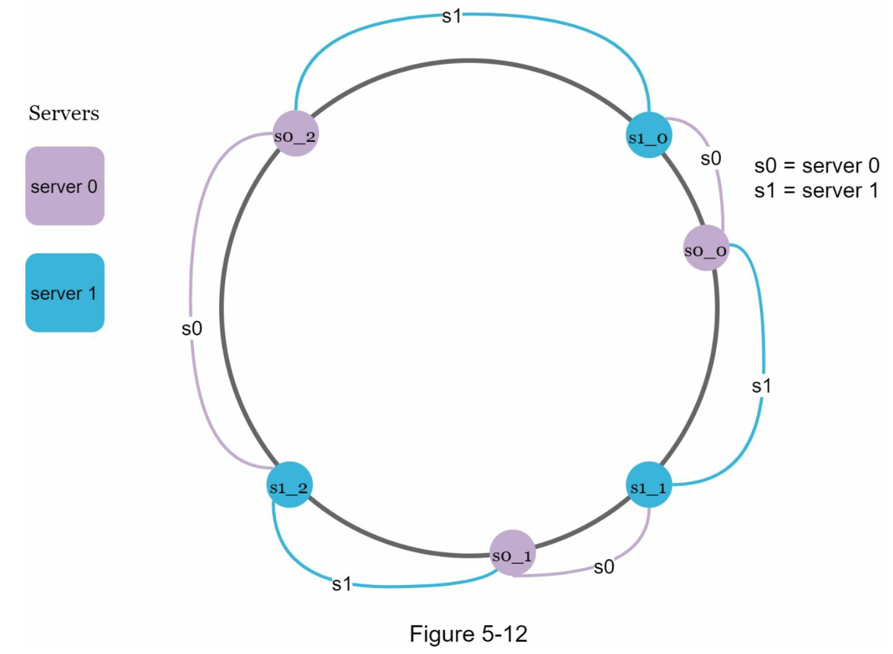

- 가상 노드의 개수를 늘리면 키의 분포는 점점 더 균등해짐
  - 표준 편차(standard deviation)가 작아져서 데이터가 고르게 분포되기 때문
- [Consistent Hashing](https://tom-e-white.com/2007/11/consistent-hashing.html) 문서에 따르면 100-200 개의 가상 노드를 사용했을 경우 표준 편차 값은 평균 5% ~ 10% 사이임
- 가상 노드의 개수를 더 늘리면 표준 편차의 값을 더 떨어지지만, 가상 노드 데이터를 저장해야 할 공간이 많이 필요하게 됨
- tradeoff 가 있으므로, 시스템 요구 사항에 맞게 가상 노드를 적절히 조정해야 함

### 재배치할 키 결정

#### 서버4 추가시 재배치 예제

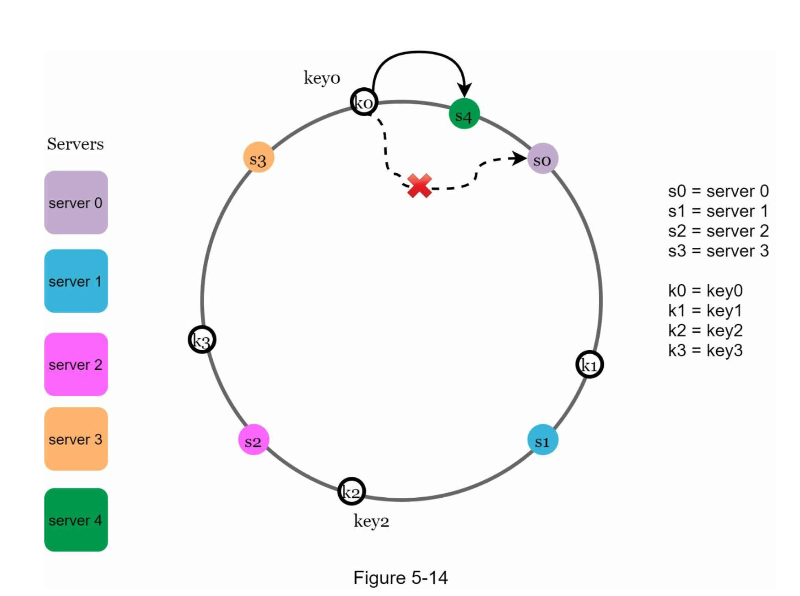

#### 서버1 삭제시 재배치 예제

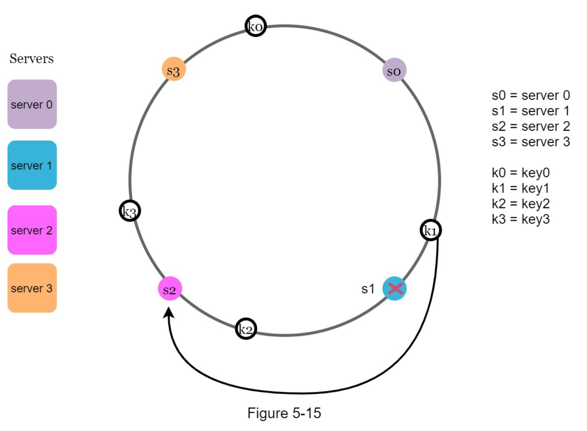

## 5.3 마무리

### 안정 해시의 이점
- 서버가 추가되거나 삭제될때 재배치되는 키의 수가 최소화
- 데이터가 보다 균등하게 분포되므로 수평적 규모 확장성을 달성하기 쉬움
- 핫스팟(hotspot) 키 문제를 줄임
  - 데이터를 균등하게 분배하므로 가능성이 줄어듬

### 안정 해시 사용예
- 아마존 다이나모 데이터베이스(DynamoDB) 파티셔닝 관련 컴포넌트
- 아파치 카산드라(Apache Cassandra) 클러스터에서의 데이터 파티셔닝
- 디스코드(Discord) 채팅 어플리케이션
- 아카마이(Akamai) CDN
- 매그레프(Meglev) 네트워크 부하 분산기

