# 6. 키-값 저장소 설계

키-값 저장소(key-value store)는 비관계형(non-relational) 데이터베이스이다.
저장소에 저장되는 값은 고유 식별자(identifier)를 키로 가져야 한다.
키-값은 pair 라고 지칭한다
키는 짧을수록 좋다

## 문제 이해및 설계 범위 확정

- 키-값 쌍의 크기는 10KB 이하
- 큰 데이터를 저장할수 있어야 함
- 높은 가용성을 제공
  - 장애가 있더라도 빨리 응답해야함
- 높은 규모 확장성을 제공
  - 트래픽 양에 따라 자동적으로 서버 증설/삭제가 이루어져야 함
- 데이터 일관성 수준은 조정이 가능해야 함
- 응답 지연시간(latency)이 짧아야 함

## 단일 서버 키-값 저장소

단일 서버 키-값 저장소
- 설계하기 가장 쉬움
- 키-값 쌍 전부를 메모리에 해시 테이블로 저장
  - 빠른 속도를 보장하지만 모든 데이터를 메모리 안에 두는것이 불가능하다는 단점이 있음

단점 개선 방법
- 데이터 압축
- 자주 쓰이는 데이터만 메모리에 두고 나머지는 디스크 저장

개선 방법대로 해도 한대 서버로 부족한 때가 바로 찾아옴
분산 키-값 저장소(distributed key-value store)를 만들어서 해결할 필요가 있음

## 분산 키-값 저장소

### CAP 정리(Consistency, Avaliability, Partition Tolerance theorem)

#### 일관성(Consistency)
항상 같은 데이터를 보게 되어야 함

#### 가용성(Avaliability)
장애가 발생하더라도 항상 응답을 받을수 있어야 함

#### 파티션 감내(Partition Tolerance)
네트워크에 파티션이 생기더라도 시스템은 계속 동작하여야 함

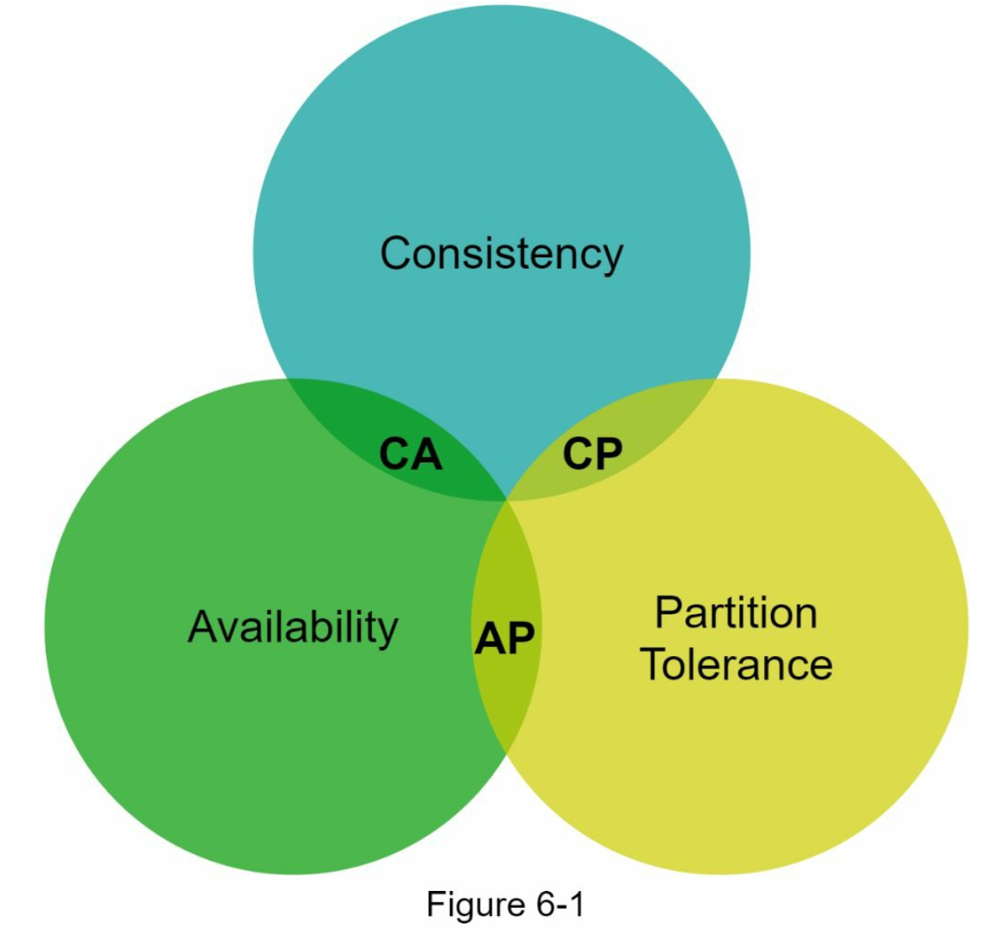

CP 시스템
- 일관성과 파티션 감내를 지원, 가용성을 희생
AP
- 가용성과 파티션 감내를 지원, 데이터 일관성을 희생
CA 시스템
- 일관성과 가용성을 지원, 파티션 감내를 지원하지 않음
- 네트워크 장애는 피할수 없는 일로 여겨지므로, 분산 시스템은 파티션 문제를 감내할수 있도록 설계 되어야함
- 실세계에서 CA 시스템은 존재하지 않음

#### 이상적 상태

- 네트워크가 타시션되는 상황은 일어나지 않음
- n1에 기록된 데이터는 자동적으로 n2, n3 에 복제됨
- 데이터 일관성과 가용성을 만족

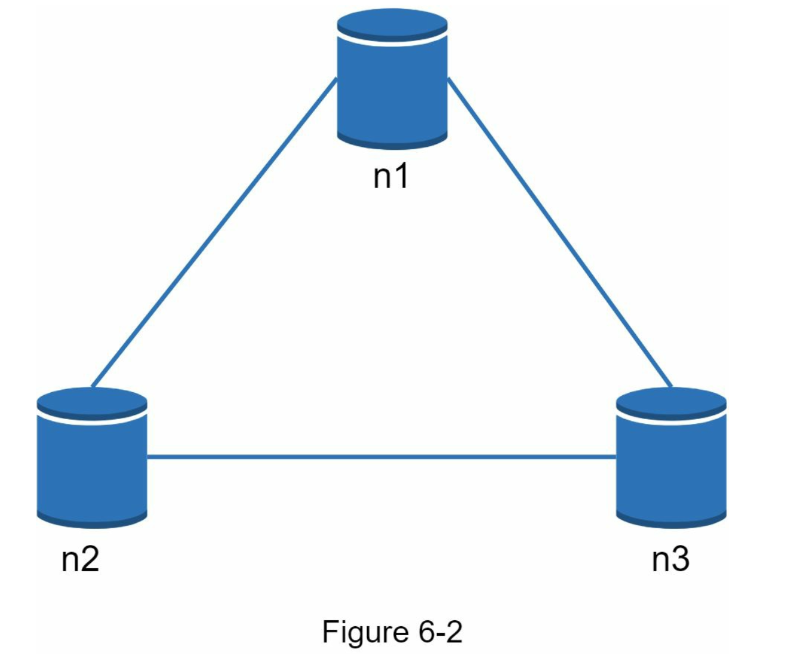

#### 실세계의 분산 시스템
- 파티션 문제를 피할수 없고, 파티션 문제 발생시 일관성과 가용성 사이에서 하나를 선택해야함

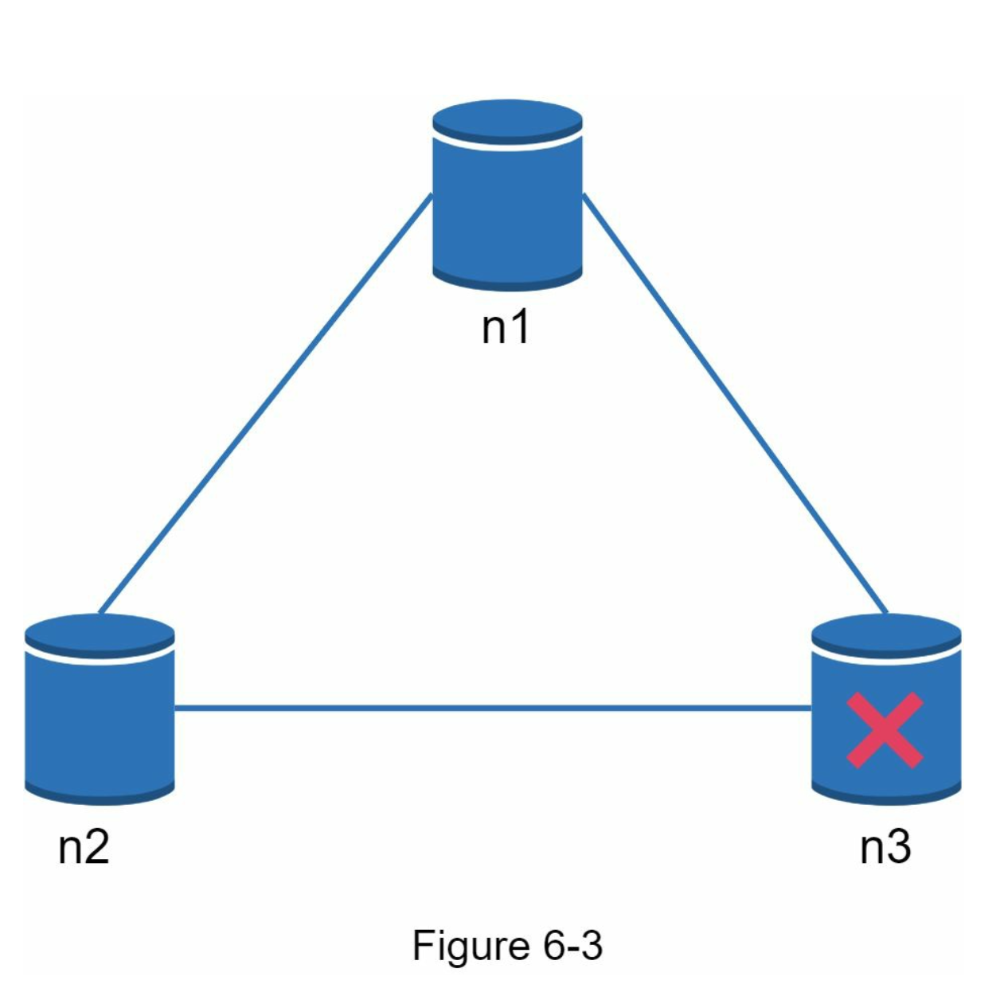

n3 에 장애가 발생했다면?
- n1,2 에 기록한 데이터가 n3 로 전달되지 않음
- n3 에 기록된 데이터가 n1,2 로 전달되지 않아 n1,2 는 오래된 사본을 가지고 있음

CP 시스템(일관성을 선택한다면)
- 데이터 불일치 문제를 피하기 위해 n1,2에 쓰기 연산을 중단 시켜야하는데, 이렇게 되면 가용성이 깨짐
- 일반적으로 은행권 시스템은 일관성을 양보하지 않음

### 시스템 컴포넌트

키-값 저장소 구현에 사용될 핵심 컴포넌트(Dynamo, Cassandra, BigTable 을 참고)
- 데이터 파티션
- 데이터 다중화(replication)
- 일관성(consistency)
- 일관성 불일치 해소(inconsistency resolution)
- 장애 처리
- 시스템 아키텍처 다이어그램
- 쓰기 경로
- 읽기 경로

#### 데이터 파티션

데이터 파티션 단위로 나눌때 두가지 문제
- 데이터를 여러 서버에 고르게 분산할 수 있는가?
- 노드가 추가되거나 삭제될 때 데이터의 이동을 최소화할 수 있는가?

안정 해시로 두가지 문제를 해결할수 있음

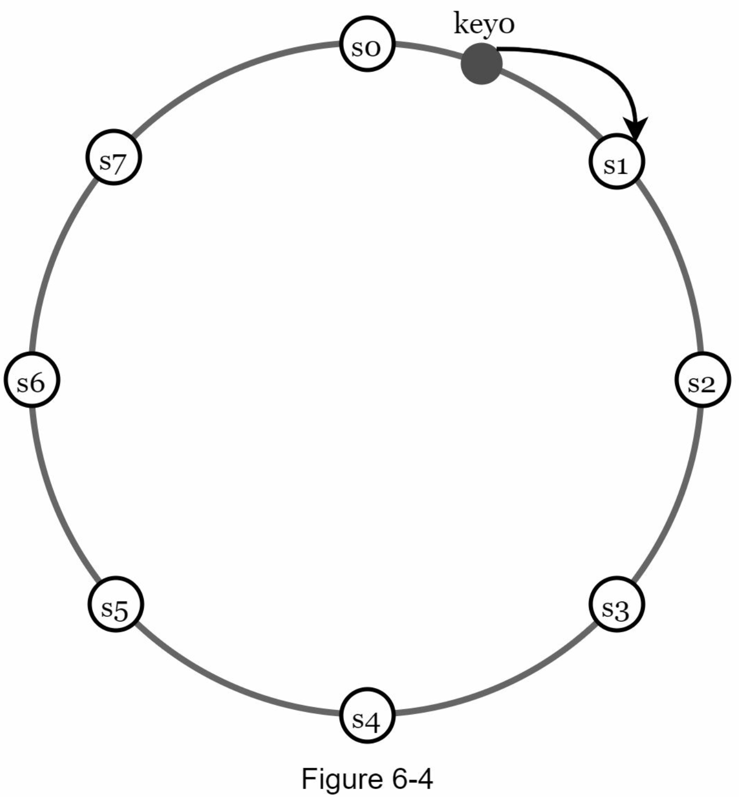

안정 해시를 사용해 데이터를 파티션 하면 좋은점
- 규모 확장 자동화(automatic scaling)
  - 시스템 부하에 따라 서버가 자동으로 추가되거나 삭제되도록 만들 수 있음
- 다양성(heterogeneity)
  - 각 서버의 용량에 맞게 가상 노드(virtual node)의 수를 조정할 수 있음

#### 데이터 다중화

높은 가용성을 확보하기 위해 N 개의 서버에 데이터를 비동기적으로 데이터를 다중화(replication)할 필요가 있음
N 은 튜닝 가능한 값으로 N 개 서버를 선정하는 방법은 시계 방향으로 만나는 N 개의 서버에 데이터를 저장d

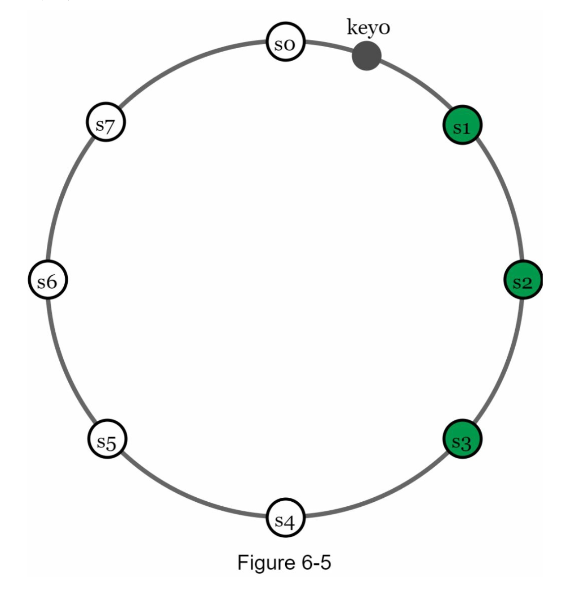

#### 데이터 일관성

정족수 합의(Quorum Consensus) 프로토콜을 사용하면 읽기/쓰기 연산 모두에 일관성을 보장할수 있음

- N = 사본개수
- W = 쓰기 연산에 대한 정족수
  - 쓰기 연산이 성공한 것으로 간주되려면 적어도 W 개의 서버로 부터 쓰기 연산이 성공했다는 응답을 받아야 함
- R = 읽기 연상에 대한 정족수
  - 읽기 연산이 성공한 것으로 간주되려면 적어도 R 개의 서버로 부터 쓰기 연산이 성공했다는 응답을 받아야 함

N = 3인 경우의 예제

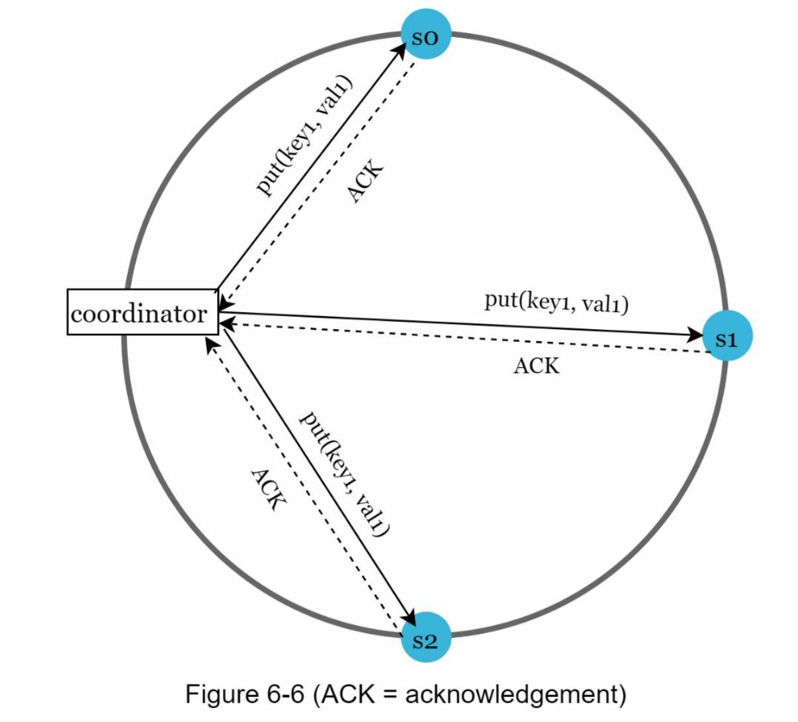

- R = 1, W = N
  - 빠른 읽기 연상에 최적화된 시스템
- W = 1, R = N
  - 빠른 쓰기 연산에 최적화된 시스템
- W + R > N
  - 강한 일관성이 보장됨
  - 보통 N = 3, W = R = 2
- W + R <= N
  - 강한 일관성이 보장되지 않음

##### 일관성 모델(consistency model)

강한 일관성(strong consistency)
- 모든 읽기 연산은 가장 최근에 갱신된 결과를 반환
- 낡은 데이터(out-of-date)를 보지 못함
- 읽기 쓰기가 중단되므로 고가용성 시스템에 적합하지 않음

약한(weak consistency)
- 읽기 연산은 가장 최근에 갱신된 결과를 반환하지 못할 수 있음

결과적 일관성(eventual consistency)
- 약한 일관성의 한 형태
- 갱신 결과가 결국에는 모든 사본에 반영(동기화)되는 모델
- Dynamo, Cassandra

##### 비 일관성 해소 기법: 데이터 버저닝

버저닝(versioning), 벡터 시계(vector clock)로 일관성이 깨지는 문제를 해결하기 위한 기술

###### 버저닝
- 데이터를 변경할 때마다 해당 데이터의 새로운 버전을 만듬
- 각 버전의 데이터는 변경 불가능(immutable)

데이터 일관성이 깨지는 예제
- 노드 n1,n2 에 데이터가 보관되어 있는 상태
- 서버1과 서버2 는 get("name") 으로 같은 값을 얻음

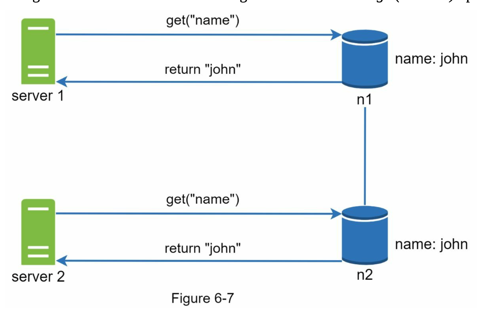

- johnNewYork, johnSanFransisco 로 동시에 변경 연상이 이루어 진다고 하자

- 두 버전 v1, v2 사이의 충돌을 발견하고 해결하기 위해 벡터 시계를 사용함

###### 벡터시계

- `서버, 버전` 의 순서쌍을 데이터에 저장
- 어떤 버전이 선행 버전인지, 후행 버전인지, 아니면 다른 버전과 충돌이 있는지 판별하는데 쓰임
- D([S1, v1], [S2, v2], ... [Sn, vn]) 으로 표현한다고 가정

처리 방식
- [Si, vi]가 있으면, vi 를 증가 시킴
- 그렇지 않으면 새항목[Si, 1]을 만듬

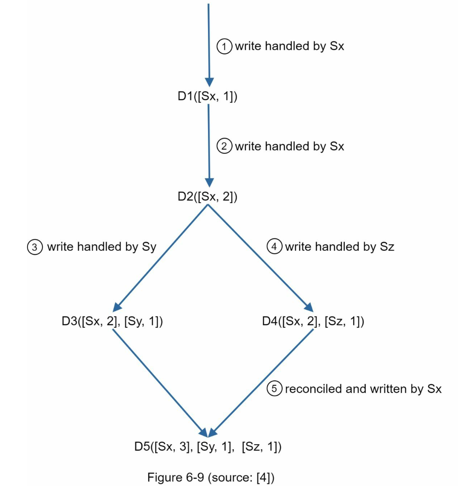

단점
- 충돌 감지 및 해소 로직이 클라이언트에 들아가야 하므로 클라이언트 구현이 복잡해짐
- \[서버:버전\] 의 순서쌍 개수가 굉장히 빨리 늘어남
  - 길이에 임계치(threshold) 를 정해서 길이가 길어지면 오래된 순서쌍을 벡터시계에서 제거해서 이슈를 해결할수 있음
  - 순서쌍을 제거하면 선후 관계가 정확하지 않을수 있다는 문제도 있으나, 다이나모 데이터베이스에서는 문제가 발생한 적이 없음

#### 장애 처리
##### 장애 감지
- 두대 이상의 서버가 서버A 의 장애를 보고해야 실제로 장애가 발생했다고 간주함
- 모든 노드 사이에 멀티캐스팅(multicasting) 채널을 구축하는 것이 서버 장애를 감지하는 가장 손쉬운 방법
  - 서버가 많을때는 비효율적임

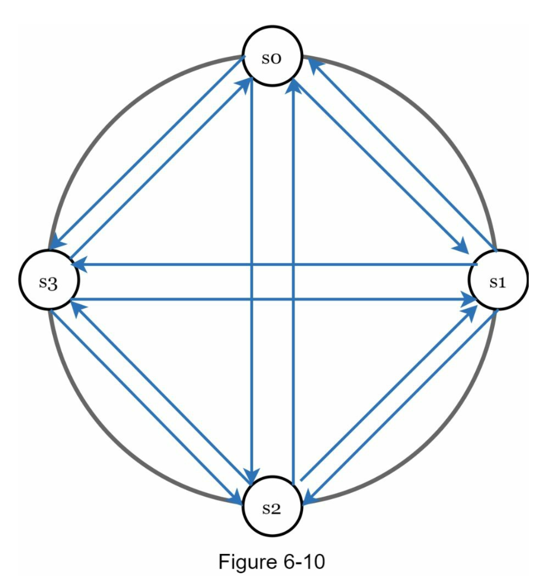

가십 프로토콜(gossip protocol)
- 분산형 감지(decentralized failure detection) 솔루션을 채택하는 편이 멀티캐스팅보다 효율적임
- 동작원리
  - 각 노드는 멤버십 목록을 유지
    - 멤버 id 와 heartbeat counter 쌍의 목록
  - 각 노드는 주기적으로 자신의 heartbeat counter 를 증가 시킴
  - 각 노드는 주기적으로 자신의 heartbeat counter 목록을 무작위로 선정된 노드에 전송
  - heartbeat counter 목록을 받은 노드는 멤버십 목록을 최신 값으로 갱신
  - heartbeat counter 값이 지정된 시간동안 갱신되지 않으면 장애 상태인것으로 간주

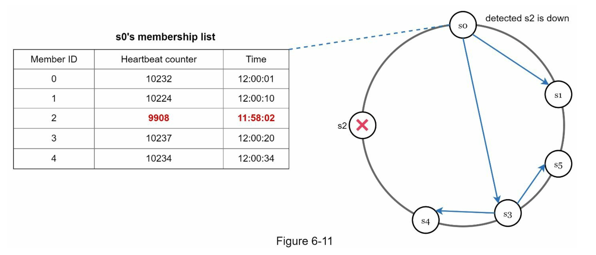

- s0 이 s2 카운트가 증가되지 않음을 발견
- s0 가 카운트 목록을 무작위 노드로 전송
- s2 카운트가 증간되지 않았음을 발견한 모든 노드들은 s2를 장애노드로 표시

##### 일시적 장애 처리

단서 후 임시 위탁 기법(hinted handoff)
- 장애 상태인 s2 노드에 대한 읽기 및 쓰기 연산은 일시적으로 s3 가 처리
- s2 가 복구되면 s3 는 갱신된 데이터를 s2 로 인계

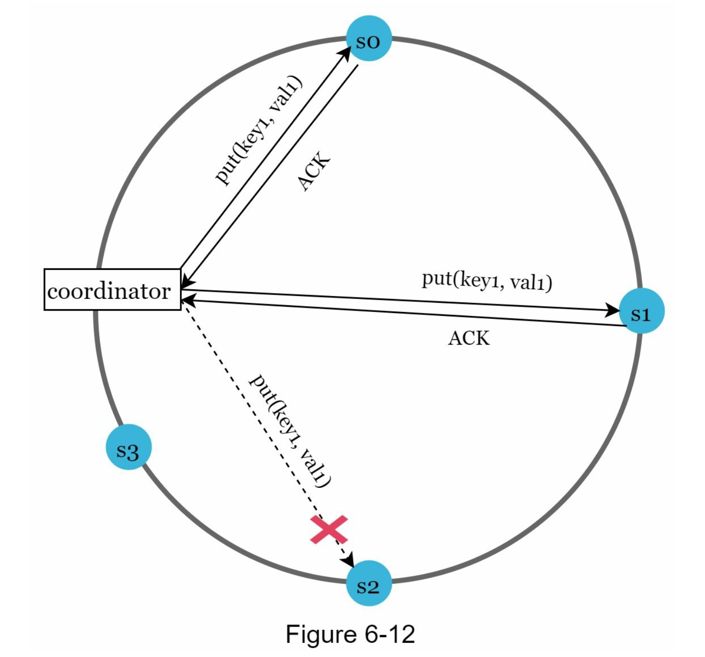

##### 영구 장애 처리

1 단계
- 4개의 bucket 으로 나눔
- 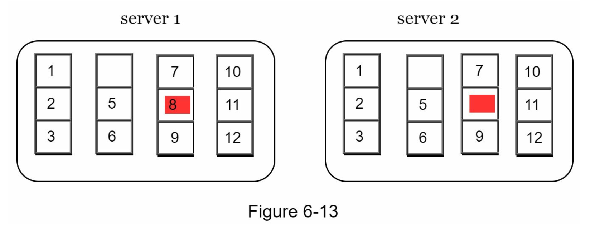

2 단계
- 버킷에 포함된 각각의 키에 균등 분포 해시 함수를 적용하여 해시 값을 계산
- 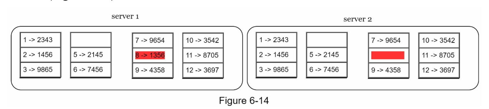

3단계
- 버킷별로 해시 값을 계산한 후, 해당 해시 값을 레이블로 갖는 노드를 만듬
- 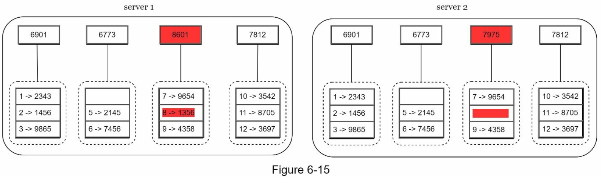

4단계
- 자식 노드의 레이블로부터 새로운 해시 값을 계산하여 이진트리를 상향식으로 구성해 나감
- 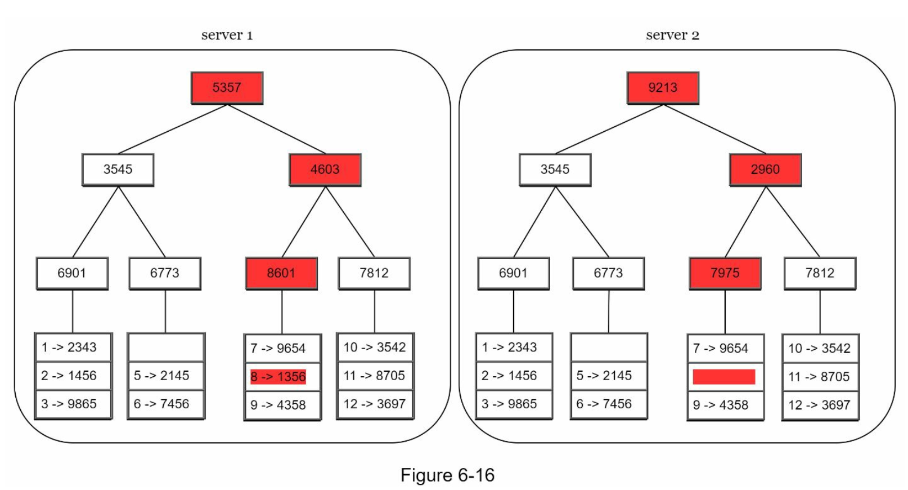

##### 데이터 센터 장애처리
- 데이터 센터 다중화 필요

#### 시스템 아키텍처 다이어그램

- 키-값 저장소가 제공하는 get, put 으로 통신
- 중재자(coordinator) 는 클라이언트에게 키-값 저장소에 대한 proxy 역할을 하는 노드
- 노드는 안정해시의 해시링 위에 분포

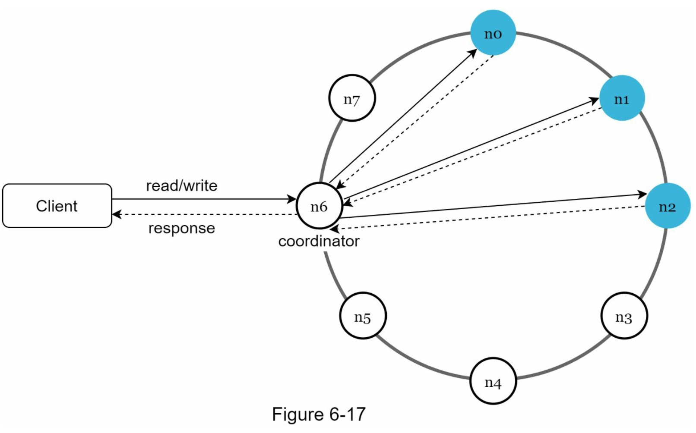

- 노드를 자동으로 추가 또는 삭제할 수 있도록, 시스템은 완전히 분산됨
- 데이터는 여러 노드에 다중화됨
- 모든 노드가 같은 책임을 지므로 SPOF(Single Point of Failure)는 존재하지 않음

#### 쓰기 경로

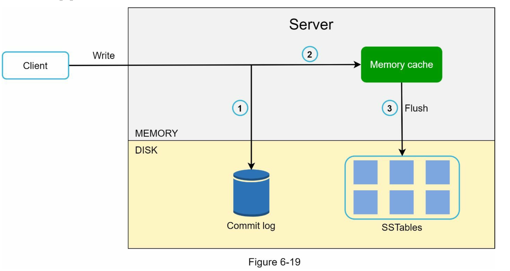

#### 읽기 경로

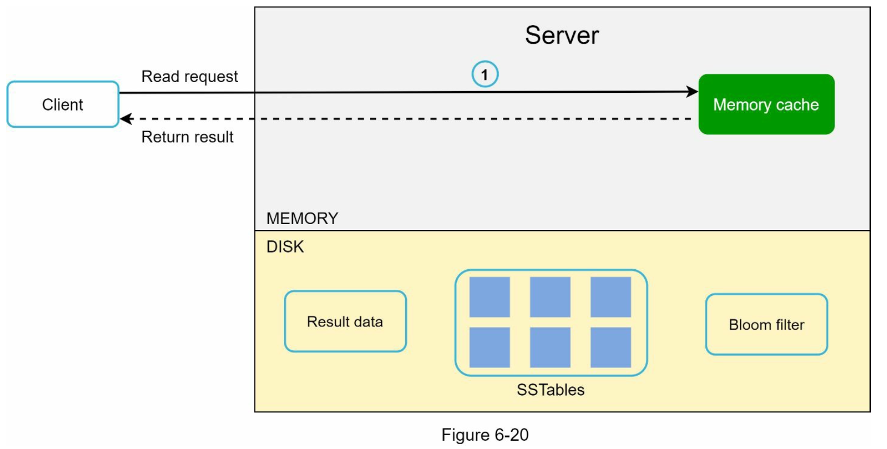
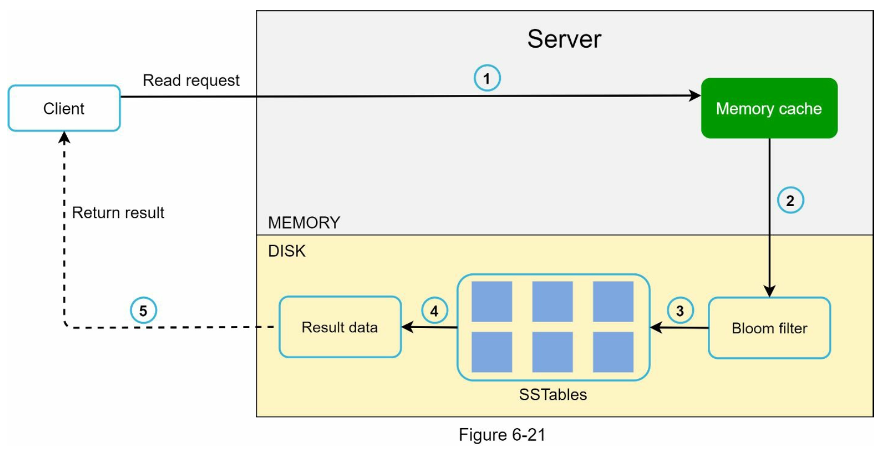

