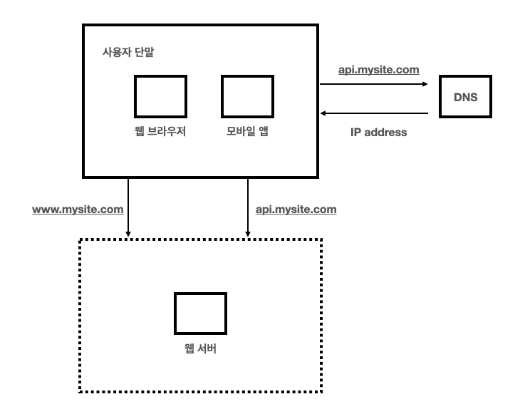

# 01. 책 내용 정리

## 1장. 사용자 수에 따른 규모 확장성

### 단일 서버

- 처리 순서
    1. 사용자는 도메인 이름을 이용하여 웹사이트에 접속한다. 이 접속을 위해서는 도메인 이름을 도메인 이름 서비스에 질의하여 IP 주소로 변환하는 과정이 필요하다.
    2. DNS 조회로 웹 서버의 IP 주소가 반환된다.
    3. 해당 IP 주소로 HTTP 요청이 전달된다.
    4. 요청을 받은 웹 서버는 HTML 페이지나 JSON 형태의 응답을 반환한다.
- AWS : Amazon EC2, Amazon Route 53

### **데이터베이스**

- 사용자가 늘면 서버 하나로는 충분하지 않아서 여러 서버를 두어야 한다. 하나는 웹/모바일 트래픽 처리 용도이고 다른 하나는 데이터베이스 용도이다.
- 데이터베이스는 크게 RDBMS, NoSQL 2가지로 나눌 수 있다. 대체적으로는 RDBMS로 해결할 수 있고 적절한 상황이지만, 아래와 같은 경우에는 NoSQL이 적절한 선택일 수 있다.
    - 아주 낮은 응답 지연시간이 요구됨
    - 다루는 데이터가 비정형이라 관계형 데이터가 아님
    - 데이터를 직렬화하거나 역직렬화할 수 있기만 하면 됨
    - 아주 많은 양의 데이터를 저장할 필요가 있음
- 관계형 DB 종류
    - MySQL, PostgreSQL, Oracle, SQL Server
        - AWS : Amazon RDS
- NoSQL 종류
    - key-value 저장소 : Redis, Memcached
        - AWS : Amazon ElastiCache
    - document(문서) 저장소 : MongoDB, CouchDB
        - AWS : Amazon DocumentDB
    - column(열) 저장소 : Cassandra, HBase
        - AWS : Amazon Keyspaces
    - graph 저장소 : Neo4j, ArangoDB
        - AWS : Amazon Neptune

### **수직적 규모 확장 vs 수평적 규모 확장**

- 스케일 업(scale up) : **수직적 규모 확장은 서버에 고사양 자원(더 좋은 CPU, 더 많은 RAM)을 추가하는 것**
- 스케일 아웃(scale out) : 수평적 규모 확장은 더 많은 서버를 추가하여 성능을 개선하는 행위
- 서버로 유입되는 트래픽의 양이 적을 때는 수직적 확장이 좋은 선택이며, 이 방법의 가장 큰 장점은 단순함이다. 그러나 스케일 업에는 심각한 단점이 존재한다.
    - 한 대의 서버에 CPU나 메모리를 무한대로 증성할 방법은 없다.
    - 장애에 대한 자동복구(failover) 방안이나 다중화 방안을 제시하지 않는다. 서버에 장애가 발생하면 웹사이트/앱은 완전히 중단된다.
- AWS : Amazon EC2 Auto Scaling, Amazon CodeDeploy, Amazon Elastic Load Balancing

### **로드밸런서**

- 사용자는 로드밸런서의 `Public IP`로 접속한다. 서버 간 통신에는 `Private IP`가 이용된다. 위처럼 스케일 아웃을 통해서 서버를 여러 대로 늘리게 되면 no failover도 해소할 수 있고, 웹 계층의 가용성은 향상된다.
- AWS : Amazon Elastic Load Balancing
    - L7 : Application Load Balancer (ALB)
    - L4 : Network Load Balancer (NLB)

### 데이터베이스 다중화

- 주 데이터베이스 : Insert, Delete, Update
- 부 데이터베이스 : Select
- 데이터베이스 다중화의 장점
    - 더 나은 성능 : 모든 데이터 변경 연산은 Master 서버로만 전달되는 반면 읽기 연산은 Slave 데이터베이스 서버들로 분산된다. 병렬로 처리될 수 있는 쿼리의 수가 늘어나므로 성능이 좋아진다.
    - 안전성 : 데이터베이스 서버 가운데 일부가 파괴되어도 데이터는 보존될 것이다. 데이터를 지역적으로 떨어진 여러 장소에 다중화 시켜놓을 수 있기 때문이다.
    - 가용성 : 데이터를 여러 지역에 복제해 둠으로써, 하나의 데이터베이스 서버에 장애가 발생하더라도 다른 서버에 있는 데이터를 가져와 계속 서비스할 수 있게 된다.
- AWS : Amazon RDS 
    - Multi-AZ : Multi-AZ 배포는 데이터베이스 인스턴스를 하나의 리전 내에서 여러 가용 영역(AZ)에 걸쳐 복제하여 운영하는 방식
    - Read Replicas : 읽기 전용 복제본(Read Replicas)을 사용하면 읽기 쿼리 부하를 주 데이터베이스 인스턴스에서 분산
    - Cross-Region Replication : Amazon RDS는 교차 리전 복제(Cross-Region Replication)를 지원
    - Automated Backups and Snapshots : Amazon RDS는 자동 백업을 지원하며, 사용자가 필요한 시점의 스냅샷을 수동으로 생성
    - Amazon Aurora Multi-Master : 마스터 인스턴스를 동시에 운영하여 읽기/쓰기 작업을 분산
- 데이터베이스 다중화를 포함한 시스템 아키텍처
    - 처리 순서
        1. 사용자는 DNS로부터 로드밸런서의 공개 IP 주소를 받는다.
        2. 사용자는 해당 IP 주소를 사용해 로드밸런서에 접속한다.
        3. HTTP 요청은 서버 1이나 서버 2로 전송된다.
        4. 웹 서버는 사용자의 데이터를 부 데이터베이스 서버에서 읽는다.
        5. 웹 서버는 데이터 변경 연산은 주 데이터베이스로 전달한다.

### 캐시

- 캐시는 값 비싼 연산 결과 또는 자주 참조되는 데이터를 메모리 안에 두고, 뒤이은 요청이 보다 빨리 처리될 수 있도록 하는 저장소이다. 애플리케이션의 성능은 데이터베이스를 얼마나 자주 호출하느냐에 크게 좌우되는데, 캐시는 그런 문제를 완화할 수 있다.
- 캐시 계층은 데이터가 잠시 보관되는 곳으로 데이터베이스보다 훨씬 빠르다.
- 처리 순서
    1. 요청을 받은 웹 서버는 캐시에 응답이 저장되어 있는지를 확인한다.
    2. 만일 저장되어 있다면 해당 데이터를 클라이언트에 반환한다.
    3. 없는 경우에는 데이터베이스 쿼리를 통해 데이터를 찾아 캐시에 저장한 뒤 클라이언트에 반환한다.
- 캐시 사용 시 유의할 점
    - 캐시는 갱신은 자주 일어나지 않지만 참조는 빈번하게 일어난다면 고려해볼만 하다.
    - 영속적으로 보관할 데이터를 캐시에 두는 것은 바람직하지 않다.
        - 캐시는 데이터를 휘발성 메모리에 두기 때문에, 캐시 서버가 재시작되면 모든 데이터는 사라진다.
    - 만료된 데이터는 캐시에서 삭제되어야 한다.
        - 만료 기한에 대한 정책을 마련하는 것이 좋다.
        - 만료 기한이 너무 짧으면, 데이터베이스를 너무 자주 읽게 되며, 너무 길면 원본과 차이가 날 가능성이 높아진다.
    - 데이터 저장소의 원본과 캐시 내의 사본 일관성을 확인해야 한다.
    - 캐시 서버를 한 대만 두는 경우 해당 서버는 단일 장애 지점(SPOF)이 되어 버릴 수 있다.
    - 캐시 메모리 크기는 너무 크지도 작지도 않게 적절하게 잡아야 한다.
    - 캐시가 꽉 차버리면 LRU, LFU, FIFO 같은 정책들을 사용해서 사용해야 한다.
- AWS : Amazon ElastiCache

### **콘텐츠 전송 네트워크(CDN)**

- CDN은 정적 콘텐츠를 전송하는 데 쓰이는, 지리적으로 분산된 서버의 네트워크이다. 이미지, 비디오, CSS, JavaScript 파일 등을 캐시할 수 있다.
- 처리 순서
    1. 사용자 A가 이미지 URL을 이용해 image.png에 접근한다.
    2. CDN 서버의 캐시에 해당 이미지가 없는 경우, 서버는 원본 서버에 요청하여 파일을 가져온다.
    3. 원본 서버가 파일을 CDN 서버에 반환한다.
    4. CDN 서버는 파일을 캐시하고 사용자 A에게 반환한다.
    5. 사용자 B가 같은 이미지에 대한 요청을 CDN 서버에 전송한다.
    6. 만료되지 않은 이미지에 대한 요청은 캐시를 통해 처리된다.
- AWS : Amazon CloudFront
- 캐시를 포함한 시스템 아키텍처
    - 처리 순서
        1. 정적 컨텐츠(JS, CSS, 이미지 등)는 더 이상 웹 서버를 통해 서비스하지 않으며, CDN을 통해 제공하여 더 나은 성능을 보장합니다.
        2. 캐시가 데이터베이스 부하를 줄어줍니다.

### **무상태(stateless) 웹 계층**

- HTTP 같은 경우는 stateless 하기 때문에 세션 같은 정보는 저장을 해두어야 한다.
- 세션은 요청에 대한 context다.
- 위와 같이 세션 저장소를 서버 내부 메모리를 사용하지 않고, `RDBMS` or `Redis, Memcached`와 같은 외부 공유 저장소이다.

### **데이터 센터**

- 장애가 없는 상황에서 사용자는 가장 가까운 데이터 센터로 안내되는데, 통상 이 절차를 지리적 라우팅이라고 부른다.
- 만약 데이터 센터 중 하나에 심각한 자애가 발생하면 모든 트래픽은 장애가 없는 데이터 센터로 전송된다.
- 다중 데이터센터를 만들기 위해서 고려해야 할 조건
    - 트래픽 우회 : 올바른 데이터 센터로 트래픽을 보내는 효과적인 방법을 찾아야 합니다.
    - 데이터 동기화 : 데이터 센터마다 별도의 데이터베이스를 다중화하기
    - 테스트와 배포 : 여러 위치에서 애플리케이션을 테스트 해보고, 자동화 배포가 모든 데이터 센터에 동일하게 설치되도록 하는 것이 중요합니다.

### **메세지 큐**

- 메세지 큐는 메세지의 무손실, 즉 메세지 큐에 일단 보관된 메세지는 소비자가 꺼낼 떄까지 안전히 보관된다는 특성을 보장하는 비동기 통신을 지원하는 컴포넌트이다. Publish/Producer는 메세지 큐에 발행한다. 큐에는 보통 Consumer/Subscribe가 메세지를 꺼내서 동작을 수행한다.
- 메세지 큐를 이용하면 서비스 또는 서버 간 결합이 느슨해져서, 규모 확장성이 보장되어야 하는 안정적 애플리케이션을 구성하기 좋다.
- AWS : Amazon SQS, Amazon SNS, Amazon Managed Streaming for Apache Kafka (MSK), Amazon MQ
- 메세지 큐를 포함한 시스템 아키텍처

### **로그, 메트릭 그리고 자동화**

- 비지니스의 규모가 커지면 로그, 매트릭, 자동화 도구에 필수적으로 투자해야한다.
    - 로그 : 에러 모니터링을 위해. 로그를 단일 서비스로 모아주는 도구를 사용할 수도 있음
        - AWS : Amazon CloudWatch
    - 메트릭 : 유용한 정보, 시스템의 현 상태를 파악하기 위해
        - AWS : Amazon CloudWatch
    - 자동화 : 생산성과 안정성을 높이기 위해
        - AWS : AWS CodeDeploy, WS CloudFormation, AWS Elastic Beanstalk, AWS OpsWorks
            - AWS CodeDeploy : 개발자가 애플리케이션을 자동으로 AWS 인프라에 배포할 수 있게 해주는 서비스
            - AWS CloudFormation : 인프라 자원을 모델링하고 설정할 수 있는 코드를 작성하여, 클릭 몇 번으로 AWS 리소스 스택을 생성하고 관리할 수 있게 해주는 서비스
            - AWS Elastic Beanstalk : 애플리케이션을 배포하고 관리하는 서비스
            - AWS OpsWorks : Chef 및 Puppet과 같은 자동화 플랫폼을 사용하여 서버 구성, 애플리케이션 배포, 스케일링을 관리할 수 있는 서비스

### **데이터베이스의 규모 확장**

- 저장할 데이터가 많아지면 데이터베이스에 대한 부하도 증가한다. 이 때도 애플리케이션 서버처럼 스케일 업, 스케일 아웃 두 가지 방법이 존재한다.
- 데이터베이스에도 수직적 확장보다는 수평적 확장이 더 적절하다. 수평적 확장에 대표적으로는 **샤딩**이 있다. 샤딩은 대규모 데이터베이스를 샤드라고 부르는 작은 단위로 분할하는 기술을 말한다.
- 샤딩 전략을 구현할 때 중요한 것은 샤딩 키 이다. 샤딩 키에 따라서 한 곳으로만 부하가 집중될 수 있고 여러 곳으로 적절히 잘 분산될 수도 있다.
- 샤딩을 위해서 고려해야 할 조건
    - 데이터의 재샤딩
        - 데이터가 너무 많아져서 하나의 샤드로는 더 이상 감당하기 어려울 때
        - 샤드 간 데이터 분포가 균등하지 못하여 어떤 샤드에 할당된 공간 소모가 다른 샤드에 비해 빨리 진행될 때
    - 유명 인사 : 핫스팟 키 문제라고도 부르는데, 특정 샤드에 쿼리가 집중되어 서버에 과부하가 걸리는 문제
    - 조인과 비정규화일단 하나의 데이터베이스를 여러 샤드 서버로 쪼개고 나면, 여러 샤드에 걸친 데이터를 조인하기가 힘들어진다. 이를 해결하는 한 가지 방법은 데이터베이스를 비정규화하여 하나의 테이블에서 쿼리가 수행될 수 있도록 하는 것이다.
- AWS : Amazon RDS, Amazon Aurora
    - Amazon RDS : Amazon RDS는 여러 종류의 데이터베이스 엔진을 지원하는 관리형 관계형 데이터베이스 서비스입니다. MySQL, PostgreSQL, MariaDB, Oracle, Microsoft SQL Server 등의 데이터베이스를 지원
        - Multi-AZ : Multi-AZ 배포는 데이터베이스 인스턴스를 하나의 리전 내에서 여러 가용 영역(AZ)에 걸쳐 복제하여 운영하는 방식
        - Read Replicas : 읽기 전용 복제본(Read Replicas)을 사용하면 읽기 쿼리 부하를 주 데이터베이스 인스턴스에서 분산
    - Amazon Aurora : Amazon Aurora는 AWS에서 개발한 MySQL과 PostgreSQL과 호환되는 관리형 관계형 데이터베이스 서비스
        - Multi-AZ
        - Read Replicas
        - Amazon Aurora Multi-Master
        - 자동 장애 복구 및 백업
- 데이터베이스 다중화를 포함한 시스템 아키텍처

## 02. **개략적인 규모 측정**

### **개략적인 규모 측정**

- 보편적으로 사용되는 성능 수치 항목들을 추정해서 계산하는 것, 필요한 기본기로 2의 제곱수나 응답지연(latency) 값과 가용성에 관계된 수치들의 이해가 있어야 한다.
    - 2의 제곱수
    - 응답지연 값
    - 가용성에 관계된 수치들

### **2의 제곱수**

- 데이터 볼륨 단위를 계산하기 위해 사용 (양을 측정) 최소단위는 1바이트(8비트) 이다.
- 아스키 문자 하나가 차지하는 메모리의 크기가 1바이트 이고 보통 많이 사용되는 UTF-8의 경우 1~4 바이트가 사용된다.
- 한글 또는 다국어를 고려할 때 한 단어를 4바이트 까지 고려하는 것이 좋겠다.
- 책에서는 페타바이트 까지 나와 있는데 이는 2의 50제곱으로 약 1000조 바이트이다.
- 대략 많이 사용되는 기가바이트는 약 10억 으로 2의 30제곱이다.

### **응답지연 값**

| 연산명 | 시간 |
| --- | --- |
| 뮤텍스 락/언락 | 100ns |
| 주 메모리 참조 | 100ns |
| Zippy로 1KB 압축 | 10us |
| 1Gbps 네트워크로 2KB 전송 | 20,000ns = 10us |
| 메모리에서 1MB 순차적으로 read | 500,000ns = 250us |
| 디스크 탐색 | 10ms |
| 네트워크에서 1MB 순차적으로 read | 10ms |
| 디스크에서 1MB 순차적으로 read | 30ms |
| 한 패킷의 캘리포니아로부터 네델란드까지의 왕복 지연시간 | 150ms |

### 결론

- 메모리는 빠르지만 디스크는 아직도 느리다.
- 디스크 탐색은 가능한 피하라.
- 단순한 압축 알고리즘은 빠르다.
- 데이터를 인터넷으로 전송하기 전에 가능하면 압축하라.
- 데이터 센터는 보통 여러 지역에 분산되어 있고 센터들 간에 데이터를 주고받는데는 시간이 걸린다.

### **가용성에 관계된 수치들**

| 가용률 시간 | 연간 장애시간 |
| --- | --- |
| 99% | 3.65일 |
| 99.9% | 8.77시간 |
| 99.99% | 52.60분 |
| 99.999% | 5.26분 |

### 트위터 QPS와 저장소 요구량 추정

- 가정
    - 월간 능동 사용자는 3억 명이다
    - 50%의 사용자가 트위터를 매일 사용한다
    - 평균적으로 각 사용자는 매일 2건의 트윗을 올린다
    - 미디어를 포함하는 트윗은 10% 정도다
    - 데이터는 5년간 보관된다
- 추정
    - 월간 능동 사용자는 3억 명이다
    - 50%의 사용자가 트위터를 매일 사용한다
    - 3억 * 50% = 1.5억 명
- QPS(Query Per Second) 추정치
    - 평균적으로 각 사용자는 매일 2건의 트윗을 올린다
    - QPS = 1.5억 * 2 트윗 / 24시간 / 1분(3600초) = 약 3500
    - 최대 QPS = 3500 * 2 = 약 7000
- 미디어 저장을 위한 저장소 요구량
    - 평균 트윗 크기(avg)
        - tweet_id 에 64바이트
        - 텍스트에 140바이트
        - 미디어에 1MB
    - 미디어를 포함하는 트윗은 10% 정도다
        - 1.5억 *2(개)* 10% * 1MB = 30TB/일
    - 데이터는 5년간 보관된다
        - 30TB *365일* 5년 = 약 55PB
- 팁
    - 근사치를 사용한 계산을 할줄 알아야 한다. 즉 반올림, 올림, 내림에 대한 오차 수준을 생각해서 근사치로 계산시간을 줄인다.
    - 가정은 적어 둬라 위에도 적혀 있다.
    - 단위를 붙이는 습관을 둬라 이건 꼼꼼함을 챙기는 포인트로 보인다 개발자는 꼼꼼함도 중요하다.
    - QPS, TPS, 저장소량(?), 캐시 요구량, 서버 수 등 추정하는 방법을 미리 연습해 두어라.
