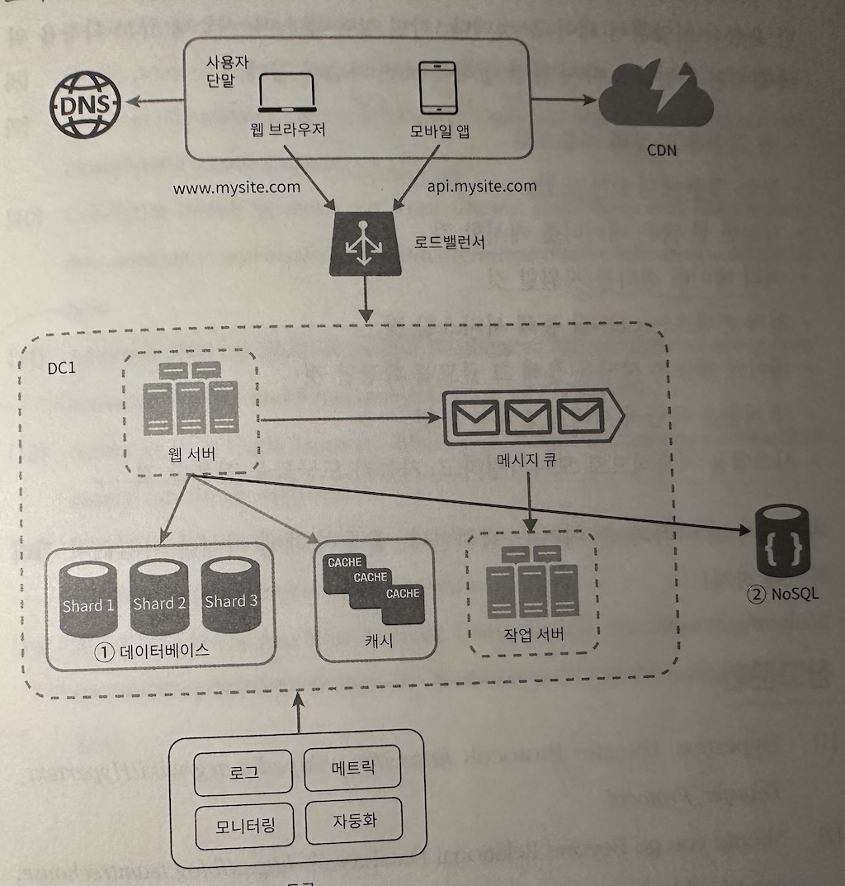

## 1장 사용자 수에 따른 규모 확장

### 질문
- DB 분리를 하는 시점은?
- NoSQL 추천하는 경우는?
- scaleup 을 추천하는 경우
- Loadbalancer를 사용하면 좋아지는 점은?
- 웹서버와 LoadBalancer간 통신시 사용되는 IP 왜 그걸 사용하는지?
- 로드밸런서 사용시에 트래픽이 증가한다면 대응 방법?
- stateless 웹계층을 만드는 방법?
- 웹서버가 상태의존적 아키텍쳐일때의 문제점?
- 데이터센터가 필요한 시점은?

### 단일 서버 
- 사용자 단말(웹브라우저, 모바일)
- DNS
- 웹서버(HTML, JSON응답)

### 데이터 베이스 
- 첫번째 서버 분리 - 사용자 증가시 "DB용 서버" 분리 

#### 어떤 데이터 베이스를 사용할 것인가
##### Relational DB
- RDBMS
- MySQL, 오라클, PostgreSQL
- 자료를 테이블과 열, 칼럼으로 표현
- SQL사용해 여러 테이블 join
##### Non - Relational DB - NoSQL
- CouchDB, Neo4j, Cassandra, HBase, Amazon DynamoDB
- **일반적으로 Join 미지원**
- 세부 분류
	- key-value store
	- graph store
	- column store
	- document store

#### NoSQL 추천하는 경우
- 아주 낮은 응답지연시간 요구
- 다루는 데이터가 비정형
	- 추가 - 블로그 글등 표로 표현하기 어려운 것들, 
- 데이터(JSON, YAML, XML등)을 serialize, deserialize할수 있기만 하면 됨.
- 아주 많은 양의 데이터를 저장해야 할때 

### 수직적 규모확장 vs 수평적 규모 확장 
- 수직적 규모확장 - scale up - CPU, RAM upgrade
	- 트래픽적을때, 단순해서 좋음
	- CPU, RAM 무한 추가 불가
	- 자동복구(failover)나 다중화(redundancy) 방법 없음 => 장애시 완전 중단
- 수평적 규모확장 - scale out - 서버 추가
	- 대규모 어플리케이션 추천

- 사용자 관점(로드밸런서 및 수평적 규모 확장이 필요한 이유)
	- 웹서버 다운시 사용자 접속불가
	- 너무 많은 사용자 접속시 응답속도 느려짐 또는 접속불가
	- 해결책 : 부하분산기 또는 로드밸런서(Load Balancer) 도입 필요

#### 로드밸런서 
- Load balancing set에 속한 웹 서버들에게 트래픽 부하를 분한

- 보안을 위해 서버간 통신은 private IP address사용
- faileover(장애복구) 가능, availability(웹계층 가용성) 향상
- 트래픽 증가시 웹서버계층에 더 많은 서버만 추가하면 됨

#### 데이터베이스 다중화
- 보통 master-slave로 구성
- master만 쓰기를 지원 - insert, update, delete
- slave숫자가 master보다 많음
- 장점
	- 읽기 연산이 분산되어 병렬처리 가능한 query수 증가
	- reliability(안정성) - 지역적으로 떨어진 곳으로 분산가능
	- availiability(가용성) - 장애발생시 계속 서비스 가능
- DB가운데 하나가 다운된다면 벌어지는일
	- slave 1개가 다운 상황
		- master 1 + slave 1 이라면
			- master 1가 읽기연산 시작
		- master 1 + slave 3 이라면
			- 나머지 slave가 계속 연산
	- master 1개가 다운되면
		- master 1 + slave 1 이라면
			- slave가 master로 변경
			- slave가 최신이 아닐수도 있음, 복구 스크립트를 돌려야함.
			- multi-masters, cicular replication방식 가능

### 캐시
- 목표 - 응답시간을 개선하자!
- 비싼 연산이나 자주 참조되는 데이터를 메모리에 두고 이후 요청을 빠르게 하기 위해 존재

#### 캐시계층 Cache tier
- 웹서버 - 캐시 - DB
- 읽기주도형캐시전략(read-through caching strategy)

#### 캐시 사용시 유의할점
- 갱신이 적고 참조가 많을때 추천
- 캐시가 재시작되면 모두 삭제되니, 저장해야 하는 데이터는 persistent data store에 두어야 함.
- 만료정책은 어떻게? 너무 짧으면 DB부하, 너무 길면 원본과 차이
- Consistency(일관성) 유지 방법 - DB원본과 캐시의 갱신이 단일 트랜잭션으로 처리안되면 깨짐
- 장애대처방법 - 캐시서버가 1개면 SPOF가 된다. 여러개 필요
- 캐시메모리는 얼마나 크게? 너무 작으면 자꾸 밀려나(evict) 효율이 떨어짐. 과할당(overprovision)하느 방법
- 데이터 방출(eviction) 정책은 어떤걸로? LRU(Least Recently Used/마지막 사용), LFU(Least Frequently Used 적은수의 참조), FIFO(First In First Out/먼저캐시된것부터)

### CDN
- 이미지, 비디오, css, js파일 등을 지리적으로 분산
- HTML캐싱은 책에서 안다룸
- 사용자에게 가장 가까운 CDN서버가 정적컨텐츠 전달
- cloudfront, akamai

#### CDN 고려사항
- 비용
- 만료시점
- CDN장애 대응 - 원본서버에서
- 콘텐츠 무효화(invalidation) - CDN에서 임의 해제 
	- CDN 서비스 제공 API
	- Object Versioning - image.png?v=2

### stateless(무상태) 웹계층
- 웹계층을 수평적으로 확장하기 위함
- 상태정보(사용자 세션 데이터)를 웹계층에서 제거하고 DB에 보관 하는 것을 말함

#### 상태 정보 의존적인 아키텍쳐
- 사용자 A에 관한 로그인정보는 서버 1에만 저장되어 있음
- 사용자 A에 관한 요청이 서버2로 간다면 로그인이 안되어 있어서 문제
- 이를 위한 Sticky session(고정세션)이라는 기능을 로드밸런서에서 제공
- 하지만 서버를 추가하거나 제거하기가 까다로워짐

#### 무상태 아키텍쳐
- 상태를 저장하는 공유 저장소는 RDB, NoSQL, Redis/Memcached 가능
 

### 데이터 센터
- 전세계 어디에서도 쾌적하게 사용하고 싶을때
- 사용자는 가장 가까운 데이터센터로 안내 - geoDNS-routing or geo-routing (지리적라우팅)

#### 고려사항
- 트래픽 우회 - geoDNS는 사용자에게 가까운곳으로 보낸다.
- 데이터 동기화 - 데이터 센터마다 별도의 DB 구축하기 때문에 데이터 센터마다 다중화 필요. 넷플릭스
- 테스트와 배포 - 모든 데이터센터에 배포되도록

### 메시지 큐
- 메시지의 Durability(무손실/큐에 일단 보관하면 컨슈머가 꺼낼때까지 안전히 보관된다는 특성)을 보장하는 Asynchronous communications(비동기 통신) 지원 컴포넌트
- 서버간 결함이 느슨, 규모확장성 보장되는 안정적 애플리케이션 구성에 좋다
- 생산자(Publisher, Producer)는 소비자(Consumer/Subscriber)가 다운되어있어도 메시지 발생할수 있음. 소비자는 생산자 서비스가 가용하지 않아도 수신가능
- 이미지 처리와 같은 연산이 큰작업에 유리

### 로그 , 메트릭 그리고 자동화

비지니스의 규모가 커지면 로그, 매트릭, 자동화 도구는 사업이 커지면, 필수적으로 투자해야한다

- 로그: 에러를 손쉽게 찾기 위해. 로그를 단일 서비스로 모아주는 도구를 사용하면 편리
- 메트릭: 사업 현황과 같은 유용한 정보, 호스트단위(CPU, 메모리, 디스크/IO), 종합(aggregated/DB성능, 캐시성능), 핵심비즈니스(Daily Active User, 수익/Revinue, Retention/재방문)
- 자동화: 시스템이 크고 복잡해지면 Continuous integration 을 도와주는 툴활용, 코드 검증절차를 자동으로, 빌드, 테스트, 배포 등을 자동화 해서 생산성 증가

### 데이터베이스의 규모 확장
- 데이터가 많아져 부하가 늘어나는 문제
- DB증설 방법에 대해 고민

- scale up(수직적 확장): 고성능 자원(CPU, RAM, 디스크 등) 증설
	- 2013년 스택오버플로우 천만명 사용자 전부를 한대의 마스터 DB로 처리
	- 단점 
		- 하드웨어는 한계가 있음, 사용자가 무한으로 늘어나면 한대로는 불가능
		- SPOF
		- 가격이 비쌈
- sharding(수평적 확장): 샤딩
    - 대규모 데이터베이스를 shard라는 단위로 분할하는 기술
    - 샤드 사이에는 중복 데이터가 없음
    - 샤딩 키(파티션 키)를 어떻게 정할지에 대한 전략이 필요
    - 발생가능 문제
	    - 재샤딩 - 데이터가 많아져서 하나의 샤드에 한계, 분포가 불균형 shard exhaustion(샤드소진) 
		    - 해결 - 5장 안정해시 기법으로 해결 가능
	    - 유명인사(celebrity) - 특정 샤드에 쿼리 집중되어 과부하. 연예인들이 한 샤드에 있을때
	    - 조인 - 여러 샤드에 걸친 데이터 조인이 힘듬
		    - 해결책 - 비정규화 해서 하나의 테이블에서 쿼리 가능하도록

### 백만 사용자, 그리고 그 이상

시스템 규모를 확장하는 것은 지속적이고 반복적인 과정
수백만 사용자 이상을 지원하기 위해서는 새로운 전략 & 지속적인 시스템 다듬기 필요

#### 시스템 규모확장 기법정리
- 웹계층은 무상태 계층으로
- 모든 계층에 다중화 도입
- 가능한 한 많은 데이터 캐시
- 정적 콘텐츠는 CDN
- 데이터 계층은 샤딩
- 각 계층은 독립적 서비스로
- 시스템을 지속적으로 모니터링하고 자동화 도구 활용
