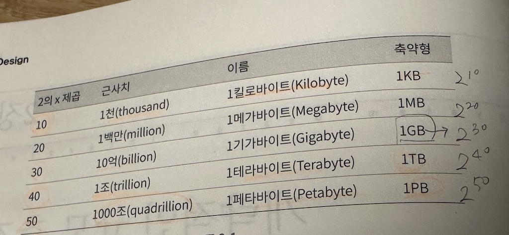

## 2장 개략적인 규모 추정(back-of-the-envelope estimation)
- 시스템 설계 면접 주요 질문 2가지 
	- 시스템용량
	- 성능 요구사항 개략적 추정
- 제프딘  - 개략적인 규모추정은 보편적인 성능 수치로 thought experiments(사고실험)을 통해 추정치를 계산하는 것으로 **어떤 설계가 요구사항에 부합하는지를 보기 위한것**
- 기본기 3가지
	- 2의 제곱수
	- 응답지연(latency)
	- 고가용성에 관한 수치에 대한 이해 

### 2의 제곱수

