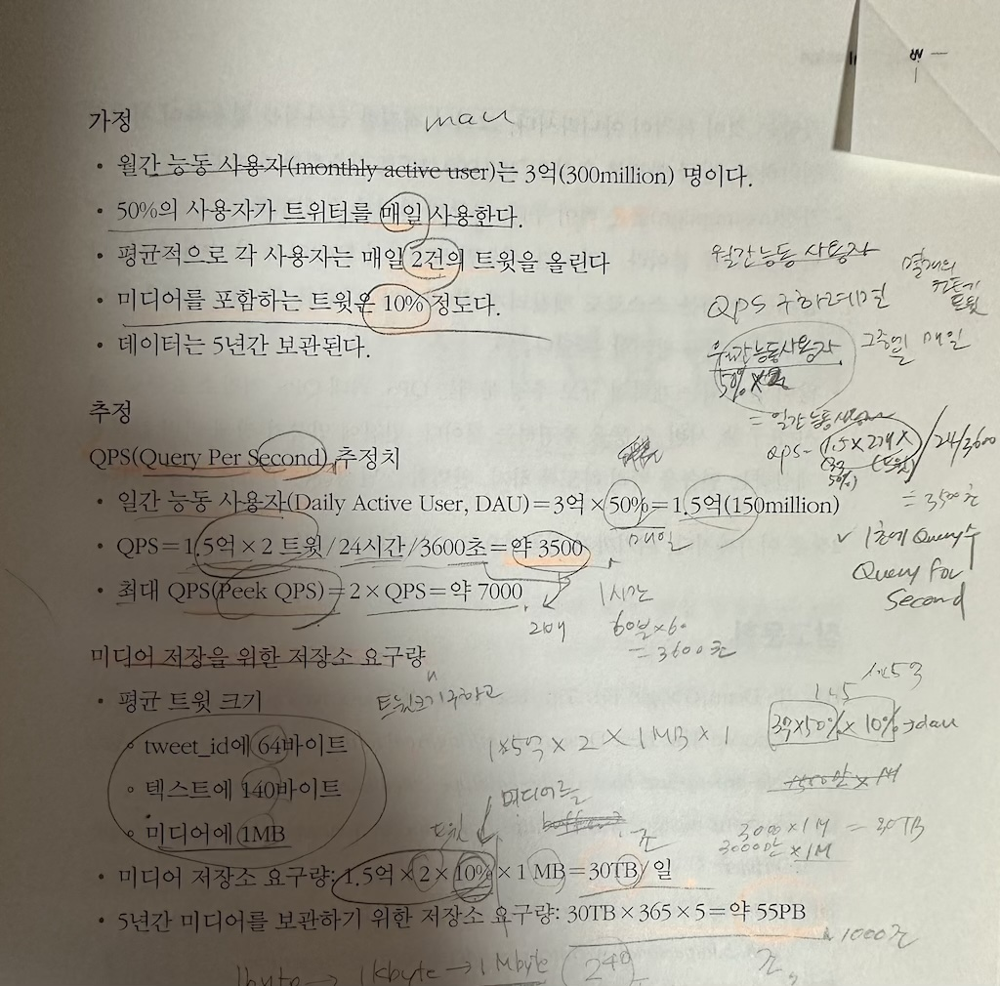

## 2장 개략적인 규모 추정(back-of-the-envelope estimation)
- 시스템 설계 면접 주요 질문 2가지 
	- 시스템용량
	- 성능 요구사항 개략적 추정
- 제프딘  - 개략적인 규모추정은 보편적인 성능 수치로 thought experiments(사고실험)을 통해 추정치를 계산하는 것으로 **어떤 설계가 요구사항에 부합하는지를 보기 위한것**
- 기본기 3가지
	- 2의 제곱수
	- 응답지연(latency)
	- 고가용성에 관한 수치에 대한 이해 

### 2의 제곱수

### 모든 프로그래머가 알아야 하는 응답 지연 값
- ns - 나노초, 10^-9
- 1 마이크로초 = 1000ns
- ms = 밀리초 = 1,000,000ns

#### 각 단위 시각화 
- 메모리는 빠르지만 디스크는 느림
- 디스크탐색(seek)은 가능한 피하라
- 단순한 압축 알고리즘은 빠르다
- L1 캐시 < L2캐시 < 뮤텍스 락 < 주메모리 참조 < Zippy압축 < SSD읽기 < 1M 메모리 읽기 < 패킷왕복(동일 DC) < SSD 1M 읽기 < 디스크탐색 < 디스크 1M < CA-네덜란드 패킷왕복
- https://colin-scott.github.io/personal_website/research/interactive_latency.html

### 가용성에 관계된 수치들
- HA(High Availability/고가용성) - 무중단 능력
- SLA(Service Level Agreement) - 서비스 사업자와 고객 사이의 합의.
- 아마존, 구글, MS는 99%의 uptime(가용시간)을 SLA제공

### 예제 : 트위터 QP와 저장소 요구량 추정
- DAU = MAU x 매일 사용하는 비율
- QPS(Query per secoent) = DAU x 1일 생산량 / 24시간(초단위)
- Max QPS = 2 x QPS 왜?
- 1일 미디어 저장소요구량 = DAU x 1일 생산량 x 미디어 비율 x 미디어사이즈

### 팁
- 근사치를 이용
- 가정을 정리
- 단위
- 문제 
	- QPS, 최대 QPS, 저장소 요구량, 캐시 요구량, 서버 수 추정