# 처리율 제한 장치의 설계  
- rate limiter: 클라이언트 또는 서비스가 보내는 트래픽의 처리율(rate)을 제어하기 위한 장치
- 특정기간에 API요청이 Threshold(임계치)를 넘어서면 Block(처리 중단)
	- 사용자는 초당 2회 이상 새 글을 올릴 수 없음
	- 같은 IP 주소로는 하루에 10개 이상의 계정 생성 불가
	- 같은 디바이스로는 주당 5회 이상 리워드 요청 불가 
  
**rate limiter의 좋은점**  
1. DoS 공격 방지 - 트위터 3시간동안 300개 트윗, 구글 독스 api 분당 300회
2. 비용 절감 - 서버를 불필요하게 많이 두지 않아도 됨  
3. 서버 과부하 방지 - 봇, 잘못 발생한 트래픽  
  
## 1단계  문제 이해 및 설계 범위 확정  
### 질문과정
- 클라이언트? 서버?
- API 제한 기준 - IP vs 사용자 ID
- 예상 사용자 수 - 스타트업 vs 사용자가 많은 
- 분산환경 
- 사용자에게 제한됨 노출 ?
### 요구사항  
1. 처리율을 초과하는 요청은 정확히 제한  
2. 낮은 응답시간  
3. 적은 메모리
4. 분산형 처리율 제한: 하나의 rate limiter를 여러 서버나 프로세스에서 공유
5. 예외 처리: 필터시 사용자에게 알림
6. 높은 결함 감내성: 제한 장치에 장애가 생기더라도 전체 시스템에 영향을 주어선 안됨  
  
## 2단계 - 개략적 설계안 제시 및 동의 구하기  
### 처리율 제한 장치는 어디에 둘 것인가?  
  
#### 클라이언트 측에 제한 장치를 두는 방법  
- 클라이언트 요청은 쉽게 위변조가 가능
- 또한, 모든 클라이언트의 구현을 통제하는 것도 어려움  
  
#### 서버 측에 제한 장치를 두는 방법  
- 서버에 제한 장치를 두는 방법  


- 처리율 제한 장치 미들웨어
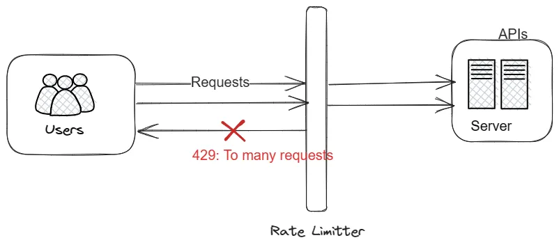
  
- API 서버의 처리율이 초당 2개로 제한, 클라이언트가 3번째 요청을 앞의 두 요청과 같은 초 범위 내에서 전송 한경우 2개만 서버로 전달, 1개는 429 Too Many Requests 반환  
- 클라우드 마이크로서비스의 처리율 제한 장치 - API gateway로 구현됨  
- API gateway: 처리율 제한, SSL 종단, 사용자 인증, IP 화이트리스트 관리 등을 지원

#### rate limiter 설계시 고려사항
- 어디에? 서버 vs 게이트웨이
- 캐시서비스, 사용중인 언어가 서버측 구현이 가능할정도로 효율적인가?
- 사업에 맞는 알고리즘 찾기 - 서버 측에서 모든 것을 구현한다면 알고리즘 자유, 게이트웨이 서비스를 사용한다면 제한됨.
- MSA 기반 + 사용자 인증, IP white list 처리를 위해 API gateway를 이미 설계에 포함했다면 처리율 제한 기능도 게이트웨이에 포함시켜야 할 수 있음
- 처리율 제한 서비스를 직접 만드는데 시간이 듦 -> 상용 API gateway를 쓰는 것 추천  
  
### 처리율 제한 알고리즘
https://blog.stackademic.com/rate-limiter-in-net-core-web-api-3688caec7098
#### 토큰 버킷 알고리즘  
- 아마존, 스트라이프에서 사용중
- Amazon - https://docs.aws.amazon.com/ko_kr/apigateway/latest/developerguide/api-gateway-request-throttling.html
- Stripe - https://stripe.com/blog/rate-limiters

##### 원리
- 토큰 버킷은 지정된 용량을 갖는 컨테이너, 이 버킷에 사전 설정된 양의 토큰이 주기적으로 채워짐  
- 토큰이 꽉 찬 버킷에는 더 이상 버킷이 추가되지 않고 버려짐  
  
##### 예제 
토큰 버킷 용량이 4이고 매초 2개의 토큰이 추가되는 예제  
  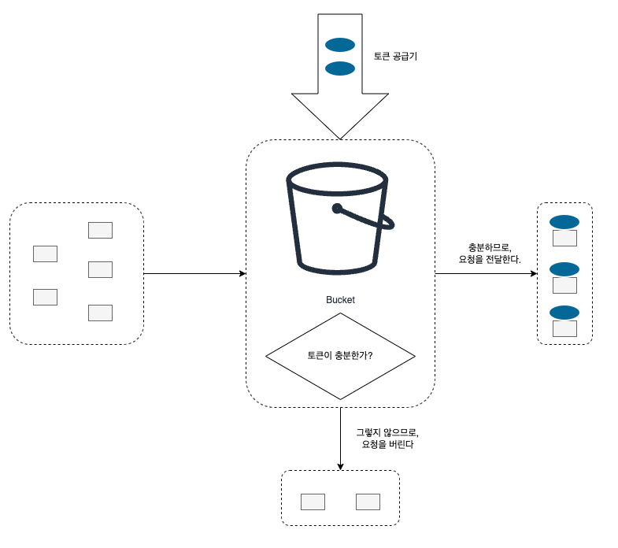
  

  
예제 - 토큰 버킷 4 +토큰 공급률 분당 4
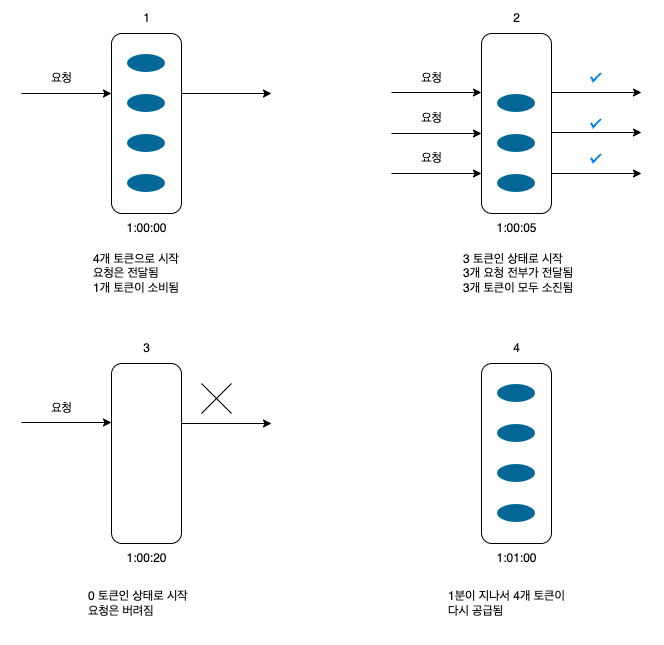


##### 토큰 버킷 알고리즘 인자
- 버킷 크기: 버킷에 담을 토큰의 최대 개수  
- 토큰 공급률: 초당 몇개의 토큰이 버킷에 공급되는지  
  
##### 버킷 개수는 어떻게 결정?
- 통상적으로 API endpoint마다 별도의 버킷을 둠  
- 사용자마다 하루 한번만 포스팅 + 친구는 150명까지 추가 + 좋아요는 5번까지 => 사용자마다 3개의 버킷을 둠  
- IP주소별로 처리율 제한을 적용한다면 => IP주소마다
- 시스템 처리율을 초당 10,000개로 제한한다면 => 모든 요청이 하나의 버킷을 공유
  
##### 장점
1. 구현이 쉽다  
2. 메모리 사용 측면에서도 효율적  
3. 짧은 시간에 집중되는 트래픽 처리 가능(버킷에 남은 토큰이 존재하기만 하면 요청은 시스템으로 전달됨)  
  
##### 단점
1. 두개의 인자를 적절히 튜닝하는 것은 까다로움  
  
#### 누출 버킷 알고리즘  
- 토큰 버킷과 비슷하지만 "요청 처리율이 고정", FIFO 큐로 구현됨  
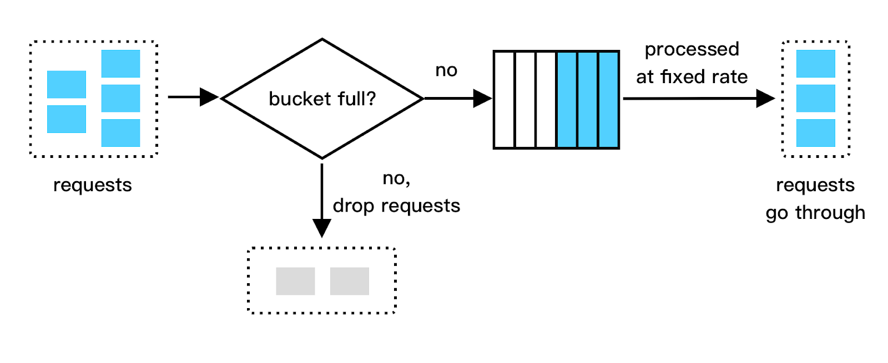

  
##### 누출 버킷 알고리즘의 두가지 인자
- 버킷 크기: 큐 사이즈  
- 처리율: 지정된 시간당 몇 개의 항목을 처리할지 지정하는 값(보통 초단위)  
  
##### 장점
1. 큐의 크기가 제한되어 있어 메모리 사용량에서 효율적  
2. 고정된 처리율을 갖고 있어 안정적 출력이 필요한 경우에 적합  
  
##### 단점
1. 단시간에 많은 트래픽이 몰리게 되면 큐에 오래된 요청이 쌓이게 되어 그 요청을 제떄 처리 못하게 되면 최신 요청들은 버려지게 됨  => 
2. 두 개의 인자를 튜닝하기가 까다로움  
  
#### 고정 윈도 카운터 알고리즘(Fixed Window Counter Algorithm)  
##### 원리 
- 타임라인을 고정된 간격의 window로 나누고 각 윈도우마다 counter를 붙임  
- 요청이 접수될 때마다 카운터의 값 1씩 증가  
- 카운터의 값이 사전에 설정된 임계치에 도달하면 새로운 요청은 새 윈도가 열릴 때까지 버려짐  
  
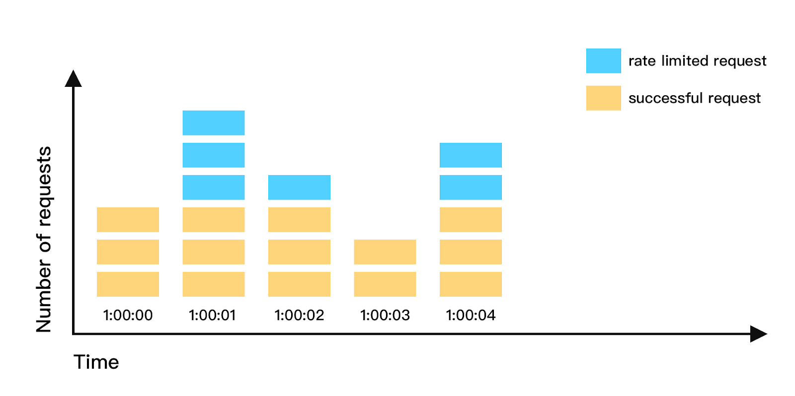


##### 문제점
- 윈도우의 경계 부근에 순간적으로 많은 트래픽이 집중될 경우 윈도우에 할당된 양보다 더 많은 요청이 처리될 수 있음  
- 최대 5개의 요청만 허용하는 시스템 + 카운터는 매분마다 초기화  
- 윈도우를 옮겨보면 아래와 같음
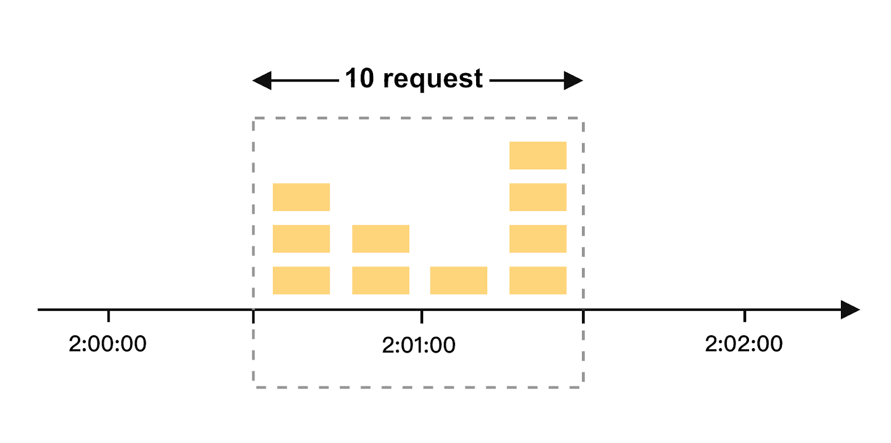  
  
##### 장점
1. 메모리 효율이 좋음  
2. 이해가 쉬움
3. 윈도우가 닫히는 시점에 카운터를 초기화하는 방식은 특정한 트래픽 패턴을 처리하기에 적합  
  
##### 단점
1. 윈도우 경계 부근에서 일시적으로 많은 트래픽이 몰려드는 경우, 기대했던 시스템의 처리 한도보다 많은 양의 요청을 처리하게 됨  
  
#### 이동 윈도 로깅 알고리즘  (sliding window logging algorithm)
고정 윈도 카운터 알고리즘의 문제점 해결
  
이동 윈도 로깅 알고리즘은 이 문제를 해결할 수 있음!  
  
- 타임스템프 추적
- 타임스탬프 데이터는 레디스의 sorted set 같은 캐시에 보관  
- 새 요청이 오면 만료된 타임스탬프 제거 (만료 기준: 현재 윈도의 시작 시점보다 오래된 타임스탬프)  
- 새 요청의 타임스탬프를 로그에 추가  
- 로그의 크기가 허용치보다 같거나 작으면 요청을 시스템에 전달, 그렇지 않다면 처리 거부  
  
##### 분당 2개 요청이 한도인 시스템 예제
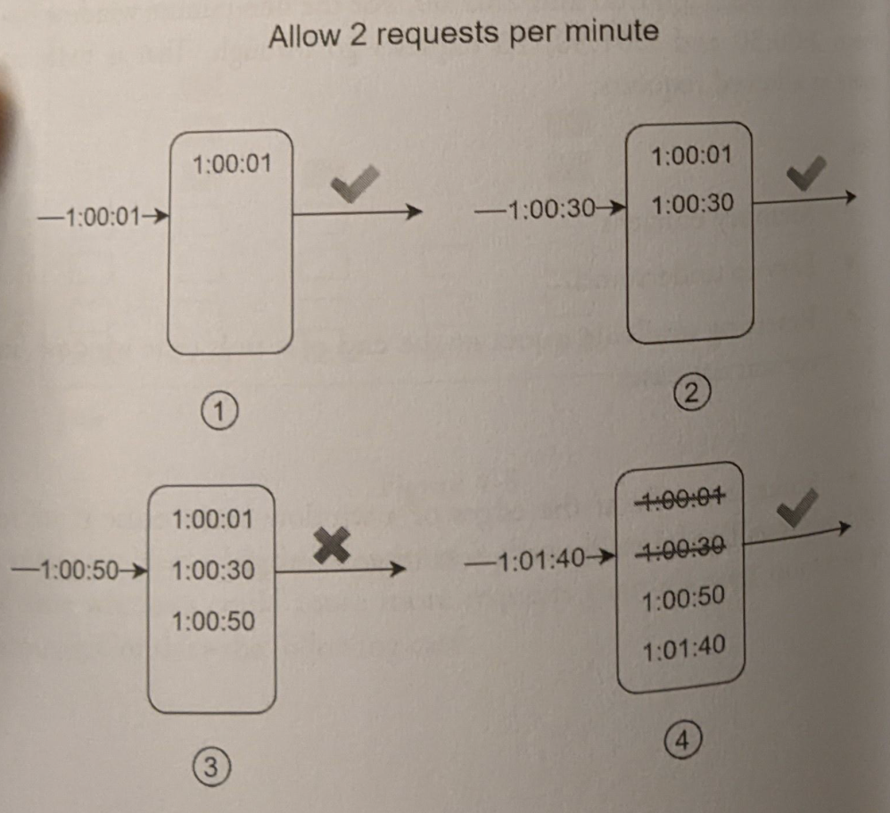
- 요청이 1:00:01에 도착했을 때, 로그는 비어있는 상태이므로 요청은 허용됨  
- 새로운 요청이 1:00:30에 도착하여 로그에 추가되고 허용 한도보다 작은 값이므로 시스템에 전달됨  
- 그 다음, 새로운 요청이 1:00:50에 도착하여 로그에 추가되고 허용 한도보다 큰 값(3)이므로 로그에는 남아있지만 요청은 거부됨  
- 새로운 요청이 1:01:40에 도착하여 1:00:40 이전의 타임스탬프는 로그에서 삭제되고 요청은 시스템으로 전달됨  
  
##### 장점
- 어느 순간의 윈도우를 보더라도 허용되는 요청의 개수는 시스템의 처리율 한도를 넘지 않음  
  
##### 단점
- 거부된 요청의 타임스탬프 값도 로그에 보관하기 때문에 다량의 메모리를 사용함  
- [https://www.reddit.com/r/AskComputerScience/comments/xktn2j/rate_limiting_why_log_rejected_requests/](https://www.reddit.com/r/AskComputerScience/comments/xktn2j/rate_limiting_why_log_rejected_requests/)
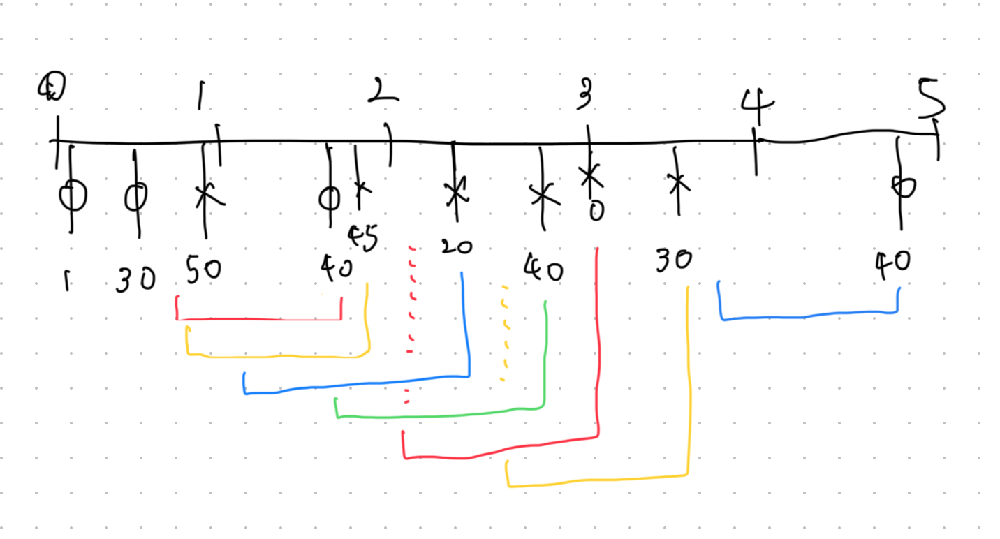

  
#### 이동 윈도 카운터 알고리즘 
- 고정 윈도 카운터 알고리즘 + 이동 윈도 로깅 알고리즘  

##### 원리
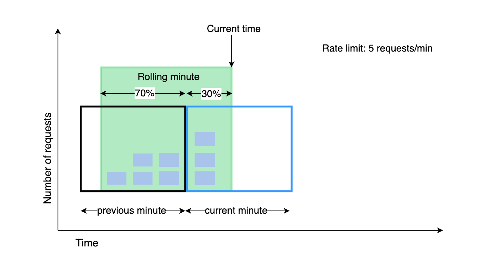
- 상황
	- 분당 7개 설정
	- 이전 1분동안 5개의 요청, 현재 1분동안 3개의 요청  
- 문제 
	- 현재 1분의 30% 시점에 도착한 새 요청의 경우, 현재 윈도에 몇개의 요청이 온것으로 보고 처리해야 할까?  
- 계산방법 
	- 현재 1분간의 요청 수 + 직전 1분간의 요청 수 * 이동 윈도와 직전 1분이 겹치는 비율  
	  - 3 + 5 * 70% = 6.5 개, 내림으로 6개 (반올림도 할수도 있음)
  - 분당 7개의 요청을 받아들일 수 있으므로 현재 1분의 30% 시점에 도착한 신규 요청은 시스템으로 전달 될 것이지만, 그 직후에는 한도에 도달하여 더 이상의 요청은 받을 수 없게됨  
  
##### 장점
- 이전 시간대의 평균 처리율에 따라 현재 윈도우의 상태를 계산하므로 짧은 시간에 몰리는 트래픽에도 잘 대응함  
- 메모리 효율이 좋음  
  
##### 단점
- 직전 시간대에 도착한 요청이 균등하게 분포되어 있다고 가정한 상태에서 추정치 계산 => 다소 느슨  
- Cloudflare사의 실험에 따르면 40억개 가운데 시스템의 실제 상태와 맞지 않게 허용되거나 버려진 요청은 0.003%에 불과함  
  
#### 개략적인 아키텍처  
##### 카운터는 어디에 보관해야 할까?  
- 데이터베이스? - 디스크 접근 때문에 느림  
- 캐시 - 메모리상에서 동작하고 빠른데다 만료정책을 지원함  
- Redis 많이 사용
	- INCR, EXPIRE 명령어를 갖고 처리율 제한 장치를 구현할 수 있음
	- INCR: 메모리에 저장된 카운터의 값을 1만큼 증가시킴  
	- EXPIRE: 카운터에 타임아웃 값을 설정, 설정된 시간이 지나면 카운터는 자동 삭제  
  
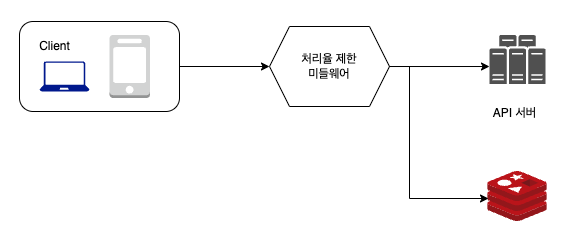  

- 클라이언트가 처리율 제한 미들웨어에게 요청을 보냄  
- 처리율 제한 미들웨어는 레디스의 지정 버킷에서 카운터를 가져와 한도에 도달했는지 아닌지 검사  
- 한도에 도달했다면 요청은 거부됨  
- 한도에 도달하지 않았다면 요청은 API 서버로 전달, 미들웨어는 카운터의 값을 증가시킨 후 다시 레디스에 저장  
  
## 3단계 - 상세 설계  
- 처리율 제한 규칙은 어떻게 만들어지고 어디에 저장되는지  
- 처리가 제한된 요청들은 어떻게 처리되는지  
  
### 처리율 제한 규칙  
- Lyft에서 사용중인 오프소스  - https://github.com/envoyproxy/ratelimit
- 시스템이 처리할 수 있는 마케팅 메시지의 최대치를 하루 5개로 제한  
``` yaml
domain: messaging  
descriptors:  
  key: message_type
  Value: marketing
  rate_limit:
		unit: day
		requests_per_unit: 5
```  

- 클라이언트가 분당 5회 이상 로그인 할 수 없도록 제한  
``` yaml
domain: auth  

descriptors:  
  key: auth_type
  Value: login
  rate_limit:
  unit: minute
  reqeusts_per_unit: 5
```  

### 처리율 한도 초과 트래픽의 처리  
- 한도 제한에 걸리면 API는 HTTP 429 응답을 클라이언트에게 보냄  
- 경우에 따라 한도 제한에 걸린 메시지를 나중에 처리하기 위해 큐에 보관할 수도 있음  
#### 처리율 제한 장치가 사용하는 HTTP 응답 헤더  
- 클라이언트의 요청이 처리율 제한에 걸리는지 감지하는 방법
- 얼마나 많은 요청을 보낼 수 있는지  HTTP response header에 포함
- 사용자가 너무 많은 요청을 보내면 429 오류를 X-Ratelimit-Retry-After 헤더와 함께 반환  
- X-Ratelimit-Remaining: 윈도우 내에 남은 처리 가능 요청의 수  
- X-Ratelimit-Limit: 매 윈도우마다 클라이언트가 전송할 수 있는 요청의 수  
- X-Ratelimit-Retry-After: 한도 제한에 걸리지 않으려면 몇 초 뒤에 요청을 다시 보내야 하는지 알림  
  

#### 상세설계  
- 처리율 제한 규칙은 디스크에 보관, 작업 프로세스(workers)는 수시로 규칙을 디스크에 읽어 캐시에 저장  
  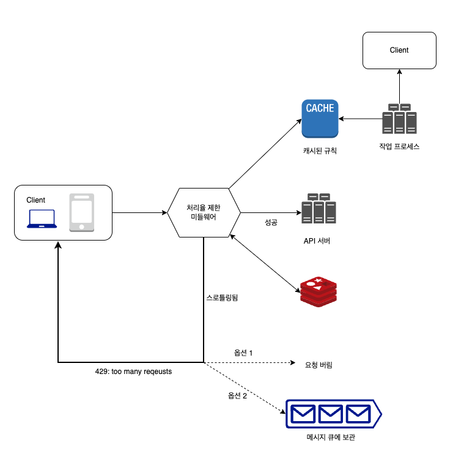
- 클라이언트가 요청을 서버에 보내면 요청은 먼저 처리율 제한 미들웨어에 도달  
- 처리율 제한 미들웨어는 제한 규칙을 캐시에서 가져옴, 카운터 및 마지막 요청의 타임스탬프를 레디스에서 가져옴  
  - 해당 요청이 처리율 제한에 걸리지 않은 경우, API 서버로 보냄  
  - 제한에 걸렸다면, 429 에러를 클라이언트에 보냄 (그대로 버리거나 메시지 큐에 보관)  

#### 분산 환경에서의 처리율 제한 장치의 구현  
- 여러 대의 서버와 병렬 스레드를 지원하도록 시스템을 확장시 풀어야할 2가지 문제
- 경쟁 조건rate condition
- 동기화 syncronization
  
##### 경쟁 조건
- 처리율 제한 장치 동작 방식  
  - 레디스에서 카운터 값 조회  
  - counter + 1의 값이 임계치를 넘는지 확인  
  - 넘지 않는다면 레디스에 보관된 카운터 값을 1만큼 증가시킴  
  
병행성이 심한 환경에서 아래와 같은 경쟁 조건 이슈가 발생할 수 있음  
  
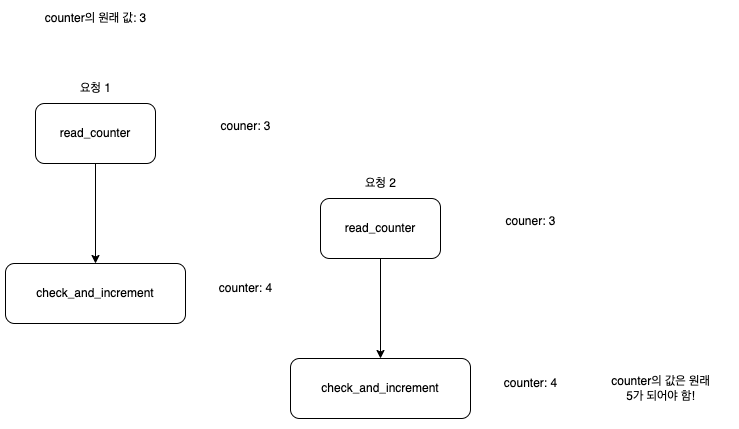
  
- 레디스에 저장된 카운터 값이 3  
- 두 개 요청을 처리하는 스레드가 각각 병렬로 counter를 읽고 그 둘 가운데 어느쪽도 아직 변경된 값을 저장하지 않은 상태  
- 두 스레드는 다른 요청의 처리 상태와 무관하게 counter + 1을 레디스에 기록 
- 둘다 4를 기록 하지만, 최종적으로 counter의 값은 5가 되어야 함  
- 해결책 - lock
	- 시스템 성능을 저하시킴  
- 대안
	- 루아 스크립트: 싱글스레드, 트랜잭션지원, 내부락 사용가능
    - 정렬 집합 자료구조 사용  - https://engineering.classdojo.com/blog/2015/02/06/rolling-rate-limiter/
		  - 요청의 타임스탬프를 sorted set에 추가함으로써 특정 시간 window 내에 들어오는 요청의 속도를 정확하게 제어 가능, 범위 지정 및 만료시간 설정
  
#### 동기화 이슈  
- 수백만 사용자의 요청을 처리하려면 한대의 처리율 제한 장치 서버로는 충분하지 않을 수 있음
	- 여러 대의 처리율 제한 장치 서버를 둠
	- 동기화 필수  

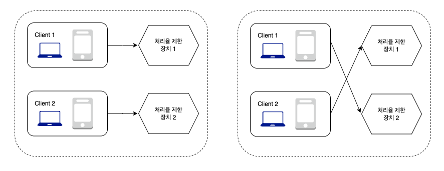
  
  
- 해결책1
	- sticky session. 같은 클라이언트로부터의 요청은 항상 같은 처리율 제한 장치로 보냄
	- 규모면에서 확장 가능하지도 않으며 유연하지도 않은 설계  
- 더 나은 해결책
	- 레디스와 같은 중앙 집중형 데이터 저장소 활용  

 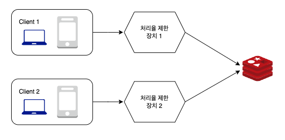

  
#### 성능 최적화  
##### 첫번째 개선점
  - 데이터센터 문제 - Latency
  - 클라우드플레어는 지역적으로 분산된 194곳의 위치에 엣지 서버를 설치
  
##### 두번쨰 개선점
- 제한 장치 간에 데이터를 동기화할 때 최종 일관성 모델(eventual consistency model)을 사용하는 것  
- 6장 참조 - 갱신이 조금 늦을수 있음, 늦지만 결국엔 동기화 되는 모델
  
#### 모니터링  
- 처리율 제한 장치가 잘 동작하고 있는지 확인하기 위해 데이터를 수집하고 모니터링  
- 채택된 처리율 제한 알고리즘이 효과적인지
- 정의한 처리율 제한 규칙이 효과적인지
	- 너무 빡빡하게 설정되었다면 많은 유효 요청이 처리되지 못하고 버려질 것 -> 규칙을 완화할 필요가 있음  
- 깜짝 세일 이벤트일 때, 트래픽이 급증하여 처리율 제한 장치가 비효율적으로 동작한다면 그런 트래픽 패턴을 잘 처리할 수 있도록 알고리즘을 바꾸는 것을 생각해봐야 함  
	-  이 경우에는 토큰 버킷 알고리즘이 적합할 것  
  
## 4단계 - 마무리 (추가적으로 생각해 볼만한 것)
- 
- 경성(hard), 연성(soft) 처리율 제한  
	- 경성 처리율 제한: 요청의 개수는 임계치를 절대 넘어설 수 없음  
	- 연성 처리율 제한: 요청 개수는 잠시 동안은 임계치를 넘어설 수 없음  
- 다양한 계층에서의 처리율 제한  
	- 3번계층 - Iptables를 사용하면 IP주소로 제한
- 처리율 제한 회피 방법, 클라이언트를 어떻게 설계하는 것이 최선인가?  
	- 클라이언트 측 캐시
	- 처리율 제한의 임계치를 이해하고 짧은 시간 동안 너무 많은 메시지를 보내지 않도록 함  
	- 예외나 에러를 처리하는 코드를 도입하여 클라이언트가 예외적 상황으로 gracefully 복구될 수 있도록 함  
	- 재시도 로직을 구현할 때는 충분한 백오프 시간을 둠  
  