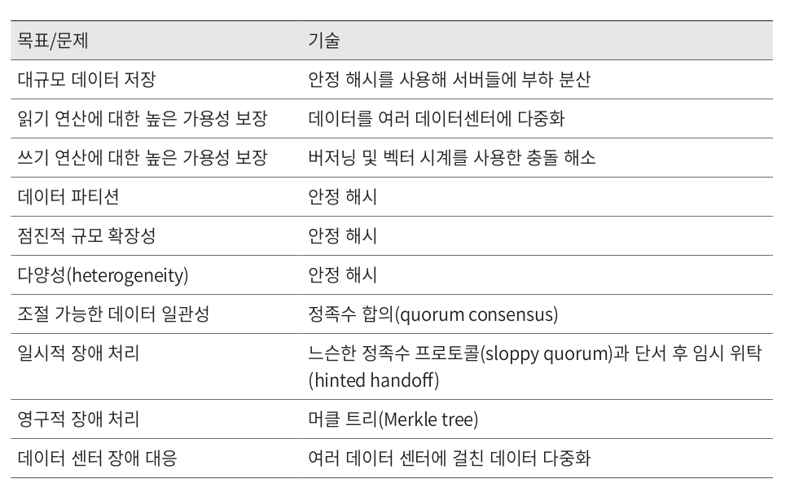

## 키-값 저장소 설계

- key-value store = key value DB (비관계형 / non-relational)
- key-value pair = value는 identifier를 key로 가져야 함
- key : 유일성, 택스트 또는 해시값, 성능상의 이슈로 키는 짧을 수록 좋음 => 왜???
	- 일반 택스트 - "last_logged_in_at"
	- 해시값 - 253DDEC5
- value : 문자열, 리스트, 객체
- 저장소 예 : 아마존 다이나모, memcached, 레디스
### 설계 준비 - 연산자
- put(key, value): 키-값 쌍을 저장소에 저장
- get(key): 인자로 주어진 키에 매핑된 값을 꺼냄

### 문제 이해 및 설계 범위 확정
다음 특성을 갖는 키-값 저장소를 설계

- 키-값 쌍의 크기는 10KB 이하
- 큰 데이터를 저장할 수 있어야 함
- 높은 가용성을 제공. 시스템은 장애가 있더라도 빨리 응답해야 함
- 높은 규모 확장성을 제공. 트래픽 양에 따라 자동으로 서버 증설/삭제가 이루어져야 함
- 데이터 일관성 수준은 조정이 가능해야 함
- 응답 지연시간이 짧아야 함

### 단일 서버 키-값 저장소
- 방법은 키-값 쌍 전부를 메모리에 해시 테이블로 저장하는 것. 
	- 빠른 속도보장
- 한계 - 모든 데이터를 메모리에 두긴 어려움
- 개선책 
	- 데이터 압축
	- 자주 쓰이는 데이터만 메모리에 두고 나머지는 디스크에 저장
- 한대의 서버로 부족한 때가 옴
	- 분산 키-값 저장소를 만들 필요성 대두

### 분산 키-값 저장소
- 분산 해시 테이블과 같은 말(키-값 쌍을 여러 서버에 분산)
- 필요 지식
	- CAP 정리(Consistency, Availability, Partition Tolerance theorem)

### CAP 정리
- CAP 정리는 아래 세 가지 요구사항을 동시에 만족하는 분산 시스템을 설게하는 것은 불가능하다는 정리다.
	- **데이터 일관성(consistency)** : 분산 시스템에 접속하는 모든 클라이언트는 어떤 노드에 접속했느냐에 관계없이 언제나 같은 데이터를 보게 되어야 한다.
	- **가용성(availability)** : 분산 시스템에 접속하는 클라이언트는 일부 노드에 장애가 발생하더라도 항상 응답을 받을 수 있어야 한다.
	- **파티션 감내(partition tolerance)** : 파티션은 두 노드 사이에 통신 장애가 발생하였음을 의미한다. 파티션 감내는 네트워크에 파티션이 생기더라도 시스템은 계속 동작하여야 한다는 것을 뜻한다.

#### 두개를 만족하면 한쪽은 희생

- CP 시스템: 일관성과 파티션 감내를 지원. 가용성을 희생.
- AP 시스템: 가용성과 파티션 감내를 지원. 데이터 일관성을 희생.
- CA 시스템: 일관성과 가용성을 지원. 파티션 감내는 지원하지 않음. 
	- 통상 네트워크 장애는 피할 수 없는 일로 여겨지므로, 분산 시스템은 반드시 파티션 문제를 감내할 수 있도록 설계되어야 한다. 그러므로 실세계에 CA 시스템은 존재하지 않음.

#### 이상적 상태

- n1에 기록된 데이터는 n2, n3에 복제
- 데이터 일관성과 가용성도 만족됨.

#### 실세계의 분산 시스템
- 분산 시스템은 파티션 문제를 피할 수 없다. 
- 파티션 문제가 발생하면 우리는 일관성과 가용성 사이에서 하나를 선택해야 한다.

- n3에 장애
- n1, n2 데이터 -> n3에 전달되지 않는다. 
- n3 데이터 -> n1, n2 - 전달되지 않은 데이터가 있을 수 있다. 
- 일관성을 선택(CP시스템) - 세 서버의 데이터 불일치 문제를 피하기 위해 n1과 n2에 대해 쓰기 연산을 중단
	- 가용성이 깨진다. 
	- 문제가 해결될때 까지 오류
	- 예) 은행권
	- 계좌 최신 정보를 출력하지 못하면 큰 문제. 
- 가용성을 선택 (AP시스템)- 낡은 데이터를 반환할 위험이 있더라도 계속 읽기 연산 허용해야 한다.
	- n1, n2는 계속 쓰기 연산을 허용
	- 파티션 문제가 해결된 뒤에 새 데이터를 n3에 전송할 것이다.
	- 예시) ??
- 면접관에게 요구사항에 맞도록 CAP 정리 적용

### 시스템 컴포넌트
- 키-값 저장소 핵심 컴포넌트 및 기술들
	- 데이터 파티션
	- 데이터 다중화(replication)
	- 일관성(consistency)
	- 일관성 불일치 해소(inconsistency resolution)
	- 장애 처리
	- 시스템 아키텍처 다이어그램
	- 쓰기 경로(write path)
	- 읽기기 경로(read path)
- 다이나모, 카산드라, 빅테이블의 사례 

#### 데이터 파티션
- 데이터를 작은 파티션들로 분할한 다음 여러 대 서버에 저장
- 고려사항
	- 데이터를 여러 서버에 고르게 분산할 수 있는가?
	- 노드가 추가되거나 삭제될 떄 데이터의 이동을 최소화할 수 있는가?

- [[chapter-05]] 안정 해시를 사용하여 데이터를 파티션할 때 장점
	- 요약 : 링에 서버 배치, 링을 시계방향으로 순회하다 만나는 첫번째 서버에 값 저장
	- **규모 확장 자동화**: 시스템 부하에 따라 서버가 자동으로 추가되거나 삭제되도록 만들 수 있다.
	- **다양성**: 각 서버의 용량에 맞게 가상 노드의 수를 조정할 수 있다. 고성능 서버는 더 많은 가상 노드를 갖도록 설정할 수 있다.

#### 데이터 다중화
- 가용성 확보를 위해 데이터를 N개 서버에 비동기적으로 다중화함(replication)
- 안정 해시 사용 - 링을 순회하면서 만나는 첫 N개 서버에 사본을 보관
- Key0는 s1, s2, s3에 저장됨
- 주의 - 가상 노드를 사용하는 경우 동일한 물리서버가 중복선택되지 않게

#### 데이터 일관성
- 여러 노드에 다중화된 데이터는 적절히 동기화
- 정족수 합의(Quorum Consensus) 프로토콜을 사용하면 읽기/쓰기 연산 모두에 일관성을 보장할 수 있다.

- 정의 
	- N = 사본 개수
	- W = 쓰기 연산에 대한 정족수
		- 쓰기 연산이 성공한 것으로 간주되려면 적어도 W개의 서버로부터 쓰기 연산이 성공했다는 응답을 받아야 한다.
	- R = 읽기 연산에 대한 정족수.
		- 읽기 연산이 성공한 것으로 간주되려면 적어도 R개의 서버로부터 응답을 받아야 한다.
- N=3인, W=1의 경우
	- 최소 한 대의 서버로부터 쓰기 성공 응답을 받아야 한다는 것이다. 

- 중재자는 클라이언트와 노드 사이에서 Proxy 역할
- W, R, N의 값을 정하는 것은 응답 지연과 데이터 일관성 사이의 타협점을 찾는 전형적인 과정이다. 
	- R = 1, W = N: 빠른 읽기 연산에 최적화된 시스템
	- W = 1, R = N: 빠른 쓰기 연산에 최적화된 시스템
	- W + R > N: 강한 일관성이 보장됨 (보통 N=3, W=R=2)
	- W + R <= N: 강한 일관성이 보장되지 않음

#### 일관성 모델
- 강한 일관성(strong consistency): 모든 읽기 연산은 가장 최근에 갱신된 결과를 반환한다. 
	- 모든 사본에 현재 쓰기 연산의 결과가 반영될 때까지 해당 데이터에 대한 읽기/쓰기를 금지
	- 고가용성 시스템에는 적합하지 않다.
- 약한 일관성(weak consistency): 읽기 연산은 가장 최근에 갱신된 결과를 반환하지 못할 수 있다.
- 최종 일관성(eventual consistency): 약한 일관성의 한 형태로, 갱신 결과가 결국에는 모든 사본에 반영(동기화)되는 모델이다.
	- 쓰기 연산이 병렬적으로 발생하면 시스템에 저장된 값의 일관성이 깨질 수 있는데, 이 문제는 클라이언트가 해결해야 한다.
	- 다이나모, 카산드라
	- 일관성 깨짐문제는 클라이언트가 해결해야함

#### 비 일관성 해소 기법: 데이터 버저닝
- 클라이언트가 일관성이 깨진것을 해결하는 방법
	- 버저닝
	- 벡터
- 버저닝 : 데이터를 변경할 때마다 해당 데이터의 새로운 버전
	- 각 버전의 데이터는 변경 불가능(immutable)하다.

- 충돌 발생 예시

- 그 각각을 버전 v1, v2라고 하자. 
	- 충돌을 발견하고 자동으로 해결해 낼 버저닝 시스템 => 벡터 시계

- 벡터 시계는 (서버, 버전)의 순서쌍을 데이터에 매단 것이다. 
	- 어떤 버전이 선행 버전인지, 후행 버전인지, 아니면 다른 버전과 충돌이 있는지
	- D([S1, v1], [S2, v2], ..., [Sn, vn])와 같이 표현한다고 가정
	- D는 데이터
	- vi는 버전 카운터
	- Si는 서버 번호이다
- 만일 데이터 D를 서버 Si에 기록하면, 시스템은 아래 작업 가운데 하나를 수행하여야 한다.
	- [Si, vi]가 있으면 vi를 증가시킴
	- 그렇지 않으면 새 항목 [Si, 1]를 만듬

- D3([Sx,2], [Sy,1]) => Sx라는 서버의 2 버전의 데이터를 읽어서 D3로 바꾼후 Sy라는 서버의 1번 버전으로 저장 
- D3, D4를 읽으면 데이터 충돌 감지
- 충돌 해소후 D5([Sx, 3], [Sy, 1], [Sz, 1]) 로 저장

- 버전 전후 관계 확인 방법
	- X가 이전 버전인 경우 - 버전 Y에 포함된 모든 구성요소의 값이 X에 포함된 모든 구성요소 값보다 같거나 크면 
	- 이전버전 예) D([s0, 1], [s1, 1]) < D([s0, 1], [s1, 2])
- 버전 충돌 확인방법
	- 충돌 - 두 버전이 같은 이전 버전에서 파생된 다른 버전들인가???
	- 버전충돌 예) D([s0, 1], [s1, 2]) vs D([s0, 2], [s1, 1])
	- 개인의견 - 전후 관계를 알수 없음

- 벡터 시계를 사용해 충돌을 감지하고 해소하는 방법 단점
	1. 충돌 감지 및 해소 로직이 클라이언트에 들어가야 하므로, 클라이언트 구현이 복잡해진다.
	2. [서버: 버전]의 순서쌍 개수가 굉장히 빨리 늘어난다. 임계치를 두고 정리해줘야 한다.
		1. 선후관계가 정확하지 않을수 있는데 다이나모에서 실제로는 그런 문제가 없었다고 함.

#### 장애 처리
- 대다수 대규모 시스템에서 장애는 아주 흔하게 벌어지는 사건이다. 
- 장애 감지(failure detection)
- 장애 해소(failure resolution)

#### 장애 감지
- 보통 두 대 이상의 서버가 똑같이 보고해야 장애가 발생했다고 간주
- 

#### 모든 노드 사이에 멀티캐스팅 채널을 구축
- 서버 장애를 감지하는 가장 손쉬운 방법
- 서비스가 많아지면 비효율적이다.

#### 가십 프로토콜
- 각 노드는 멤버십 목록을 유지한다. 멤버십 목록은 각 멤버와 박동 카운터(heartbeat counter) 쌍의 목록이다.
- 각 노드는 주기적으로 자신의 박동 카운터를 증가시킨다.
- 각 노드는 무작위로 선정된 노드들에게 주기적으로 자기 박동 카운터 목록을 보낸다.
- 박동 카운터 목록을 받은 노드는 멤버십 목록을 최신 값으로 갱신한다.
- 어떤 멤버의 박동 카운터 값이 지정된 시간 동안 갱신되지 않으면 해당 멤버는 장애(offline) 상태인 것으로 간주한다.

ex) AKKA

#### 일시적 장애 처리
- 엄격한 정족수(strict quorum) 접근법 -> 일관성을 위해 읽기와 쓰기 연산 금지
- 느슨한 정족수(sloppy quorum) 접근법 -> 조건을 완화하여 가용성을 높임
- 장애 상태인 서버로 가는 요청은 다른 서버가 잠시 맡아 처리
- 그동안 발생한 변경사항은 장애 서버가 복구되었을 때 일괄 반영하여 일관성 보존
- 임시 쓰기 연산을 처리한 서버에는 hint를 남김 -> hinted handoff(임시 위탁)

#### 영구 장애 처리
- 영구 장애의 경우 반-앤트로피(anti-entropy) 프로토콜을 구현하여 사본들을 동기화
- 반-앤트로피 프로토콜은 사본들을 비교하여 최신 버전으로 갱신
- 사본 간의 일관성이 망가진 상태를 탐지하고 전송 데이터의 양을 줄이기 위해서 머클(Merkle)트리 사용
- 머클트리 - 해시트리, 각 노드에 보관된 값의 계산된 해시값을 계산해 레이블로 붙여둠, 해시트리를 비교해서 다르면 동기화가 필요하다는 의미, 차이가 있는 만큼만 동기화 필요
- 실제로는 시스템의 버킷하나가 꽤 큼

#### 데이터 센터 장애 처리
- 정전, 네트워크 장애, 자연재해 등 다양한 이유로 문제 발생 가능
- 여러 데이터센터에 걸쳐 다중화

### 시스템 아키텍처 다이어그램
- 클라이언트는 키-값 저장소가 제공하는 get(key) 및 put(key, value)와 통신
- 중재자(coordinator)는 클라이언트에게 키-값 저장소에 대한 proxy 역할을 하는 노드
- 노드는 안정 해시(consistent hash)의 해시 링 위에 분포

- 노드를 자동으로 추가 또는 삭제할 수 있도록, 시스템은 완전히 분산된다(decentralized)
- 데이터는 여러 노드에 다중화된다.
- 모든 노드가 같은 책임을 지므로, SPOF는 존재하지 않는다.

- 지원기능

### 쓰기 경로
- 카산드라 구조 참조

1. 쓰기 요청이 커밋 로그 파일에 기록
2. 데이터가 메모리 캐시에 기록
3. 메모리 캐시가 가득차거나 사전에 정의된 임계치에 도달하면 디스크에 있는 SSTable(Sorted-String Table, <키,값>의 순서쌍을 정렬된 리스트 형태로 관리하는 테이블)에 기록

### 읽기 경로

- 데이터가 메모리에 없는 경우 - 디스크에서 가져와야 한다.
	- 어느 SSTable에 찾는 키가 있는지 - 블룸 필터(Bloom filter)가 사용된다.

1. 데이터가 메모리에 있는지 검사
2. 데이터가 메모리에 없으면 블룸 필터를 검사하여, 어떤 SSTable에 키가 보관되어 있는지 알아낸다
3. SSTable에서 데이터를 가져온다.
4. 해당 데이터를 클라이언트에 전달한다.

## 요약

