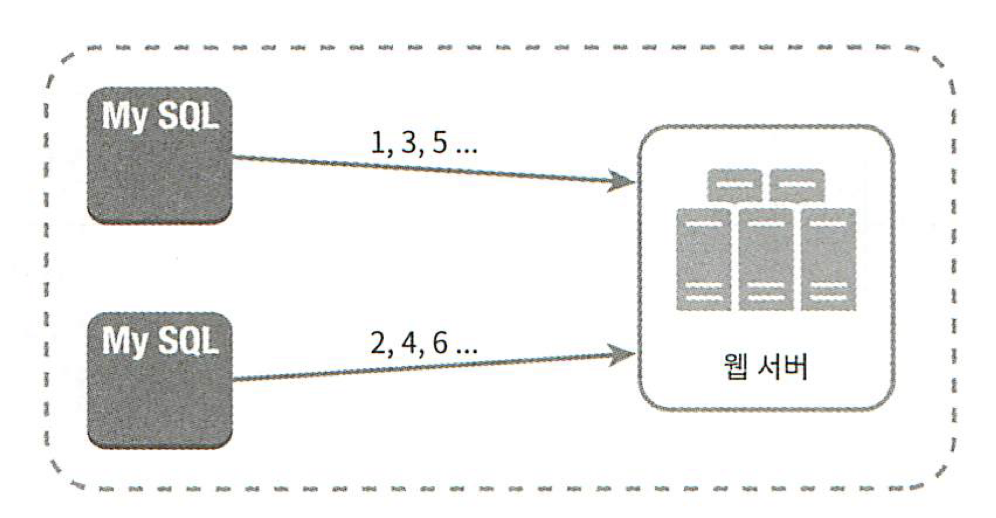
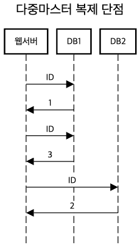
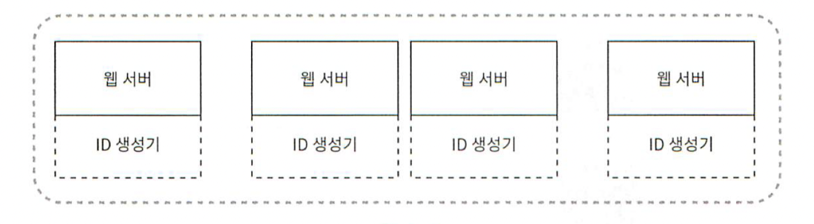
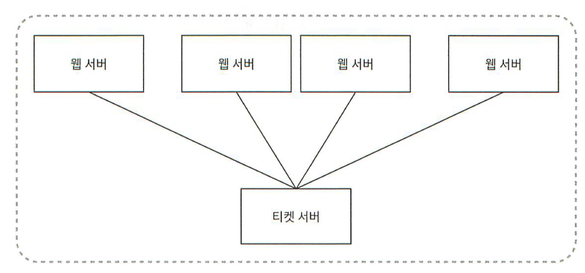

```table-of-contents
title: 
style: nestedList # TOC style (nestedList|nestedOrderedList|inlineFirstLevel)
minLevel: 0 # Include headings from the specified level
maxLevel: 0 # Include headings up to the specified level
includeLinks: true # Make headings clickable
debugInConsole: false # Print debug info in Obsidian console
```
# 분산 시스템을 위한 유일 ID 생성기 설계

## 문맥
- 분산시스템에서 사용할 유일ID
- RDBMS의 auto_increment는 지연시간을 낮추기가 힘듬.

## 1단계 - 문제이해 및 설계 범위 확정
- 모호함제거 + 설계 방향 설정


## 2단계 - 개략적 설계안 제시 및 동의 구하기
### ID 만드는 법 
- 다중 마스터 복제(multi-master replication)
- UUID(Universally Unique Identifier)
- Ticket Server
- Twitter Snowflask
### 다중 마스터 복제(multi-master replication)
- auto_increment
- k(DB수) 만큼 증가



#### 단점
- 여러 데이터센터 불가
- 유일성은 보장되지만 시간의 흐름에 맞추어 커지도록 보장하기 힘듬
- 서버 추가 삭제시 잘 동작하도록 만들기 어려움



### UUID
- 컴퓨터 시스템에 저장되는 정보를 유일하게 식별하기 위한 128비트짜리 수
- 충돌가능성 낮음
	- 중복 UUID가 생길 확률을 50%로 끌어 올리려면 초당 10억개의 UUID를 100년 동안 계속 생성해야 가능
- UUID는 서버 간 조율 없이 독립적으로 생성 가능하다.
- 예시 - c569bc62-ab4c-46f3-8360-5830e7868e21



| 장점         | 단점                   |
| ---------- | -------------------- |
| 생성 심플      | 128비트로 요구사항 64비트보다 큼 |
| 동기화 이슈가 없음 | 시간순 정렬 불가능           |
| 규모 확장이 쉬움  | 숫자가 아닌 다른 값이 포함됨     |
### 티켓 서버
- 티켓 서버(`auto_increment` 기능을 갖춘 데이터베이스 서버)를 중앙 집중형으로 하나만 사용



| 장점                        | 단점                       |
| ------------------------- | ------------------------ |
| 유일성이 보장되는 오직 숫자 ID 생성 가능  | 티켓 서버가 SPOF가 됨           |
| 구현하기 쉽고 중소 규모의 애플리케이션에 적합 | 티켓 서버를 여러대 두면 데이터 동기화 이슈 |

### 트위터의 snowflake 접근법
- 64비트
- ID의 구조를 여러 Section으로 분할하는 방법
![[snowflake.png]]
- sign 비트: 음수와 양수 판별
- 타임스탬프: epoch 이후로 몇 밀리초가 경과했는지 나타내는 값
- 데이터센터 ID: 5비트이므로 $2^5$ 개 데이터센터 지원 가능
- 서버 ID: 데이터센터당 32개 서버 사용 가능
- 일련 번호: 각 서버에서는 ID를 생성할 때마다 이 일련번호를 1만큼 증가시킴
- 1밀리초가 경과할 때마다 0으로 reset(타임스탬프가 밀리초)


## 3단계 - 상세 설계
- 데이터센터 ID, 서버 ID는 시스템이 시작할 때 결정, 나중에 변경되지 않는다.
	- 잘못 변경시 충돌가능
- 타임스탬프나 일련번호는 id 생성기가 돌고 있는 중에 생성
### 타임스탬프
- 시간의 흐름에 따라 점점 큰 값, id 기반 시간순 정렬 가능
- 한계 - 41비트로 표현할 수 있는 타임스탬프의 최댓값은 $2 ^ {41} - 1 = 2199023255551$ 밀리초(대략 69년)이다. 
	- 69년이 지나면 epoch를 변경하거나 다른 id 체계를 이전해야 할 것이다.

### 일련번호
- 12비트이므로, $2^{12}=4096$개의 값을 가질 수 있다. 
- 어떤 서버가 같은 밀리초 동안 하나 이상의 ID를 만들어 낸 경우에만 0보다 큰 값을 갖게 된다. 

## 마무리 - 추가 논의
- 시계 동기화문제(Time Synchromization)
	- [NTP(Network Time Protocol)](https://ko.wikipedia.org/wiki/%EB%84%A4%ED%8A%B8%EC%9B%8C%ED%81%AC_%ED%83%80%EC%9E%84_%ED%94%84%EB%A1%9C%ED%86%A0%EC%BD%9C)
- Section최적화
	- 동시성이 낮고 수명이 긴 애플리케이션이라면 타임스탬프절의 길이를 늘리는 것이 나을수도
- High Availability : ID생성기는 필수불가결(Mission Critical) -> 아주 높은 가용성 필요