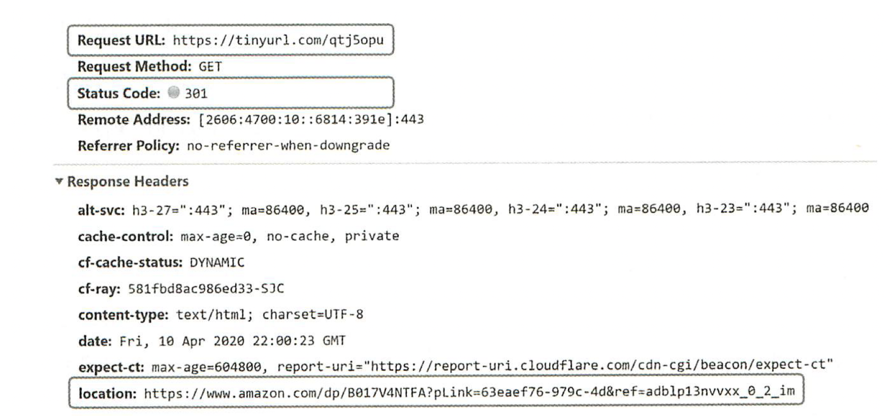
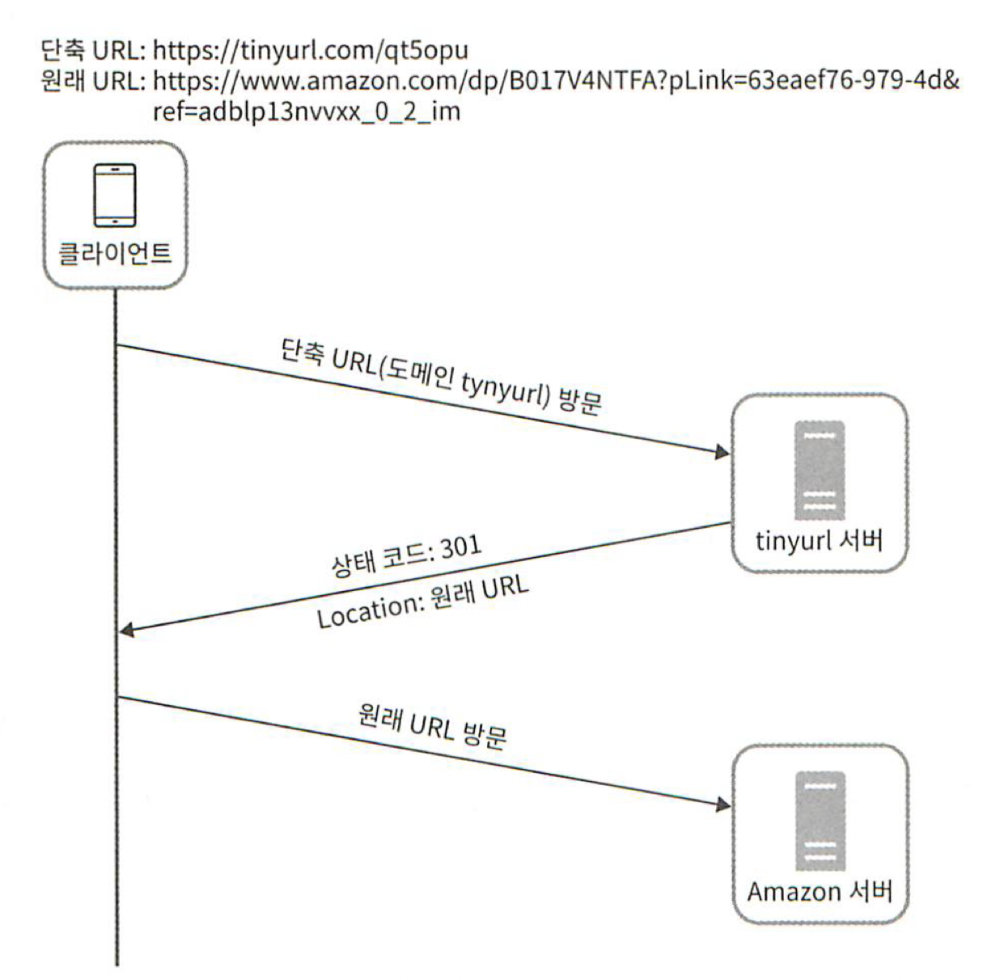
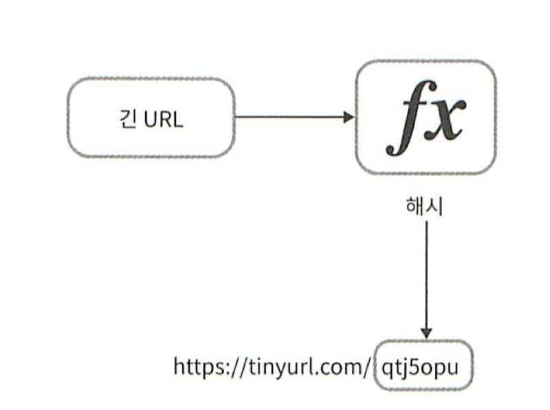
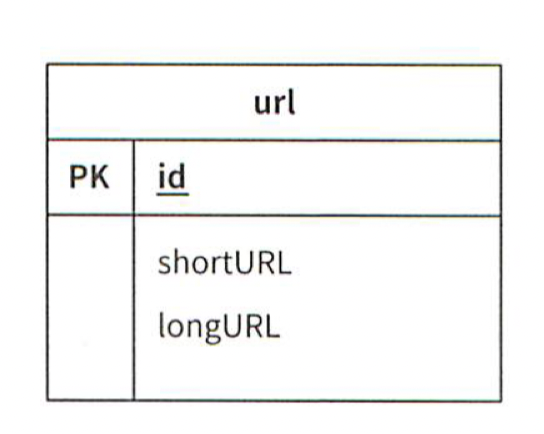
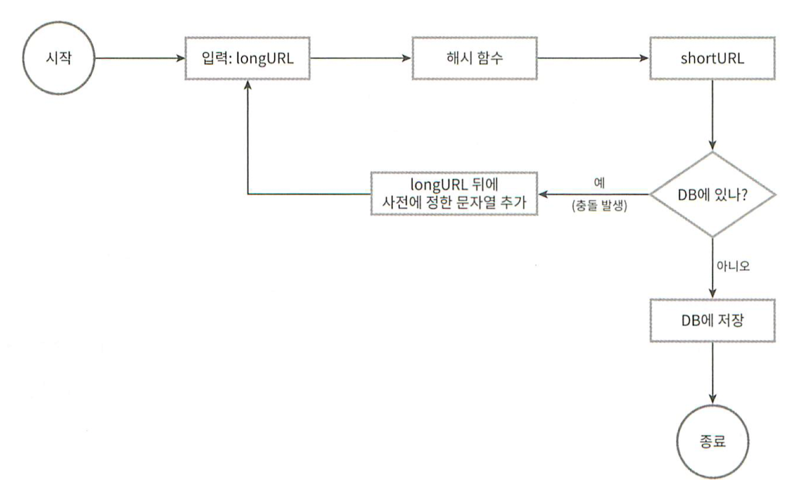
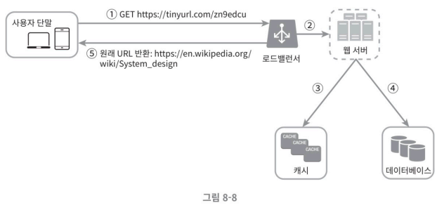

# URL 단축기 설계

## 1단계 - 문제이해 및 설계 범위 확정
1. URL 단축: 주어진 긴 URL을 훨씬 짧게 줄인다
2. URL 리디렉션: 축약된 URL로 HTTP 요청이 오면 원래 URL로 안내
3. 높은 가용성과 규모 확장성 그리고 장애 감내 요구

### 개략적 추정
- 쓰기연산: 매일 1억개의 단축 URL 생성
- 초당 쓰기 연산: 1억 / 24 / 3600 = 1160
- 읽기연산: 읽기 연산과 쓰기 연산 비율을 10:1이라 하면, 읽기 연산은 초당 11600회 발생
- URL 단축 서비스를 10년간 운영한다고 가정하면 1억 * 365 * 10 = 3650억개의 레코드 보관
- 축약 전 URL 평균 길이가 100byte라고 하면, 10년 동안 필요한 저장 용량은 36.5TB
## 2단계 - 개략적 설계안 제시 및 동의 구하기
### API Endpint
1. URL 단축 생성:
	1. POST `/api/v1/data/shorten`
	2. Parameter : longURL: long URL string
	3. Response : Short URL
2. URL 리디렉션용: 
	1. GET `/api/v1/shortUrl`
	2. Response : HTTP 목적지 URL

### URL 리디렉션 과정

#### 301, 302 Status Code 차이
| 301 Permanently Moved | 302 Found                 |
| --------------------- | ------------------------- |
| 영구적으로 Location 헤더에 이전 | 일시적으로 Location 헤더 URL로 이전 |
| 브라우저는 캐시함             | 항상 서버에 요청해서 URL을 받아야함     |
| 서버부하 줄일때 유용           | 트래픽 분석이 중요할때              |

#### URL 리디렉션 구현
- 원래 URL = hashTable.get(단축 URL)
- 301,302 응답 Location 헤더에 원래 URL을 넣은 후 전송

### URL 단축
- URL이 `www.tinyurl.com/{hashValue}` 과 같은 형태일 때 긴 URL을 이 해시 값으로 대응시킬 해시 함수 $fx$ 를 찾는 일이 중요
- 입력으로 주어지는 긴 URL이 다른 값이면 해시 값도 달라야 함
- 계산된 해시 값은 원래 입력으로 주어졌던 긴 URL로 복원될 수 있어야 함

## 3단계 상세 설계 
### 데이터 모델
- 모든 것을 해시 테이블에 저장하면, 비싸고 한정적인 메모리기 때문에 어려움
	- <단축 URL, 원래 URL>의 순서쌍을 관계형 데이터베이스에 저장하는 방식

### 해시 함수
- 원래 URL을 단축 URL로 변환시 사용. 
- 편의상, 단축 URL 값을 hashValue라 칭함
#### 해시 길이
- hashValue: \[0-9, a-z, A-Z\] 구성
	- 즉, 사용할 수 있는 문자의 개수는 10 + 26 + 26 = 62개
- hashValue의 길이를 정하기 위해 $62^n \ge 3650억$ 인 n의 최소값 찾기

| n   | URL 개수                              |
| --- | ----------------------------------- |
| 1   | $62^1$ = 62                         |
| 2   | $62^2$ = 3,844                      |
| 3   | $62^3$ = 238,328                    |
| 4   | $62^4$ = 14,776,336                 |
| 5   | $62^5$ = 916,132,832                |
| 6   | $62^6$ = 56,800,235,584 = 약 568억    |
| 7   | $62^7$ = 3,521,614,606,208 = 약 3.5조 |
| 8   | $62^8$ = 218,340,105,584,896        |
=> n = 7

### 해시 후 충돌 해소
- 긴 URL을 줄이려면 원래 URL을 7글자 문자열로 줄이는 해시 함수 필요
- 잘알려진 해시함수 : CRC32, MD5, SHA-1 
- 단축결과: `https://en.wikipedia.org/wiki/Systems_design 

| 해시 함수 | 해시 결과 (16진수)                             |
| ----- | ---------------------------------------- |
| CRC32 | 5cb54054 (8자리)                           |
| MD5   | 5a62509a84df9ee03fe1230b9dfb84e          |
| SHA-1 | 0eeae7916c06853901d9ccbefbfcaf4de57ed85b |
- CRC32로 해도 길다. 
	- 처음 7자만 차용
	- 해시 충돌 확률 증가 
	- 충돌하면 사전에 정한 문자열을 붙임

- 단점
	- 한번이상 DB조회 해야 해서 오버헤드가 큼
	- [블룸필터](https://ko.wikipedia.org/wiki/%EB%B8%94%EB%A3%B8_%ED%95%84%ED%84%B0)를 사용하면 성능을 높일수 있음
		- 확률론적 공간 효율 좋은 기술

### base-62 변환
- 진법 변환은 URL 단축기를 구현할 때 흔히 사용
- 수의 표현 방식이 다른 두 시스템이 같은 수를 공유해야 하는 경우에 유용하다.
- 62진법을 쓰는 이유: hashValue에 사용할 수 있는 문자 개수가 62개이기 때문
#### 방법
- 11,157 을 **62진수**로 변환해보자
- 62진법: 10은 a, 11은 b, ..., 35는 z, ..., 61은 Z로 대응시켜 표현
	- a = 1010, Z = 6110
- 11157 = 2 x 62^2 + 55 x 62^1 + 59 x 62^0 = [2, 55, 59] => [2, T, X] => $2TX_{62}$
- 따라서 단축 URL은 `https://tinyurl.com/2TX`

### 두 접근법 비교
| 해시 후 충돌 해소 전략                                           | base-62 변환                                                                  |
| ------------------------------------------------------- | --------------------------------------------------------------------------- |
| 단축 URL의 길이가 고정됨                                         | 단축 URL의 길이가 가변적. ID 값이 커지면 같이 길어짐                                           |
| ID 생성기가 유일성 보장 하지 않아도됨                                  | 유일성 보장 ID 생성기가 필요                                                           |
| 충돌이 가능해서 해소 전략이 필요                                      | ID 유일성이 보장된 보장된 후에야 적용 가능한 전략이라 충돌은 아예 불가능                                  |
| ID로부터 단축 URL을 계산하는 방식이 아니라서 다음에 쓸 수 있는 URL을 알아내는 것이 불가능 | ID가 1씩 증가하는 값이라고 가정하면 다음에 쓸 수 있는 단축 URL이 무엇인지 쉽게 알아낼 수 있어서 보안상 문제가 될 소지가 있음 |

### URL 단축기 상세 설계

| ID            | shortURL | longURL                                      |
| ------------- | -------- | -------------------------------------------- |
| 2009215674938 | zn9edcu  | https://en.wikipedia.org/wiki/Systems_design |

- ID는 전역적 유일성이 보장되어야 함.
	- 7장에서 분산환경에서 ID생성기에 대한 이야기를 함.

### URL 리디렉션 상세 설계

URL 리디렉션 흐름

1. 사용자가 단축 URL을 클릭한다.
2. 로드 밸런서가 해당 클릭으로 발생하는 요청을 웹 서버에 전달한다.
3. 단축 URL이 이미 캐시되어 있다면 원래 URL을 바로 반환한다.
4. 없다면 데이터베이스에서 꺼내서 캐시에 저장한 후 반환한다.

# 4단계 마무리

- 처리율 제한 장치
- 웹 서버의 규모 확장이 자유로움
- 데이터베이스의 규모 확장
	- 다중화, 샤딩
- 데이터 분석 솔루션
- 가용성, 데이터 일관성, 안정성