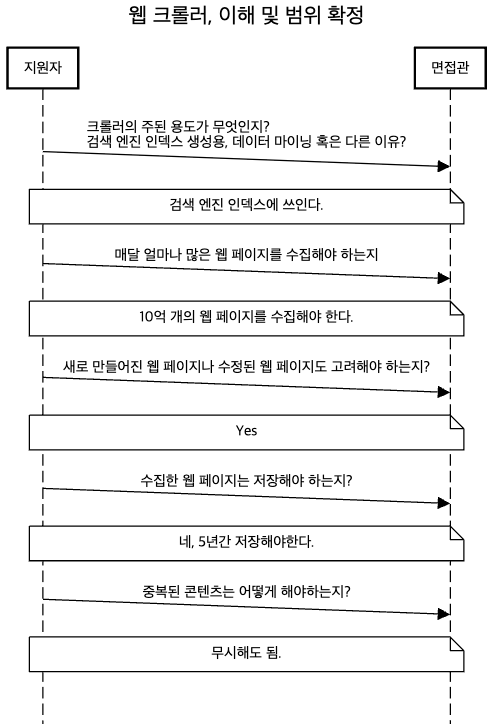
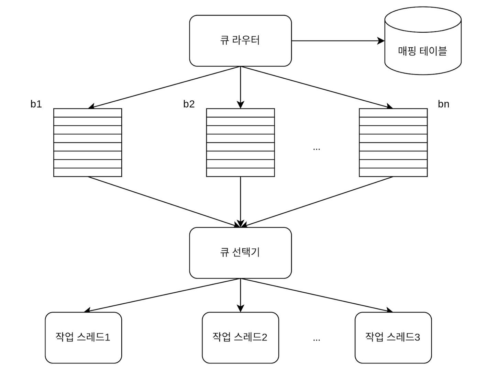
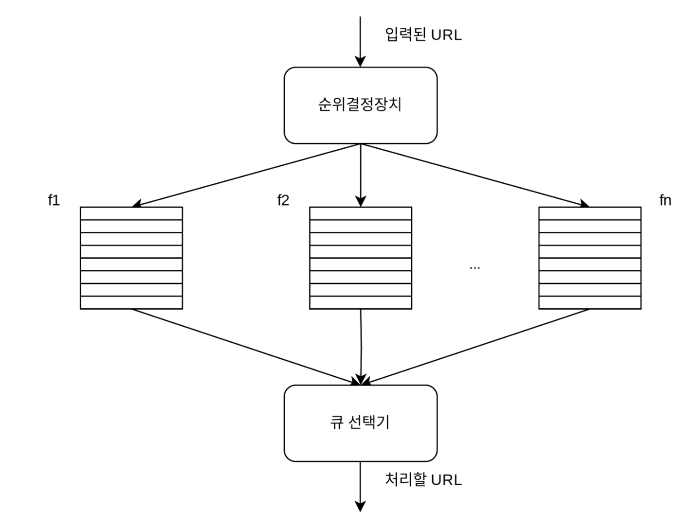
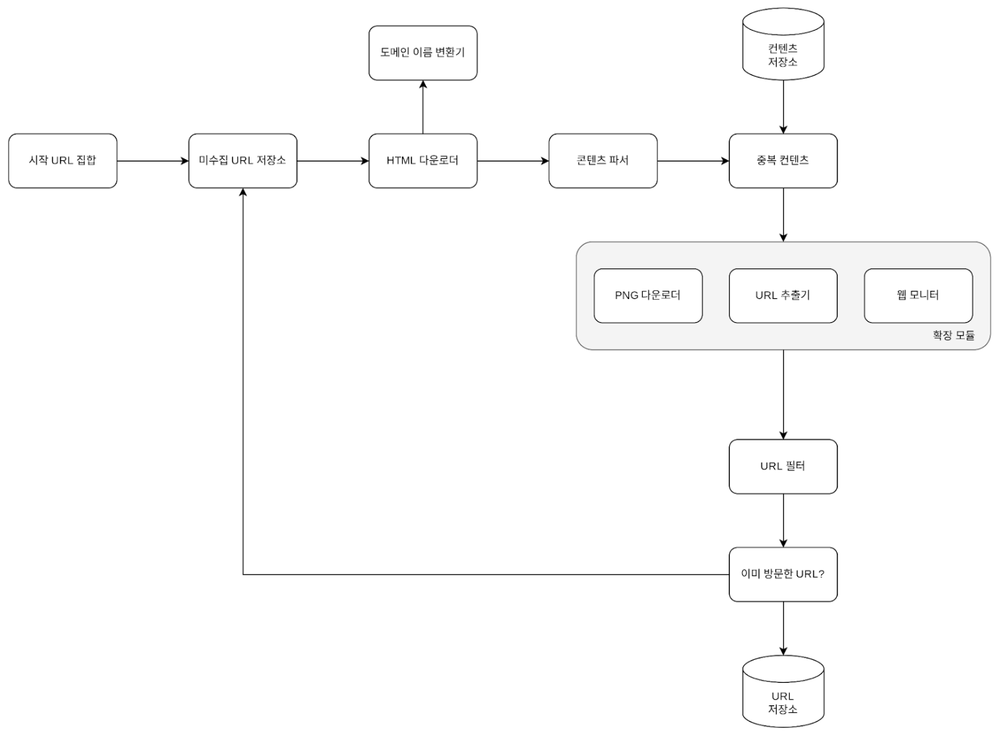

# 웹 크롤러 설계

- 웹 크롤러 = 로봇 = 스파이더
- 검색 엔진에서 널리 쓰는 기술
	- 웹에 새로 올라오거나 갱신된 콘텐츠를 찾아내는 것이 주된 목적
- 콘텐츠 : 웹 페이지, 이미지나 비디오, 또는 PDF 파일
- 웹 크롤러는 몇 개 웹페이지에서 시작하여 그 링크를 따라 나가면서 새로운 콘텐츠를 수집
### 용도
- 검색 엔진 인덱싱
    - 가장 보편적.웹 페이지를 모아 검색 엔진을 위한 로컬 인덱스를 만든다.
    - Googlebot : 구글 검색 엔진이 사용하는 웹 크롤러
- 웹 아카이빙
    - 장기보관용
    - 미국 국회도서관(US Library of Congress), EU 웹 아카이드
- 웹 마이닝
    - 인터넷에서 유용한 지식을 도출.
    - 유명 금융기업들은 주주총회 자료나 연차 보고서를 다운받아 기업의 핵심 사업방향을 알아냄
- 웹 모니터링
    - 저작권이나 상표권이 침해되는 사례를 모니터링

### 규모
- 웹 크롤러의 복잡도는 웹 크롤러가 처리해야 하는 **데이터의 규모**에 따라 달라진다. 
	- 몇시간짜리 학급 프로젝트 vs 별도의 팀이 필요한 초대형 프로젝트

### 1단계 문제 이해 및 설계 범위 확정

- 웹 크롤러의 기본 알고리즘
```
1. URL 집합이 입력, 해당 URL들이 가리키는 모든 웹 페이지를 다운로드
2. 웹페이지에서 URL 추출
3. 추출된 URL들을 다운로드할 URL 목록에 추가하고 1부터 반복
```
	




#### 추가 속성

- 규모 확장성
    - 웹은 거대하고 웹에는 수십억 개의 페이지가 존재한다. 
    - 따라서 병행성(parallelism)을 활용하면 보다 효과적으로 웹 크롤링을 할 수 있다.
- 안정성(robustness)
    - 잘못 작성된 HTML, 아무 반응이 없는 서버, 장애, 악성 코드가 붙어 있는 링크
    - 크롤러는 이런 비정상적 입력이나 환경에 잘 대응할 수 있어야 한다.
- 예절(Politeness) 
    - 크롤러는 수집 대상 웹 사이트에 짧은 시간 동안 너무 많은 요청을 보내서는 안된다.
- 확장성(Extensibility)  
    - 새로운 형태의 콘텐츠를 지원하기가 쉬워야 한다. 예를 들어, 이미지 파일도 크롤링하고 싶을 때 이를 위해 전체 시스템을 새로 설계해야 한다면 곤란할 것이다.

#### 개략적 규모 추정
- 매달 10억 개의 웹 페이지를 다운로드
- QPS = 10억 / 30일 / 24시간 / 3600초 = 대략 400 page / sec
- 최대 (Peak) QPS = 2 X QPS = 800 page/sec
- 웹 페이지의 평균 크기는 500k라고 가정
- 10억 페이지 x 500k = 500 TB /month. 
- 1개월치 데이터 = 500TB, 5년간 보관 = 500TB X 12개월 X 5년  = 30PB의 저장용량이 필요

### 2단계 개략적 설계안 제시 및 동의 구하기

- [https://courses.cs.washington.edu/courses/cse454/15wi/papers/mercator.pdf](https://courses.cs.washington.edu/courses/cse454/15wi/papers/mercator.pdf)  
- [http://infolab.stanford.edu/~olston/publications/crawling_survey.pdf](http://infolab.stanford.edu/~olston/publications/crawling_survey.pdf)
#### 기본 설계

![[web_crawloer_sequence.png]]
#### 웹 크롤러 작업 흐름
1. 시작 URL들을 미수집 URL 저장소에 저장한다. 
2. HTML 다운로더는 미수집 URL 저장소에서 URL 목록을 가져온다.
3. HTML 다운로더는 도메인 이름 변환기를 사용하여 **URL의 IP 주소**를 알아내고, 해당 IP 주소로 접속하여 웹 페이지를 다운받는다.
4. 콘텐츠 파서는 다운된 HTML 페이지를 **파싱**하여 올바른 형식을 갖춘 페이지인지 검증한다.
5. 콘텐츠 파싱과 검증이 끝나면 **중복 콘텐츠**인지 확인한느 절차를 개시한다.
6. 중복 콘텐츠인지 확인하기 위해서, 해당 페이지가 이미 **저장소**에 있는지 본다.
	- 이미 저장소에 있는 콘텐츠인 경우에는 처리하지 않고 **버린다**.
	- 저장소에 없는 콘텐츠인 경우에는 저장소에 저장한 뒤 URL 추출기로 전달한다.
7. URL 추출기는 해당 HTML 페이지에서 링크를 골라낸다.
8. 골라낸 링크를 URL 필터로 전달한다.
9. 필터링이 끝나고 남은 URL만 **중복 URL** 판별 단계로 전달한다.
10. 이미 처리한 URL인지 확인하기 위하여, **URL 저장소**에 보관된 URL인지 살핀다. 이미 저장소에 있는 URL은 버린다.
11. 저장소에 없는 URL은 URL 저장소에 저장할 뿐 아니라 미수집 URL 저장소에도 전달한다.


#### 각 컴포넌트 설명
**시작 URL 집합**
- 웹 크롤러가 크롤링을 시작하는 출발점
- 정답은없고 의도가 무엇인지만 전달
- 전체 웹인경우 크롤러가 가능한 많은 링크를 탐색할 수 있도록 하는 URL선택.
- 전체를 작은 부분집합으로 나눔.
- 지역, 쇼핑, 스포츠, 건강 등등의 주제별로 세분화하고 그 각각에 다른 시작 URL 사용

**미수집 URL 저장소**
- 크롤링 상태를 두 가지로 나눠 관리.
- (1) 다운로드 할 URL - **미수집 URL 저장소**, FIFO 큐
- (2) 다운로드된 URL 

**HTML 다운로더**
- HTML 다운로더는 인터넷에서 웹 페이지를 다운로드하는 컴포넌트
- 다운로드할 페이지의 URL은 미수집 URL 저장소가 제공한다. 

**도메인 이름 변환기** 
- HTML 다운로더는 도메인 이름 변환기를 사용하여 URL에 대응되는 IP 주소를 알아낸다. 

**콘텐츠 파서**
- 다운로드 후 파싱과 검증 절차
- 이상한 웹 페이지는 문제를 일으킬 수 있는데다 저장 공간만 낭비하게 되기 때문이다. 
- 크롤링 서버 안에 콘텐츠 파서를 구현하면 크롤링 과정이 느려지게 될 수 있으므로 독립된 컴포넌트로 구성함.

**콘텐츠 저장소**
- HTML 문서를 보관하는 시스템
- 데이터의 유형, 크기, 저장소 접근 빈도, 데이터의 유효 기간 등을 종합적으로 고려 기술선택
- 데이터 양이 너무 많으므로 대부분의 콘텐츠는 디스크에 저장한다.
- 인기 있는 콘텐츠는 메모리에 두어 접근 지연시간을 줄일 것이다.

**URL 추출기**
- URL 추출기는 HTML 페이지를 파싱하여 링크추출

**URL 필터**
- 크롤링 대상에서 배제
- 특정한 콘텐츠 타입 이나 파일 확장자를 갖는 URL
- 접속 시 오류가 발생하는 URL
- 접근 제외 목록에 포함된 URL

**이미 방문한 저장소?**
- 블룸 필터나 해시테이블이 널리 쓰임


**URL 저장소**
- URL 저장소는 이미 방문한 URL을 보관하는 저장소다. 

### 3단계 상세 설계

#### DFS(Depth-First Search) vs BFS(Breath-First Search)

| Web       | Directed Graph |
| --------- | -------------- |
| Page      | Node           |
| HyperLink | Edge           |
- 크롤링 프로세스 = 이 유향 그래프를 에지를 따라 탐색하는 과정
- DFS, BFS =  그래프 탐색 알고리즘
- 하지만 DFS는 좋은 선택이 아닐 가능성이 높다
	- 그래프 크기가 클 경우 어느 정도로 깊숙이 가게 될지 가늠하기 어려움
- 따라서 웹 크롤러는 보통 BFS
	- BFS는 FIFO 큐를 사용하는 알고리즘이다. 
	- 탐색할 URL을 집어넣고, 다른 한쪽으로는 꺼내기만 한다. 

##### BFS로 웹크롤러를 구현할때의 문제점

1. 한 페이지에서 나오는 링크의 상당수는 같은 서버로 되돌아간다. 
	1. 결국 크롤러는 같은 호스트에 속한 많은 링크를 다운받느라 바빠지게 되는데, 
	2. 이때 링크들을 병렬로 처리하게 된다면 수 많은 요청으로 과부하에 걸리게 될 것이며
	3. 이런 크롤러는 보통 예의 없는 크롤러로 간주된다.

3. 표준적 BFS 알고리즘은 URL 간에 우선순위를 두지 않는다. 
	1. 하지만 모든 웹 페이지가 같은 수준의 품질, 같은 수준의 중요성을 갖지 않는다. 
	2. 그러니 페이지 순위, 사용자 트래픽의 양, 업데이트 빈도 등 여러가지 척도에 비추어 처리 우선순위를 구별하는 것이 바람직하다.

#### 미수집 URL 저장소 (문제 해결방법)

- URL 저장소는 다운로드할 URL을 보관하는 장소다. 
- 이 저장소를 잘 구현하면 예의를 갖춘 크롤러, URL 사이의 우선 순위와 신선도를 구별하는 크롤러를 구현할 수 있다. 

##### 예의 (어떻게?)

- 동일 웹 사이트에 대해서는 한 번에 한 페이지만 요청한다
- 웹 사이트의 호스트명과 다운로드를 수행하는 작업 스레드 사이의 관계 유지. 즉 각 다운로드 스레드는 별도의 FIFO 큐를 가지고 있어서 해당 큐에서 꺼낸 URL만 다운로드한다. 



- 큐 라우터 : 같은 호스트에 속한 URL은 언제나 같은 큐로 가도록 보장하는 역할을 한다. 
- 매핑 테이블 : 호스트 이름과 큐 사이의 관계를 보관하는 테이블
- FIFO 큐 : 같은 호스트에 속한 URl은 언제나 같은 큐에 보관된다.
- 큐 선택기 : 큐 선택기는 큐들을 순회하면서 큐에서 URl을 꺼내서 해당 큐에서 나온 URL을 다운로드하도록 지정된 작업 스레드에 전달하는 역할을 한다.
- 작업 스레드 : 작업 스레드는 전달된 URL을 다운로드하는 작업을 수행한다. 전달된 URL은 순차적으로 처리될 것이며, 작업들 사이에는 일정한 지연시간을 둘 수 있다.

##### 우선순위
- PageRank - https://www.cis.upenn.edu/~mkearns/teaching/NetworkedLife/pagerank.pdf
	- 한 페이지가 다른 중요한 페이지로부터 많은 링크를 받으면 그 페이지도 중요하다고 간주
- 트래픽양
- Update frequency


- 순위결정장치(prioritizer) : URL입력으로 받아 우선순위 계산
- 큐 : 우선순위별로 큐 하나씩 할당, 높을수록 선택확률 높음
- 큐 선택기 : 처리할 URL 꺼냄, 순위가 높을수록 더 자주 꺼냄

##### 최종설계
![[web_crawler_url_storage_final.png]]
- 전면 큐 : 우선순위결정 과정을 처리한다.  
- 후면 큐: 크롤러가 예의 바르게 동작하도록 보증한다.

#### 신선도
- 데이터의 신선함을 유지하기 위해서는 이미 다운로드한 페이지라고 해도 주기적으로 재수집
- 그러나 모든 URL을 재수집하는 것은 많은 시간과 자원이 필요한 작업이다. 
- 최적화 방법
	- 웹 페이지의 변경 이력(update history) 활용
	- 우선순위를 활용하여, 중요한 페이지는 좀 더 자주 재수집

#### HTML 다운로더
- HTML 다운로더는 HTTP 프로토콜을 통해 웹 페이지를 내려 받는다. 

##### Robots.txt (로봇 제외 프로토콜) 
- 웹 사이트가 크롤러와 소통하는 표준 방법이다.
- 이 파일에는 크롤러가 수집해도 되는 페이지 목록이 들어 있다. 
- 따라서 웹 사이트를 긁어 가기 전에 크롤러는 해당 파일에 나열된 규칙을 먼저 확인해야 한다.
- 이 파일을 주기적으로 다시 다운받아 캐시에 보관할 것이다. 

##### 성능 최적화
1. 분산 크롤링
	1. 성능을 높이기 위해 크롤링 작업을 여러 서버에 분산하는 방법이다. 각 서버는 여러 스레드를 돌려 다운로드 작업을 처리한다. 이 구성을 위해 URL 공간은 작은 단위로 분할하여, 각 서버는 그중 일부의 다운로드를 담당한다. 
2. 도메인 이름 변환 결과 캐시
3. 도메인 이름 변환기는 크롤러 성능의 병목 중 하나인데 이는 DNS 요청을 보내고 결과를 받는 작업의 동기적 특성 때문이다. 
	1. DNS 요청이처리되는 데는 보통 10ms에서 200ms까지 소요된다. 크롤러 스레드 가운데 어느 하라도 이 작업을 하고 있으면 다른 스레드의 DNS 요청은 전부 블록된다. 따라서 DNS 조회 결과로 얻어진 도메인 이름과 IP 주소 사이에 관계를 캐시에 보관해 놓고 크론 잡 등을 돌려 주기적으로 갱신하도록 해 놓으면 성능을 높일 수 있다.
4. 지역성
	1. 서버를 지역별로 분산한다. 크롤링 서버가 대상 서버와 지역적으로 가까우면 페이지 다운로드 시간은 줄어들 것이다.
5. 짧은 타임아웃
	1. 어떤 웹 서버는 응답이 느리거나 아예 응답하지 않는다.
	2. 최대 얼마나 기다릴지를 미리 정해 두는 것이다. 
	3. 이 시간 동안 서버가 응답하지 않으면 크롤러는 해당 페이지 다운로드를 중지하고 다음 페이지로 넘어간다.

#### 안정성 개선 방법
- 안정 해시(consistent hashing)
    - 다운로더 서버들에 부하를 분산할 때 적용 가능한 기술이다. 이 기술을 이용하면 다운로더 서버를 쉽게 추가하고 삭제할 수 있다.
- 크롤링 상태 및 수집 데이터
    - 장애가 발생할 경우에도 쉽게 복구할 수 있도록 크롤링 상태와 수집된 데이터를 지속적 저장장치에 기록해 두는 것이 바람직하다. 
- 예외 처리
    - 대규모 시스템에서 에러는 불가피할 뿐 아니라 흔하게 벌어지는 일이다. 예외가 발생해도 전체 시스템이 중단되는 일 없이 그 작업을 우아하게 이어나갈 수 있어야 한다.
- 데이터 검증
    - 시스템 오류를 방지하기 위한 중요 수단 가운데 하나이다.
#### 확장성
- 새로운 형태의 콘텐츠를 쉽게 지원할 수 있도록 신경 써야 한다. 예시는 아래와 같다.



#### 문제 있는 컨텐츠 감지 및 회피

##### 1. 중복 콘텐츠
- 웹 콘텐츠의 30% 가량은 중복
- 해시
- check-sum

##### 2. 거미 덫(spider trap)
- 크롤러를 무한 루프에 빠뜨리도록 설계한 웹 페이지다.
- URL의 최대 길이를 제한하면 회피할 수 있다
- 만능 해결책은 없다. 다만 이런 덫이 설치된 웹 사이트인지 알아내는 것은 어렵지 않은데, 기이할 정도로 많은 웹 페이지를 가지고 있는 것이 일반적이라서이다.
- 덫이 있는 사이트를 크롤러 탐색 대상에서 제외하거나 URL 필터 목록에 추가 처리한다.

##### 3. 데이터 노이즈
- 광고나 스크립트 코드, 스팸 URL 같은 것들
### 마무리

- 서버 측 렌더링 
    - 자바스크립트, AJAX 등의 기술을 사용해서 링크를 즉석해서 만들어 낸다.
    - 동적으로 생성되는 링크는 발견할 수 없다. 
    - 이 문제는 페이지를 파싱하기 전에 서버 측 렌더링을 적용하면 해결할 수 있다.
- 원치 않는 페이지 필터링  
    - 저장 공간 등 크롤링에 소요되는 자원은 유한하기 때문에 스팸 방지 컴포넌트를 두어 품질이 조악하거나 스팸성인 페이지를 걸러내도록 하면 좋다.
- 데이터베이스 다중화 및 샤딩 
- 수평적 규모 확장성 
	- 다운로드 서버
	- 무상태 서버로 만들어야 가능
- 가용성, 일관성, 안정성
- 데이터 분석 솔루션