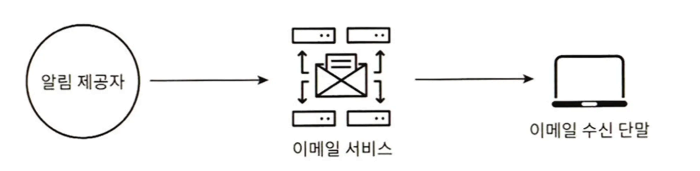

## 알림 시스템 설계(Notification System)

- 최신뉴스, 제품 업데이트, 이벤트, 선물 등 고객에게 중요할 만한 정보를 비동기적으로 제공
- 종류 : Mobile Push Notification, SMS메시지, 이메일

### 1단계 문제 이해 및 설계 범위 확정
![[Notification_System_QnA.png]]

### 2단계 개략적 설계안 제시 및 동의 구하기

#### 알림 유형별 지원 방안
 
##### iOS 푸시 알림

- 알림 제공자(Provider): 알림 요청을 만들어, Apple Push 알림 서비스로 보내는 주체다. 알림 요청을 보내기 위해서는 다음과 같은 데이터가 필요하다.
	- 단말 토큰 : 알림 요청을 보내기 위한 고유 식별자
	- 페이로드 : 알림 내용을 담은 JSON Dictionary다.
- 알림 제공자 : 알림 요청을 만들어 APNS로 보내는 주체, 단말토큰, 페이로드 데이터 필요
- APNS: 애플이 제공하는 원격 서비스, 푸시 알림을 iOS 단말로 보냄
 
##### 안드로이드
 

##### SMS 메시지
- 업체
	- 트윌리오
	- 넥스모
- 국내
	- 네이버 - https://api.ncloud-docs.com/docs/ai-application-service-sens-smsv2
	- 유플러스 - https://openapi.sms.uplus.co.kr/#!/main
	- 카카오톡 메시지 - https://developers.kakao.com/docs/latest/ko/message/rest-api

 
##### 이메일

- 회사 이메일 고유 서버를 갖추고 있지만 전송 성공률도 높고, 데이터 분석 서비스도 제공하기 때문에 외부 업체 이용
- Sendgrid, Mailchimp

 
#### 연락처 정보 수집 절차
- 알림 전송을 위한 정보 - 개인 정보 수집
	- 단말 토큰
	- 전화번호
	- 이메일
- 앱설치 또는 계정등록시 저장

- 한 사용자가 여러 단말을 가질수 있고, 모든 단말에 전송되어야 함.

#### 알림전송 및 수신 절차
##### 초안

- 서비스 : 마이크로서비스, 크론잡, 분산 시스템 컴포넌트 ex. 납기일 안내, 배송 알림 등
- 알림 시스템은 우선 1개 서버만 사용하는 시스템으로 가정
- 이 시스템은 서비스들에 알림 전송을 위한 API를 제공해야 하고, 제 3자 서비스(서드 파티 서비스)에 전달할 알림 요청을 만들어 낼 수 있어야 한다.
- 제 3자 서비스(서드 파티 서비스)는 사용자에게 알림을 실제로 전송하는 역할
- 서드파티와의 통합을 진행할 때 유의할 것은 **확장성**이다. 쉽게 새로운 서비스를 통합하거나 기존 서비스를 제거할 수 있어야 한다.
- 또 글로벌 서비스일 경우 국가에 따른 지원 여부를 고려

##### 이 설계의 문제점
- SPOF - 서버1대라 장애시 전면장애
- 확장성 - DB, 캐시가 모두 서버안에 있어 개별적으로 조절 불가
- 성능병목 - 때문에 트래픽이 많이 몰리게 되면 성능 병목으로 인한 과부하도 있을 수 있다.

#### 개선된 버전

- DB, 캐시 분리
- 알림서버 증설가능
- 메시지큐 추가로 느슨한 결합
- 알림서버
	- API 제공 : 사내 또는 인증서버만 가능
	- 알림검증 : 이메일, 전화번호 검증
	- DB, 캐시 확인 : 데이터
	- 알림전송 : 메시지 큐에 넣음
- 캐시 : 사용자 정보, 단말정보, 알림템플릿등 캐시
- DB : 사용자, 알림, 설정 등
- 메시지 큐 : 버퍼, 3rd party 서비스별로 분리해 한 서비스가 장애나더라도 나머지는 가능
- 작업 서버 : 큐에서 알림을 꺼내서 3rd part로 전달
- iOS, 안드로이드, SMS, 이메일 
- 

##### 개인적 경험
- 메시지 큐 대신에 RDB사용

### 3단계, 상세 설계

#### 안정성 Reliability
- 분산 환경에서 운영될 경우 고려사항
##### 데이터 손실 방지
- 데이터를 DB에 보관 + 재시도 메커니즘
- 알림 로그를 DB에 유지하는 것도 하나의 방법 - 쿠팡

##### 중복 전송 방지
- 분산시스템 특성상 같은 알림 중복 전송 가능 - https://bravenewgeek.com/you-cannot-have-exactly-once-delivery/
- 간단 로직
	- 보내야 할 알림도착시 Event ID 검사하여 이전에 본적이 없는 이벤트 인지 검사
	- 중복이면 버리고, 아니면 전송

ㅁㄴㅇㄹㅁㄴㅇㄹ - 쿠팡에서 과정, 설계 

#### 추가 컴포넌트 및 고려사항

##### 알림 템플릿
- 파라미터, 스타일, Tracking Link를 조정해 만들어냄
- 형식 일관성
- 개인 의견 - 금칙어 제거

##### 알림 설정
- 사용자가 상세히 조절할 수 있도록 `알림 설정 테이블` 을 이용.
- 알림 수단마다 허용 여부를 확인 → 알림 보내기 전 필터링 필요

##### 전송률 제한
- 사용자 경험 고려

##### 재시도 방법
- 제 3자 서비스가 알림 전송 실패하면, 재시도 전용 큐에 넣어 알림 재시도
- 같은 문제가 발생하면 개발자에게 알림(alert)
    - 재시도 전용 큐에 넣을 때, retry 횟수도 넣어야 될 듯?

##### 보안
- 인증된 클라이언트만 API를 사용하도록 제한

##### 큐 모니터링
- 쌓인 알림의 개수를 보면서 처리가 잘 되고 있는지 확인.
- 처리가 늦는 경우 서버 증설 필요

##### 이벤트 추적
- 사용자를 이해하기 좋음
- 알림 확인율, 클릭율, 실제 앱 사용

#### 수정된 설계안

##### 추가 된 것
- 알림 서버의 인증, 전송률 제한 기능
- 전송 실패 대응을 위한 재시도 기능. 실패한 알림은 다시 큐에 넣고 지정된 횟수만큼 재시도 한다.
- 전송 템플릿 기능
- 모니터링과 추적을 위한 분석 서비스

### 4단계 마무리

- 안정성: 메시지 전송 실패율을 낮추기 위해 안정적인 재시도 메커니즘 도입
- 보안: 인증된 클라이언트만이 알림을 보낼 수 있도록 appKey, appSecret 등의 메커니즘 이용
- 이벤트 추적 및 모니터링
- 사용자 알림 수신 설정
- 전송률 제한

### 추가 생각해볼 거리
- 클릭이벤트 추적 
		- APNS의 경우 발송 요청만 가능하고 실제 도달까지 알수 있는 방법이 없음
			- https://developer.apple.com/documentation/usernotifications/viewing-the-status-of-push-notifications-using-metrics-and-apns
		- https://developer.apple.com/documentation/usernotifications/handling-notification-responses-from-apns
		- FCM은 있음 
			- https://firebase.google.com/docs/cloud-messaging/understand-delivery?hl=ko&_gl=1*1mjx7iw*_up*MQ..*_ga*MTc2OTY4OTMzMy4xNzE5ODIwMzM1*_ga_CW55HF8NVT*MTcxOTgyMDMzNS4xLjAuMTcxOTgyMDMzNS4wLjAuMA..&platform=ios

- 발송 속도 차이 
	- GCM - 83건
		- FCM의 경우 한번에 동일 메시지를 여러디바이스에  동시에 보낼수 있는 API 존재 
	- APNS - 16건/초당
- 마케팅에서만 사용되는 추가 태그들, 사용자 ID, 리텐션용, 
- 만료 메시지 만료 시간
- 장바구니 안내

