## 채팅 시스템 설계

### 1단계 문제 이해 및 설계 범위 확장

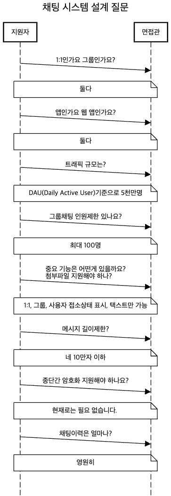

- 응답지연이 낮은 일대일 채팅 가능
- 최대 100명까지 참여할 수 있는 그룹 채팅 기능
- 사용자 접속상태 표시 기능
- 다양한 단말 지원
- Push 알림

### 2단계 개략적 설계안 제시 및 동의 구하기
 - 클라이언트는 서로 직접 통신하지 않음
 - 클라이언트로부터 메세지 수신
 - 메세지 수신자 결정 및 전달
 - 수신자가 접속 상태가 아닌 경우 접속할 때 까지 메세지 보관
 

- 채팅 서비스의 경우 어떤 프로토콜을 사용할지도 매우 중요한 요소. 
- 대부분 Client/Server Application에서 요청을 보내는 것은 클라이언트다. 
	- 보통은 수신자에게 요청을 보낼 때 가장 오래됐으며 대중적인 HTTP 프로토콜을 사용한다.
	- 메세지 송신의 경우 채팅 서비스와의 접속에는 keep-alive 헤더를 사용하면 효율적
	- 클라이언트와 서버 간 연결을 끊지 않고 계속 유지할 수 있기 때문
	- TCP 헤더 간의 핸드셰이크 횟수를 줄일 수 있음
- 메세지 수신의 경우 이것보다 더 복잡하다. 
	- HTTP 한계 - 클라이언트가 연결을 만드는 프로토콜이며,서버에서 클라이언트로 임의 시점에 보내는 데는 쉽게 쓰일 수 없다. 
- 서버가 계속해서 연결을 만들어 메세지를 수신하고 다시 수신한 메세지를 보여주게 동작하는 방안으로 많은 기법이 제안
	- 폴링(polling), 
	- 롱 폴링(long polling), 
	- 웹 소켓(Web Socket)이 등이 대표적이다.

#### 폴링(Polling)
- 폴링은 클라이언트가 주기적으로 서버에게 새 메세지가 있는지 요청하는 방법이다. 
- 메세지가 없는 경우 자원을 낭비하는 단점이 있지만, 안정적이다.

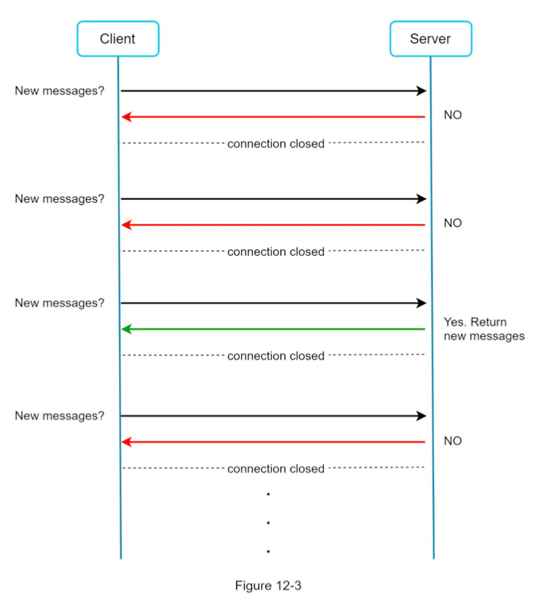

#### 롱 폴링(Long Polling)

- 클라이언트는 새 메세지가 반환되거나, 타임아웃 될 때까지 연결을 유지한다.
- 클라이언트는 새 메세지를 받으면 기존 연결을 종료하고 서버에 새로운 요청을 보내 모든 절차를 다시 시작한다.

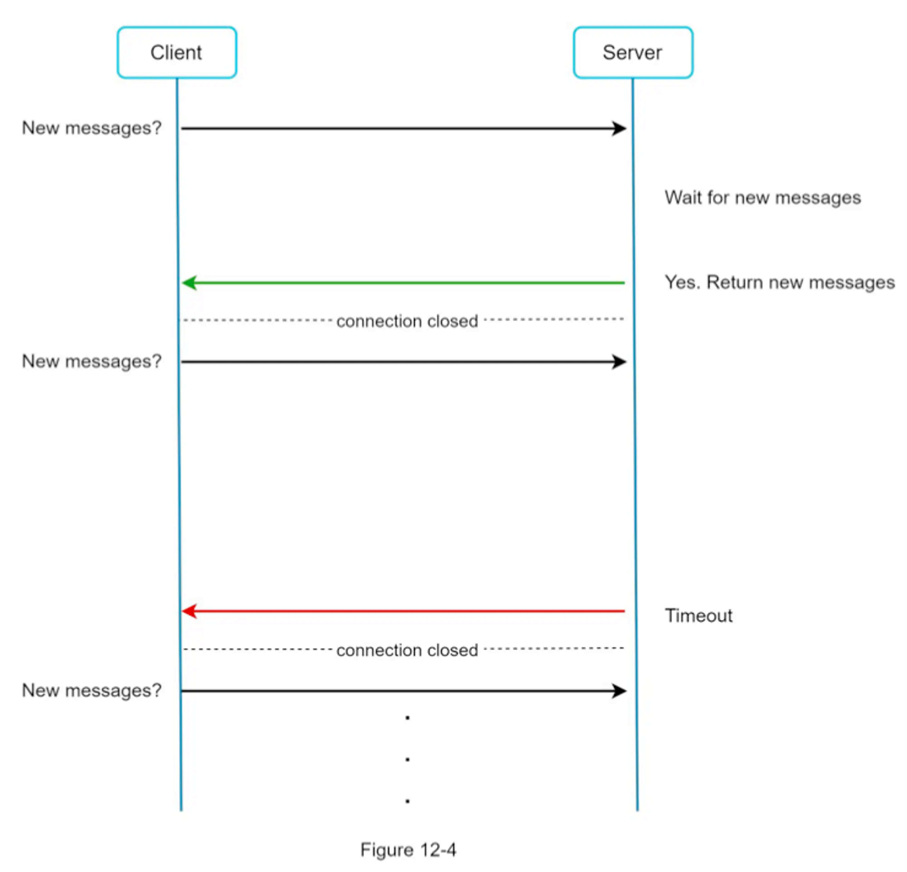

-  메세지를 보내는 클라이언트와 수신하는 클라이언트가 같은 채팅 서버에 접속하지 않을 수도 있다. 로드밸런싱을 위해 라운드 로빈을 사용하는 경우, 메세지를 받은 서버는 메세지를 수신할 클라이언트와 같은 롱 폴링 연결을 가지고 있지 않은 서버일 수 있다.
- 서버 입장에선 클라이언트가 연결을 해제했는지 아닌지 알 좋은 방법이 없다.
	- 네트워크 문제, 자원 소모
- 여전히 비효율 적이다. 
	- 메세지를 많이 받지 않은 클라이언트도 타임아웃이 일어날 때마다 주기적으로 서버에 다시 접속할 것이다.

#### 웹 소켓(Web Socket)

웹 소켓은 서버가 클라이언트에게 비동기 메세지를 보낼 때 널리 사용하는 기술이다.

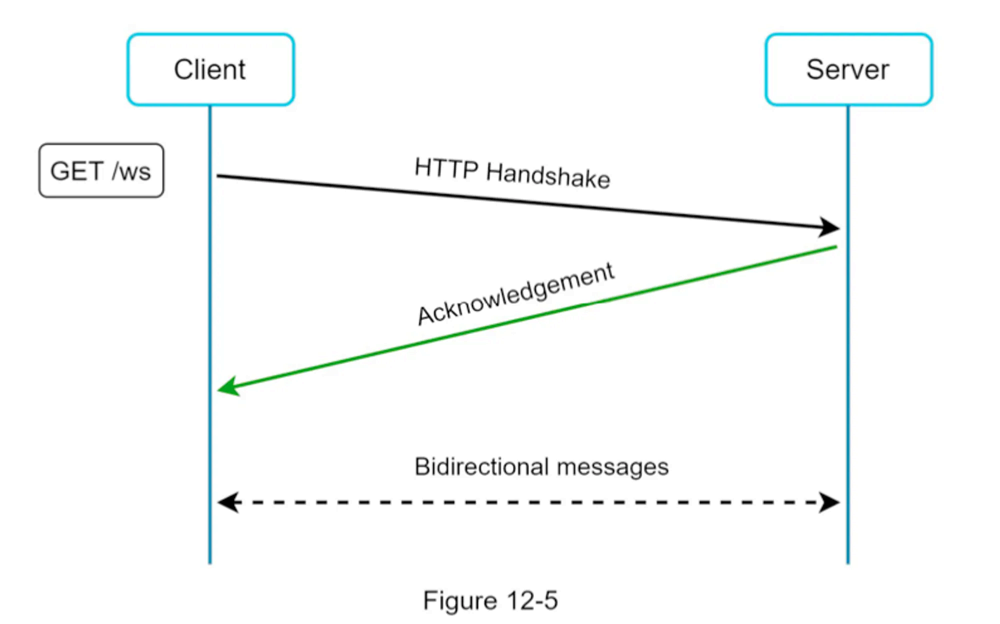

- 소켓 연결은 클라이언트가 시작
- 맺어진 연결은 항구적이며 양방향
- 연결은 초기에는 HTTP지만 핸드셰이크 절차를 거지고 나서 웹 소켓 연결로 업그레이드
- 일단 연결이 만들어지고 나면 서버는 클라이언트에 비동기적으로 메세지를 전송할 수 있다. HTTP와 HTTPS의 80 또는 443 포트를 그대로 사용하기 때문에 방화벽 환경에서도 동작한다.
- 웹 소켓은 양방향 메세지 전송을 가능하게 만들어주기 때문에 안정적으로 소켓 기반 서비스를 구축할 수 있다면 굳이 폴링 방식을 사용할 필요는 없다.

##### 어떻게?

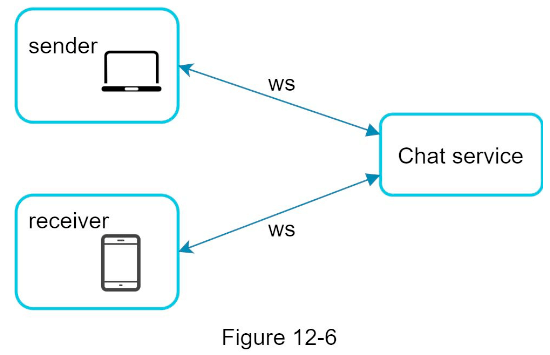
- 웹 소켓을 이용하면 송수신 때, 동일한 프로토콜을 사용할 수 있다.
- 설계 및 구현이 단순하며 직관적이다.
- 단, 연결이 항구적이므로 서버에서 연결 관리를 효율적으로 해야한다.

### 개략적 설계안 (high-level design)

- 채팅을 제외한 대부분의 기능(회원가입, 로그인, 사용자 프로필 등)은 일반적인 HTTP로 구현해도 된다.
- 채팅 시스템은 세 부분으로 구분 가능하다.
    1. stateless(무상태) 서비스
    2. stateful(상태유지) 서비스
    3. third-party 연동
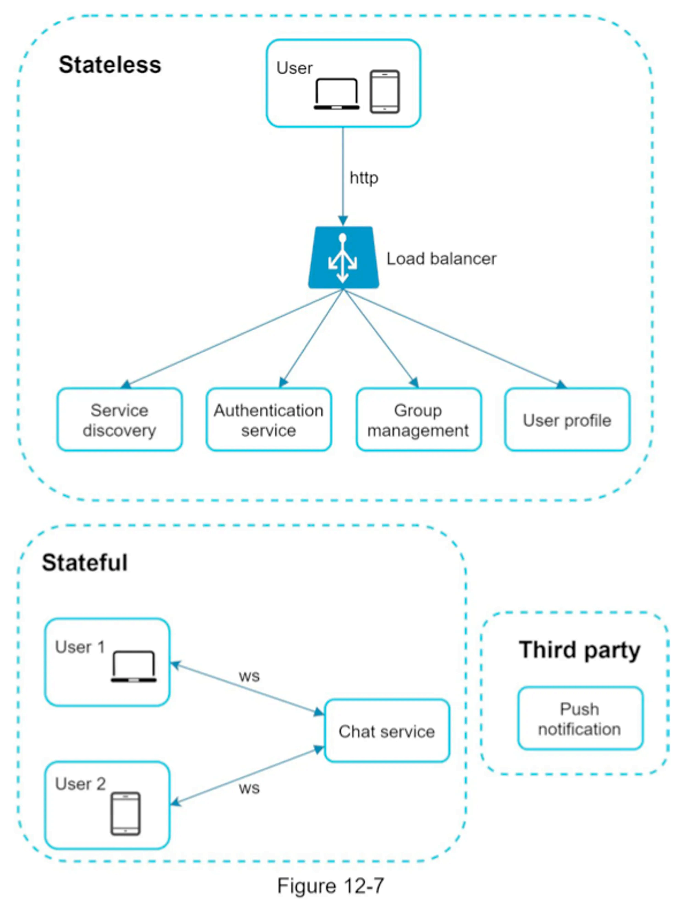

**stateless 서비스**

- 로그인, 회원가입, 사용자 프로필 등 전통적인 요청/응답이 해당된다.
- 무상태 서비스는 로드밸런서 뒤에 위치한다.
    - 로드밸런서 뒤에는 모놀리틱 또는 마이크로서비스일 수도 있다.
- 서비스 탐색(service discovery) 서비스 - 클라이언트가 접속할 채팅 서버의 DNS 호스트명을 알려주는 서비스이다.

**stateful 서비스**

- 채팅 서비스가 해당된다.
- 각 클라이언트와 채팅 서버는 독립적인 네트워크 연결을 유지해야한다.
    - 클라이언트는 서버와 연결이 살아있는 한 다른 서버로 연결을 변경하지 않는다.
- 서비스 탐색 서비스는 채팅 서비스와 협력하여 특정 채팅 서버에 부하가 몰리지 않도록 한다.

**third-party 연동**

- 푸시 알림이 해당된다.
- 앱이 실행 중이 아니어도 알림을 받아야한다.
- 상세 내용은 챕터 10장. 알림 시스템 설계 참고

### 규모 확장성(scalability)

- 동시접속자가 1M이고, 접속당 서버 메모리가 10KB가 필요하다면, 10GB의 메모리로 모든 연결을 처리할 수 있다.
- 서버 한 대로 구현하는 경우 한계가 있음 - SPOF 문제
- 서버 한 대 설계안에서 개선시켜나가는 것도 괜찮다. 
	- 이 경우, 면접관에게 단지 시작이라는 것을 정확히 전달하자.

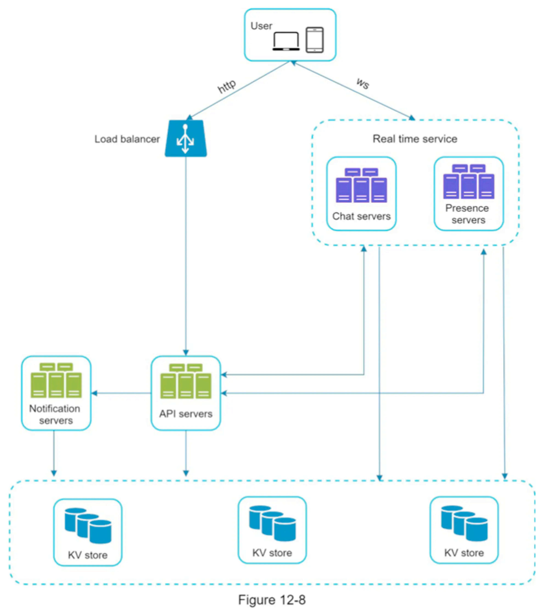

- 채팅서버는 클라이언트 간 메시지 중계를 담당한다.
- 접속상태(presence) 서버는 사용자 접속 여부를 관리한다.
- API 서버는 채팅을 제외한 로그인, 회원가입 프로필 변경 등 전부를 처리한다.
- 알림 서버는 푸시 알림을 보낸다.
- 키-값 저장소에는 채팅 이력을 보관한다.
    - 시스템에 접속한 사용자는 이전 채팅 이력을 전부 볼 것이다.

### 저장소

- 어떤 데이터베이스를 사용할 것인지는 데이터의 유형과 읽기/쓰기 연산의 패턴을 봐야한다.
- 채팅 시스템의 데이터는 두 가지다.
    1. 사용자 프로필, 설정, 친구 목록 등 일반 데이터
    2. 채팅 이력 (chat history)
- 일반 데이터는 데이터 안정성을 보장하는 관계형 데이터베이스에 보관한다.
- 채팅이력은 읽기/쓰기 연산 패턴을 이해해야한다.
    - 채팅 이력 데이터는 매우 크다.
        - 페이스북 메신저나 왓츠앱은 매일 600억 개의 메시지를 처리한다.
    - 이 데이터에서 가장 자주 사용되는 것은 최근 메시지이다.
        - 대부분 사용자는 오래된 메시지를 보지않는다.
    - 사용자는 대체로 최근 메시지를 보지만, 메시지 검색 기능, 특정 사용자가 언급된 메시지 보기, 특정 메시지로 점프하기 등 무작위 데이터 접근을 지원해야한다.
    - 1:1 채팅 앱의 경우 읽기:쓰기 비율은 대략 1:1이다.
- 위 사항을 바탕으로 채팅 이력은 키-값 저장소를 추천한다.
    - 수평적 규모확장이 쉽다.
    - 데이터 접근 지연시간이 낮다.
    - 관계형 데이터베이스는 long tail에 해당하는 부분을 잘 처리하지 못한다.
        - 인덱스가 커지면 데이터에 대한 random access 비용이 늘어난다.
    - 이미 많은 안정적인 채팅 시스템이 키-값 저장소를 사용한다.
        - 페이스북 메신저는 HBase를 사용하며 디스코드는 카산드라를 사용한다.

> - long tail이란?
>     - 파레토 법칙을 그래프로 나타냈을 때 꼬리처럼 긴 부분을 형성하는 80% 부분을 말한다.
>     - 파레토 법칙은 상위 20%가 전체 80%를 차지한다는 법칙이다.
>     - 채팅 시스템에서 최근 메시지가 가장 자주 사용된다.
>     - 따라서 대부분 사용자들의 데이터 접근은 최근 메시지에 집중되며, long tail은 오래된 메시지를 말하는 것이다.
>     - [https://ko.wikipedia.org/wiki/긴_꼬리](https://ko.wikipedia.org/wiki/%EA%B8%B4_%EA%BC%AC%EB%A6%AC)

### 데이터 모델

#### 1:1 채팅 메시지 테이블
- message_id를 기본키로 갖는다.
	- 동시에 메시지가 생성될수도 있어서 created_at만 볼수 없음
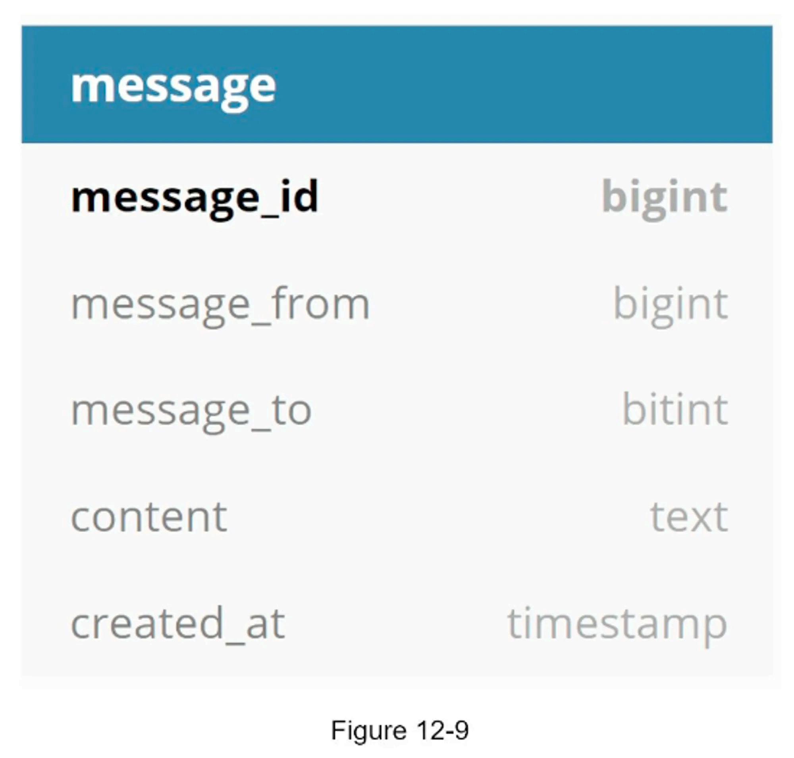

#### 그룹 채팅 메시지 테이블

- channel_id, message_id 복합키를 기본키로 갖는다.
- channel_id, 파티션 키로도 활용
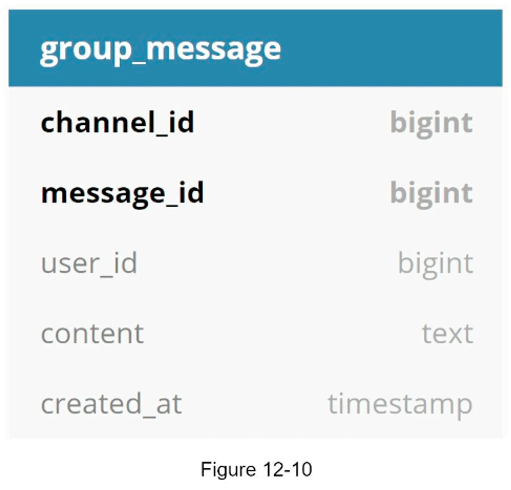

#### 메시지 ID

- message_id는 고유해야한다.
- ID는 정렬 가능하며 시간 순서와 일치해야한다.
- snowflake와 같은 유일 ID를 사용할 수 있다.
    - 제 7장 분산 시스템을 위한 유일 ID 생성기 설계 참고
- 지역적 순서 번호 생성기를 이용할 수 있다.
    - message_id의 유일성은 같은 그룹 안에서만 보장하면 된다.
    - 전역에 비해 비교적 구현하기 쉽다.

### 3단계. 상세 설계

서비스 탐색, 메시지 전달 흐름, 사용자 접속 상태 표시 방법에 대해서 알아보자.

#### 서비스 탐색(Service Discovery)

- 클라이언트에게 가장 적합한 채팅 서버를 추천하는 것
- 기준은 클라이언트의 위치, 서버 용량 등이 있다.
- 대표적으로는 아파치 주키퍼가 있다.
	- 사용가능한 모든 채팅 서버를 등록하고 클라이언트가 접속 시도 시, 기준에 따라 최적의 채팅 서버를 골라준다.

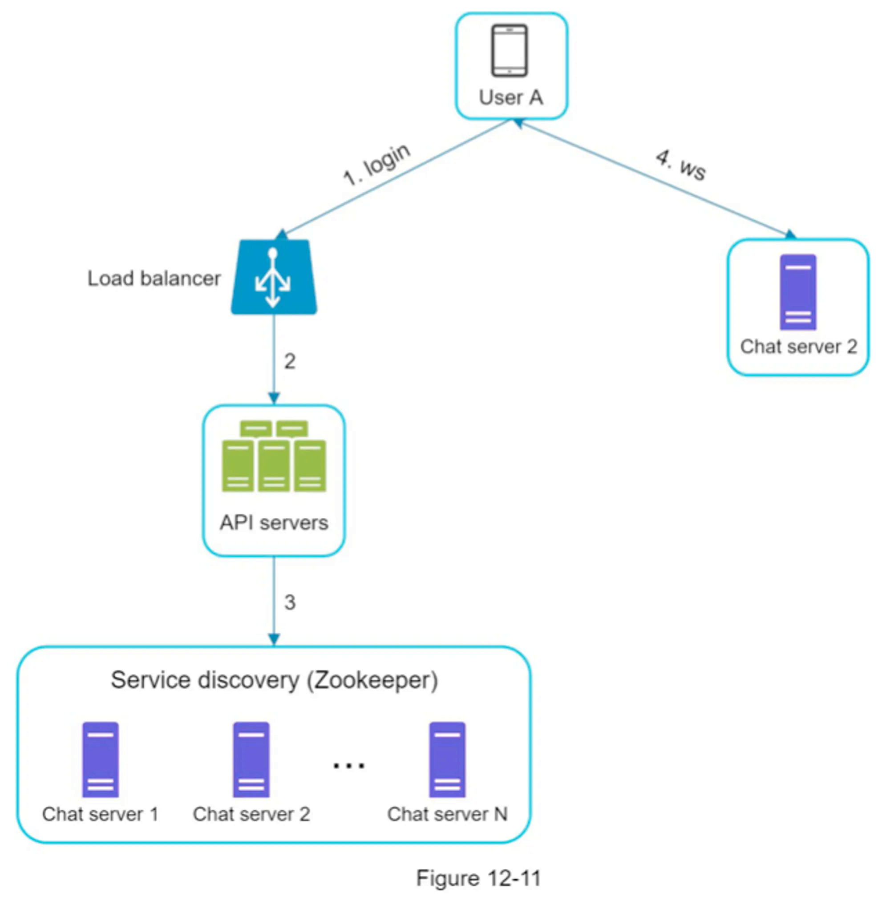
1. A가 시스템에 로그인 시도
2. 로드밸런서가 로그인 요청을 API 서버에 보낸다.
3. API 서버가 인증 처리 후 서비스 탐색 기능을 통해 최적의 채팅 서버를 찾는다.
    - 최적의 채팅 서버로 2를 반환한다고 가정
4. A는 채팅 서버 2와 웹 소켓 연결

#### 메시지 흐름

##### 1:1 채팅 메시지 처리 흐름
1. A가 채팅 서버 1로 메시지 전송
2. 채팅 서버 1은 ID 생성기로 message_id 결정
3. 채팅 서버 1은 해당 메시지를 메시지 동기화 큐로 전송
4. 메시지를 키-값 저장소에 저장
5. B가 온라인인가?
	1. 온라인인 경우, 메시지는 채팅 서버 2로 전송됨.
	2. 오프라인인 경우, 메시지를 푸시 알림(PN/Push Notification) 서버로 전송.
		1. B와 채팅서버 2는 웹소켓으로 연결되어 있으며, 채팅서버 2가 B에게 메시지 전송.

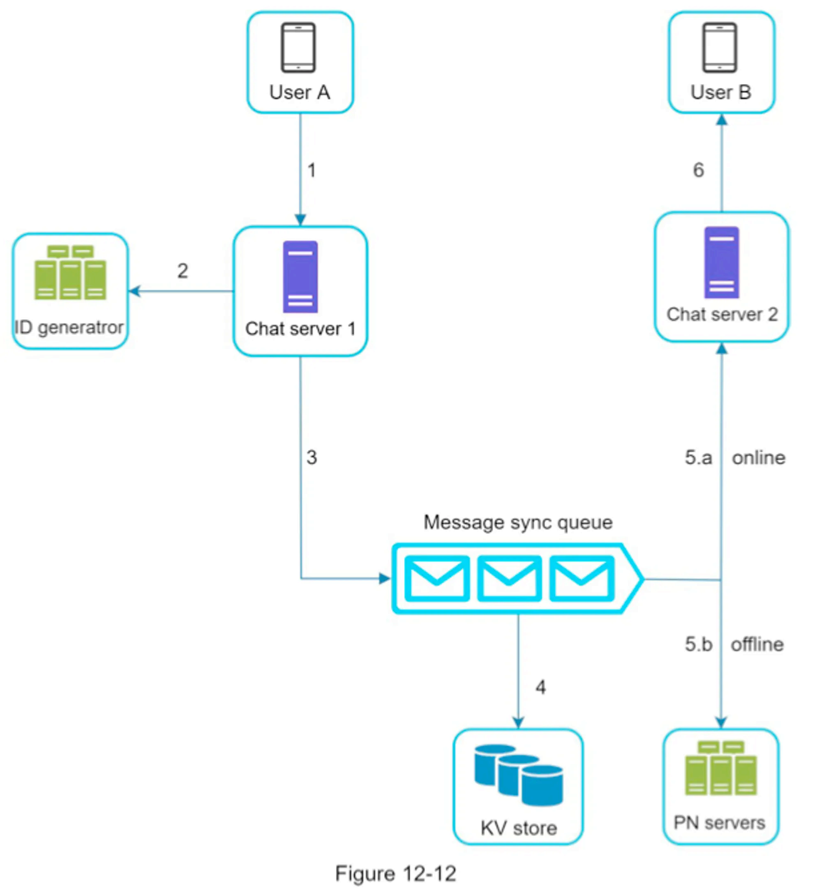

##### 여러 단말 사이의 메시지 동기화(동일 사용자)
- 각 단말은 가장 최신 메시지 ID인 cur_max_message_id를 갖는다.
- 아래 두 조건을 만족한 경우 새 메시지로 간주한다.
    - 수신자 ID가 현재 로그인한 사용자 ID와 같은 경우
    - message_id가 cur_max_message_id보다 큰 경우

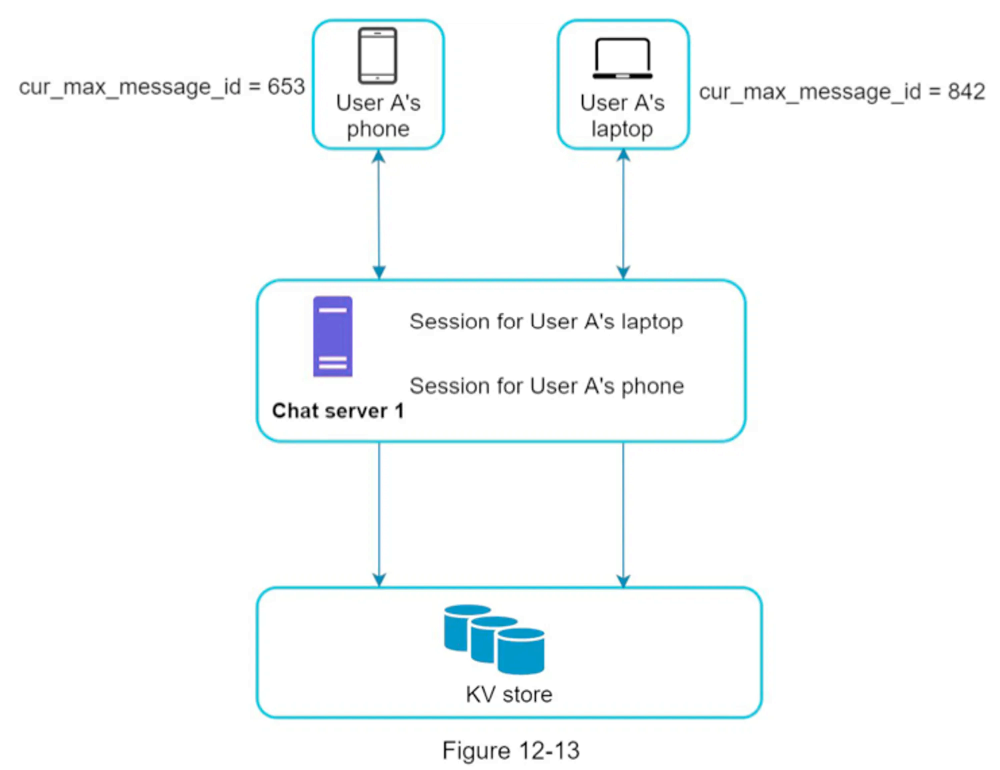

##### 소규모 그룹 채팅에서의 메시지 흐름
- A가 보낸 메시지는 B와 C의 메시지 큐에 복사된다.
- 새 메시지 여부는 본인 큐만 확인하면 되므로 단순하다.
- 그룹이 크지않으면 큐마다 복사하는 비용이 문제되지 않는다.
- 위챗은 이 방법을 쓰며 그룹 크기를 500명으로 제한한다.

**발신자 관점**

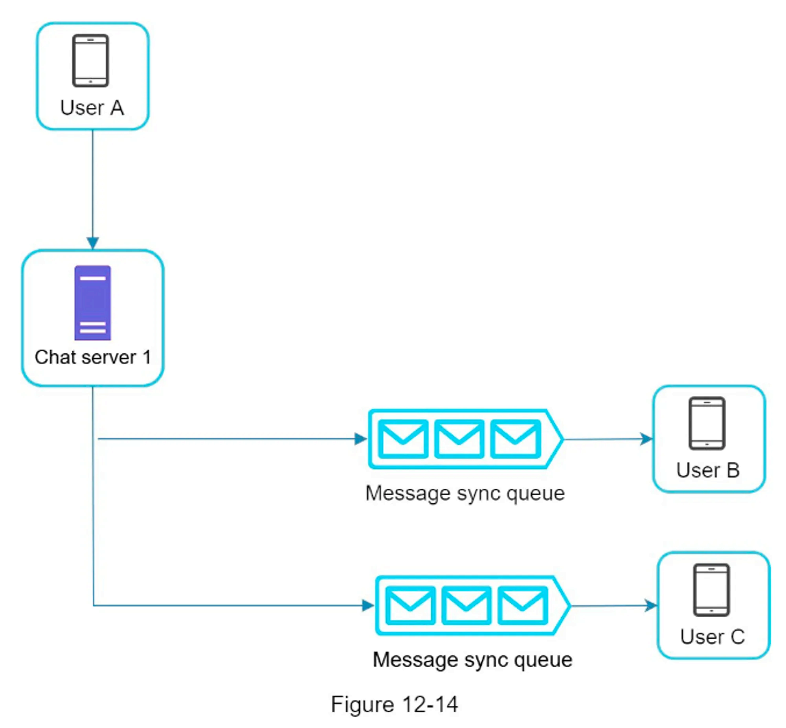

**수신자 관점**
- 수신자 관점으로 보면, 수신자는 여러 송신자에서 오는 메시지를 수신할 수 있어야한다.
- 즉, 메시지 큐는 여러 사용자의 메시지를 받을 수 있어야한다.

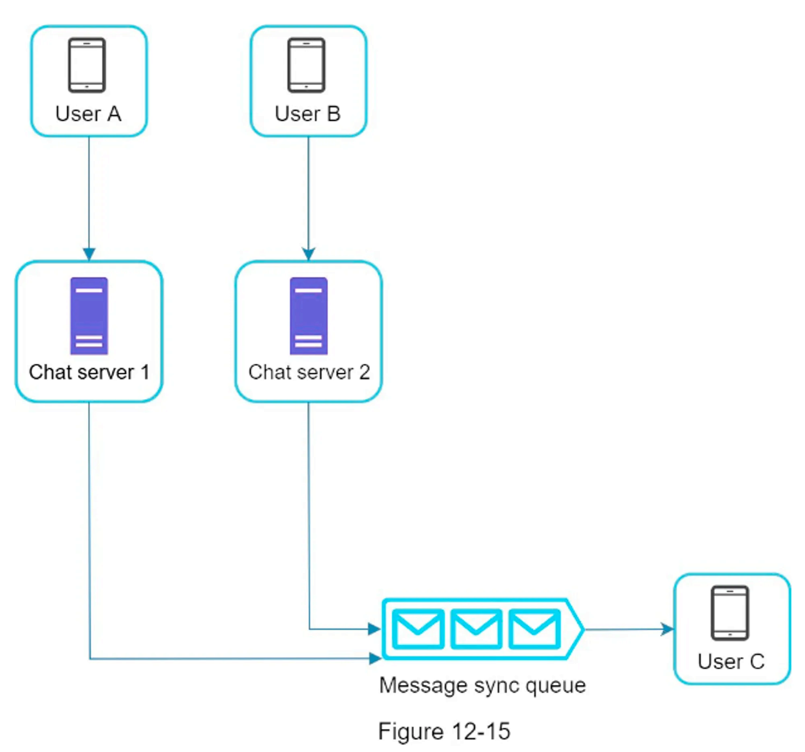

#### 접속상태 표시

- 접속상태 표시는 채팅 애플리케이션의 핵심 기능이다.
    - 사용자 프로필 옆에 나타나는 녹색 불이 그것이다.
- 접속 상태 서버는 웹소켓으로 통신하는 실시간 서비스 중 하나이다.
- 사용자 상태가 변하는 로그인, 로그아웃, 접속 장애에 대해서 살펴보자.

##### 사용자 로그인
- 클라이언트가 웹 소켓 연결을 하고나면 접속 상태 서버는 유저 상태와 last_active_at 타임스탬프 값을 키-값 저장소에 보관한다.
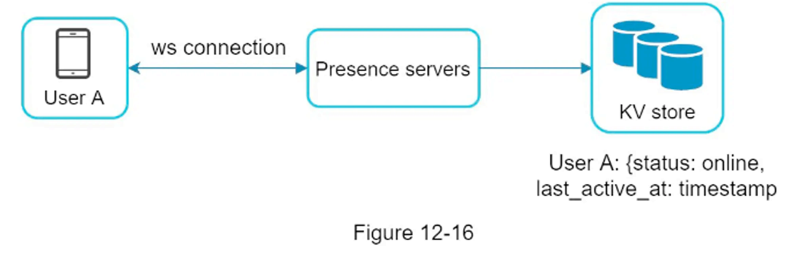

- 로그아웃 시 사용자 상태를 offline으로 바꾼다.
- 이때 UI 상에 사용자 상태는 접속 중이 아닌 것으로 표시된다.
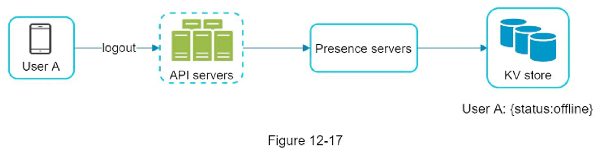

##### 접속 장애
- 인터넷 연결은 항상 안정적인 것은 아니다.
- 잠깐의 연결이 끊겼다고 매번 접속 상태를 변경하는 것은 오버헤드가 크다. 
	- ex) 터널에 자동차가 들어갔다고 오프라인은 아니다
- 이 문제는 heartbeat 검사를 통해 해결할 수 있다.
- 클라이언트는 주기적으로 heartbeat event를 접속상태 서버로 보낸다.
- 마지막 이벤트가 x초 이내에 다시 오면 온라인으로 유지하고 아닐 경우 오프라인으로 변경한다.
- 위 예시에서 x가 30초일 때, 클라이언트는 박동이벤트를 5초마다 보내다가 아무런 메시지를 보내지않아 오프라인으로 변경됐다.
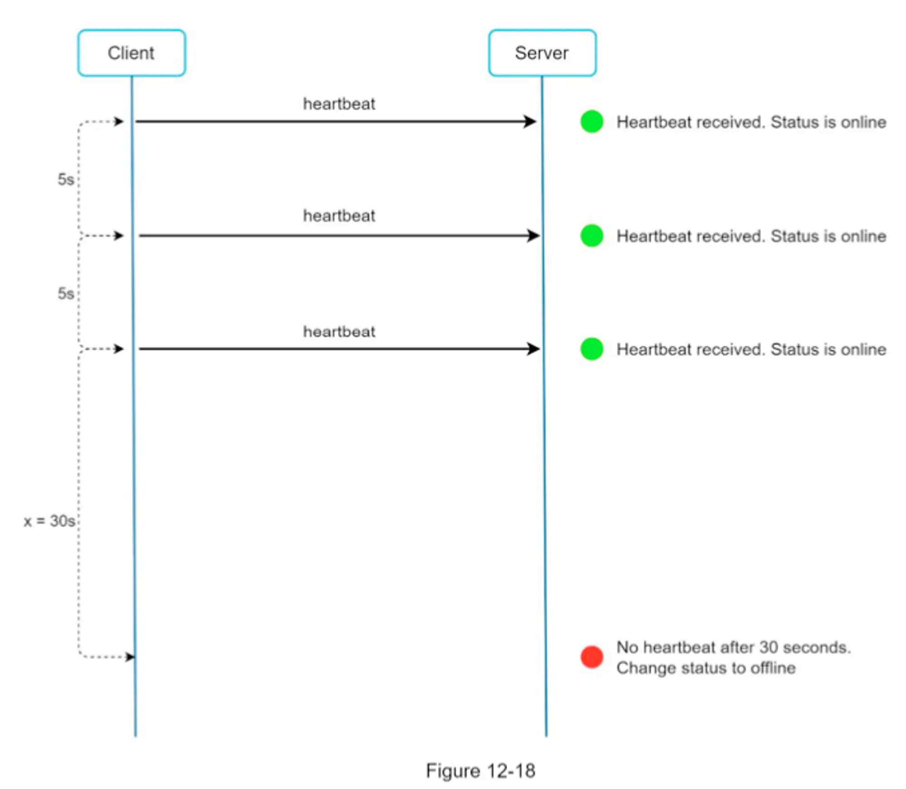

##### 상태정보의 전송

- 친구들(B, C, D)는 A의 상태정보를 어떻게 알까?
- 접속상태 서버는 발행(publish)-구독(subscribe) 모델을 사용한다.
    - 각 친구관계마다 채널을 하나씩 둔다.
    - 위 예시에서는 A-B, A-C, A-D 채널이 존재
    - 각 채널을 각 친구들이 구독
- 이는 그룹의 크기가 작을 때 효과적이다. 동일 이벤트가 친구 수만큼 발생한다.
- 그룹이 클 경우 사용자가 그룹 채팅에 입장하는 순간에만 상태정보를 읽거나 사용자가 친구의 접속상태를 수동으로 갱신하는 방식을 사용한다.

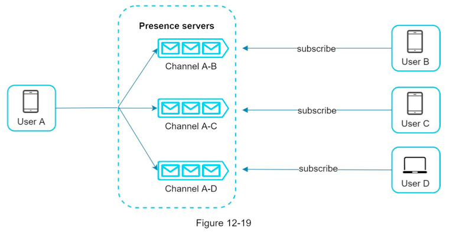

## 4단계. 마무리

**추가 논의 사항**

- 미디어 파일을 지원하는 방법
    - 미디어 파일은 용량이 크기 때문에 압축, 클라우드 저장소, 섬네일 생성 등을 논의할 수 있다.
- 종단 간 암호화
- 캐시
    - 이미 읽은 메시지를 캐시하면 서버와 주고받는 데이터를 줄일 수 있다.
- 로딩 속도 개선
    - 슬랙은 사용자 데이터, 채널 등을 지역적으로 분산하는 네트워크를 구축하여 앱 로딩 속도를 개선했다.
- 오류 처리
    - 채팅 서버 오류: 채팅 서버가 죽으면 서비스 탐색 서비스가 클라이언트에게 새로운 서버를 배정하고 재접속 할 수 있도록 해야한다.
    - 메시지 재전송: 재시도나 큐는 메시지의 안정적 전송을 보장하는 일반적인 기법이다.
- 