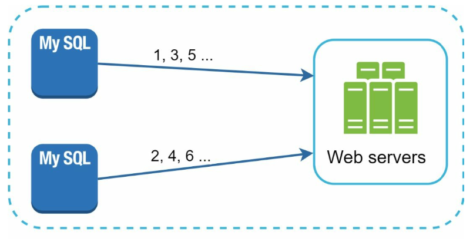
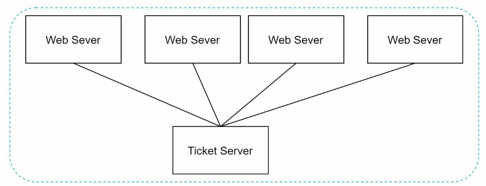
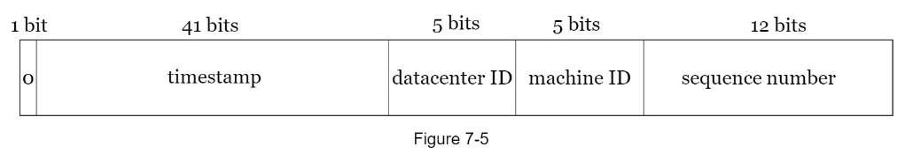
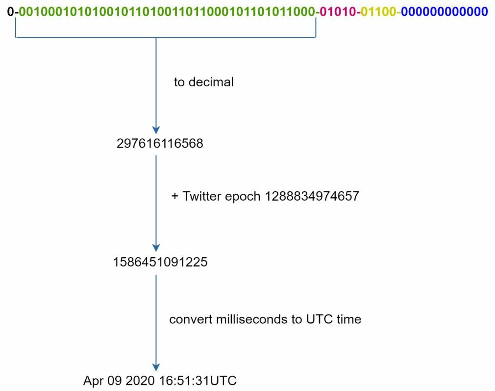

# 분산 시스템을 위한 유일 ID 생성기 설계
## 1단계) 문제 이해 및 설계 범위 확정
- 유일한 ID
- 숫자로만 구성된 ID
- 64비트로 표현될 수 있는 ID
- 발급날짜에 따라 정렬 가능
- 초당 10,00개의 ID 생성
## 2단계) 개략적 설계안 제시 및 동의 구하기
### 다중 마스터 복제

데이터베이스의 `auto_increment` 기능을 활용한 방법, +1만큼 증가되는 것이 아니라 +k(k=현재 사용중인 데이터베이스 서버의 수)이다.
단점
- 여러 데이터 센터에 걸쳐 규모를 늘리기 어려움
- ID의 유일성은 보장되나 그 값이 시간 흐름에 맞춰 커지도록 보장할 수 없음
- 서버를 추가하거나 삭제할 때도 잘 동작하도록 만들기 어려움
### UUID
컴퓨터 시스템에 저장되는 정보를 유일하게 식별하기 위한 128비트짜리 수, 중복 UUID가 생길 확률을 50%로 끌어 올리려면 초당 10억개의 UUID를 100년 동안 계속 생성해야 한다고 한다.
UUID는 서버 간 조율 없이 독립적으로 생성 가능하다.

| 장점                        | 단점               |
| ------------------------- | ---------------- |
| 생성이 단순함                   | 128비트로 길다        |
| 독립적으로 생성 가능하므로 동기화 이슈가 없음 | 시간순 정렬 불가능       |
| 규모 확장이 쉬움                 | 숫자가 아닌 다른 값이 포함됨 |
### 티켓 서버

유일성이 보장되는 ID를 만들어 내는 데 쓰일 수 있는 또 하나의 방법, `auto_increment` 기능을 갖춘 데이터베이스 서버, 즉 티켓 서버를 중앙 집중형으로 하나만 사용한다.

| 장점                             | 단점                               |
| ------------------------------ | -------------------------------- |
| 유일성이 보장되는 오직 숫자로만 구성된 ID 생성 가능 | 티켓 서버가 SPOF가 됨                   |
| 구현하기 쉽고 중소 규모의 애플리케이션에 적합      | 티켓 서버를 여러대 두면 데이터 동기화 이슈를 해결해야 함 |
### 트위터의 snowflake 접근법

- sign 비트: 음수와 양수 판별
- timestamp: epoch 이후로 몇 밀리초가 경과했는지 나타내는 값
- 데이터센터 ID: 5비트이므로 $2^5$ 개 데이터센터 지원 가능
- 서버 ID: 데이터센터당 32개 서버 사용 가능
- 일련 번호: 각 서버에서는 ID를 생성할 때마다 이 일련번호를 1만큼 증가시킴, 1밀리초가 경과할 때마다 0으로 reset
## 3단계) 상세 설계
데이터센터 id, 서버 id는 시스템이 시작할 때 결정되는 값이고 나중에 변경되지 않는다. (충돌 가능성 때문에...) 타임스탬프나 일련번호는 id 생성기가 돌고 있는 중에 만들어지는 값이다.
### 타임스탬프
시간의 흐름에 따라 점점 큰 값을 갖게 되어 id 기반으로 시간순 정렬이 가능하다.

- UTC 시각을 추출하는 예제

41비트로 표현할 수 있는 타임스탬프의 최댓값은 $2 ^ {41} - 1 = 2199023255551$ 밀리초(대략 69년)이다. 69년이 지나면 epoch를 변경하거나 다른 id 체계를 이전해야 할 것이다.

### 일련번호
12비트이므로, $2^{12}=4096$개의 값을 가질 수 있다. 어떤 서버가 같은 밀리초 동안 하나 이상의 ID를 만들어 낸 경우에만 0보다 큰 값을 갖게 된다. 

## 4단계) 마무리
- 시계 동기화: 하나의 서버가 여러 코어에서 실행될 경우 전부 같은 시계를 사용한다는 가정이 유효하지 않을 수 있다. NTP(Network Time Protocol)으로 해결 가능
- 각 절의 길이 최적화: 동시성이 낮고 수명이 긴 애플리케이션이라면 일련번호 절의 길이를 줄이고 타임스탬프 절의 길이를 늘리는 것이 효과적일 수 있다.
- 고가용성: id 생성기는 필수 불가결 컴포넌트이므로 아주 높은 가용성을 제공해야 할 것
