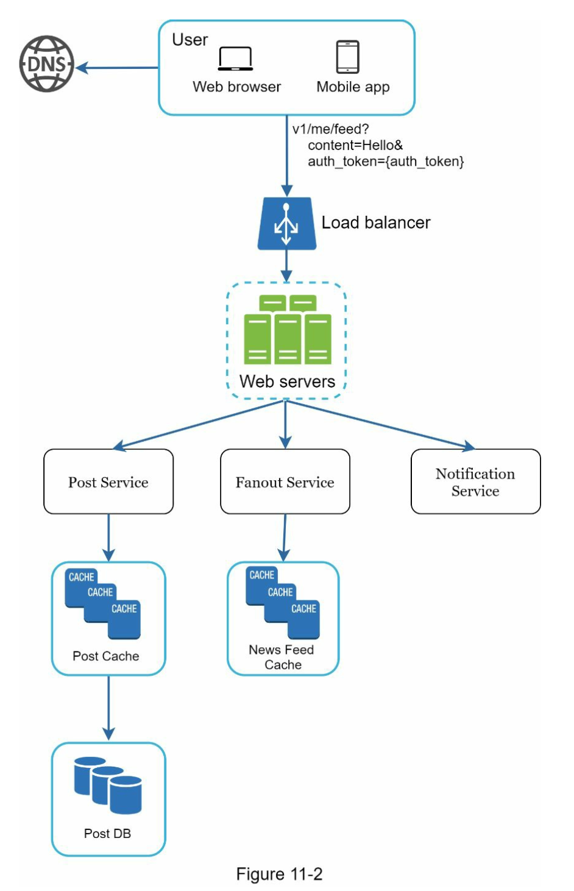
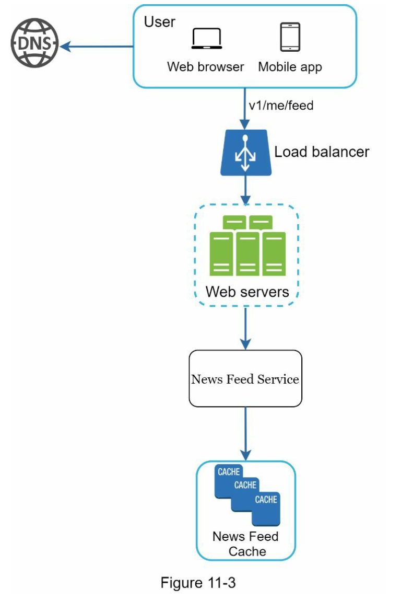
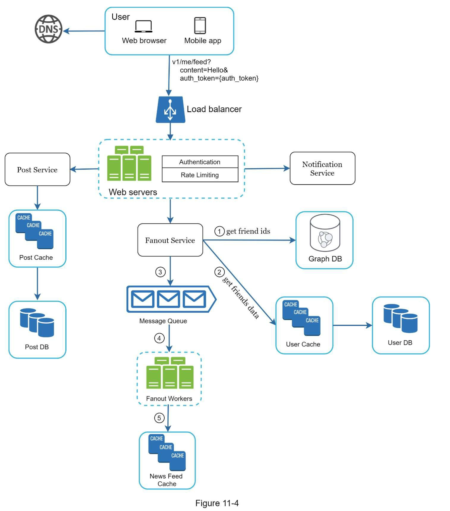
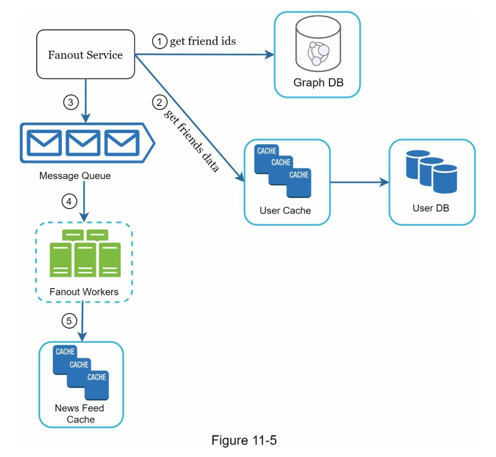
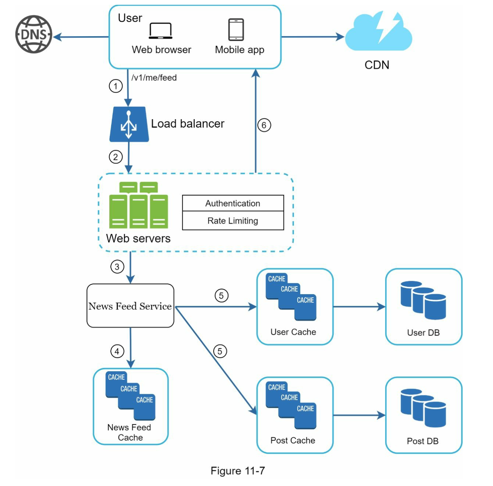
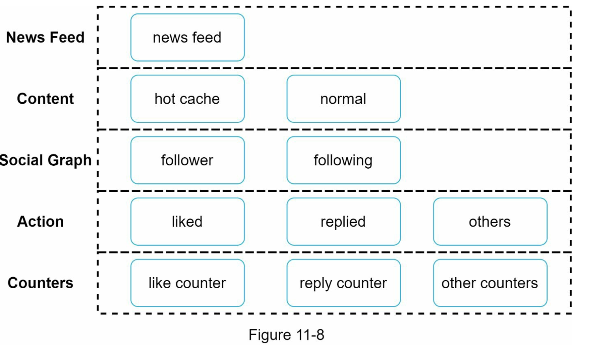

## 1단계) 문제 이해 및 설계 범위 확정
- 모바일/웹 지원
- 중요 기능
	- 뉴스 피드 페이지에 새로운 스토리 추가
	- 친구들이 올리는 스토리를 조회
- 뉴스 피드에 보이는 스토리의 순서: 시간의 역순
- 한 명의 사용자는 최대 5000명의 친구를 가짐
- 매일 천만명이 방문하는 트래픽 규모
- 스토리에 이미지/비디오 포함
## 2단계) 개략적 설계안 제시 및 동의 구하기
### (1) 피드 발행
> 사용자가 스토리를 포스팅하면 해당 데이터를 캐시와 데이터베이스에 기록, 새 포스팅은 친구의 뉴스 피드에 전송됨

- 포스팅 저장 서비스: 새 포스팅을 데이터베이스와 캐시에 저장
- 포스팅 전송 서비스: 새 포스팅을 친구의 뉴스 피드에 푸시
	- 뉴스 피드 데이터는 캐시에 보관하여 빠르게 읽어갈 수 있도록 함
- 알림 서비스: 친구들에게 새 포스팅이 올라왔음을 알리거나, 푸시 알림을 보냄
### (2) 뉴스 피드 생성
> 뉴스 피드는 모든 친구의 포스팅을 시간 흐름 역순으로 모아 생성

- 뉴스 피드 서비스: 캐시에서 뉴스 피드를 가져오는 서비스
- 뉴스 피드 캐시: 뉴스 피드를 렌더링할 때 필요한 피드 ID를 보관
### 뉴스 피드 API
#### 피드 발행 API
- POST
- /v1/me/feed
- Authorization header: API 호출 인증
- body: 포스팅 내용
#### 피드 읽기 API
- GET
- /v1/me/feed
- Authorization header: API 호출 인증용

## 3단계) 상세 설계

- 웹서버: 인증, 처리율 제한 기능 담당
- 포스팅 전송(fanout) 서비스
	- 팬아웃: 어떤 사용자의 새 포스팅을 그 사용자와 친구 관계에 있는 모든 사용자에게 전달하는 과정
		- 쓰기 시점에 팬아웃하는 모델(push)
			- 새로운 포스팅을 기록하는 시점에 뉴스 피드를 갱신
			- 포스팅이 완료되면 바로 해당 사용자의 캐시에 해당 포스팅을 기록
			- 장점: 뉴스 피드가 실시간으로 갱신, 뉴스 피드를 읽는데 시간 단축
			- 단점: 친구가 많은 사용자의 경우 hotkey 문제 발생, 모든 사용자(휴면 유저를 고려하지 않음)를 대상으로 갱신하기 때문에 자원이 낭비됨
		- 읽기 시점에 팬아웃하는 모델(pull)
			- 요청 기반 모델
			- 사용자가 로딩하는 시점에 새로운 포스팅을 가져옴
			- 장점: 컴퓨팅 자원이 낭비되지 않음, hot key 문제도 발생하지 않음
			- 단점: 뉴스 피드를 읽는데 많은 시간 소요
	- 팔로워가 많은 유저라면 pull 모델, 그 외 유저에게는 push 모델 사용하여 시스템 과부하 방지
	- 안정 해시를 통해 요청과 데이터를 고르게 분산하여 hotkey 문제 감소 목표
### 팬아웃 서비스

1. 그래프 데이터베이스에서 친구 ID 목록을 가져옴
2. 사용자 정보 캐시에서 친구들의 정보를 가져옴(mute가 설정됐는지, 일부 사용자에게만 공개됐는지 설정 확인)
3. 친구 목록과 새 스토리의 포스팅 ID를 메시지 큐에 삽입
4. 팬아웃 작업 서버가 메시지 큐에서 데이터를 꺼내 뉴스 피드 데이터(key: 포스팅 ID, value: 사용자 ID)를 뉴스 피드 캐시에 추가
	- 모든 사용자들이 천개 이상의 뉴스 피드를 다 읽는 경우는 지극히 낮을 것임, 즉 최신의 포스팅만 확인하므로 cache miss가 발생할 확률은 낮음
### 뉴스 읽기 흐름 상세 설계

1. 사용자가 뉴스 피드를 읽으려는 요청을 `/v1/me/feed` 로 보냄
2. 로드밸런서가 요청을 웹 서버 가운데 하나로 보냄
3. 웹 서버는 피드를 가져오기 위해 뉴스 피드 서비스를 호출
4. 뉴스 피드 서비스는 뉴스 피드 캐시에서 포스팅 ID 목록을 가져옴
5. 뉴스 피드에 표시할 사용자 이름 등 사용자 캐시와 포스팅 캐시에서 가져와 완전한 뉴스 피드 생성
6. 생성된 뉴스 피드를 JSON 형태로 클라이언트에게 전송 후, 클라이언트는 피드 렌더링
### 캐시 구조

- 뉴스 피드: 뉴스 피드의 ID를 저장
- 콘텐츠: 포스팅 데이터 보관, 인기 컨텐츠는 별도 관리 보관
- 소셜 그래프: 사용자 간 관계 정보 보관
- 행동: 포스팅에 대한 사용자의 행위에 관한 정보 보관(좋아요, 댓글 등)
- 횟수: 좋아요 횟수, 팔로어 수, 팔로잉 수 등 정보 보관

## 4단계) 마무리
### 데이터베이스 규모 확장
- 수직적 vs 수평적
- SQL vs NoSQL
- 주-부 다중화
- 복제본에 대한 읽기 연산
- 일관성 모델
- 데이터베이스 샤딩
- 웹 계층을 무상태로 운영
- 가능한 많은 데이터를 캐싱
- 메시지 큐를 사용해 컴포넌트 사이의 결합도 낮추기
- 메트릭에 대한 모니터링