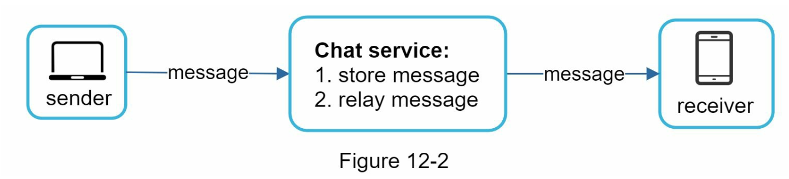
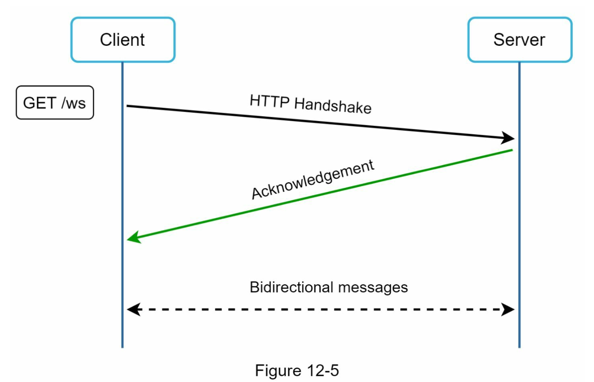
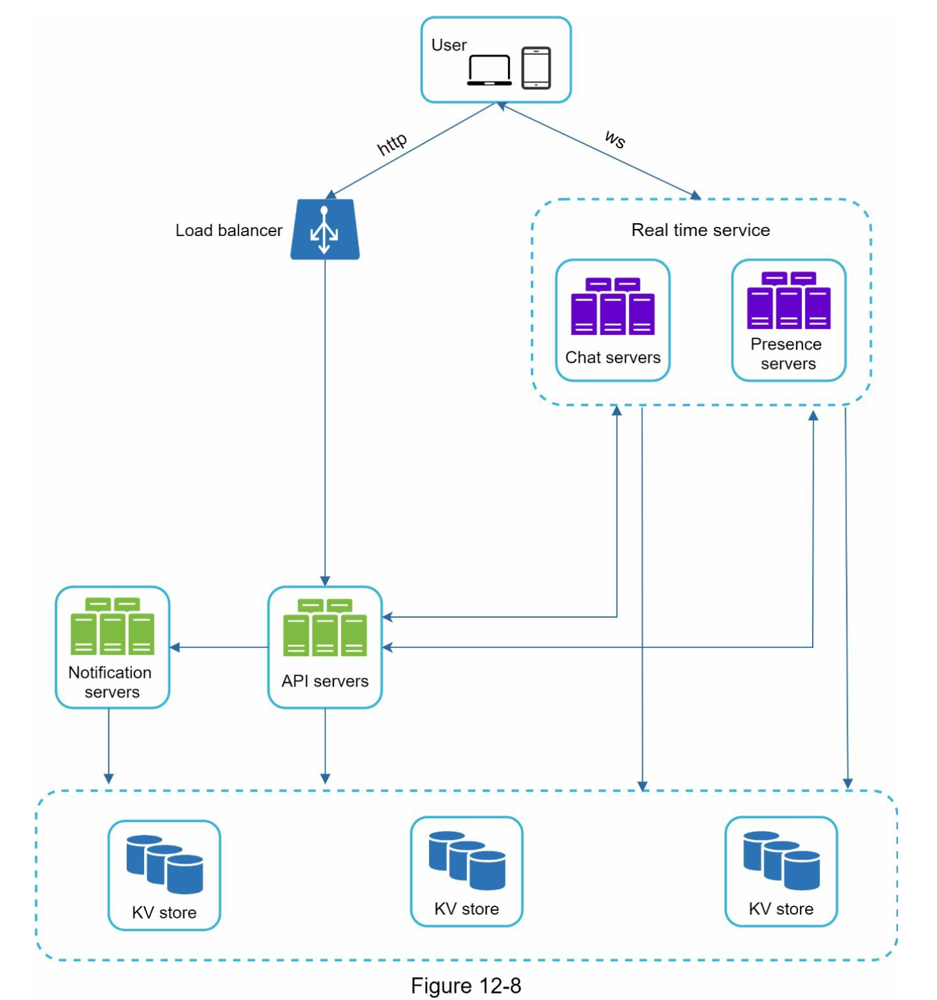
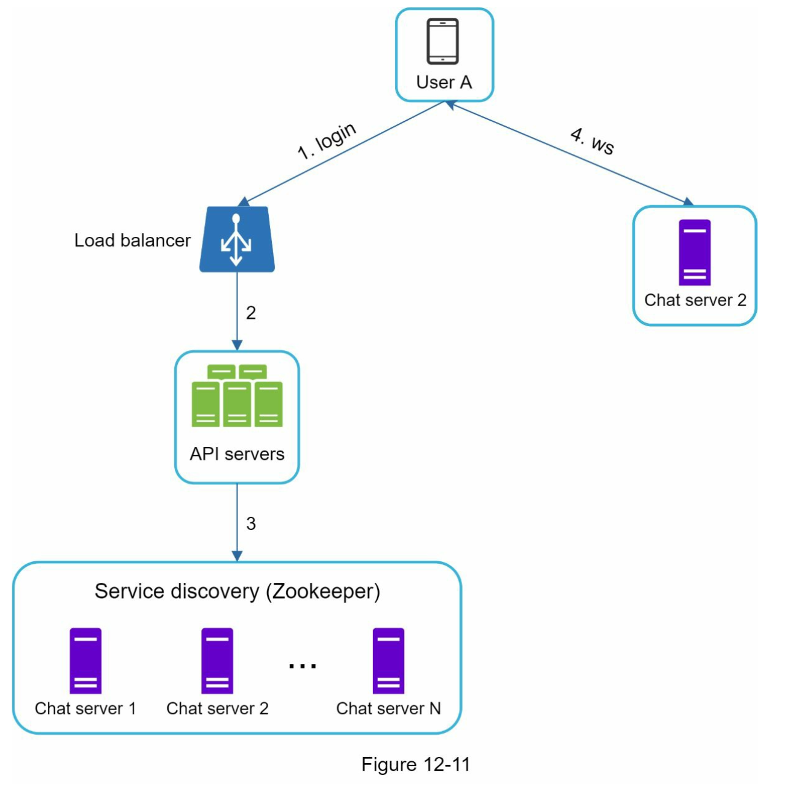
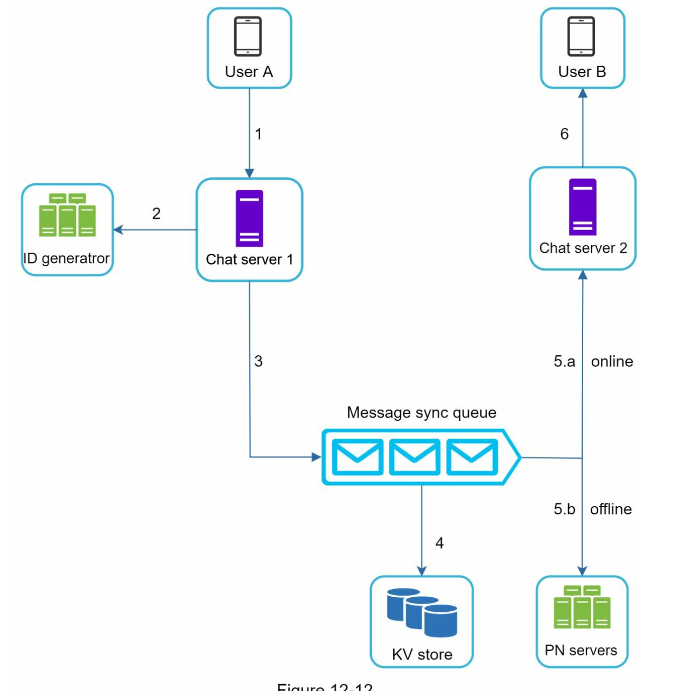
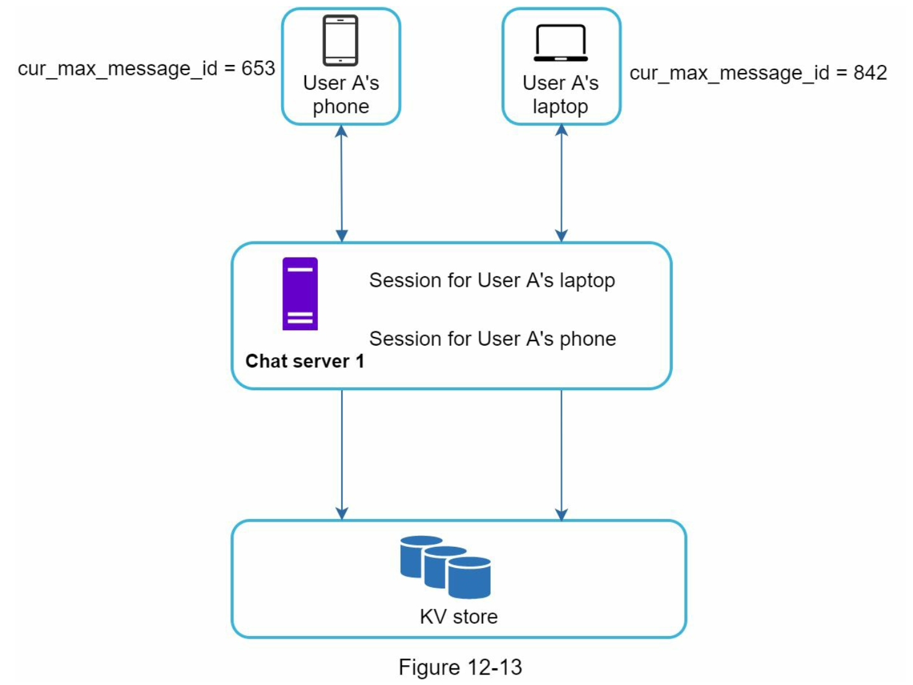
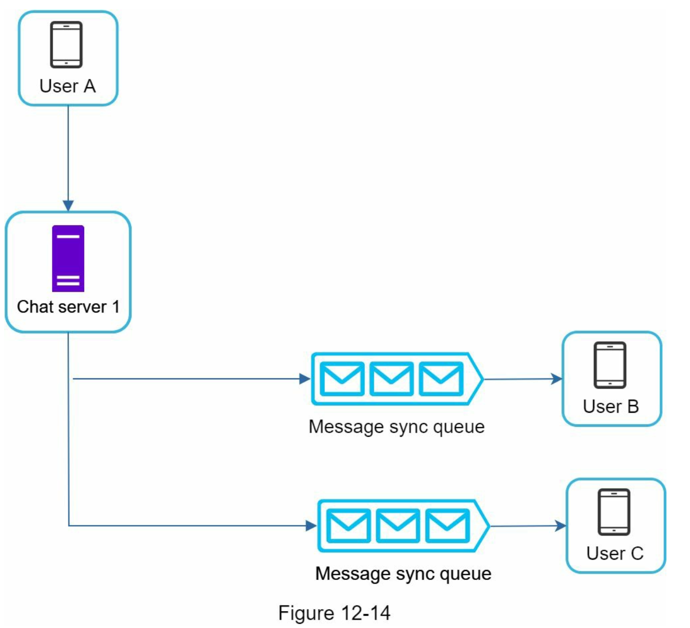
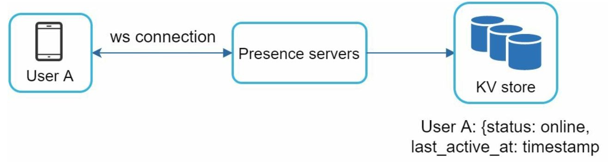
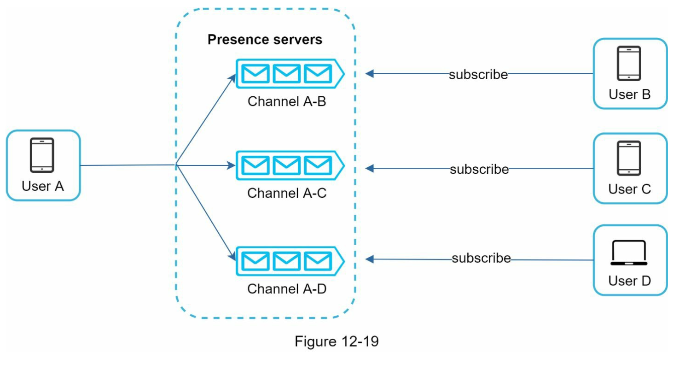

## 1단계) 문제 이해 및 설계 범위 확정
- 1:1 및 그룹 채팅 모바일/웹
- 트래픽 규모: DAU(Daily Active User) 기준 5천만명 처리
- 최대 100명 그룹 채팅 참가 가능
- 중요 기능
	- 1:1 채팅
	- 그룹 채팅
	- 사용자 접속 상태 표시
	- 텍스트 메시지만 주고받기
- 100_000자 메시지 길이 제한
- 종단 간 암호화?
- 채팅 이력은 영구적 보관
- 푸시 알림

## 2단계) 개략적 설계안 제시 및 동의 구하기
채팅 서비스에서 제공해야하는 기본 기능들
1. 클라이언트들로부터 메시지 수신
2. 메시지 수신자 결정 및 전달
3. 수신자가 접속 상태가 아닌 경우, 접속할 때까지 해당 메시지 보관

- 채팅 서비스의 경우 어떤 통신 프로그램을 사용할 것인지 중요
- 메시지 송신 HTTP keep-alive로 불필요한 TCP 3-way handshake 과정을 줄임
- 메시지 수신: polling, long polling, websocket
	- 폴링: 주기적으로 클라이언트가 서버에게 새 메시지가 있는지 확인하는 방법
		- 답해줄 메시지가 없을 때에도 계속 진행하게 되어 리소스 낭비가 심함
	- 롱 폴링: 클라이언트는 새 메시지가 반환되거나 타임아웃 될 때까지 연결 유지, 클라이언트는 새 메시지를 받으면 기존 연결을 종료하고 서버에 새로운 요청을 보내 모든 절차를 다시 시작함
		- 메시지를 보내는 클라이언트와 수신하는 클라이언트가 같은 채팅 서버에 접속하게 되지 않을 수 있음
		- stateless한 HTTP 서버에서 RR 알고리즘을 사용하여 로드밸런싱을 구현한 경우, 메시지를 받은 서버는 해당 메시지를 수신할 클라이언트와의 롱 폴링 연결을 갖고 있지 않은 서버일 수 있음
		- 서버 입장에서는 클라이언트가 연결을 해제했는지 아닌지 알 수 있는 방법이 없음
		- 그래도 폴링이라 비효율적
	- 웹소켓: 서버가 클라이언트에게 비동기 메시지를 보낼때 가장 널리 사용하는 기술
		
	- 한번 맺어진 연결은 persistent하고 양방향
	- 처음에는 HTTP로 연결하지만 핸드셰이크 절차를 거쳐 ws로 변경
	- 연결이 성립되고 나서 클라이언트에게 비동기적으로 메시지 전송 가능
	- 웹소켓을 사용하면 메시지를 송수신할 때 동일한 프로토콜을 사용할 수 있어 설계와 구현도 단순함
	- 서버 측에서 연결 관리를 효율적으로 해야 함 (어떻게..?)
### 개략적 설계안
#### 무상태 서비스
- 로드밸런서 뒤에 위치
- 로드밸런서가 하는 일은 요청을 그 경로에 맞는 서비스로 정확히 전달
- service discovery 서비스: 클라이언트가 접속할 채팅의 서버 DNS 호스트명을 클라이언트에게 알려주는 역할 담당
#### 상태 유지 서비스
- 각 클라이언트가 채팅 서버와 독립적인 네트워크 연결을 유지해야 함
- 클라이언트는 보통, 서버가 살아있는 한 다른 서버의 연결로 변경하지 않음
#### 제 3자 서비스 연동
- 푸시 알림
#### 규모 확장성
- 동접 1M, 접속당 10K의 서버 메모리가 필요하다고 가정 -> 10GB 메모리만 있으면 모든 연결 처리 가능
- BUT, SPOF 문제

- 실시간으로 메시지를 주고받기 위해 클라이언트는 채팅 서버와 웹소켓 연결을 끊지 않고 유지
	- 채팅 서버는 클라이언트 사이에 메시지를 중계
	- 접속상태 서버는 사용자의 접속 여부 관리
	- API 서버는 로그인, 회원가입 등 나머지를 처리
	- 알림서버는 푸시 알림 생성 전달
	- 키-값 저장소는 채팅 이력 보관, 채팅에 접속한 사용자는 이전 채팅 이력을 볼 수 있게됨
#### 저장소
데이터의 유형과 읽기/쓰기 연산의 패턴을 중요하게 따져보자

채팅 시스템이 다루는 데이터
1. 사용자 프로파일, 설정, 친구 목록 등 일반적 데이터 -> 안정성을 보장하는 관계형 디비에 저장
2. 채팅 시스템에 고유한 데이터(채팅 이력) -> ?

채팅 이력의 데이터 양은 엄청 많음. 페이스북 메신저 기준 매일 600억개의 메시지를 처리한다고 함

이 데이터 중, 최근에 주고받은 메시지가 빈번하게 사용됨

하지만, 검색 기능을 이용하거나 특정 사용자가 언급된 메시지를 보거나 특정 메시지로 점프하여 **무작위적인** 데이터에 접근할 때도 있음

1:1 채팅의 경우, 읽기: 쓰기 = 1: 1의 비율을 가짐

이 모든 내용을 지원할 데이터베이스를 고르는 것은 아주 중요한 일로, 본 설계안에 맞는 key-value 저장소를 추천함
- 키-값 저장소는 수평적 규모 확장에 용이
- 키-값 저장소는 데이터 접근 지연시간이 낮음
- 관계형 데이터베이스는 데이터 가운데 long tail 부분을 잘 처리하지 못함, 인덱스가 커지면 데이터에 대한 random access를 처리하는 비용이 증가함

#### 데이터모델
- 1: 1 채팅을 위한 메시지 테이블
	- message_id: PK
	- message_from
	- message_to
	- content
	- created_at: 서로 다른 두 메시지가 동시에 만들어질 수 있어 메시지 sorting에는 좀 어려움
- 그룹 채팅을 위한 메시지 테이블
	- channel_id: PK, 파티션 키(그룹 채팅에 적용될 모든 질의는 특정 채널을 대상으로 할 것)
	- message_id: PK
	- user_id
	- content
	- created_at
- 메시지 ID
	- message_id는 고유해야 함
	- ID 값은 정렬 가능, 시간 순서와 일치(이전 ID < 새로운 ID)
	NoSQL은 auto_increment 기능을 보통 제공해주지 않음
	- snowflake 같은 전역적 64-bit sequence number 생성기를 이용하는 것도 대안
	- 아니면, 지역적 순서 번호 생성기 이용
		- 지역적: ID의 유일성은 같은 그룹안에서만 보증하면 충분함
		- 메시지 사이의 순서는 같은 채널, 같은 채팅 안에서만 유지되면 되니까
		- 그리고 구현도 쉬움
## 3단계) 상세 설계
### 서비스 탐색
- 클라이언트에게 가장 적합한 채팅 서버를 추천하는 것
	- 기준: 클라이언트의 위치, 서버의 용량 등
	- Apache Zookeeper
		- 사용 가능한 모든 채팅 서버를 여기에 등록시켜 두고 클라이언트가 접속을 시도하면 사전에 정한 기준에 따라 최적의 채팅 서버를 골라 줌
		
	1. 사용자 A가 시스템에 로그인 시도
	2. 로드밸런서가 로그인 요청을 API 서버들 가운데 하나로 보냄
	3. API 서버가 사용자 인증을 처리하고 나면 서비스 탐색 기능이 동작하여 해당 사용자를 서비스할 최적의 채팅 서버를 찾음
	4. 사용자는 채팅서버 2와 웹소켓 연결을 맺음
### 메시지 흐름
#### 1:1 채팅 메시지 처리 흐름

1. 사용자 A가 채팅 서버1로 메시지 전송
2. 채팅서버 1은 ID 생성기를 사용해 메시지의 ID 값 결정
3. 채팅 서버 1은 해당 메시지를 메시지 동기화 큐로 전송
4. 메시지가 키-값 저장소에 보관
5. (a) 사용자 B가 접속 중인 경우 메시지는 사용자 B가 접속중인 채팅 서버로 전송됨
   (b) 사용자 B가 접속 중이 아니라면 푸시 알림 메시지를 푸시 알림 서버로 보냄
6. 채팅 서버2는 메시지를 사용자 B에게 전송, 사용자 B와 채팅서버 2 사이에 웹소켓 연결이 있는 상태이므로 그것을 이용
#### 여러 단말 사이의 메시지 동기화

- 사용자 A의 핸드폰과 랩탑의 웹소켓 연결이 별도로 연결되어 있음
- 각 단말은 cur_max_message_id라는 변수를 유지함
	- 해당 단말에서 관측된 가장 최신 메시지의 ID를 추적하는 용도
	- 새 메시지로 간주되는 2 조건
		- 수신자 ID가 현재 로그인한 사용자 ID와 같다
		- 키-값 저장소에 보관된 메시지로 그 ID가 cur_max_message_id보다 크다

#### 소규모 그룹 채팅에서의 메시지 흐름

- 사용자 A가 보낸 메시지가 사용자 B와 C의 메시지 동기화 큐에 복사됨
	- 새로운 메시지가 왔는지 확인하려면 자신의 큐만 확인하면 됨
	- 그룹이 크지않다면 메시지를 수신자별로 복사하여 큐에 넣는 작업의 비용이 문제가 되지 않음

한 수신자는 여러 사용자로부터 오는 메시지를 수신할 수 있어야 함, 따라서 각 사용자의 메시지 동기화 큐는 여러 사용자로부터 오는 메시지를 받을 수 있어야 함

### 접속상태 표시
접속상태 서버는 클라이언트와 웹소켓으로 통신하는 실시간 서비스의 일부.

#### 사용자 로그인

클라이언트와 실시간 서비스 사이에 웹소켓 연결이 맺어지고 나면 접속상태 서버는 A의 상태와 last_active_at 값을 키-값 저장소에 보관한다. 그 후, 사용자는 접속 중인 것으로 표시될 것
#### 로그아웃
키-값 저장소에 보관된 사용자 상태가 online -> offline으로 상태 변경

#### 접속 장애
사용자를 항상 오프라인 상태로 표시하고 연결이 복구되면 온라인 상태로 변경, 짧은 시간동안 인터넷 연결이 끊어졌다 복구되는 일이 흔한데, 이런 일이 벌어질 때마다 사용자의 접속 상태를 변경한다면 바람직하지 않을 것

heartbeat 검사를 통해 이 문제를 해결할 것임
- 온라인 상태의 클라이언트로 하여금 주기적으로 박동 이벤트를 접속상태 서버로 보내고 마지막 이벤트를 받은지 n초 이내에 또 다른 박동 이벤트 메시지를 받으면 해당 사용자의 접속상태를 계속 온라인으로 유지하게 됨
#### 상태 정보의 전송
> 사용자 A와 친구 관계에 있는 사용자들은 어떻게 해당 사용자의 상태 변화를 알까?

- 상태 정보 서버는 pub-sub 모델을 사용
	- 각각의 친구관계마다 채널을 하나씩 둠
		- 예를 들어, 사용자 A의 접속상태가 변경되면 A-B, A-C, A-D 채널에 그 사실을 추가함
		- A-B는 사용자 B가 구독하고, A-C는 사용자 C가 구독하는 것
		- 친구 관계에 있는 사용자가 상태정보 변화를 쉽게 통지 받을 수 있게 됨
		- 클라이언트와 서버 사이의 통신은 실시간 웹소켓 사용
		- 그룹의 크기가 작을때 효과적, 그룹의 크기가 커지면 이 방식은 비용과 시간이 많이 소모됨
			- 100_000의 사용자를 가진 그룹이 있다고 가정, 상태변화 1건당 100_000개의 이벤트 메시지가 발생할 것
				- 해소 방법: 사용자가 그룹 채팅에 입장하는 순간에만 상태 정보를 읽거나 친구 리스트에 있는 사용자의 접속상태를 갱신하고 싶으면 수동으로 하도록 유도할 것
