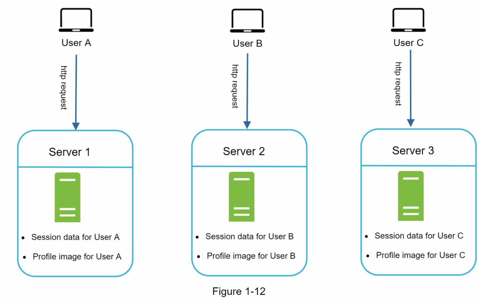
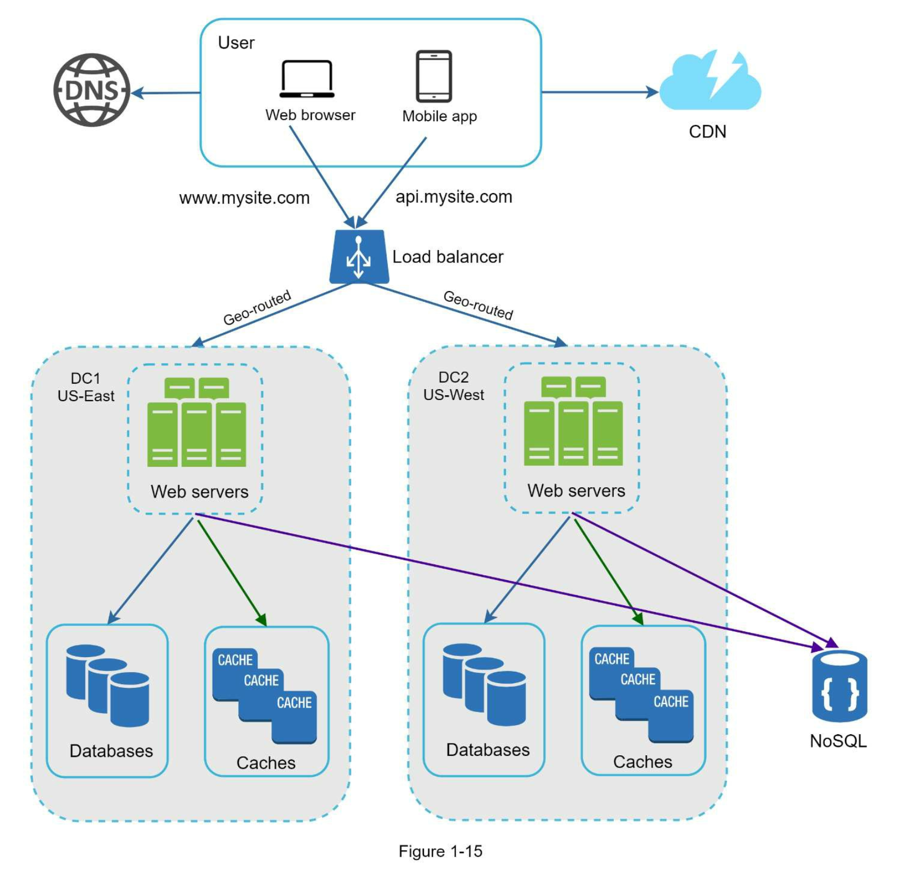

## 1. 사용자 수에 따른 규모 확장성

### 단일 서버
모든 컴포넌트가 단 한대의 서버에서 실행되는 간단한 시스템부터 설계해보자

사용자 요청 처리 흐름
1. 사용자는 도메인(api.mysite.com)을 이용하여 웹사이트에 접속함
2. DNS 에 질의하여 ip 주소로 변환
3. 웹 서버 ip(15.125.23.214) 로 http 요청을 전달
4. 요청을 받은 웹서버는 HTML 페이지나 JSON 형태의 응답을 반환

### 데이터 베이스
사용자가 늘면 서버 하나로 충분하지 않아 서버 여러대를 두어야 함.
웹/모바일 트래픽 처리 서버(웹 계층)와 데이터베이스 서버(데이터 계층)을 분리

#### 어떤 데이터베이스를 사용할 것인가?
관계형 데이터베이스와 비관계형 데이터베이스 사이에서 고를수 있음

- 관계형 데이터베이스
  - Relational Database Management System(RDBMS) 라고 부름
  - MySQL, Oracle, PostgreSQL 등
  - 자료를 테이블과 열, 칼럼으로 표현
  - SQL 을 사용하여 여러 테이블에 있는 데이터를 조인하여 합칠수 있음
- 비관계형 데이터베이스
  - NoSQL 이라고도 부름
  - CouchDB, Neo4j, Cassandra, HBase, Amazon DynamoDB 등
  - NoSQL 의 종료
    - key-value store
    - graph store
    - column store
    - document store
  - 일반적으로 조인 연산은 지원하지 않음

비관계형 데이터가 바람직한 선택일 경우
- 아주 낮은 응답 지연시간(latency) 이 요구
- 다루는 데이터가 비정형(unstructured)이라 관계형 데이터가 아님
- 데이터를(JSON, YAML, XML 등)를 직렬화(serialize) 역직렬화(deserialize) 할수 있기만 하면됨
- 아주 많은 양의 데이터를 저장할 필요가 있음

### 수직적 규모 확장 vs 수평적 규모 확장
수직적 규모 확장(scale up)
- 고사양 자원(cpu, ram 등) 을 추가하는 행위
- 서버로 유입되는 트래픽의 양이 적을때 더 좋은 선택
- 가장 큰 장점은 단순함
- 단점
  - cpu, memory 를 무한대로 증설할 방법이 없어서 확장에 한계가 있음
  - 장애에 대한 자동복구(failover) 방안이나 다중화(redundancy) 방안을 제시하지 않음
  - 서버에 장애가 발생하면 웹/앱은 완전히 중단
- 이러한 단점으로 대규모 애플리케이션을 지원하는 데는 수평적 규모 확장이 보다 적절함

수평적 규모 확장(scale out)
- 더 많은 서버를 추가하여 성능을 개선하는 행위

### 로드밸런서
- 웹서버가 다운되면 사용자는 접속할수 없음
- 너무 많은 사용자가 접속하여 웹서버가 한계 상황에 도달하게 되면 응답속도가 느려지거나 서버 접속이 불가능해질수 있음
- 이러한 문제를 해결하기 위해 로드밸런서를 도입하는 것이 최선

처리 방법
1. 사용자는 로드밸런서의 public ip 로 접속함, 웹서버는 클라이언트의 접속을 직접처리하지 않음
2. 더나은 보안을 위해 로드밸런서와 웹서버간 통신에는 private ip 를 사용
3. 웹서버를 추가하면 장애를 자동복구하지 못하는 문제(no failover) 는 해소되며, 웹 계층의 가용성은 향상됨
4. server1 이 다운되면 요청은 server2 로 전송되어, 웹서버 전체가 다운되는 일이 방지됨
5. 두대의 서버로 트래픽을 감당할수 없는 시점이 오면, 웹 서버 계층에 더 많은 서버를 추가하기만 하면 로드밸런서가 트래픽을 분산해줌

### 데이터베이스 다중화

master - slave 구조 
- 데이터 원본은 master 에 데이터 사본은 slave 에 저장하는 방식
- 쓰기(write) 연산은 master 에서만 지원
  - insert, update, delete
- slave 는 master 로부터 사본을 전달 받으며, 읽기(read) 연산만 지원
- 대부분 쓰기 연산보다 읽기 연산의 비중이 훨씬 높기 때문에, slave 수가 master 보다 많다

master - slave 장점
- 더 나은 성능
  - 데이터 변경 연산은 master, 읽기 연산은 slave 로 분산되어 병렬로 처리될수 있는 query 가 늘어나므로 성능이 좋아짐
- 안정성(reliability)
  - 데이터서버 가운데 일부가 파괴되어도 데이터가 보존됨
  - 데이터를 지역적으로 떨어진 여러 장소에 다중화 시켜둘수 있기 때문
- 가용성(availability)
  - 데이터를 여러 지역에 복사해둠으로써, 하나의 데이터베이스 서버에 장애가 발생하더라도 계속 서비스할수 있음

master - slave 단점은 없나?
- 복제 지연을 주의해야함
- 서버 로직 구현시 개발 난이도가 꽤 많이 올라감

slave 서버가 한대뿐인데 다운된 경우라면?
- 읽기 연산이 모두 master 서버로 전달됨
  - master 로 요청이 전달되서 복구가 된다는건 slave 가 필요가 없는 상황으로 보임
  - 이건 master 로 요청이 몰리면 바로 전체 장애남

master 서버가 한대인데 다운되는 경우라면?
- slave 가 새로운 master 서버가 됨
  - 절대로 이렇게 되면 안됨
- master 를 mmm(Multi-Master Replication Manager) 구조로 설정해야함

처리 과정
- 사용자는 DNS 로부터 로드밸런서의 공개 IP 주소를 받음
- 사용자는 해당 IP 주소를 사용해 로드밸런서에 접속
- HTTP 요청은 서버 1이나 2로 전달
- 웹 서버는 사용자의 데이터를 slave 에서 읽음
- 웹 서버는 데이터 변경 연산은 master 로 전달
  - 데이터 추가, 삭제, 갱신 연상 등이 이에 해당됨

응답시간(latency) 개선
- 캐시를 붙이고, 정적 콘텐츠를 컨텐츠 전송 네트워크(Content Delivery Network, CDN) 으로 옮기면 개선할 수 있음

### 캐시(cache)
값비싼 연산 결과 또는 자주 참조되는 데이터를 메모리 안에 두고, 뒤이은 요청이 보다 빨리 처리될수 있도록 하는 저장소

#### 캐시 계층(cache tier)
- 데이터가 잠시 보관되는 곳으로 데이터베이스보다 훨씬 빠름
- 캐시 계층을 두면, 성능이 개선될 뿐만아니라 데이터베이스의 부하를 줄일수 있음
- 캐시 계층의 규모를 독립적으로 확장시키는 것도 가능함

- 주도형 캐시 전략(read-through caching strategy)
- 다른 전략은 \[6]\ 에서 확인하라는데, 6장을 말하는것인지?

#### 캐시 사용 시 유의할 점
캐시는 어떤 상황에 바람직한가 ?
- 데이터 갱신은 자주 일어나지 않지만, 참조는 빈번하게 일어난다면 고려해볼만 함

어떤 데이터를 캐시에 두어야 하는가 ?
- 캐시는 데이터를 휘발성 메모리에 두므로, 영속적으로 보관할 데이터를 캐시에 두는것은 좋지 않음

캐시에 보관한 데이터는 어떻게 만료(expire)되는가?
- 만료된 데이터는 캐시에서 삭제되어야함
- 만료 정책이 없으면 데이터는 캐시에 계속 남게됨
- 만료 기한이 너무 짧으면 데이터베이스를 너무 자주 읽게됨
- 너무 길어도, 원본과 차이가 날 가능성이 높아짐
  - 원본 데이터가 변경되면 캐시도 expire 되어야 함

일관선(consistency)은 어떻게 유지되는가?
- 저장소의 원본을 갱신하는 연산과 캐시를 갱신하는 연산이 단일 트랜잭션으로 처리되지 않는 경우, 일관성이 깨질수 있음
- 페이스북에 scaling mamcache at facebook 을 참고

장애에는 어떻게 대처할 것인가 ?
- 캐시 서버를 한대만 두는 경우 해당 서버는 단일 장애 지점이 될 가능성이 있음
  - 단일 장애 지점(single point of failure, SPOF)이란?
    - 어떤 특정 지점에서의 장애가 전체 시스템의 동작을 중단시켜버릴 수 있는 것을 말함
- 여러 지역에 캐시 서버를 분산 시켜야 함

캐시 메모리는 얼마나 크게 잡을 것인가?
- 캐시 메모리가 너무 작으면 엑세스 패턴에 따라 너무 자주 eviction 되면 캐시의 성능이 떨어지게 됨
- 캐시 메모리를 과할당(overprovision) 하면, 문제를 방지할수 있음

데이터 방출(eviction) 정책은 무엇인가?
- 캐시가 꽉 차버리면 추가로 캐시에 데이터를 넣어야할 경우 기존 데이터를 내보내야 함
- 캐시 정책
  - LRU(Least Recently Used)
    - 마지막으로 사용된 시점이 가장 오래된 데이터를 내보내는 정책
  - LFU(Least Frequently Used)
    - 사용된 빈도가 가장 낮은 데이터를 내보내는 정책
  - FIFO(First In First Out)
    - 가장 먼저 캐시에 들어돈 데이터를 가장 먼저 내보내는 정책

### 콘텐츠 전송 네트워크(CDN)
CDN 이란?
- 정적 콘텐치를 전송하는데 쓰이는 분산된 서버의 네트워크
- 이미지, 비디오, CSS, Javascript 파일 등을 캐시할 수 있음
- 동적 콘텐츠 캐시는 이책에서 다루지 않음

CDN 동작

#### CDN 사용시 고려해야할 사항
- 비용
  - CDN 으로 들어가고 나가는 데이터 전송 양레 따라 요금을 내게됨
  - 자주 사용되지 않는 콘텐츠를 캐싱하는 것은 이득이 크지 않으므로, 빼는 것을 고려하자
- 적절한 만료 시한 설정
  - 시의성이 중요한(time-sensitive) 콘텐츠의 경우 만료 시점을 잘 정해야 함
  - 너무 짧으면 원본 서버에 빈번히 접속하게 되어 좋지 않음
- CDN 장애에 대한 대처 방안
  - 문제를 감지하여 원본 서버로부터 직접 콘텐츠를 가져오도록 클라이언트를 구성하는 것이 필요할수도 있음
- 콘텐츠 무효화(invalidation) 방법
  - API 를 이용하여 콘텐츠 무효화
  - Object versioning 을 이용
    - ex> image.png?v=2

CND 과 캐시가 추가된 설계

### 무상태(stateless) 웹 계층
무상태 웹 계층이란?
- 상태 정보를 데이터베이스나 NoSQL 같은 지속성 자정소에 보관하고, 필요할 때 가져오도록 하는 것
- 웹 계층을 수평적으로 확장하는 방법
  - 사용자 세션 데이터와 같은 상태 정보를 웹 계층에서 제거하여야 함

#### 상태 정보 의존적인 아키텍처
문제점
- 클라이언트로부터의 요청이 항상 같은 서버로 전송 되어야하고
- 이러한 기능을 로드밸런서의 고정 셰션(sticky session)이라는 기능으로 제공하고 있음
- sticky session 은 로드밸런서에 부담을 줌
- 또한 로드밸런서 뒷단에 서버 서버를 추가하거나 제거하기도 까다로와짐

#### 무상태 아키텍처
- 웹 서버는 상태 정보가 필요할 경우 공유 저장소(shared storage)로부터 데이터를 가져옴
- 상태 정보가 웹 서버로부터 물리적으로 분리되어 있어, 규모 확장이 쉬움

무상태 웹 계층을 갖도록 설계를 변경한 결과

### 데이터 센터
- 지리적 라우팅(geoDNS-routing 또는 geo-routing)으로 두 개의 데이터 센터를 이용하는 사례
- 다중 데이터센터 아키텍처를 만들려면 몇가지 기술적 난재를 해결해야함
  - 트래픽 우회
    - GeoDNS 는 사용자에게 가장 가까운 데이터센터로 트래픽을 보낼수 있도록 함
  - 데이터 동기화
    - 여러 데이터 센터에 걸쳐 데이터를 다중화 해야함
  - 테스트와 배포
    - 여러 위치에서 테스트 해보는것이 중요(권한 설정 이슈같은게 있을수 있음)
    - 자동화된 배포도구로 모든 데이터 센터에 동일한 서비스가 설치되도록 하는게 중요

### 메세지 큐
메세지 큐란?
- 메세지의 무손실(durability)를 보장하는 비동기 통신을 지원하는 컴포넌트
- 메세지의 버퍼 역할을 함
- 비동기로 전송함

메세지 큐의 장점
- 서비스 또는 서버간 결합이 느슨해짐
- 규모 확정성이 보장되어야 하는 애플리케이션을 구성하기 좋음

메세지 큐 사용 예
- 이미지의 크로핑(cropping), 샤프닝(sharpening), 블러링(blurring) 등을 지원하는 사진 보정 애플리케이션을 만든다고 가정해 보자
- 보정 시간이 오래 걸릴수 있는 프로세스이므로 비동기적으로 처리하면 편함

### 로그, 메트릭 그리고 자동화
- 소규모 웹 사이트를 만들때 필요 없다?
  - 그렇지 않다고 생각함

로그
- 시스템의 오류와 문제들을 보다 쉽게 찾아낼수 있도록 하기 때문에, 에러 로그 모니터링은 중요함
- 로그를 단일 서비스로 모아주는 도구를 활용

메트릭
- 호스트 단위 메트릭
  - CPU, 메모리, 디스크 I/O
- 종합 메트릭
  - 데이터베이스 계층의 성능, 캐시 계층의 성능
- 핵심 비지니스 메트릭
  - 일별 능동 사용자, 수익, 재방문 등

자동화
- 생산성을 높이기 위해 자동화 도구를 활용
  - 지속적 통합(continuous integration)을 사용하여 빌드 테스트 배포등의 절차를 자동화할 수 있어서 개발 생산성을 크게 향상시킬 수 있음

#### 메세지 큐, 로그, 메트릭, 자동화 등을 반영하여 수정한 설계안

### 데이터베이스의 규모 확장
#### 수직적 확장
- CPU, RAM, 디스크 등을 증설하는 방법

단점
- 데이터베이스 서버 하드웨어에는 한계가 있으므로 CPU, RAM 등을 무한 증설할수 없음
- SPOF(Single Point of Failure) 로 인한 위험성이 큼
- 비용이 많이 듬, 고성능 서버로 갈수록 가격이 올라감

#### 수평적 확장
- 샤딩(sharding)이라고도 부름
- 더 많은 서버를 추가함으로써 성능을 향상 시킬수 있도록 함

샤딩
- 대규모 데이터베이스를 샤드(shard)라고 부르는 작은 단위로 분할
- 모든 샤드는 같은 스키마를 쓰지만, 샤드에 보관되는 데이터 사이에는 중복이 없음

샤딩 전략을 구현할 때 고려해야할 사항
- 샤딩키(sharding key)를 어떻게 정하느냐 하는것이 가장 중요
  - 샤당키는 파티션(partition key)라고도 부름
  - 데이터가 어떻게 분산될지 정하는 하나 이상의 컬럼으로 구성
  - 위 그림에 샤딩키는 user_id 임
  - 샤딩키를 정할때 데이터를 고르게 분할할수 있도록 하는게 가장 중요

샤딩의 문제점
- 데이터의 재 샤딩
  - 데이터가 너무 많아져서 하나의 샤드로 더이상 감당하기 어려울때
  - 샤드간 데이터 분포가 균등하지 못하여 샤드에 할당된 공간 소모가 다른 샤드에 비해 빨리 진행될때, 샤드 소진(shard exhaustion)이라고도 부름
  - 샤드키를 계산하는 함수를 변경하고 데이터를 재배치하여야 함
  - 5장 안정해시(consistent hashing) 기법을 활용
- 유명인사(celebrity)
  - 핫스팟키(hotspot key) 문제라고도 부름
  - 특정 샤드에 질의가 집중되어 서버에 과부하가 걸리는 문제
    - ex> 저스틴비버, 레이디가가 같은 유명인사가 전부 같은 샤드에 들어가는 경우
- 조인과 비정규화(join and de-normallization)
  - 데이터베이스를 여러 샤드 서버로 쪼개고 나면, 여러 샤드에 걸친 데이터 베이스를 조인하기가 힘듬
  - 데이터베이스를 비정규화하여 하나의 테이블에서 질의가 수행될수 있도록 하는 것

### 백만 사용자, 그리고 그 이상

- 웹 계층은 무상태 계층으로
- 모든 계층에 다중화 도입
- 가능한 한 많은 데이터를 캐시할것
  - 캐시가 만능이 아니기도 하고, 개발 난이도가 올라감
- 여러 데이터 센터를 지원할 것
  - 비용 이슈 감당가능할지?
- 정적 콘텐츠는 CDN을 통해 서비스할 것
- 데이터 계층은 샤딩을 통해 그 규모를 확장할 것
  - 샤딩은 개발 난이도가 꽤 올라가기 때문에 많은 고민이 필요하다고 봄
- 각 계층은 독립적 서비스로 분할할 것
- 시스템을 지속적으로 모니터링하고, 자동화 도구들을 활용할것

