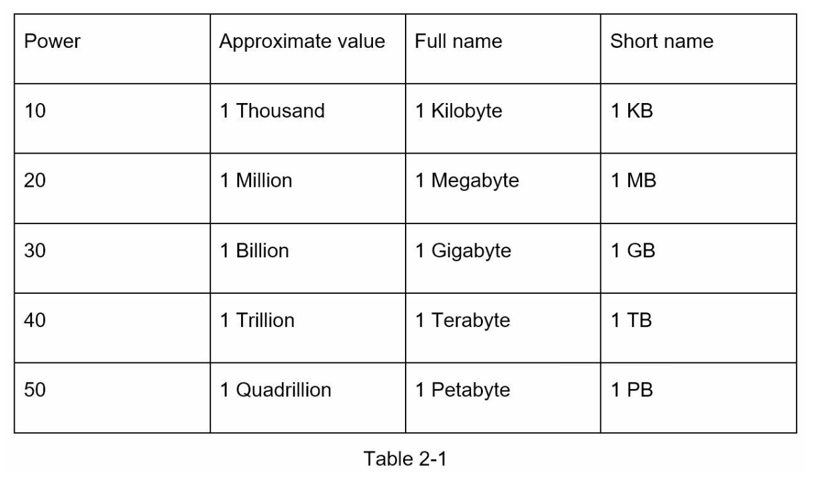
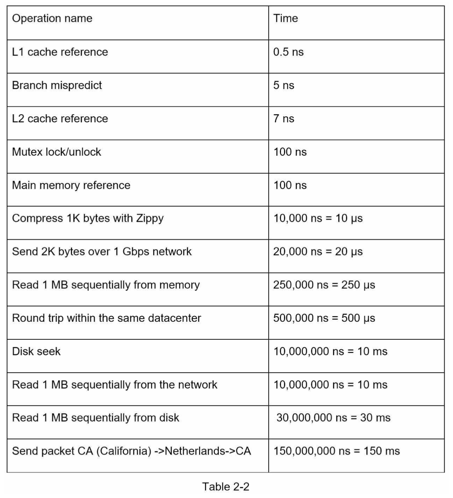
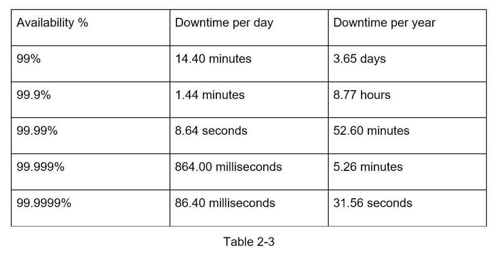

# 2. 개략적인 규모 추정

## 2의 제곱수

## 모든 프로그래머가 알아야 하는 응답지연 값
- 컴퓨터 연산 처리 속도가 어느정도 인지 짐작하는 용도로 보면 됨

수치 분석
- 메모리는 빠르지만 디스크는 아직도 느리다
- 디스크 탐색(seek)은 가능한 한 피하라
- 단순한 압축 알고리즘은 빠르다
- 데이터를 인터넷으로 전송하기 전에 가능하면 압축하라
- 데이터 센터는 보통 여러 지역(region) 에 분산되어 있고, 센터들 간에 데이터를 주고받는 데는 시간이 걸린다

## 가용성에 관계된 수치들
- 고가용성(high availability)은 시스템이 오랜 시간동안 지속적으로 중단 없이 운영될 수 있는 능력을 지칭하는 용어
- 100% 는 시스템이 단 한번도 중단된적이 없었음을 의미
- 아마존, 구글, 마이크로소프트 같은 사업자는 99% 이상을 제공

## 예제: 트위터 QPS 와 저장소 요구량 추정

가정
- 월간 능동 사용자 3억명
- 50%의 사용자가 트위터를 매일 사용
- 평균적으로 각 사용자는 매일 2건의 트윗을 올림
- 미디어를 포함하는 트윗은 10% 정도
- 데이터는 5년간 보관

추정
- QPS(Query Per Second) 추정치
  - 일간 능동 사용자
    - 3억 * 50% = 1.5억
  - QPS
    - 1.5억 * 2 트윗 / 24시간 / 3600초 = 약 3500
  - 최대 QPS(peek QPS)
    - 2 * QPS = 약 7000
- 미디어 자장을 위한 저장소 요구량
  - 평균 트윗 크기
    - tweet_id 에 64 바이트
    - 텍스트에 140 바이트
    - 미디어에 1MB
  - 미디어 저장소 요구량
    - 1.5억 * 2 트윗 * 10% * 1MB = 30TB / 일
  - 5년간 미디어를 보관하기 위한 저장소 요구량
    - 30TB * 365 * 5 = 약 55PB
