# 4. 처리율 제한 장치의 설계

처리율 제한 장치(rate lilmiter)
- 트래픽의 처리율(rate)을 제어하기 위한 장치
- ex>
  - 사용자는 초당 2회 이상 새 글을 올릴 수 없다
  - 같은 IP 주소로 하루에 10개 이상 계정을 생성할 수 없다

처리율 제한 장치의 좋은점
- DoS(Denial of Service) 공격 에 의한 자원 고갈resource starvation) 을 방지
- 자원 절감
- 서버 과부하 방지

## 4-1. 처리율 제한 장치 요구 사항
- 설정된 처리율을 초과하는 요청은 정확하게 제한
- 낮은 응답시간s
- 가능한한 적은 메모리
- 분산형 처리율 제한(distributed rate limiting)
  - 하나의 처리율 제한 장치를 여러 서버에서 공유할수 있어야함
- 예외 처리
  - 요청이 제한된 사유를 사용자에게 보여주어야 함
- 높은 결함 감내성(fault tolerance)
  - 제한 장치가 장애가 생기더라도 시스템에 영향을 주어선 안됨

## 4-2. 개략적 설계

### 처리율 제한 장치를 어디에 둘것인가?
- 처리율 제한 미들웨어를 만듬
- 보통 api gateway 라 불리는 컴포넌트에 구현
  - 처리율 제한
  - ssl 종단(termination)
  - 사용자 인증(authentication)
  - ip 허용 목록(whitelist)

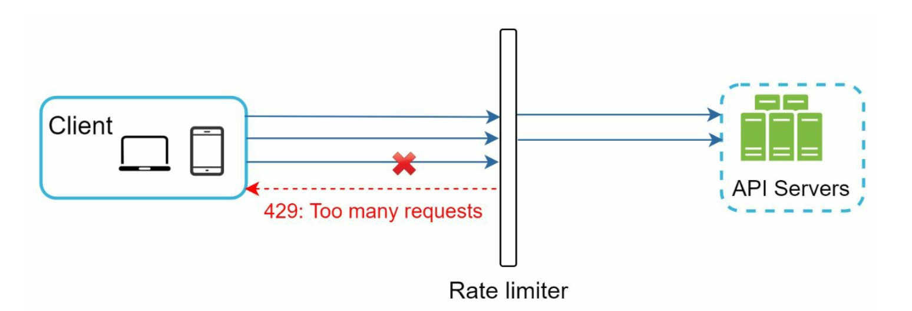

### 처리율 제한 알고리즘
#### 토큰 버킷(token bucket)
- 알고리즘
  - 지정된 용량을 갖는 컨테이너로 주기적으로 토큰이 채워지며, 요청이 처리될때마다 토큰이 사용됨
  - 처리율 제한에 폭 넓게 이용
- 인터넷 기업들이 보편적으로 사용(아마존, 스트라이프)
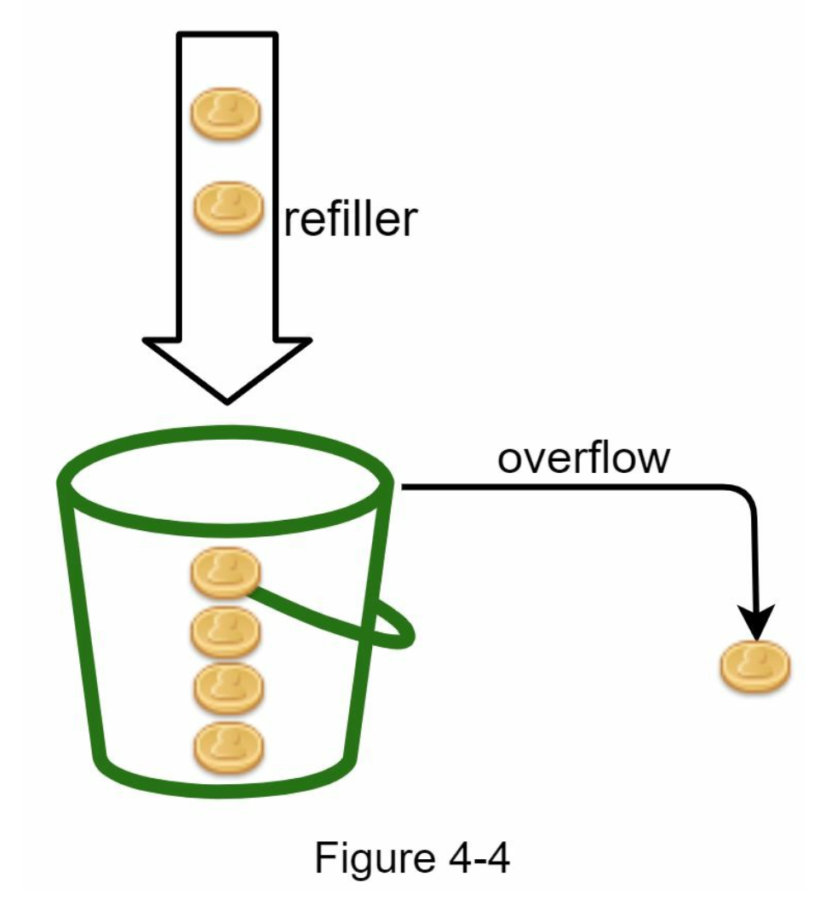
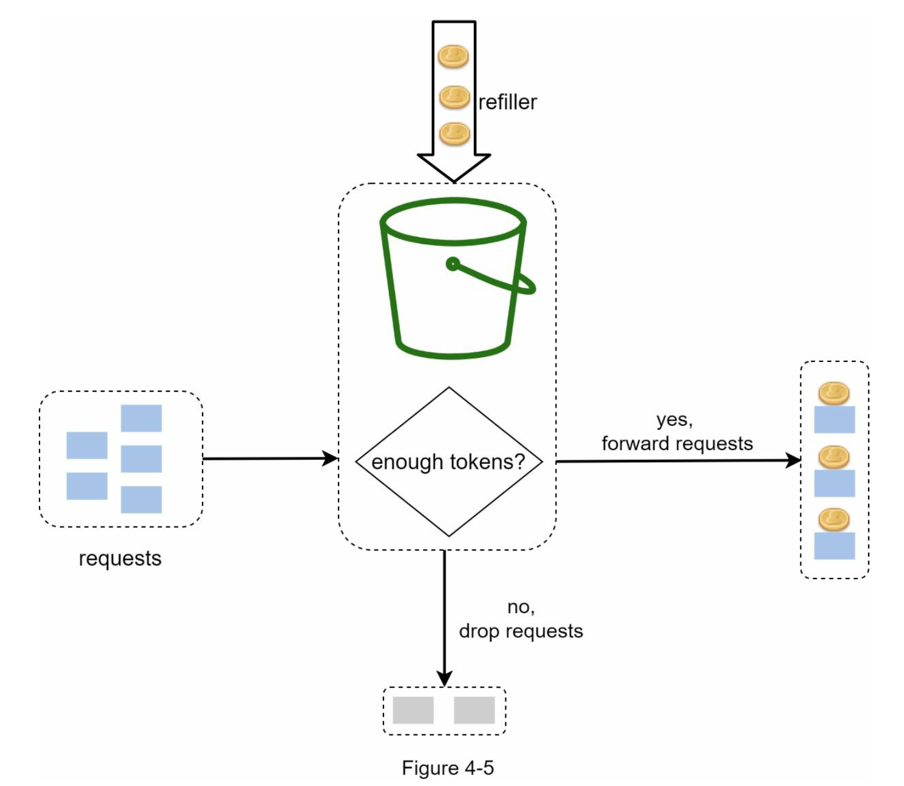
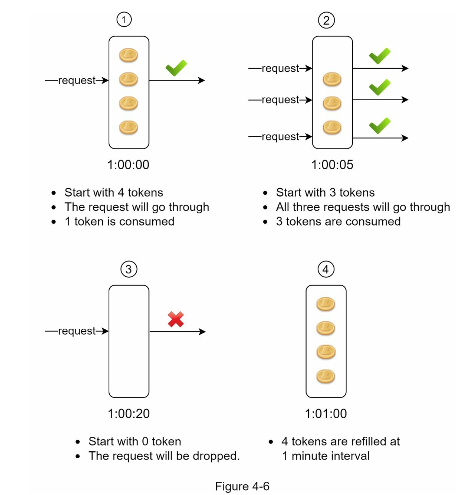

#### 누출 버킷(leaky bucket)
- 알고리즘
  - 요청 처리율이 고정되어 있고 FIFO(First-In-First-Out) 큐로 구현
  - 요청이 도착하면 큐에 요청을 추가
  - 큐가 가득차 있는 경우 새 요청을 버림
  - 지정된 시간마다 큐에서 요청을 꺼내어 처리

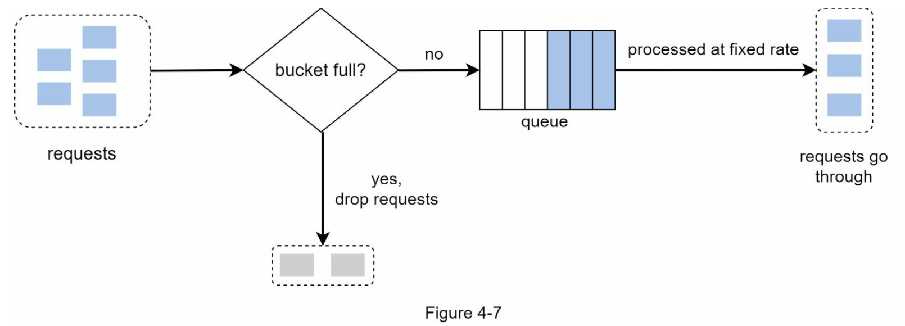

#### 고정 윈도 카운터(fixed window counter)
- 알고리즘
  - 타임라인(timeline)을 고정된 간격의 윈도(window) 로 나누고, 각 윈도마다 couter 를 붙임
  - 요청이 접수될때마다 카운터 값이 1씩 증가
  - 카운터 값이 임계치(threshold)에 도달하면 새로운 요청을 버림
- 윈도가 닫히는 시점에 카운터를 초기화하는 방식
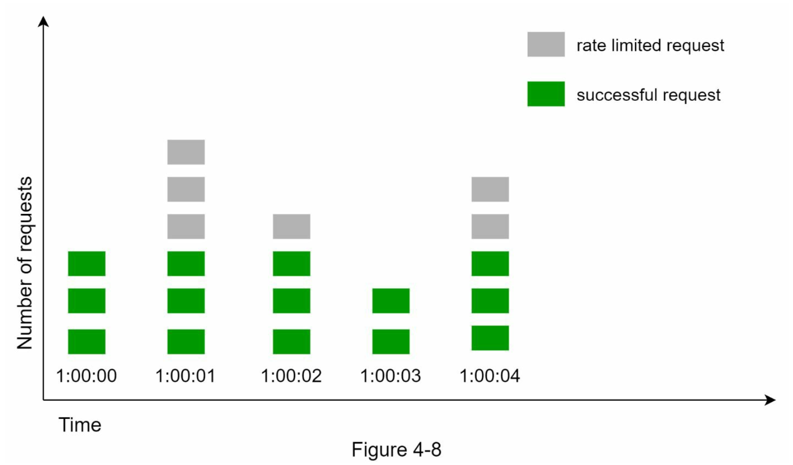

- 윈도 경계 부근에 순간적으로 많은 트래픽이 처리될수 있음
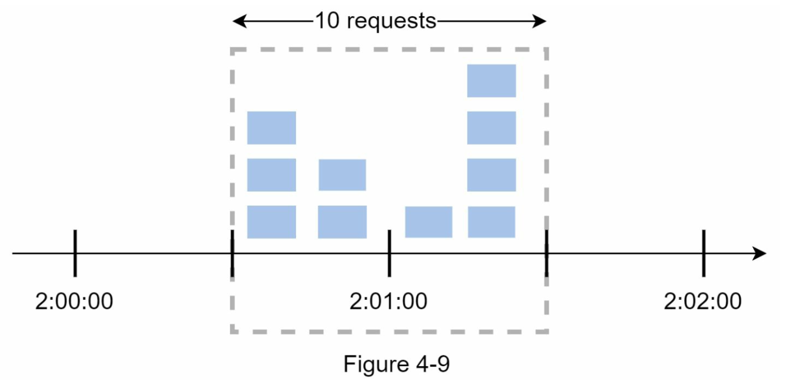

#### 이동 윈도 로그(sliding window log)
- 고정 윈도 카운터 문제를 해결한 알고리즘
- 알고리즘
  - 요청의 timestamp를 redis - sorted set 에 보관
  - 새 요청이 오면 만료된 timestamp 를 제거(현재 윈도의 시작 시간보다 오래된 timestamp)
  - 요청의 timestamp를 log 에 추가
  - 요청의 허용치보다 클때 요청을 버림
- 예제
  - window 는 1분, 최대 2회의 요청을 처리
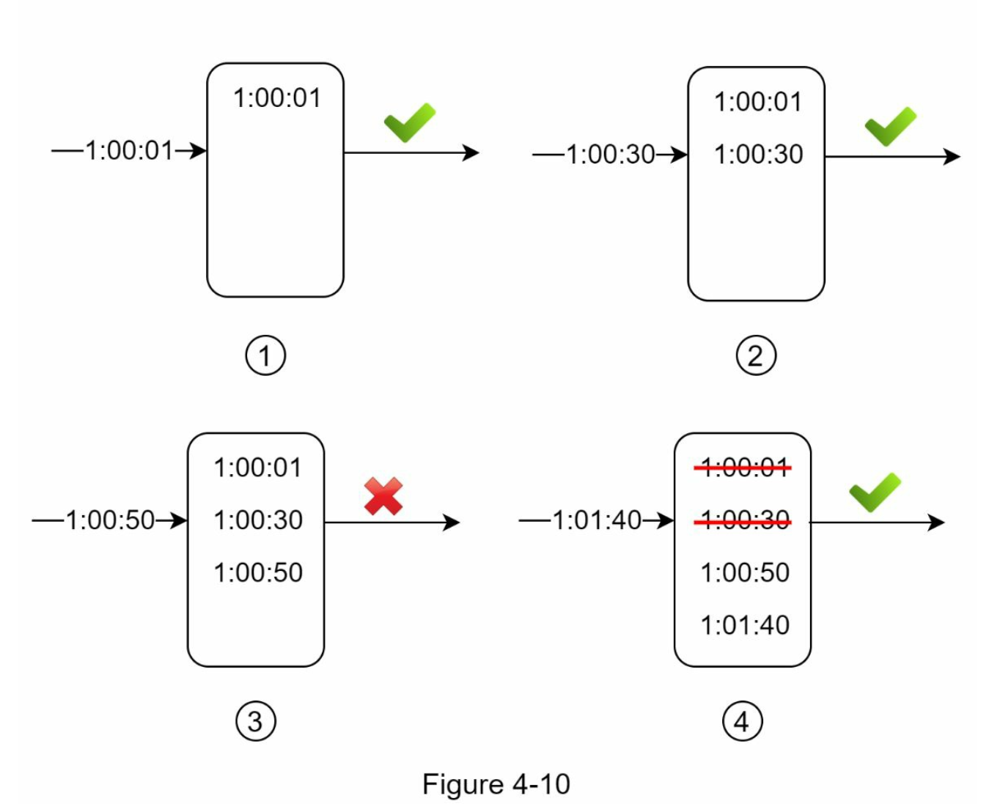

- `1:00:01` - `0:59:01 ~ 1:00:01` window 에 로그가 없기 때문에 처리됨
- `1:00:30` - `0:59:30 ~ 1:00:30` window 에 2개 이내이기 때문에 처리됨 
- `1:00:50` - `0:59:50 ~ 1:00:50` window 에 `1:00:01, 1:00:30` 두개가 있기 때문에 3개가 되어 처리되지 않음
- `1:01:40` - `1:00:40 ~ 1:01:40` window 에 `1:00:50` 하나 있기 때문에 처리되며, window 이전 값 `1:00:01, 1:00:30` 은 삭제

#### 이동 윈도 카운터(sliding window counter)
- 고정 윈도 카운터와 이동 윈도 로그를 결합
- 이전 시간대의 평균 처리율에 따라 현재 윈도의 상태를 계산함
- 알고리즘
- 예제
  - 한도를 분당 7개 요청으로 설정, 이전 1분동안 5개 요청, 현재 1분동안 3개의 요청이 왔다고 가정

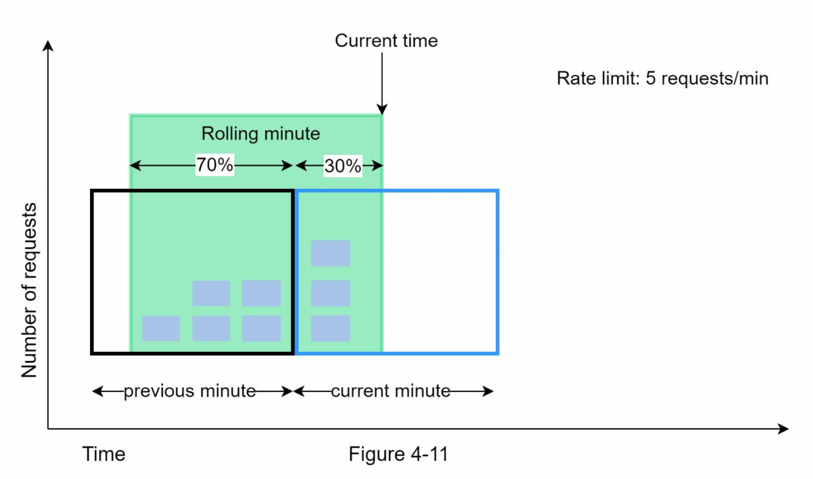

- 현재 1분의 30% 시점에 도착한 요청은 현재 window에 몇개의 요청이 온것으로 보고 처리해야 할까?
  - 현재 1분 간의 요청수 + 직전 1분간의 요청수 * 이동 윈도와 직전 1분이 겹치는 비율
  - 3 + 5 * 70% = 6.5 개로 내림하여 요청수는 6 이 되어 처리됨
- 6 이후 바로 다음 요청은 7이 되어 거부됨

알고리즘 | 장점 | 단점
--- | --- | ---
토큰 버킷(token bucket) | * 구현이 쉽다  * 메모리 효율이 좋음  * 짧은시간 집중되는 트래픽(burst of traffic)도 처리 가능 | * 버킷 크기와 토큰 공급을 적절하게 튜닝하는것이 어려움
누출 버킷(leaky bucket) | * 메모리 효율이 좋음(FIFO 큐 - size 고정)  * 고정된 처리율로 안정적 출력(stable outflow rate)이 필요할때 적합 | * 큐가 다 차면 최신 요청이 버려짐  * 적절하게 튜닝하는 것이 어려움
고정 윈도 카운터(fixed window counter) | * 구현이 쉬움  * 메모리 효율이 좋음  * 특정한 트래픽 패턴을 처리하기 적합 | * 일시적으로 많은 트래픽이 몰릴 경우, 기대했던 시스템의 처리 한도보다 많은 양의 요청을 처리
이동 윈도 로그(sliding window log) | * 허용되는 요청의 개수가 시스템의 처리율 한도를 넘지 않음 | * 다량의 메모리 사용(거부된 요청의 타임스탬프도 보관하기 때문)
이동 윈도 카운터(sliding window counter) | * 짧은 시간에 몰리는 트래픽에도 잘 대응  * 메모리 효율이 좋음 | * 균등하게 분포되어 있다고 가정한 상태에서 추정치를 계산하기 때문에 다소 느슨함  * 버려지는 요청이 있을수 있음

### 개략적인 아키텍처
- 카운터는 어디에 보관할 것인가?
  - 캐시가 적합
- redis
  - INCR
    - 메모리에 저장된 카운터의 값을 1만큼 증가
  - EXPIRE
    - 설정된 시간이 지나면 카운터를 삭제

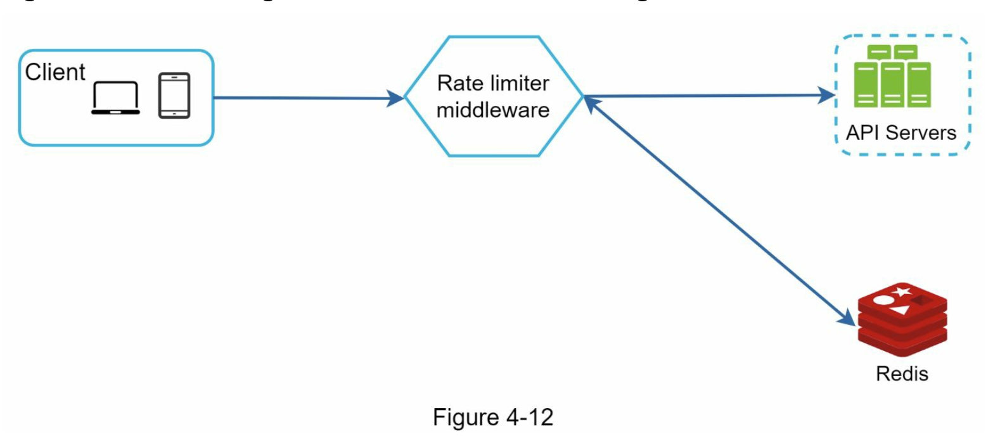

## 4-3. 상세 설계

### 처리율 제한 규칙
- lyft 오픈소스 사용 예

~~~yaml
domain: messaging
descriptors:
  - key: message_type
    value: marketing
    rate_limit:
      unit: day
      requests_per_unit: 5
~~~

~~~yaml
domain: auth
descriptors:
  - key: auth_type
    value: login
    rate_limit:
      unit: minute
      requests_per_unit: 5
~~~

### 처리율 한도 초과 트래픽의 처리
- 한도 제한이 걸리면 HTTP 429(too many requests)를 클라에 보냄
- 경우에 따라 한도 제한이 걸린 요청을 큐에 보관

### 처리율 제한 장치가 사용하는 HTTP 헤더
- X-Ratelimit-Remaining
  - 윈도 내에 처리 가능 요청의 수
- X-Ratelimit-Limit
  - 매 윈도 마다 클라이언트가 전송할 수 있는 요청의 수
- X-Ratelimit-Retry-After
  - 한도 제한이 걸리지 않는 요청 시간

### 상세 설계

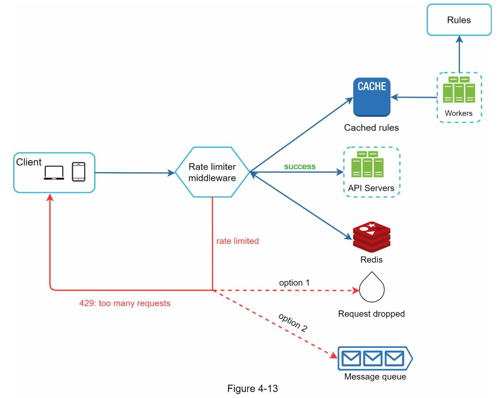

### 분산 환경에서의 처리율 제한 장치의 구현
### 경쟁조건
처리율 제한 장치 로직
- redis 에서 counter의 값을 읽음
- counter + 1 의 값이 임계치를 넘는지 확인
- 넘지 않으면, redis 에 counter 를 1만큼 증가시킴

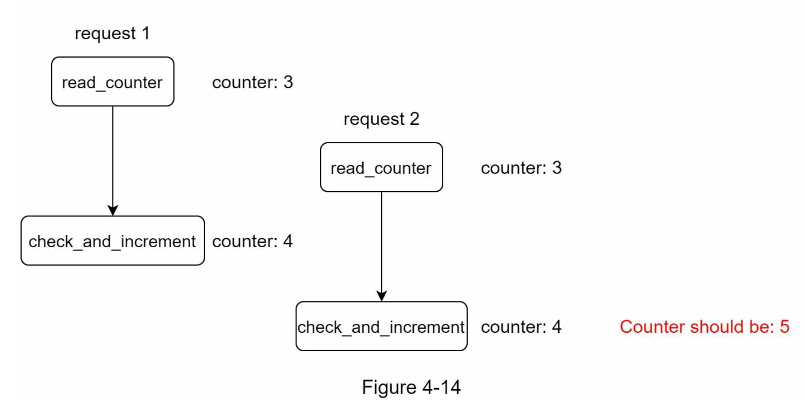

- counter 가 5가 되어야 하지만 4가됨
- 문제 해결 방법
  - lua script
    - script 언어 문법을 통해 Redis에 접근할 수 있는 기술입니다. transaction과 마찬가지로 atomic이 보장됩니다.
    - https://gist.github.com/ptarjan/e38f45f2dfe601419ca3af937fff574d#request-rate-limiter
  - sorted set
    - https://engineering.classdojo.com/blog/2015/02/06/rolling-rate-limiter/
    - all Redis operations can be performed as an atomic action, using the MULTI command. 
    - blocked actions still count as actions
    - 원자 단위로 처리 되지만, 블록된 액션도 action 으로 카운트 되기 때문에 작업이 허용되지 않을수 있음
    - redis 는 미래에 transaction 을 삭제하려고 함, lua scripting 이 더 나은 부분이 많기 때문

## 4-4. 마무리
- 처리율 제한을 임계치를 절대 넘을수 없도록 할것인지 잠시동안 넘게 할것인지?
- 다양한 계층에서의 처리율 제한
  - Iptable 을 사용하면 OSI 3번 계층에서 처리율 제한을 적용
- 처리율 제한을 회피
  - 너무 뻔한 이야기..

## spring 으로 구현한다면?
- spring cloud gateway 에서 RateLimiter Filter 를 사용
- RateLimiter Filter 는 Bucket4j 를 사용하고 있음
- Bucket4j 는 hazlecast, redis, mysql, postgresql, local cache(caffeine) 등을 지원

~~~java
@Component
public class RateLimitingFilter implements GlobalFilter, Ordered {

    private final HazelcastInstance hazelcastInstance;

    public RateLimitingFilter(HazelcastInstance hazelcastInstance) {
        this.hazelcastInstance = hazelcastInstance;
    }

    @Override
    public Mono<Void> filter(ServerWebExchange exchange, GatewayFilterChain chain) {
        // Implement rate limiting logic here
        // Retrieve rate limit counters from Hazelcast and update them accordingly
        
        // For example:
        String clientId = getClientId(exchange.getRequest());
        IMap<String, AtomicInteger> rateLimitMap = hazelcastInstance.getMap("rateLimitMap");
        AtomicInteger counter = rateLimitMap.getOrDefault(clientId, new AtomicInteger(0));
        if (counter.incrementAndGet() > 100) { // Example rate limit threshold
            return Mono.error(new ResponseStatusException(HttpStatus.TOO_MANY_REQUESTS));
        } else {
            rateLimitMap.put(clientId, counter);
            return chain.filter(exchange);
        }
    }

    private String getClientId(ServerHttpRequest request) {
        // Extract client identifier from request (e.g., IP address, API key, user ID, etc.)
        // Implement as per your application's requirements
        return request.getRemoteAddress().getAddress().getHostAddress();
    }

    @Override
    public int getOrder() {
        return -1; // Ensure this filter is executed early in the filter chain
    }
}
~~~

- https://docs.spring.io/spring-cloud-gateway/reference/spring-cloud-gateway-server-mvc/filters/ratelimiter.html
- https://github.com/bucket4j/bucket4j#bucket4j-distributed-features
