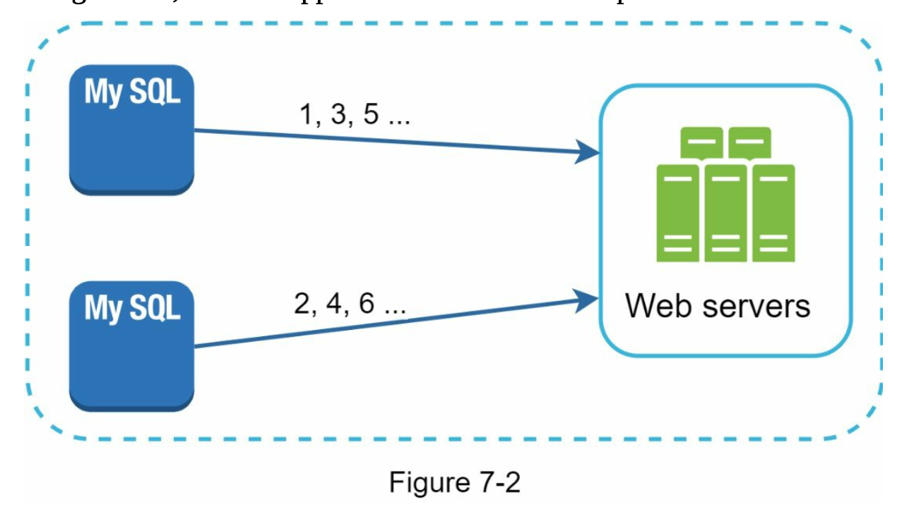
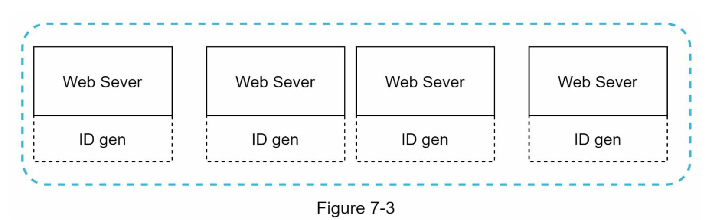
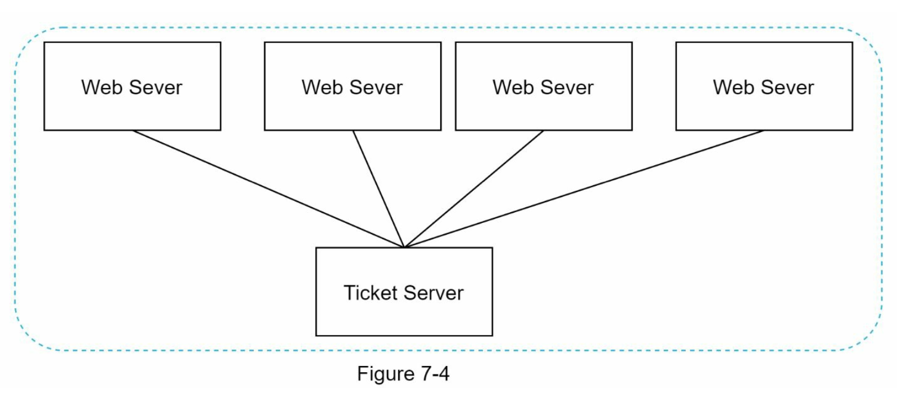
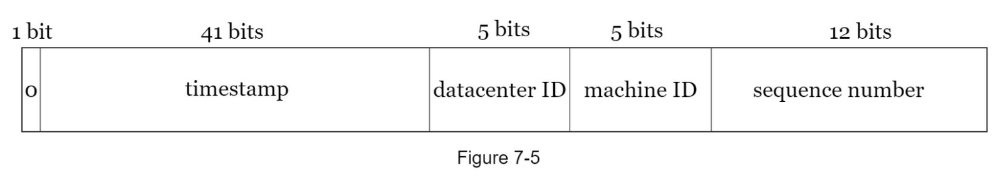
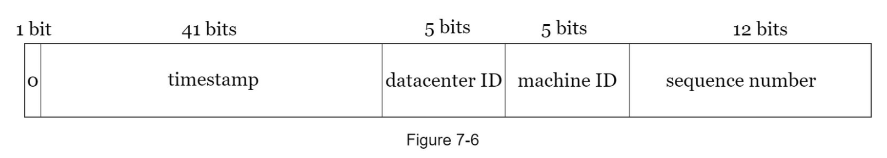
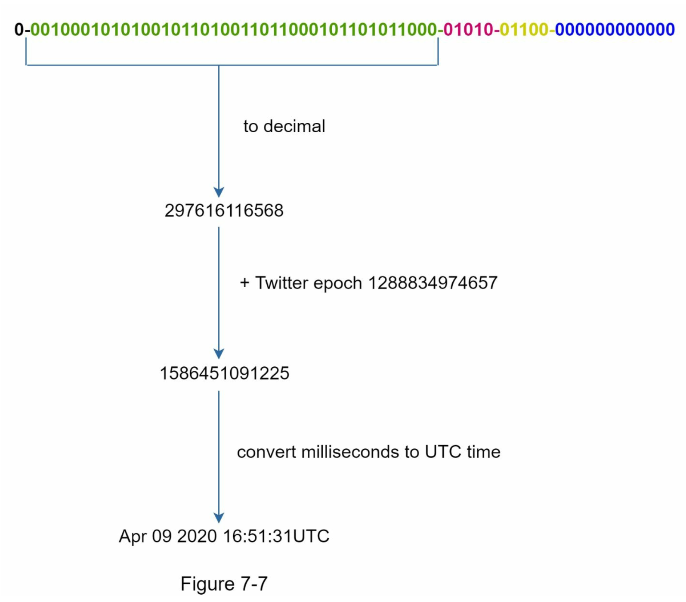

# 7. 분산 시스템을 위한 유일 ID 생성기 설계

## 7.1 문제 이해 및 설계 범위 확정

ID 조건
* 유일해야 한다
* 숫자로만 구성되어야 한다
* 64 비트로 표현될 수 있는 값이어야 한다
* 발급 날짜에 따라 정렬 가능해야 한다
* 초당 10,000 개의 ID 를 만들 수 있어야 한다

## 7.2 개략적 설계안 제시 및 동의 구하기

### 분산 시스템에서 유일성이 보장되는 ID를 만드는 방법
- 다중 마스터 복제(multi-master replication)
- UUID(Universally Unique Identifier)
- 티켓 서버(ticket server)
- 트위터 스노플레이크(twtter snowflake) 접근법

### 다중 마스터 복제
- 데이터베이스에 auto_increment 기능을 활용
- 다음 ID 값은 서버 수만큼 증가하는 방식

문제점
- 여러 데이터 센터에 걸쳐 규모를 늘리기 어렵다
- ID 의 유일성은 보장되지만, 그 값이 시간 흐름에 맞추어 커지도록 보장할 수 없음
- 서버를 추가하거나 삭제할 때도 잘 동작하도록 만들기 어려움

### UUID

- 컴퓨터 시스템에 저장되는 정보를 유일하게 식별하기 위한 128비트 짜리 수
- 충동 가능성이 지극히 낮음
  - 1개의 중복이 생릴 확률을 50%로 만드려면, 초당 10억 개의 UUID 를 100년 동안 계속 만들어야 함

장점
- UUID 를 만드는 것은 단순함
- 서버 사이의 조율이 필요 없으므로 동기화 이슈도 없음
- 각 서버가 자기가 쓸 ID 를 알아서 만드는 구조이므로 확장도 쉬움

단점
- ID 가 128비트로 길다
  - 이번장 요구 사항은 64비트
- 시간순으로 정렬할 수 없음
- 숫자 아닌 값이 포함될 수 있음

### 티켓서버

- auto_increment 기능을 갖춘 데이터베이스 서버를 티켓서버라고 함
- 이 티켓 서버를 중앙 집중형으로 하나만 사용하는 방법

장점
- 유일성이 보장되는 오직 숫자로만 구성된 ID 를 쉽게 만들수 잇음
- 구현하기 쉽고, 중소 규모 애플리케이션에 적합함

단점
- 티켓 서버가 SPOF(Single-Point-of-Failure) 가 됨
- 이서버에 장애가 발생하면, 해당 서버를 이용하는 모든 시스템이 영향을 받음
  - 이 이슈를 해결하고자 티켓 서버를 여러대를 준비하면 새롭게 동기화 이슈가 발생함

### 트위터 스토플레이크 접근법

- 64비트로 생성할 ID 구조를 여러 section 으로 분할함

구조
- sign 비트
  - 1 비트릃 할당, 음수와 양수를 구별하는데 사용
- timestamp
  - 41 비트를 할당, 기원 시각(epoch) 이후로 몇 밀리초가 경과했는지 나타내는 값
- 데이터 센터 ID
  - 5비트를 할당, 2^5 = 32 개 데이터 센터를 지원할수 있음
- 서버 ID
  - 5비트를 할당, 32개 서버를 사용할 수 있음
- 일련번호
  - 12비트를 할당, 각 서버에서는 ID 를 생성할 때마다 이 일련번호를 1씩 증가
  - 일련번호는 1 밀리초가 경과할때마다 0으로 초기화

## 7.3 상세 설계

- 데이터 센터와 서버 ID 는 시스템이 시작할 때 결정되며, 운영중에 변경되지 않음
- 데이터 센터나 서버 ID 를 변경하게 되면 ID 충돌이 발생할수 있으므로 변경시 신중해야 함
- 타임스탬프와 일련번호는 ID 생성기가 실행되고 있는 중에 만들어짐

### 타임스탬프
- 타임스탬프는 시간에 따라 점점 큰 값을 갖게 되므로 ID 는 시간순으로 정렬 가능함
- 41 비트로 표현할수 있는 타임스탬프의 최댓값은 2^41 - 1 = 2199023255551 밀리초, 이는 약 69년에 해당

### 일련번호
- 12비트이므로 2^12 = 4096 개의 값을 가질수 있음
- 같은 밀리초 동안 하나 이상의 ID 를 만들어 낸 경우에만 0보다 큰 값을 갖게 됨

## 7.4 마무리
- 시계 동기화
  - ID 생성 서버들이 전부 같은 시계를 사용한다고 가정하였음
- section 의 길이 최적화
  - 동시성이 낮고 수명이 긴 애플리케이션이라면 일련번호를 줄이고 타임스탬프를 늘리는것이 효과적일수 있음

  