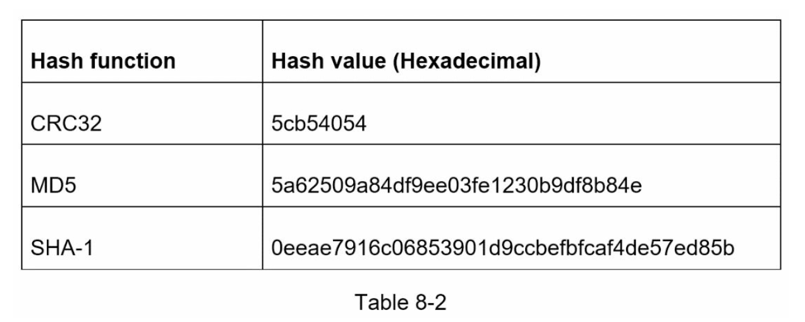
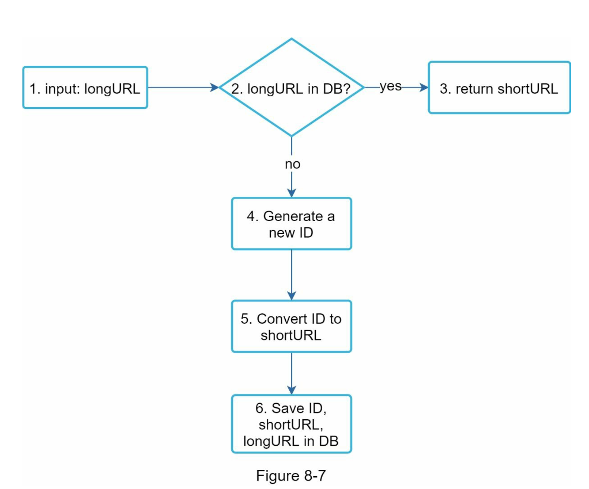

# 8. URL 단축기 설계

## 8.1 문제 이해 및 설계 범위 확정

요구 사항
- URL 단축
  - 주어진 URL 을 훨씬 짧게 줄임
- URL 리다이렉션
  - 축약된 URL 로 HTTP 요청이 오면 원래 URL 로 안내
- 높은 가용성과 규모 확장성, 그리고 장애 감내가 요구됨

### 개략적 추정
- 쓰기 연산
  - 매일 1억개의 단축 URL 생성
- 초당 쓰기 연산
  - 1억 / 24 / 3600 = 1160
- 읽기 연산
  - 읽기 연산과 쓰기 연산 비율은 10:1이라고 하자
  - 읽기 연산은 초당 11,600 회 발생
- URL 단축 서비스를 10년간 운영한다고 가정하면
  - 1억 * 365 * 10 = 3650억 개의 레코드를 보관해야 함
- 따라서 10년 동안 필요한 저장 용량은 3650억 * 100 바이트 = 36.5TB

## 8.2 개략적 설계안 제시 및 동의 구하기

### API 엔드포인트
URL 단축용 엔드포인트
- URL 을 생성하고자 하는 클라이언트가 호출할 API
  - POST /api/v1/data/shorten
    - 인자: {longUrl: longUrlString }
    - 반환: 단축 URL

URL 리다이렉션용 엔드포인트
- 단축 URL 에 대해서 HTTP 요청이 오면 원래 URL 로 보내주기 위한 용도
  - GET /api/v1/shortUrl
    - 반환: HTTP 리다이렉션 목적지가 될 원래 URL

### URL 리다이렉션
- 단축 URL 을 받은 서버는 301 응답의 Location 헤더에 원래 URL 을 넣어 반환
- 가장 직관적으로 구현하는 방법은 해시 테이블을 사용하는 것
  - <단축 URL, 원래 URL> 의 형태로 저장한다고 가정하면, 다음과 같이 구현될 수 있음
  - 원래 URL = hahsTable.get(단축 URL)
  - 301, 302 응답 Location 헤더에 원래 URL을 넣은 후 전송

#### 301, 302 응답 차이
301 Permanently Moved
- 해당 URL 에 대한 HTTP 요청의 처리 책임이 영구적으로 이전 되었다는 응답
- 영구적으로 이전 되었으므로 브라우저에 캐시됨
- 브라우저는 두번째 요청부터 location URL 로 요청을 보내게 됨

302 Found
- 일시적으로 Location 헤더가 지정하는 URL 에 의해 처리되어야 한다는 응답
- 언제나 단축 URL 서버로 요청이 보내진 후에 원래 URL 로 리다이렉션 됨

### URL 단축

fx 해시 함수 요구 사항
- 입력으로 주어진 긴 URL 이 다른 값이면 해시 값도 달라져야 한다
- 계산된 해시값은 원래 입력으로 주어졌던 긴 URL 로 복원될 수 있어야 한다

## 7.3 상세 설계

### 7.3.1 데이터 모델
데이터베이스에 저장하는 형식
- id, shortURL, longURL

### 7.3.2 해시 함수

#### 해시 값 길이
- hashValue[0-9. a-z A-Z] 문자들로 구성
- 10 + 26 + 26 = 62 개

62 ^ n >= 3650 억개를 지원하기 위해서는 몇자리가 필요한가?
- n 이 7이면, 3.5조 개의 URL 을 만들수 있음
- hashValue 는 7임

#### 해시 후 충돌 해소
- 원래 URL 을 7 글자 문자열로 줄이는 해시 함수가 필요함
- CRC32, MD5, SHA-1 같이 잘 알려진 해시 함수를 사용하는게 순쉬운 방법임
- 이 함수들을 사용해서 축약한 결과

- 가장 짧은 CRC32 해시값조차도 7보다 길다
- 해시 값에서 처음 7개만 사용하는 방식을 사용
  - 해시 충동 확률이 높아짐
  - 충돌이 발생했을 경우 아래 그림과 같이 처리함

- 이와 같은 방법을 쓰면, 해시 충돌은 해소할수 있지만 단축 URL 을 생성할때마다 데이터베이스를 질의하게 됨
- 데이터베이스 대신 블룸 필터를 사용하면 데이터베이스를 조회하지 않고 처리할수 있음

#### base62 변환
- 11157 -> 2TX 로 변환 가능

#### 해시 후 충돌 해소 vs base62

### 7.3.3 URL 단축기 상세 설계

- base62 변환 기법을 사용해서 설계

단축기 처리 예제
- id 가 2009215674938
- 2009215674938 를 62 진수로 변환하면 zn9edcu 를 얻음
- 아래 와 같이 새로운 데이터베이스 레코드를 생성

### 7.3.4 URL 리다이렉션 상세 설계

- <단축 URL, 원래 URL> 의 쌍을 캐시에 저장하여 성능을 높임

