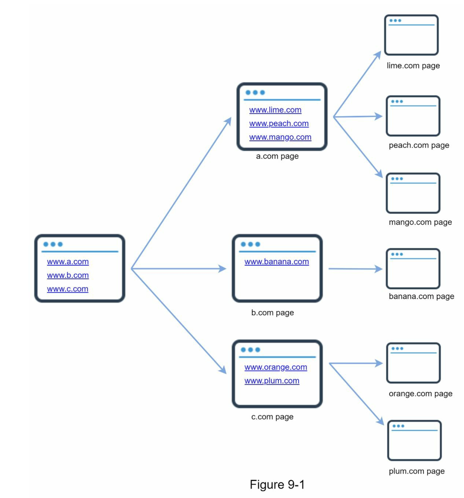
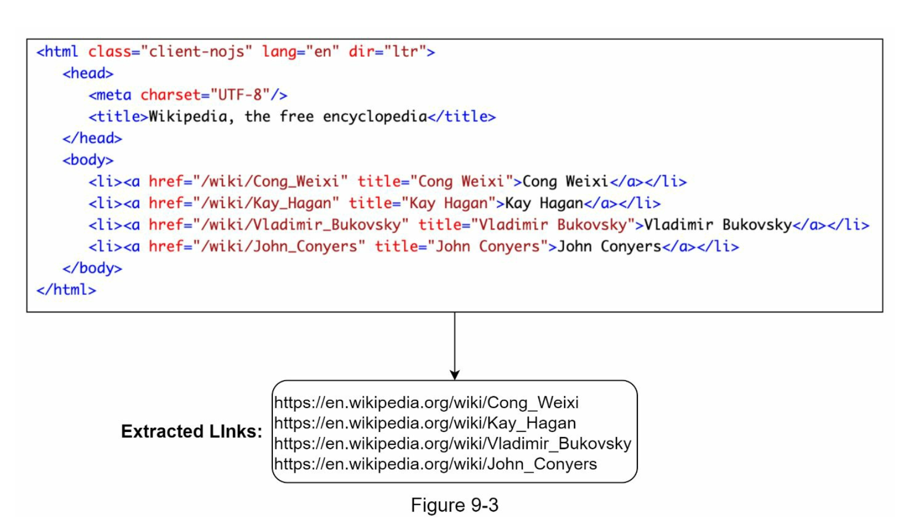
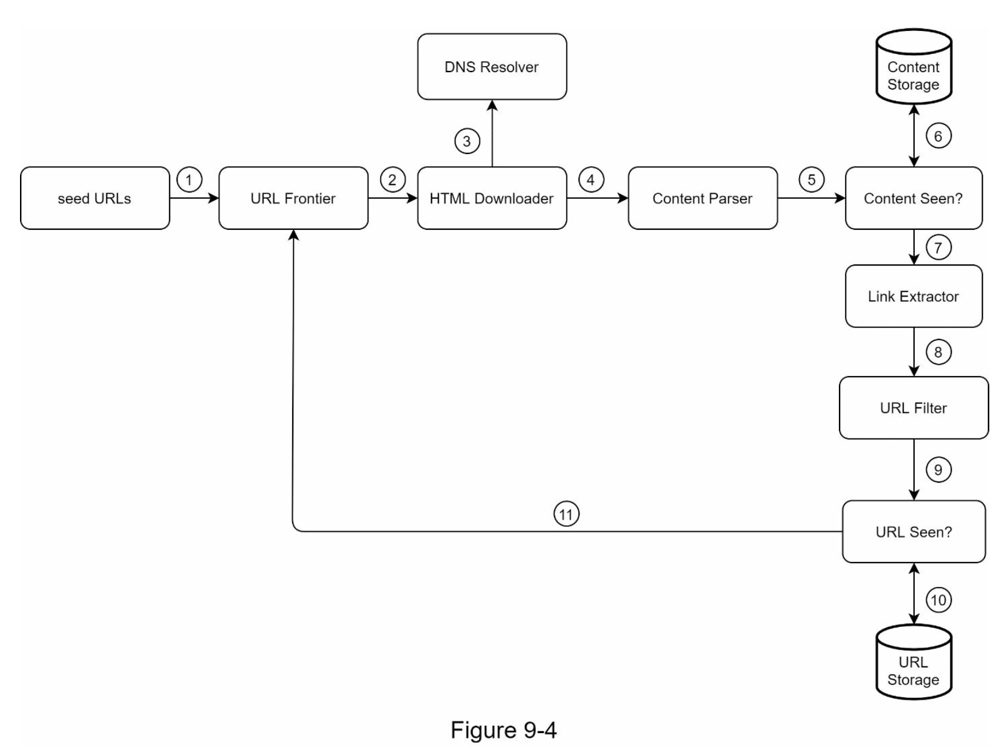
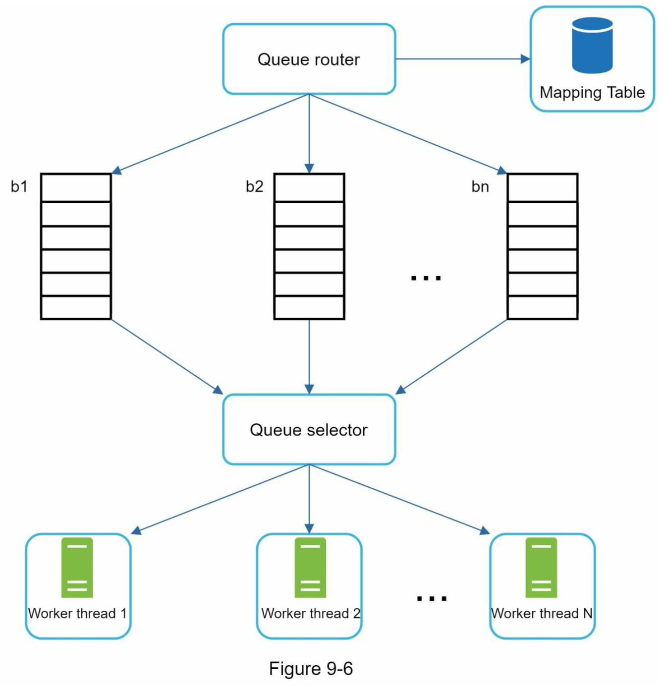
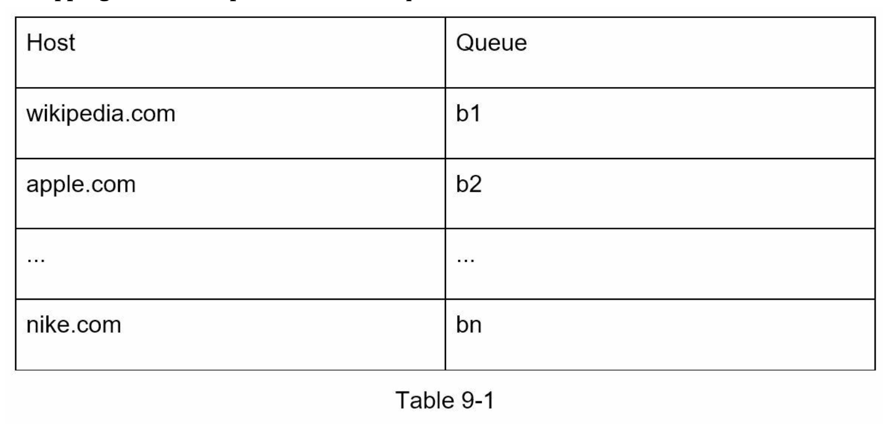
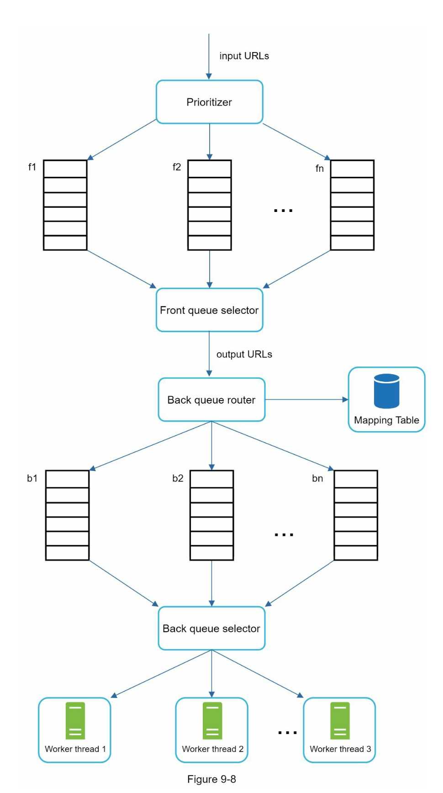
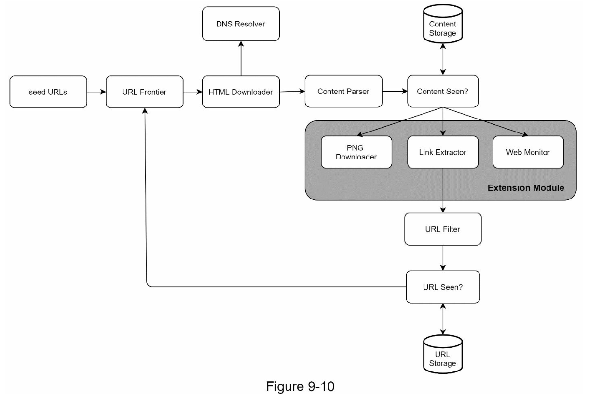

# 9. 웹 크롤러 설계
- 검색 엔진에 널리 쓰는 기술로 웹에 새로 올라오거나 갱신된 컨텐츠를 찾아애는 것이 주된 목적
- 사용처
  - 검색 엔진 인덱싱(search engine indexing)
    - 웹 페이지를 모아 검색 엔진을 위한 로컬 인덱스를 만듬
  - 웹 아카이빙(web archiving)
    - 나중에 사용할 목적으로 장기 보관하기 위해 웹에서 정보를 모음
  - 웹 마이닝(web mining)
    - 인터넷에서 유용한 지식을 도출함
    - ex> 주주 총회 자료나 연차 보고서를 다운받아 기업의 핵심 사업 방향을 알아내는 것을 함
  - 웹 모니터링(web monitoring)
    - 인터넷에서 저작권이나 상표권이 침해되는 사례를 모니터링

## 9.1 요구사항
- 매당 10억 개의 웹 페이지를 다운로드함
- QPS = 1억 / 30일 / 24시간 / 3600초 = 400 페이지/초
- 최대(peak) QPS = 2 * QPS = 800
- 웹 페이지의 평균 크기 500kb
- 10억 페이지 * 500kb = 500TB/월
- 5년 보관 500TB * 12개월 * 5년 = 30PB

## 9.2 개략적인 설계

### 시작 URL 집합
- 크롤러가 가능한 한 많은 링크를 탐색할 수 있도록 하는 URL 을 고르는 것이 바람직
- 시작 URL 로 무엇을 쓸지 정답은 없음

### 미수집 URL 저장소
- 다운로드할 URL 을 저장하는 컴포넌트이고 FIFO 큐라고 생각하면 됨

### HTML 다운로더
- 인터넷에서 웹 페이지를 다운로드하는 컴포넌트

### 도메인 이름 변환기
- URL 에 대응되는 IP 주소을 알아내는 컴포넌트

### 콘텐츠 파서
- 웹 페이지를 다운로드하면 파싱(parsing)과 검증(validation) 절차를 처리하는 컴포넌트

### 중복 콘텐츠인가?
- HTML 문서를 비교하는 가장 간단한 방법은 두 문서를 문자열로 보고 비교하는 것
- 하지만 대상 문서의 수가 10억에 달하는 경우에는 느리고 비효율적임
- 효과적인 방법은 웹 페이지의 해시 값을 비교하는 것

### 콘텐츠 저장소
- HTML 문서를 보관하는 시스템
- 대부분 콘텐츠는 디스크에 저장
- 인기있는 콘텐츠는 메모리에 두어 접근 시간을 줄일수 있음

### URL 추출기
- HTML 페이지를 파싱하여 링크들을 골라내는 역할
- 상대 경로는 전부 절대 경로로 변환

### URL 필터
- URL 을 크롤링 대상에서 배제하는 역할

### 이미 방문한 URL ?
- 불룸 필터(bloom filter) 나 해시 테이블이 널리 쓰임

### URL 저장소
- 이미 방문한 URL 을 보관하는 저장소

### 웹크롤러 작업 흐름

## 9.3 상세 설계

### DFS(Depth-First Search) vs BFS(Breadth-First Search)
- 웹은 directed graph 와 같음. 페이지는 노드, URL 은 에지(edge) 라고 보면됨

#### DFS
- 깊이 우선 탐색법으로 크롤링 프로세스에 좋은 선택이 아님
- 그래프 크기가 클 경우 어느 정도로 깊숙이 가게 될지 가능하기 어려움

#### BFS
- 너비 우선 탐색법은 FIFO(First In First Out) 큐를 사용하는 알고리즘

두가지 문제점이 있음
- 한페이지에서 나오는 링크의 상당수는 같은 서버로 되돌아 간다
  - 동일한 wikipedia.com 서버의 다른 페이지를 참조하는 링크를 병렬로 처리하게 된다면 위키피디아 서버는 수많은 요청으로 과부하게 걸리게됨
  - 예의 없는(impolite) 크롤러로 간주됨
- 표준적 BFS 알고리즘은 URL 간에 우선 순위를 두지 않음
  - 모든 웹 페이지가 같은 수준의 품질과 중요성을 갖지 않음
  - 페이지 순위, 사용자 트래픽양, 업데이트 빈도 등을 넣어 우선순위를 구별

### 미수집 URL 저장소
- BFS 문제점 두가지를 미수집 URL 저장소에서 해결할수 있음

#### 예의
- 동일 웹 사이트에 대해서는 한번에 한 페이지만 요청하는 것을 말함
- 이 요구 사항을 만족시키려면, 웹사이트의 호스트명과 다운로드를 수행하는 작업 스레드 사이의 관계를 유지하면 됨
- 각 다운로드 스레드는 별도 FIFO 큐를 가지고 해당 큐에서 꺼낸 URL 만 다운로드 함

##### 큐 라우터( queue router)
- 같은 호스트에 속한 URL 은 언제나 같은 큐(b1, b2, ... bn) 으로 가도록 보장하는 역할

##### 매핑 테이블(mapping table)
- 호스트 이름과 큐 사이이의 관계를 보관하는 테이블

##### 큐 선택기(queue selector)
- 큐들을 순회하면서 큐에서 나온 URL 을 다운로드하도록 지정된 작업 스레드에 전달하는 역할

##### 작업 스레드(worker thread)
- 전달된 URL 을 다운로드하는 작업을 수행

#### 우선순위
- URL 우선순위를 나눌 때는 페이지랭크, 트래픽양, 갱신 빈도 등 다양한 척도를 사용할수 있음
- 순위결저장치(prioritizer) 는 URL 우선 순위를 정하는 컴포넌트

##### 순위 결정 장치(prioritizer)
- URL 을 입력으로 받아 우선순위를 계산

##### 큐 선택기
- 순위가 높은 큐에서 더 자주 꺼내도록 프로그램되어 있음

##### 전체 설계
- 전면 큐
  - 우선 순위 결정 과정을 처리
- 후면 큐
  - 크롤러가 예의 바르게 동작하도록 보증

#### 신선도
- 웹 페이지는 수시로 추가되고 삭제되고 변경됨
- 이미 다운로드한 페이지라고 해도 주기적으로 재수집할 필요가 있음
- 모든 URL 을 재수집하는 것은 많은 시간과 자원이 필요한 작업임

최적화 전략
- 웹 페이지의 변경 이력을 활용
- 우선 순위를 활용하여 중요한 페이지를 좀 더 자주 재수집

#### 미수집 URL 저장소를 위한 지속성 저장 장치
- 대부분 URL 은 디스크에 두지만 IO 비용을 줄이기 위해 메모리 버퍼에 큐를 둠
- 버퍼에 있는 데이터는 주기적으로 디스크에 기록

### HTML 다운로더
- HTTP 프로토콜을 통해 웹 페이지를 내려 받음

#### Robots.txt
- 로복 제외 프로토콜이라고 부르기도 하는 Robots.txt 는 웹 사이트가 크롤러와 소통하는 표준적인 방법
- 크롤러가 수집해도 되는 페이지 목록이 들어 있음
- 크롤러는 Robots.txt 파일에 나열된 규칙을 먼저 확인 해야함
- Robots.txt 를 계속 다운로드하는 것을 피하기 위해, 주기적으로 다운받아 캐시에 보관
- ex> https://wwww.amazon.com/robots.txt
  - Greatorhub 같은 디렉토리의 내용은 다운 받을수 없다고 명시되어 있음

~~~
User-agent:Googlebot
Disallow: /creatorhub/*
Disallow: /rss/people/*/reviews
~~~

#### 성능최적화
##### 분산 크롤링
- 성능을 높이기 위해 크롤링 작업을 여러 서버에 분산하는 방법
##### 도메인 이름 변환 결과 캐시
- 도메인 이름 변환기는 크롤러 성능의 병목중 하나임
- DNS 요청을 보내고 받는 과정이 동기적이기 때문
- DNS 요청이 처리되는데 보통 10ms ~ 200ms 가 소요됨
- DNS 조회 결과로 얻어진 도메인 이름과 IP 주소 사이의 관계를 캐시에 보관해 놓는 크론잡(cronjob) 등을 돌려 주기적으로 갱신하도록 함

#### 지역성
- 크롤링 대상 서버와 지역적으로 가까우면 페이지 다운로드 시간은 줄어들것

#### 짧은 타임 아웃
- 어떤 웹 서버는 응답이 느리거나 아예 응답하지 않음
- 최대 얼마나 기다릴지 미리 정해두고, 이 시간동안 서버가 응답하지 않으면 다음 페이지로 넘어감

### 안정성

#### 안정 해시
- 다운로더 서버들에 부하를 분산할 때 적용 가능한 기술
- 이 기술을 이용하면 다운로더 서버를 쉽게 추가하고 삭제 할수 잇음

#### 크롤링 상태 및 수집 데이터 저장
- 장애가 발생한 경우에도 쉽게 복구할 수 있도록 크롤링 상태와 수빚된 데이터를 지속적으로 저장장치에 기록해둠

#### 예외 처리
- 예외가 발생해도 전체 시스템이 중단되는일 없도록 함

#### 데이터 검증
- 시스템 오류를 방지하기 위한 중요 수단

### 확장성
- 새로운 형태의 콘텐츠를 쉽게 지원할 수 있도록 해야함
  - PNG 다운로더는 PNG 파일을 다운로드하는 플러그인 모듈
  - 웹 모니터(web monitor)는 웹을 모니터링하여 저작권이나 상표권이 침해되는 일을 막는 모듈

### 문제 있는 콘텐츠 감지 및 회피 전략

#### 중복 콘텐츠
- 웹 콘텐츠의 30% 가량을 중복임
- 해시나 체크섬(check-sum)을 사용하면 중복 콘텐츠를 보다 쉽게 탐지할수 있음

#### 거미덫(spider trap)
- 크롤러를 무한 루프에 빠뜨리도록 설계된 웹 페이지
- 다음과 같이 무한히 깊은 디렉토리 구조를 포함하는 링크가 있다고 해보자
  - www.spidertrapexample.com/foo/bar/foo/bar/foo/bar/...
  - 이런 덫은 URL 최대 길이를 제한하면 회피할수 있음
- 덫을 자동으로 피해가는 알고리즘을 만들어 내는 것을 까다로움
- 사람이 수작업으로 덫을 확인하고 찾아낸후 덫이 있는 사이트를 크롤러 탐색 대상에서 제외하거나 URL 필터 목록에 걸어두어야 함

#### 데이터 노이즈
- 어떤 콘텐츠는 거의 가치가 없음
- 광고, 스크립트 코드, 스팸 URL 은 가능하다면 제외해야함

## 9.4 마무리

### 서버 측 렌더링(server side rendering)
- 많은 웹사이트가 동적으로 페이지를 만들어냄
- 웹페이지를 그냥 있는 그대로 다운받아서 파싱해보면 동적으로 생성되는 링크를 찾을 수 없음
- 페이지를 파싱하기 전에 server side rendering 을 적용하면 해결할 수 있음

### 원치 않는 페이지 필터링
### 데이터베이스 다중화 및 샤딩
- 데이터 계층의 가용성 규모확장성 안정성이 향상됨

### 수평적 규모 확장성
- 대규모 크롤링을 위해서는 다운로드를 실행할 서버가 수백 혹은 수천대가 필요할 수도 있음
- 수평적 규모 확장성을 위해 서버가 상태정보를 유지하지 않도록 하는 것, 즉 무상태 서버로 만드는것이 좋음

