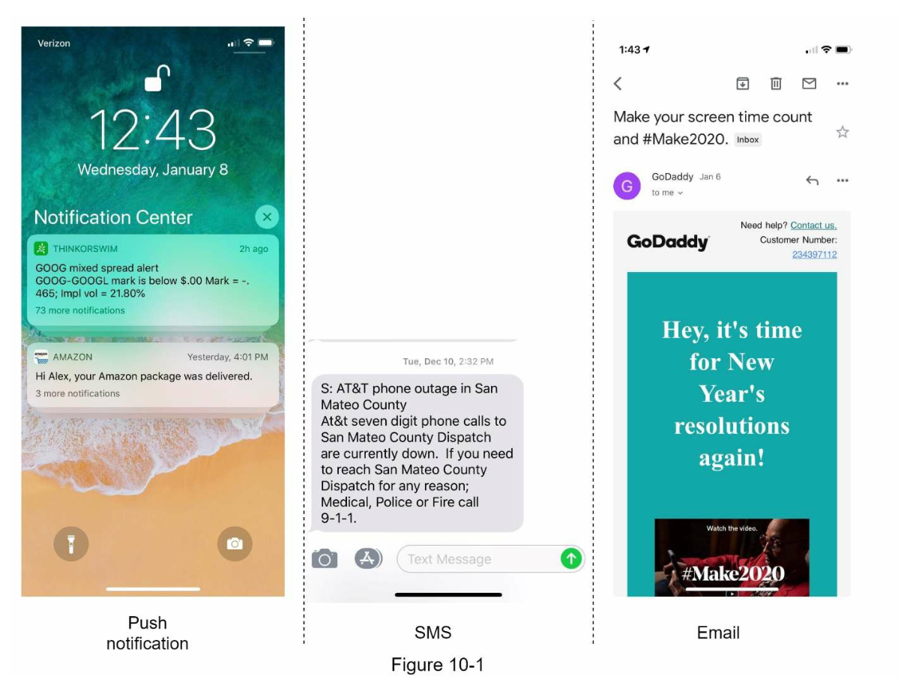
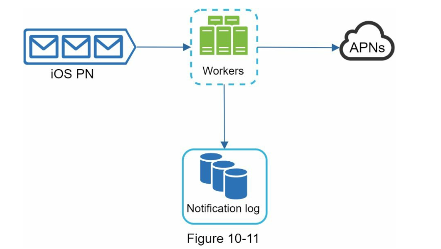

# 10. 알림 시스템 설계

## 10.1 요구사항
- 푸시 알림, SMS 메세지, 이메일을 지원 해야함
- 연성 실시간(soft real-time) 시스템이라고 가정
  - 알림은 가능한한 빨리 전달되어야 하지만, 시스템에 부하가 걸렷을때 약간의 지연은 무방
- iOS, 안드로이드, 랩톱/데스크톱을 지원해야함
- 클라에서 알림을 보낼수도 있고, 서버에서 스케줄링할 수도 있음
- 사용자가 알림을 받지 않도록 설정할수도 있어야 함
- 하루에 천만건의 모바일 푸시 알림, 백만건의 SMS 메세지, 5백만건의 이메일을 보낼수 있어야 함

## 10.2 설계

### 알림 유형별 지원 방안

### 연락처 정보 수집 절차
- 앱을 설치하거나 처음으로 계정을 등록하면 API 서버는 해당 사용자의 정보를 수집하여 데이터베이스에 저장함

- 이메일 주소와 전화번호는 user 테이블에 저장하고, 단말 토큰은 device 테이블에 저장
- 한 사용자가 여러 단말을 가질수 있고, 알림은 모든 단말에 전송되어야 한다는 점을 고려

### 알림 전송 및 수신 절차

#### 초안

##### 1~N 까지의 서비스
- 마이크로서비스일수도 있고, 크론잡일수도 있고, 분산 시스템 컴포넌트일수도 있음

##### 알림 시스템
- 알림 전송/수신 처리의 핵심
- 서비스 1~N에 알림 전송을 위한 API 를 제공해야 함
- 제 3자 서비스에 전달할 알림 페이로드(payload)를 만들어 낼수 있어야 함

##### 제3자 서비스
- 사용자에게 알림을 실제로 전달하는 역할
- 새로운 서비스를 통합하거나 기존 서비스를 쉽게 제거할수 있어야 함
  - ex> FCM 은 중국에서는 사용할수 없음, 중국에서는 Jpush, PushY 같은 서비스를 사용해야함

#### 문제점
SPOF(Single Point Of Failure)
- 알림 서비스에 서버가 하나밖에 없다면, 서버에 장애가 생기면 전체 서비스의 장애로 이어짐

규모 확장성
- 한대 서비스로 푸시 알림에 관계된 모든것을 처리하므로, 데이터베이스나 캐시 등 중요 컴포넌트의 규모를 개별적으로 늘릴 방법이 없음

성능 병목
- 알림을 처리하고 보내는 것은 자원을 많이 필요로하는 작업일수 있음
- 모든 것을 한 서버로 처리하면 사용자 트래픽이 많이 몰리는 시간에는 시스템이 과부하 상태에 빠질수 있음

#### 개선된 버전

##### 알림서버
알림 전송 API
- 스팸 방지를 위해 보통 사내 서비스 또는 인증된 클리이언트만 이용 가능

알림 검증
- 이메일 주소, 전화번호 등에 대한 기본적 검증을 수행

데이터베이스 또는 캐시 질의
- 알림에 포함시킬 데이터를 가져오는 기능

알림 전송
- 알림 데이터를 메시지 큐에 넣음

캐시
- 사용자 정보, 단말 정보, 알림 템플릿 등을 캐시함

데이터베이스
- 사용자, 알림, 설정 등 다양한 정보를 저장

메시지큐
- 시스템 컴포넌트 간 의존성을 제거하기 위해 사용
- 다량의 알림이 전송되어야 하는 경우를 대비한 버퍼 역할도 함

작업서버
- 메시지 큐에서 전송할 알림을 꺼내서 제 3자 서비스로 전달하는 역할을 담당

## 9.3 상세 설계

### 안정성
#### 데이터 손실 방지
- 어떤 상황에서도 알림이 소실되면 안됨
- 알림 데이터를 데이터베이스에 보관하고 재시도 매커니즘을 구현해야함

#### 알림 중복 전송 방지
- 같은 알림이 여러번 반복되는 것을 완전히 막는것은 불가능
- 중복 전송 빈도를 줄이기 위해 간단한 중복 방지 로직
  - 보내야할 알림이 도착하면 그 이벤트 ID 를 검사하여 이전에 본적이 있는 이벤트인지 확인
  - 중복된 이벤트라면 버리고, 그렇지 않으면 알림을 발송

### 추가로 필요한 컴포넌트 및 고려사항

#### 알림 템플릿
- 템플릿을 사용하면 전송될 알림들의 형식을 일관성있게 유지할수 있고, 오류 가능성뿐 아니라 알림 작성에 드는 시간도 줄일수 있음

#### 알림 설정
- 알림 설정을 상세히 조정할수 있도록 알림 설정 테이블에 다음과 같은 필드들을 저장하고 있을 것임

| field | type | description
| --- | --- | --- |
| user_id | bigint |  |
| channel | varchar | # 알림이 전송될 채널. 푸시알림, 이메일, SMS 등
| opt_in | boolean | # 해당 채널로 알림을 받을 것인지의 여부

#### 전송률 제한
- 사용자가 받을수 있는 알림의 빈도를 제한하여 너무 많은 알림을 보내지 않도록 함
- 알림을 너무 많이 보내면 사용자가 알림을 끌수 있음

#### 재시도 방법
- 제 3자 서비스가 알림 전송에 실패하면, 해당 알림을 재시도 전용 큐에 넣음
- 같은 문제가 계속 발생하면 개발자에게 통지

#### 푸시 알림과 보안
- 알림 전송 API 는 appKey 와 appSecret 를 사용하여 보안을 유지함
- 인증된 혹은 승인된 클라이언트만 해당 API 를 사용하여 알림을 보낼수 있음 

#### 큐 모니터링
- 큐에 쌓인 알림의 개수를 모니터링해야 함
- 이 수가 너무 크면 작업 서버들이 이벤트를 빠르게 처리하고 있지 못하다는 뜻

#### 이벤트 추적
- 알림 확인율, 클릭율, 실제 앱 사용으로 이어지는 비율 같은 메트릭은 사용자를 이해하는데 중요함

### 수정된 설계안

## 10.4 마무리

### 안정성
- 메시지 전송 실패율을 낮추기 위해 안정적인 재시도 메커니즘을 도임

### 보안
- 인증된 클라이언트만이 알림을 보낼수 있도록 appKey, appSecret 등의 매커니즘을 이용

### 이벤트 추적 및 모니터링
- 알림이 만들어진 후 성공적으로 전송되기까지의 과정을 추적하고 시스템 상태를 모니터링하기 위해 알림 전송의 각 단계마다 이벤트를 추적하고 모니터링 할수 있는 시스템을 통함

### 사용자 설정
- 사용자가 알림 수신 설정을 조정할수 있도록 함
- 알림을 보내기전 반드시 해당 설정을 확인하도록 시스템 설계를 변경함

### 전송률 제한
- 사용자에게 알림을 보내는 빈도를 제한할수 있도록 함

