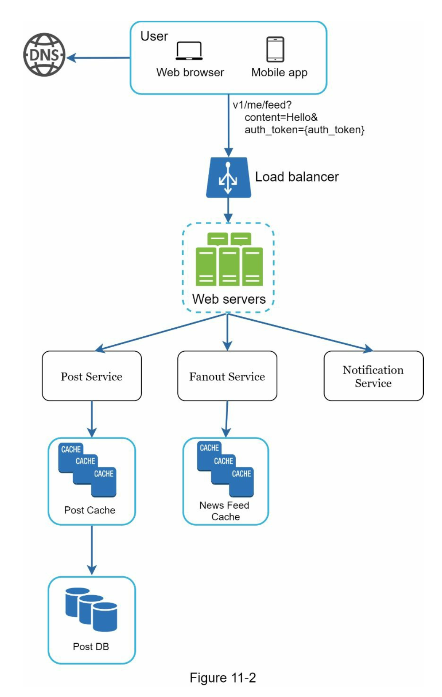
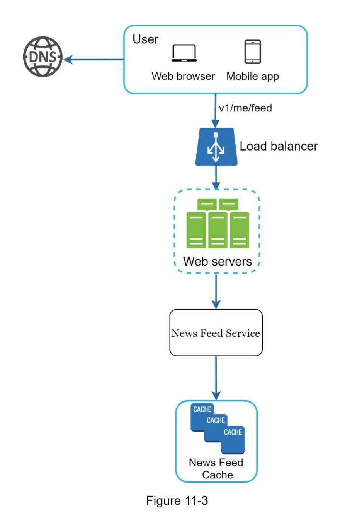
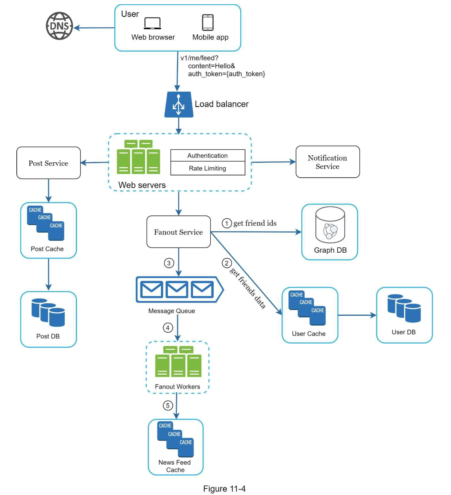
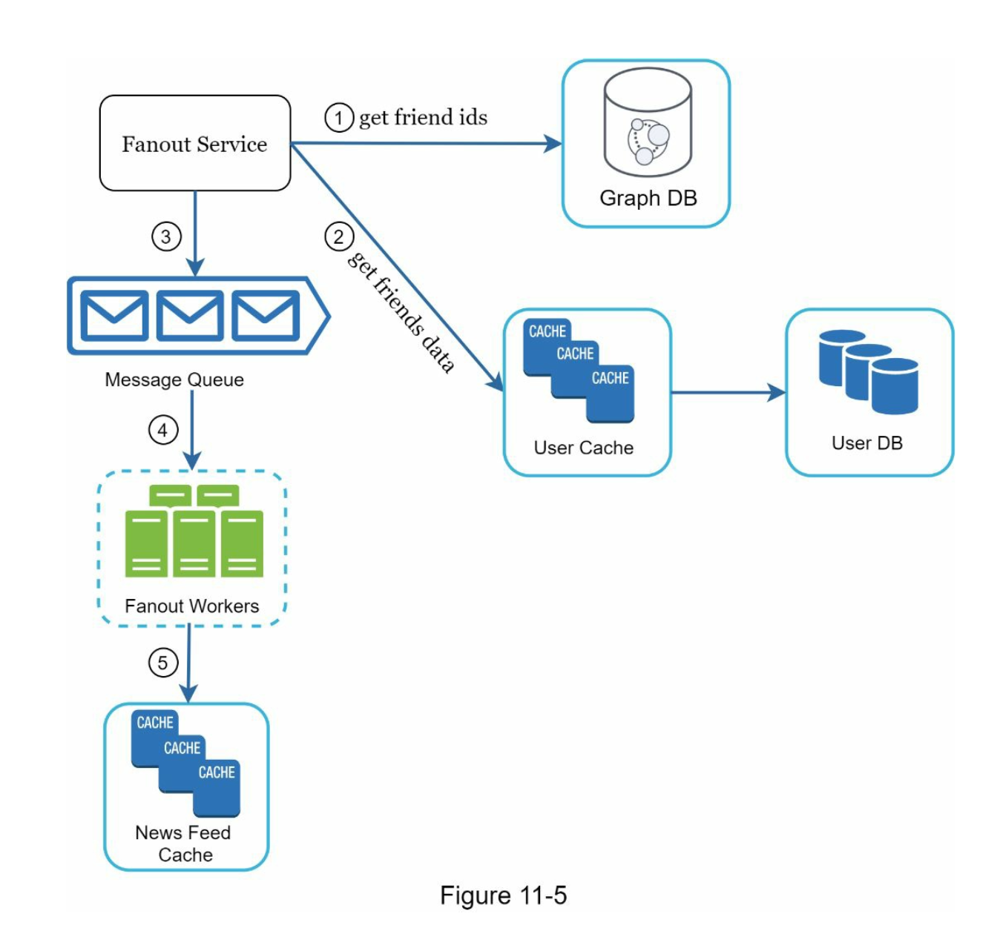
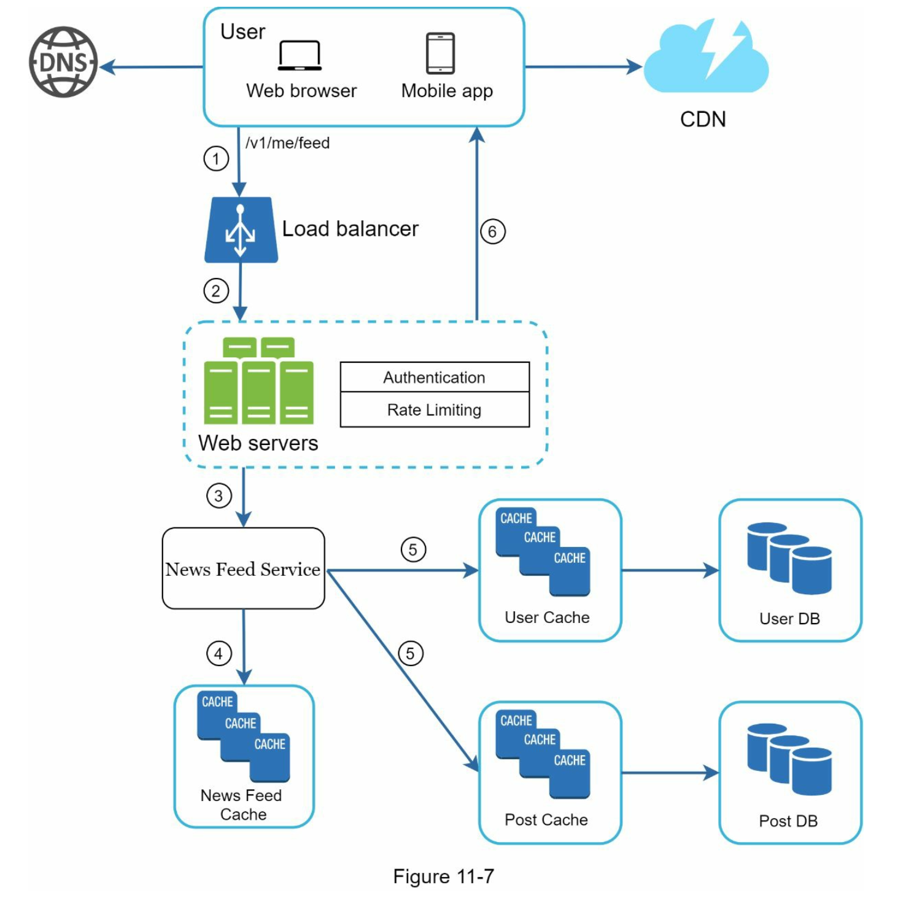
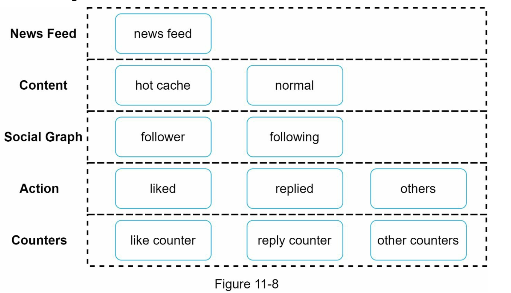

# 11. 뉴스 피드 시스템 설계

## 11.1 문제 이해 및 설계 범위
- 웹, 앱 둘다 지원
- 사용자는 뉴스 피드 페이지에 새로운 스토리를 올릴수 있어야 함
- 친구들이 올리는 스토리도 볼 수 있어야 함
- 피드는 시간 흐름 역순으로 표시
- 최대 5000 명 친구 가능
- 매일 천만명이 방문
- 스토리에는 이미지나 비디오등 미디어 파일이 포함될수 있음

## 11.2 개략적 설계

피드 발해
- 사용자가 스토리를 포스팅하면 해당 데이터를 캐시와 데이터베이스에 기록
- 새 포스팅은 친구의 뉴스 피드에도 전송

뉴스 피드 생성
- 모든 친구의 포스팅을 시간 흐름 역순으로 모아서 만듬

### 뉴스 피드 API
피드 발행 API
- 새 스토리를 포스팅하기 위한 API
- POST /v1/me/feed

피드 읽기 API
- 뉴스 피드를 가져오는 API
- GET /v1/me/feed

### 피드 발행

### 뉴스 피드 생성

## 11.3 상세 설계

피드 발행 흐름 상세 설계

### 포스팅 전송 서비스
#### Push 모델
장점
- 뉴스 피드가 실시간으로 갱신되며, 친구 목록에 있는 사용자에게 즉시 전송
- 새 포스팅이 기록되는 순간에 뉴스 피드가 이미 갱신되므로 뉴스 피드를 읽는데 시간이 짧아짐
단점
- 친구가 많은 사용자의 경우 친구 목록을 가져오고 그 목록에 있는 사용자 모두의 뉴스피드를 갱신하는데 많은 시간이 소요됨, hotkey 라고 부르는 문제
- 서비스를 자주 이용하지 않는 사용자의 피드까지 갱신해야 하므로 컴퓨팅 자원이 낭비됨

#### Pull 모델
장점
- 비활성화된 사용자 또는 서비스에 거의 로드인하지 않는 사용자의 경우에 유리, 로그인하기까지는 어떤 컴퓨팅 자원도 소모하지 않음
- 데이터를 친구 각각에 푸시하는 작업이 필요없으므로 hotkey 문제도 생기지 않음
단점
- 뉴스 피드를 읽는데 많은 시간이 소요될수 있음

#### 포스팅 전송 서비스

- 그래프 데이터 베이스에서 친구 ID 목록을 가져옴
  - 그래프 데이터베이스는 친구 관계나 친구 추천을 관리하기 적합
- 사용자 정보 캐시에서 친구들의 정보를 가져옴
  - 사용자 설정에 따라 친구 가운데 일부를 걸러냄
  - 피드 업데이트를 무시하기로 설정한 사용자
- 친구 목록과 새 스토리의 포스팅 ID 를 메세지 큐에 넣음
- 뉴스피드 캐시는 \<포스팅ID, 사용자 ID\> 의 순서쌍을 보관하는 매핑 테이블
  - 포스팅 정보사 사용자 정보를 넣으면 메모리 요구량이 지나치게 늘어날수 있어서 넣지 않음
  - 캐시의 크기에 제한을 두고, 해당 값은 조정이 가능하도록 함
  - 대부분의 사용자가 보려 하는 것은 최신 스토리 이므로 캐시 미스가 일어날 확률은 낮음

### 피드 읽기 흐름과 상세

### 캐시 구조

뉴스피드
- 뉴스 피드의 ID 를 보관
콘텐츠
- 포스팅 데이터를 보관함, 인기 콘텐츠는 따로 보관
소셜 그래프
- 사용자 간 관계 정보를 보관
행동
- 포스팅에 대한 사용자의 행위에 관한 정보를 보관
- 포스팅에 대한 좋아요 답글 등등이 이에 해당
횟수
- 좋아요 횟수, 응답 수, 팔로어 수, 팔로잉 수 등의 정보를 보관

## 11.4 마무리
### 데이터베이스 규모 확장
- 수직적 규모 확장 vs 수평적 규모 확장
- SQL vs NoSQL
- master - slave 다중화
- replica 에 대한 읽기 연산
- 일관성 모델(consistency model)
- 데이터베이스 샤딩(sharding)

### 이외에 논의해 보면 좋을 만한 주제
- 웹 계층을 무상태로 운영하기
- 가능한 한 많은 데이터를 캐시할 방법
- 여러 데이터 센터를 지원할 방법
- 메시지 큐를 사용하여 컴포넌트 사이의 결합도 낮추기
- 핵심 메트릭(key metric)에 대한 모니터링, 예를 들어 트래픽이 몰리는 시간대의 QPS
- 사용자가 뉴스 피드를 새로고침 할 때희 지연시간 등

