# 12. 채팅 시스템 설계

## 12.1 요구 사항
- 응답 지연이 낮은 일대일 채팅 기능
- 최대 100명까지 참여할 수 있는 그룹 채팅 기능
- 사용자의 접속상태 표시 기능
- 다양한 단말 지원, 하나의 계정으로 여러 단말에 동시 접속 지원
- 푸시 알림

## 12.2 개략적 설계

채팅 서비스는 아래 기능을 제공 해야함
- 클라이언트들로 부터 메시지 수신
- 메시지 수신자 결정 및 전달
- 수신자가 접속 상태가 아닌 경우에는 접속할 때까지 해당 메시지를 보관

채팅 서비스는 어떤 통신 프로토콜을 사용할것인가?
- 초기에는 HTTP 로 keep-alive 를 사용하여 처리
  - TCP 접속 과정에서 발생하는 핸드셰이크 횟수를 줄일수 있음

메시지 수신 방법
- 폴링, 롱폴링, 웹소켓

### 폴링
- 클라이언트가 주기적으로 서버에 새 메시지가 있는지 물어보는 방법
- 답해줄 메시지기 없는 경우네는 서버 자원이 불필요하게 낭비된다는 문제가 있음

### 롱폴링
- 폴링은 여러가지로 비효율적일 수 있어서 나온 기법이 롱폴링
- 새메시지가 반환되거나 타임아웃 될 때까지 연결을 유지함
- 단점
  - 메시지를 보내는 클라이언트와 수신하는 클라이언트가 같은 채팅 서버에 접속하게 되지 않을 수 있음
  - 서버 입장에서 클라이언트가 연결을 해제했는지 아닌지 알수 있는 방법이 없음
  - 여전히 비효율적
    - 메시지를 많이 받지 않는 클라이언트도 타임아웃이 일어날때마다 서버에 주기적으로 접속
### 웹소켓
- 서버가 클라이언트에게 비동기 메시지를 보낼때 가장 널리 사용하는 기술
- 웹소켓 연결은 클라이언트가 시작
- 한번 맺어진 연결은 항구적이며, 양방향임
- 처음에 HTTP 로 연결하지만, 특정 핸드셰이크 절차를 거쳐 웹소켓으로 업그레이드됨
- 방화벽이 있는 환경에서도 잘 동작함
  - 80, 443 처럼 HTTP, HTTPS 프로토콜이 사용하는 기본 포트번호를 그대로 쓰기 때문
- 메시지를 보낼때나 받을 때 동일한 프로토콜을 사용할수 있으므로 설계뿐 아니라 구현도 단순하고 직관적임
- 유의할 것
  - 웹소켓 연결은 항구적으로 유지되어야 하기 때문에 서버측에서 연결 관리를 효율적으로 해야함

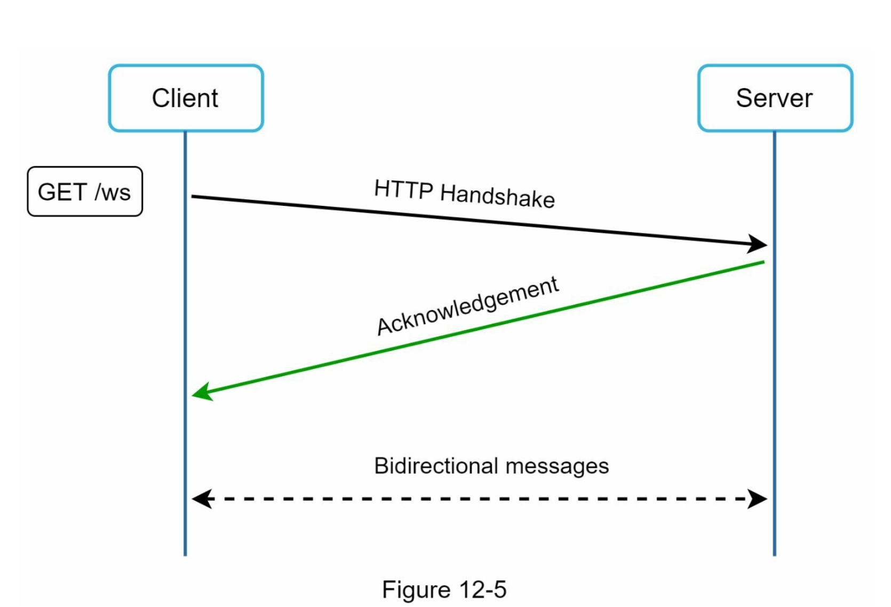
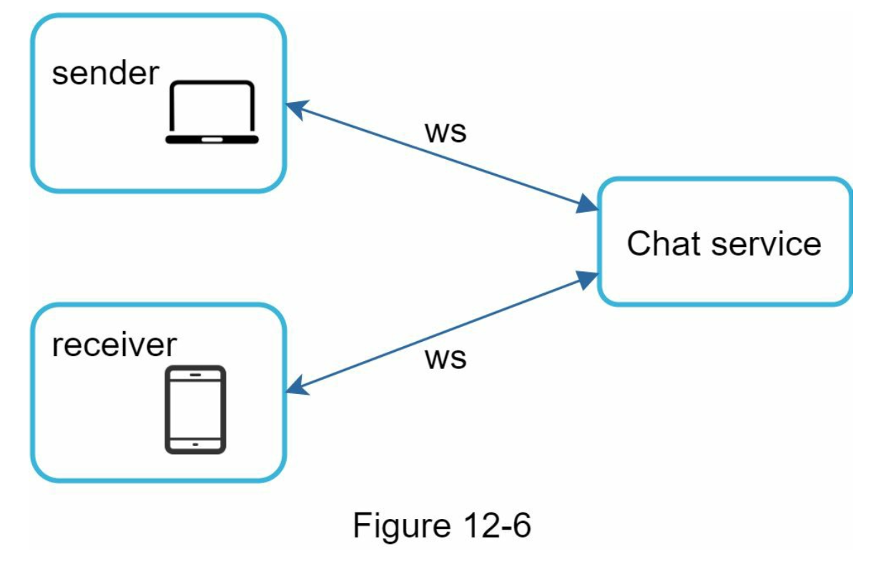

### 설계안

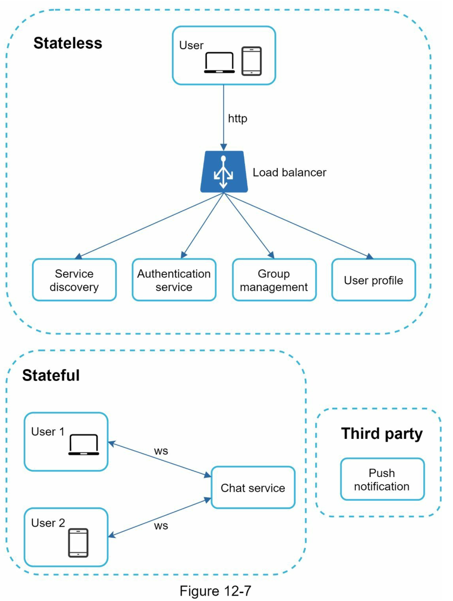

#### 무상태 서비스
- 로그인, 회원가입, 사용자 프로파일 표시 등을 처리하는 전통적인 요청/응답 서비스

#### 상태 유지 서비스
- 채팅 서비스
- 각 클라이언트가 채팅 서버와 독립적인 네트워크 연결을 유지해야 하기 때문
- 보통 서버가 살아있는 한 다른 서버로 연결을 변경하지 않음

#### 제3자 서비스 연동
- 푸시 알림
- 새 메시지를 받았다면 설사 앱이 실행 중이지 않더라도 알림을 받아야해서 사용

#### 규모 확장성

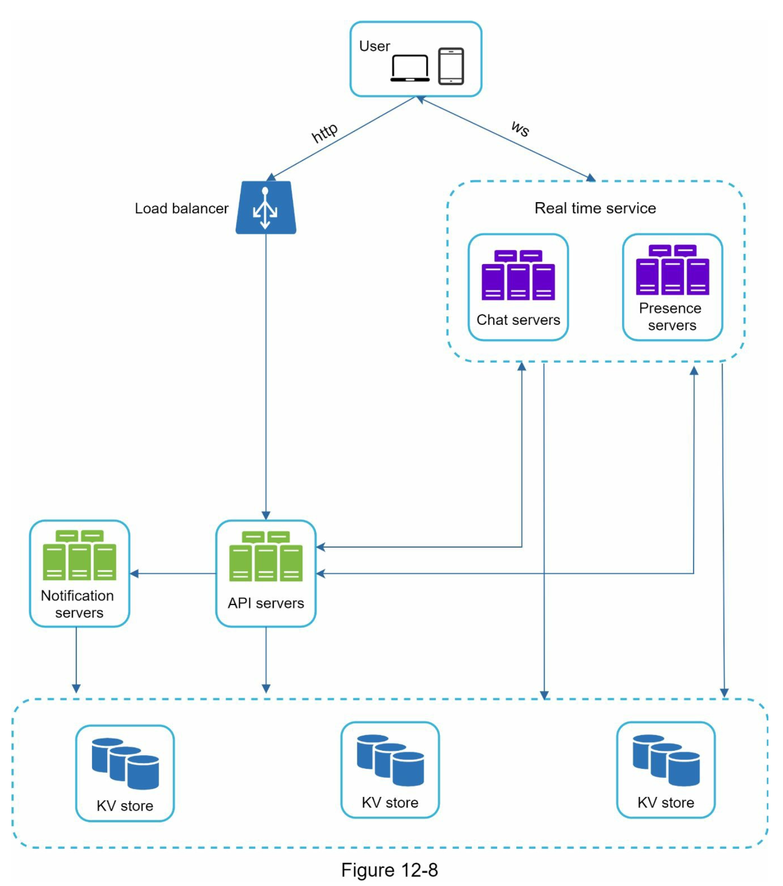

- 채팅 서버는 메시지를 중계하는 역할을 담당
- 접속 상태 서버는 사용자의 접속 여부를 관리
- API 서버는 로그인, 회원가입, 프로파일 변경 등 전부를 처리
- 알림 서버는 푸시 알림을 보냄
- 키-값 저장소
  - 채팅 이력을 보관

#### 저장소
채팅 시스템이 다루는 데이터는 보통 두가지임
- 사용자 프로파일, 설정, 친구 목록과 같은 일반적인 데이터
  - 안전성을 보장하는 관계형 데이터베이스에 보관
- 채팅 이력
  - 채팅 이력 데이터의 양은 엄청나다
  - 페이스북이나 왓츠앱은 매일 600억 개의 메시지를 처리
  - 최근데 주고받은 메시지가 빈번하게 사용됨
  - 검색하거나 특정 메시지로 점프하여 무작위적인 데이터 접근을 하게 되는 경우도 있음
  - 1:1 채팅 앱의 경우 읽기:쓰기 비율은 대략 1:1 정도임
  - key-value 저장소를 추천

key-value 저장소 추천 이유
- 수평적 규모 확장이 쉬움
- 데이터 접근 지연시간이 낮음
- 관계형 데이터베이스는 데이터 가운데 롱테일(long tail)에 해당하는 부분을 잘 처리하지 못하는 경향이 있음
- 인덱스가 커지면 데이터에 대한 무작위 접근을 처리하는 비용이 늘어남
- 페이스북 메신저는 habse 사용, 디스코드는 카산드라 사용

#### 데이터 모델
1:1 채팅을 위한 메시지 테이블
- message_id 로 메시지 순서를 쉽게 정할수 있도록 bigint 를 사용
- created_at 을 사용하여 메시지 순서를 정할수 없음. 동시에 만들어 질수도 있기 때문
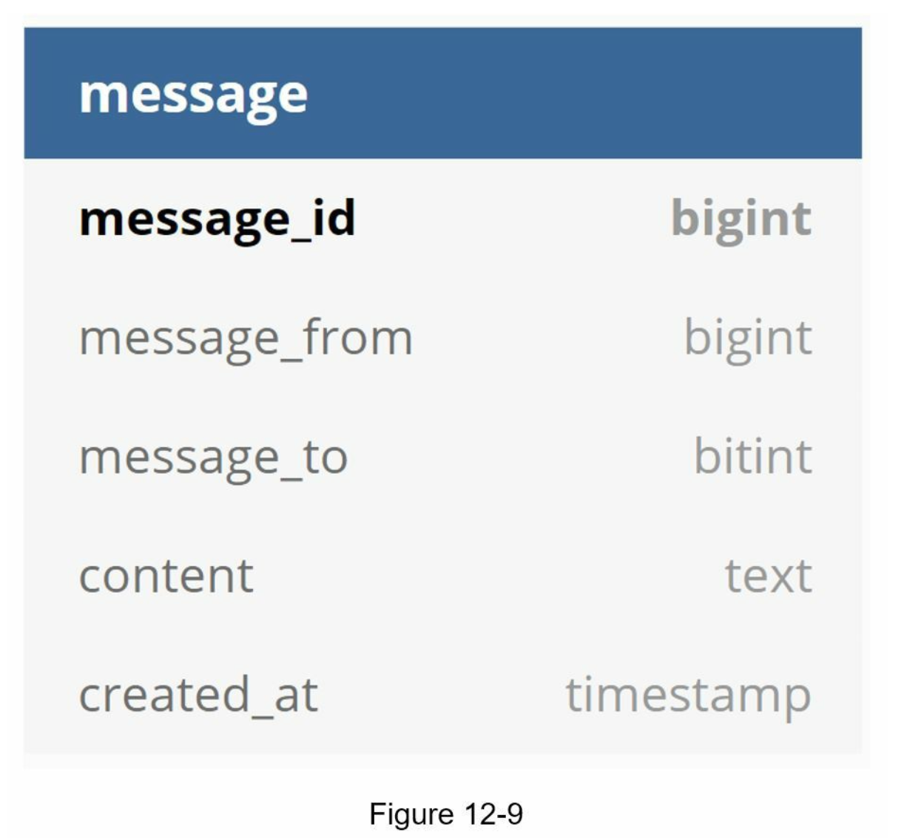

그룹 채팅을 위한 메시지 테이블
- (channel_id, meaaged_id) 의 복합키를 기본키로 사용
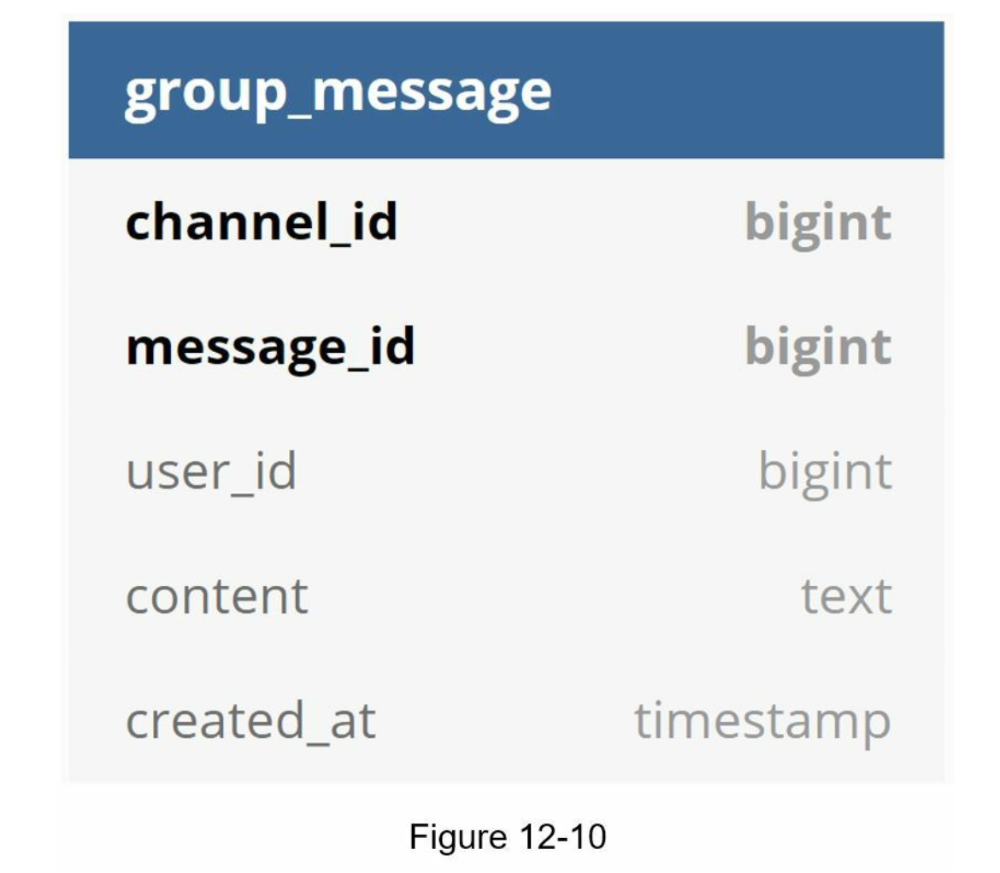

#### 메시지 ID
- message_id 의 값은 고유해야 함
- ID 값은 정렬 가능해야 하며, 시간 순서와 일치해야 함
- RDBMS 라면 auto_increment 가 대안이지만, NoSQL 은 보통 제공하지 않음
- 스노플레이크 같은 전역적 64-bit 순서 번호 생성기를 이용
- 또는 지역적 순서 번호 생성기를 이용
  - 메시지 사이의 순서는 같은 채널, 혹은 1:1 채팅 세션안에서만 유지되면 충분하기 때문

## 12.3 상세 설계

### 서비스 탐색
- 클라이언트에게 가장 적합한 채팅 서버를 추천
  - 추천으로 사용되는 기준은 클라이언트의 위치, 서버의 용량등이 있음
- 서비스 탐색 기능을 구현하는데 널리 쓰이는 오픈소스로 아파치 주키퍼가 있음

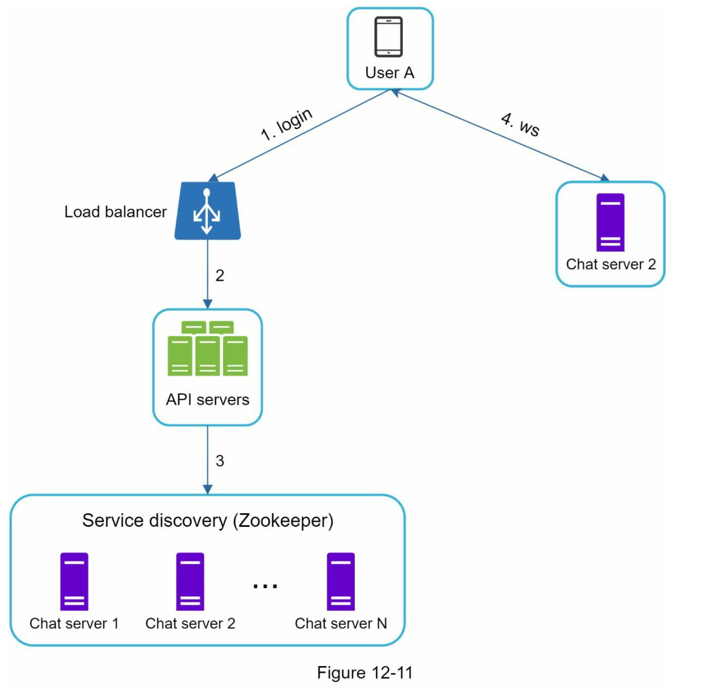

### 메시지 흐름

#### 1:1 채팅 메시지 처리 흐름

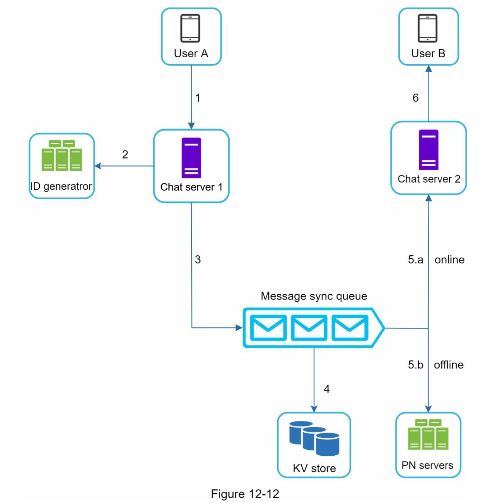

#### 여러 단말 사이의 메시지 동기화
- 각 단말은 cur_max_message_id 라는 변수를 유지
- 가장 최신 메시지의 ID 를 추적하는 용도
- 새 메시지로 간주하는 조건
  - 수신자 ID 가 현재 로그인한 사용자 ID 와 같음
  - 키-값 저장소에 보관된 메시지로서, 그 ID 가 cur_max_message_id 보다 큼

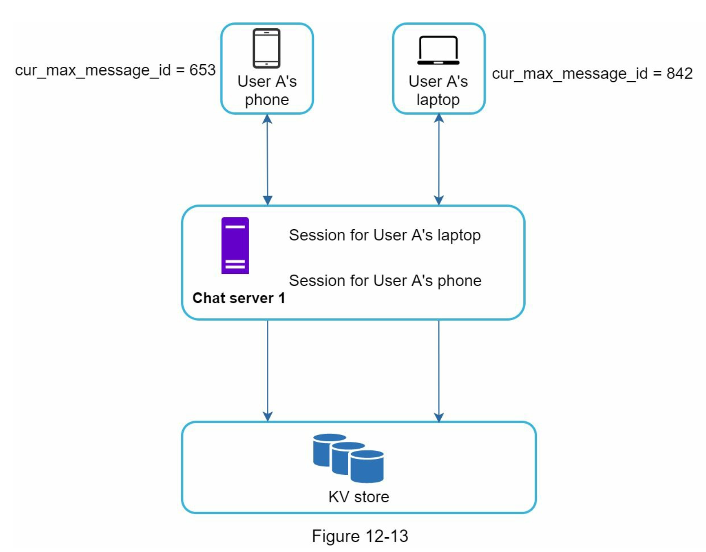

#### 소규모 그룹 채팅에서의 메시지 흐름
메시지 전송시 처리 방법

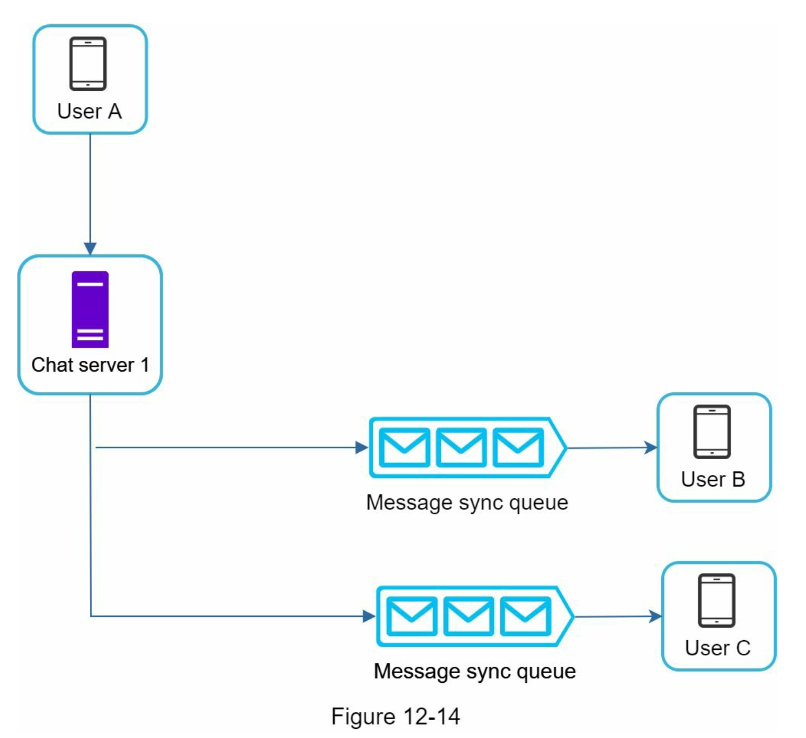

- A 가 보낸 메시지가 사용자 B 와 C 의 메시지 동기화 큐에 복사됨
- 큐를 사용자 각각에 할당된 메시지 수신함 같은 것으로 생각해도 무방
- 소규모 그룹 채팅에 적합
  - 새로운 메시지가 왔는지 확인하려면 자기 큐만 보면 되니까 메시지 동기화 플로가 단순
  - 그룹이 크지 않으면 메시지를 수신자별로 복사해서 큐에 넣는 작업의 비용이 문제되지 않음
  - WeChat 이 이런 방법을 사용하고 있고, 그룹 크기는 500명으로 제한

메시지 수신시 처리 방법

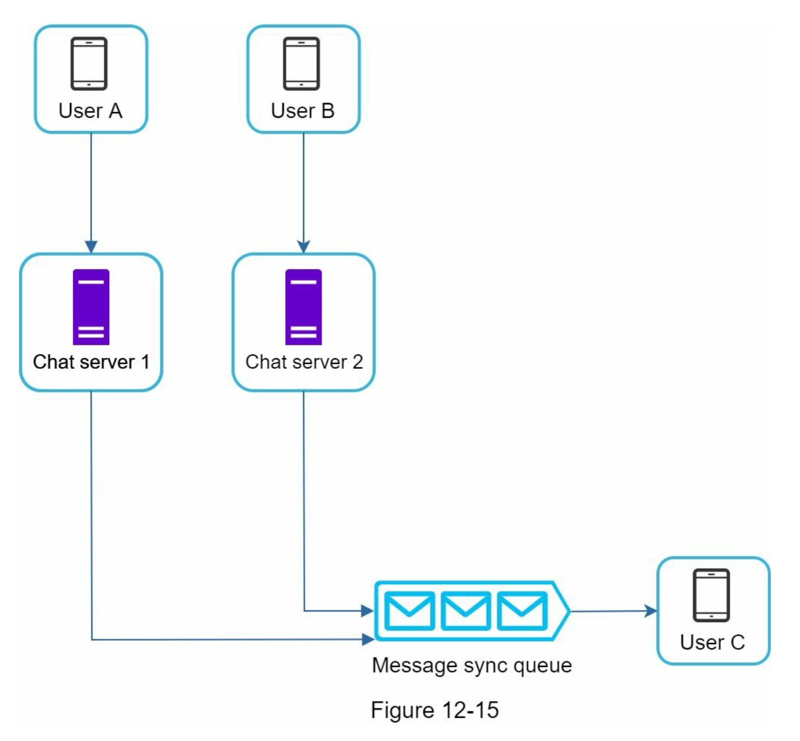

- 한 수신자는 여러 사용자로부터 오는 메시지를 수신할수 있어야 함

### 접속 상태 표시
- 클라이언트와 웹소켓으로 통신하는 실시간 서비스의 일부임
- 사용자의 상태가 변하는 시나리오
  - 로그인
  - 로그아웃
  - 접속장애

#### 사용자 로그인
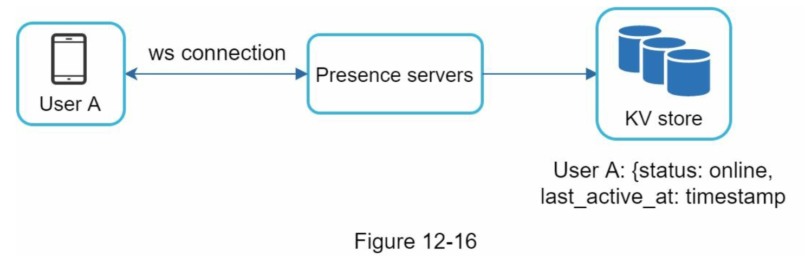

- 클라이언트와 서버 사이에 웹소켓 연결이 맺어지고 나면 동작
- 접속 상태 서버는 A 의 상태와 last_active_at 타임스탬프 값을 키-값 저장소에 보관

#### 로그아웃
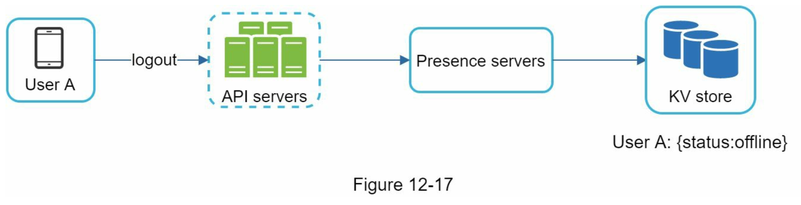

#### 접속 장애
- 짧은 시간동안 인터넷 연결이 끊어졌다 복구되는 일은 흔함
- 이런 일이 벌어질때마다 사용자의 접속 상태를 변경하는 것은 지나친 일일것이고, 사용자 경험 측면에서도 바람직하지 않음
- 박동 검새를 통해 이문제를 해결
- 박동 이벤트를 접속상태 서버로 전송
- 마지막 이벤트를 받은 지 X 초 이내에 또다시 다른 박동 이벤트 메시지를 받으면 온라인으로 유지
- 그렇지 않을 경우 오프라인으로 변경

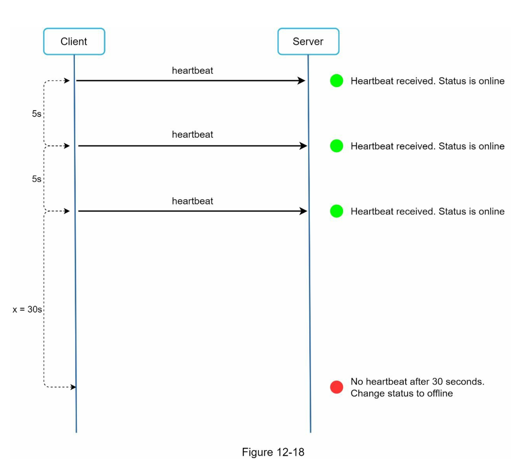

### 상태 정보의 전송
- 상태 정보 서버는 발행-구독 모델을 사용
- 각각의 친구 관계마다 채널을 하나씩 두는 방법
- 클라이언트와 서버 사이의 통신에는 웹소켓을 사용
- 그룹이 작을때 효과적

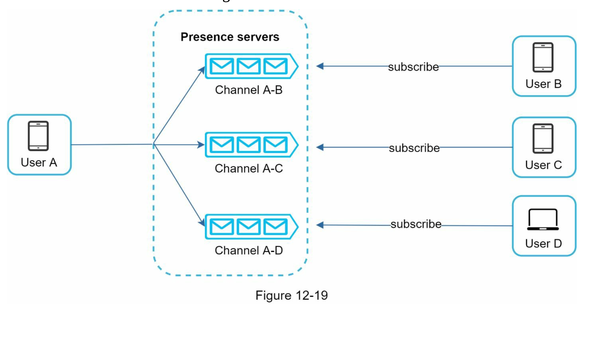

- 그룹 하나에 100,000 사용자가 있다고 하면?
- 상태 변화 1건당 100,000 개의 이벤트 메시지가 발생함
  - 사용자가 그룹 채팅에 입장하는 순간에만 상태 정보를 읽도록 하거나
  - 친구 리스트에 있는 사용자의 접속상태를 갱신하고 싶으면 수동으로 하도록 유도함

## 12.4 마무리
- 채팅 앱을 확장하여 사진이나 비디오 등의 미디어를 지원하도록 하는 방법
- 종단 간 암호화
- 캐시
  - 클라이언트에 이미 읽은 메시지를 캐시해두면 서버와 주고 받는 데이터 양을 줄일수 있음
- 로딩 속도 개선
  - 사용자의 데이터, 채널 등을 지역적으로 분산하는 네트워크를 구축하여 앱 로딩 속도를 개선
- 오류 처리
  - 채팅서버 오류
    - 서버가 죽으면 서비스 탐색 기능이 동작하여 클라이언트에게 새로운 서버를 배정하고 다시 접속할수 있도록 해야함
  - 메시지 재전송
    - 재시도나 큐는 메시지의 안정적 전송을 보장하기 위해 사용하는 기법

